# 用预测概率处理不平衡数据

> 原文：<https://towardsdatascience.com/tackling-imbalanced-data-with-predicted-probabilities-3293602f0f2?source=collection_archive---------9----------------------->

## 在数据世界里争吵

## 葡萄牙银行营销数据集中优化分类概率的案例研究

*图片由* Budarinphoto *通过创意市集*

分类算法通常能够输出预测的概率。有时，这些预测的概率本身也很有意义，例如在评估博彩赔率时。**预测概率**也可以通过给我们**调整分类阈值**的选项来改善模型预测，从而帮助处理不平衡数据。

本文讨论了各种机器学习算法在预测概率上的**差异**，以及如何通过案例研究使用它们来**提高这些算法的预测能力**。案例研究是一个**葡萄牙银行营销**数据集，其中**目标变量**是定期存款的“是”或“否”预订。

我将首先讨论目标变量和选择的评分标准。然后网格搜索最佳模型超参数，接着分析预测概率。然后将这些概率校准到数据中的真实观察概率。随后定位使评分度量最大化的召回精度阈值。最后，最优概率阈值用于重新分类模型预测，并计算最终的训练测试分数。

几年前，我在一次数据科学访谈评估中收到了有问题的数据集，它被故意调整为需要一些数据争论，以将数据放入正确的 Pandas 数据框架中进行进一步分析。我提到这一点，是为了让你在我的 Github 页面上查看代码时，不会被最初的数据争论所迷惑，并且对那些可能面临类似调整的采访数据集的人也有帮助。 **UCI 数据集**可在[这里](https://archive.ics.uci.edu/ml/datasets/bank+marketing)获得，但是我用于案例研究的版本发布在我的 Github 页面上，链接在本文底部。

# 不平衡数据

调整后的数据集有**41176 个观察值**。**目标分类变量**不平衡，**的“是”率为 11.27%**,**的“否”率为 88.73%** 。

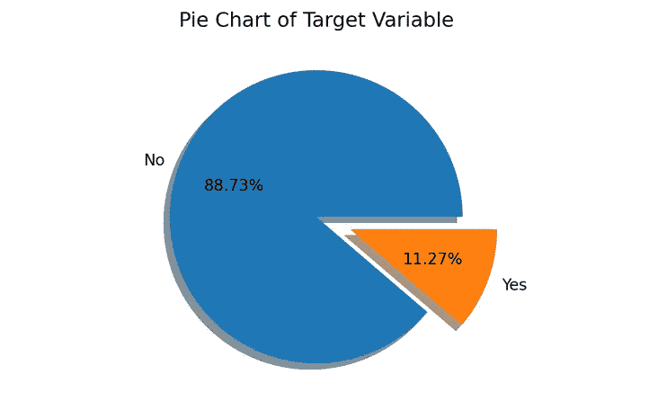

换句话说，如果这是一个装有九个黑白球组合的袋子，那么(大约)只有一个黑球**和八个白球**。因此，如果我的目标是选一个黑球，也就是预测营销活动的“是”订阅，我将有很大的胜算。

我将目标变量中的**“yes”类编码为“1”****，将“no”编码为“0”。将感兴趣的类别编码为 **class 1** 非常有用，因为许多重要的 *scikit-learn* 评分指标，包括 F1 指标，都使用 *pos_label=1* 作为默认的感兴趣类别。**

考虑到不平衡的数据，通常的**准确度分数**对这个问题帮助不大。即使模型一直简单地说“不”，它的准确率也有 88.73%。说破钟一天对两次！这种模式将被打破，但仍然看起来强大的印象深刻的所有时间。

为了解决这个问题，让我们转向**混淆矩阵**。假设我们有一个被分类为“正”(1)或“负”(0)的二元变量，这是纯粹用来区分这两个类别的术语。根据下面描述的**风格化混淆矩阵**，我们有沿着水平轴的二元变量的**预测**类(左 0 &右 1)和沿着垂直轴的**实际**类(顶部 1 &底部 0)。这个程式化矩阵的设计遵循了与 *scikit-learn* 的[混淆矩阵](https://scikit-learn.org/stable/modules/model_evaluation.html#confusion-matrix)相同的顺序。

自然，预测很可能不是 100%准确的，所以我们可以将那些“积极的”预测分为正确的(*真阳性*)或错误的(*假阳性*)。我们可以对“否定”预测做同样的事情，即*真否定*和*假否定*。矩阵的右上象限保存*真正*预测，例如，假定它包含**预测 1 和真 1。**

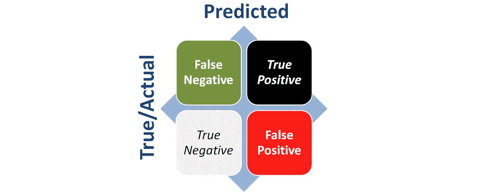

**程式化的混淆矩阵**

“阳性”类别的**精确率**将是*真阳性*的总和除以总阳性类别预测(或*真阳性* + *假阳性*)。*假阳性*是那些被模型错误地标记为“阳性”但实际上是“阴性”的观察结果。在上图的上下文中，它是黑盒除以红盒和黑盒的总和。**所以** **精度是模型从其*预测的*正观测值**中挑选出*真正*的概率。

另一方面，**召回率**将是*真阳性*的数量除以*真阳性*和*假阴性*之和的比率。请注意，假阴性是那些被模型错误地标记为“阴性”但实际上是“阳性”的观察结果。在上图的上下文中，它是黑盒除以绿盒和黑盒的总和。**回忆描述了模型从*实际*阳性观察值**中挑选出*真阳性*的概率。

# 评分标准

当正类在不平衡数据集中占少数时，精确度和召回率是模型预测能力的更有用的度量，并且主要目标(但不是唯一目标)是正确识别那些正观察值。**F1 分数是精确度和召回率的调和平均值**。

F1 分数实际上是 **F-Beta 分数**的一个特例，其中 Beta > 1 意味着更加重视**召回率**，而 Beta < 1 则更加重视**精确率**。在模型预测中追求更高的召回率必然会降低准确率，反之亦然，我将在下面演示。所以 F1 分数在召回率和精确率之间取得平衡。这可能不适合每一种情况，但在我看来，它符合这种情况下的目的。

科恩的 kappa 是评估不平衡数据的另一个有用的统计。它告诉我们这个模型在预测**【正面】和【负面】类别时，比单独的随机机会要好得多。kappa 统计值大于 0 意味着模型比 chance 更好，它越接近最大上限 1 意味着模型对数据的分类越好。然而，Cohen 的 kappa 统计不能用于比较不同数据集之间的模型性能。**

**所以我的模型**评测指标**会是 **F1 评分** *和* **科恩的 kappa** 。在数据不平衡的情况下，另一个有用的指标是精确召回曲线 (AUC-PR)下的**面积，如果人们关心这两个比率之间的平衡的话。****

# **变量和初始分数**

**我将省略 EDA 和数据工程的解释，因为这不是本文的重点。感兴趣的读者可以参考我的 Github 页面，跟进具体采取的措施。我选定的**变量**如下，包括目标变量(名为“target”)，其中大部分是虚拟变量:**

**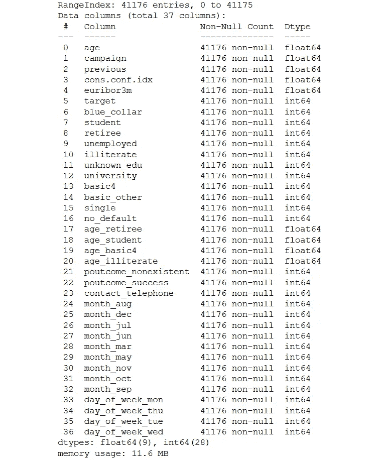**

****变量列表****

**我将比较五种流行的分类算法的结果:**

*   ****逻辑回归** (Logit)，**
*   ****随机森林**(射频)，**
*   **天真的贝叶斯 (NB)，**
*   ****支持向量分类器** (SVC)，以及**
*   ****XGBoost** (XGB)**

**Python 中的 *scikit-learn* 库允许您更改 Logit、RF 和 SVC 的*class-weight 参数，在处理不平衡数据时，通常建议指明*class _ weight = " balanced "***。你也可以为 NB 模型设置**先验概率**来反映目标变量各自的比例，我是这样做的*【0.11，0.89】*。至于 XGBoost，可以设置***scale _ pos _ weight***参数来反映负类与正类的比值，我表示为 7.85。通常这些超参数设置只会有边缘帮助，尤其是当数据高度不平衡时，但每一点都有帮助！*****

*****使用**最小-最大缩放**对数据进行缩放，由于存在大量虚拟变量，因此选择了这种特定的缩放程序。数据通过 70:30 的**训练测试分割**，对数据的第一次分析得出以下训练测试分数:*****

*****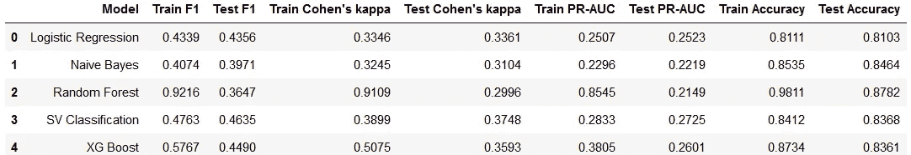*****

*******训练集和测试集的初始分数*******

*******SVC** 是**在**测试 F1、科恩的 kappa 和精确回忆 AUC 分数**中表现最好的**，尽管它没有最高的测试准确度分数。 **XG Boost 在 F1 测试、Cohen 的 kappa 和 AU-PR 评分中排名第二**，而**逻辑回归**在这些指标中排名第三。**随机森林**在训练和测试集上获得了最高的**准确性分数**，但在其他指标上表现不佳，这表明它专注于预测多数类 0。*****

# ***网格搜索超参数***

***接下来是使用 **F1 *和* Cohen 的 kappa 作为评分标准**对这五个模型进行 **gridsearch 和分层 KFold** 交叉验证(k =3)。gridsearch 程序显示了五种分类算法的以下优化超参数:***

***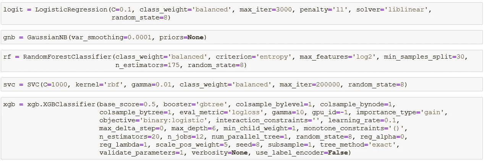***

*****网格搜索优化模型*****

***然后，这些数据被用于再次对训练集和测试集上的每个算法进行拟合和评分:***

***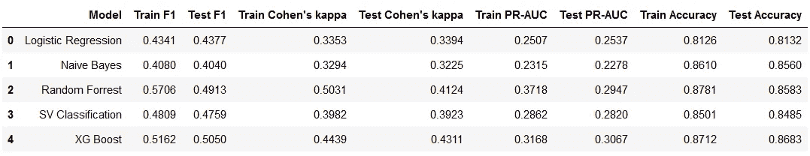***

*****训练集和测试集的网格搜索后得分*****

***grid search-tuned**XG Boost model**摘得了**顶级表演者桂冠**。我们看到**训练 F1** 和 **Cohen 的 kappa** 分数在五个模型中表现出混合变化，但是在测试集分数中有一个**总体改善。**随机森林**和 **XG Boost** 的测试成绩进步最大，其次是 **SVC** 。相比之下，Logit** 和**nave Bayes**只有轻微的改善。***

# ***预测概率***

***现在让我们检查由各种 **gridsearch-tuned 模型**提供的**类 1** 的预测概率，并将它们与真实的类概率进行比较。这可以通过**校准曲线**图(或可靠性图表)来完成。预测的概率与目标变量的真实观察值一起被分类并分布到十个箱中。***

***然后计算每个箱中预测概率的平均值，并与该箱中类别 1 观察值的真实分数进行比较。这是通过绘制每个箱的平均预测概率来实现的。**如果模型校准良好，那么平均概率点将落在对角线**附近，这意味着每个箱中的平均预测概率与该箱中的实际 1 类观测值的比例相当。***

***校准曲线的计算仅使用上述 gridsearch 程序之前分割的数据集的**训练**部分进行。模型预测概率的校准曲线如下，不幸的是，它们都没有校准好。几乎每个模型在对角线下都有一致的图，这意味着它们倾向于**过度预测每个分类箱中目标变量**(第 1 类)的分数，表明算法的精确度较低。***

***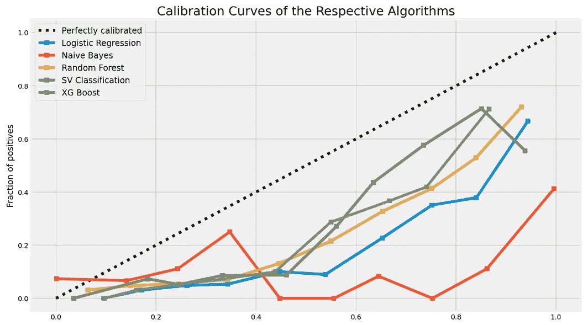***

*****概率缩放前的可靠性图*****

*****朴素贝叶斯**因提供偏向极端的预测概率而臭名昭著，而**支持向量机**倾向于生成偏向中间的预测概率，正如**随机森林**在较小程度上一样。然而，即使是**逻辑回归**，通常被认为提供了良好的未校准预测概率，在这种情况下也表现不佳。***

***下面的预测概率点提供了他们糟糕表现的另一个视角。NB 的预测概率(红色)确实集中在两个极端，而 SVC 的预测概率(绿色)更多地集中在中间。Logit(蓝色)似乎不太愿意做出接近 0%概率的预测，而 RF(黄色)似乎相反。另一方面，XG Boost (grey)对于做出接近 0%或 100%的预测显得非常害羞。***

***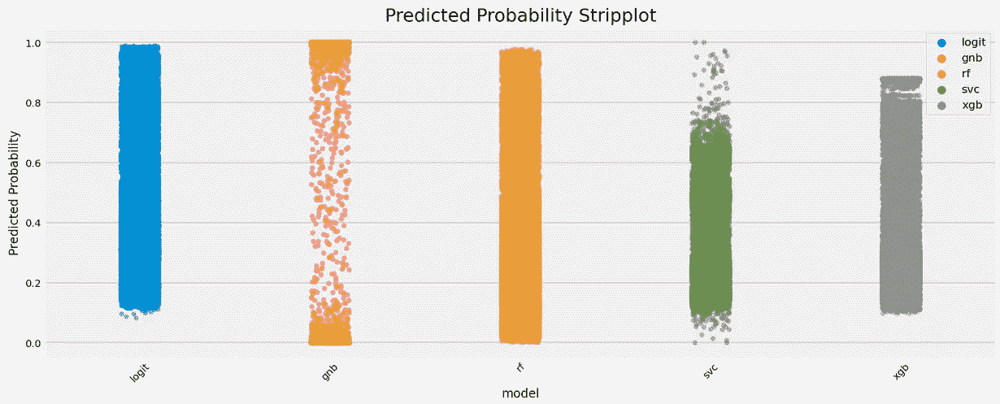***

*****缩放前的预测概率剥离图*****

***在任何情况下，预测概率的**分布**在不同的模型中是不同的。在我们可以使用预测的概率来改进分类预测之前，需要通过校准来**校正这些偏斜的分布。*****

# ***缩放预测概率***

***通过使用初始概率来预测目标变量(即真实概率)的附加回归器，对预测概率进行校准或缩放，以反映观察到的**1 级**事件的发生。更简单的程序是使用逻辑回归进行缩放，也称为**普拉特缩放**或 **sigmoid 回归变量**。替代程序是利用**等渗回归仪**。***

***令人高兴的是， *scikit-learn* 具有***calibrated classifiercv***函数来进行缩放。我将校准函数嵌套在 *GridSearchCV* 中，使用 **brier score** 作为计分器，为每个算法找到最佳缩放程序，sigmoid 或等张。仅使用训练数据再次完全执行该第二网格搜索。**除了 **SVC 显示 sigmoid 校准**为更好的选项外，所有模型均显示偏好等张校准**。这实际上是非常典型的 SVC 算法。***

***下面显示了**比例预测概率**，人们可以立即看到改进。现在大部分概率曲线大部分时间都在拥抱对角线。然而，**朴素贝叶斯**是一个主要的例外，因为它似乎无法在校准后以更高的概率生成任何预测。因此，我决定放弃对它的进一步分析。***

******

*****概率缩放后的可靠性图*****

***为了提供另一个视角，让我们看看由各种算法提供的预测概率(类别 1)的分布的**直方图**。下面的第一张图表是**预缩放分布图**，我们可以看到它们之间的明显差异，尤其是各种分布图的模式和分布图。第二张图描绘了**缩放后的分布**，现在我们观察到预测概率的分布更加相似。***

***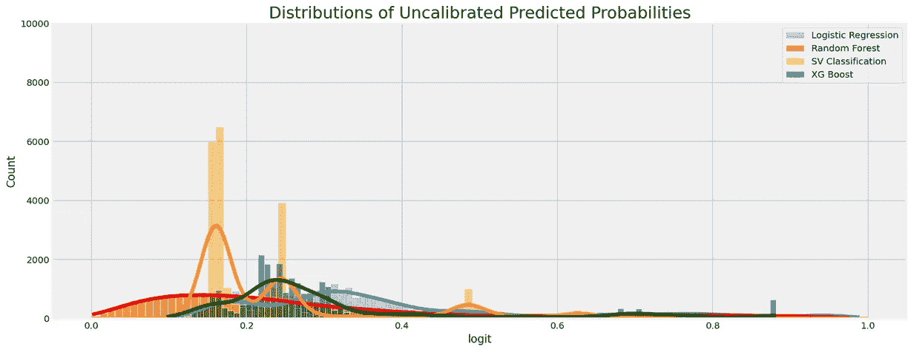***

*****概率缩放前的分布*****

***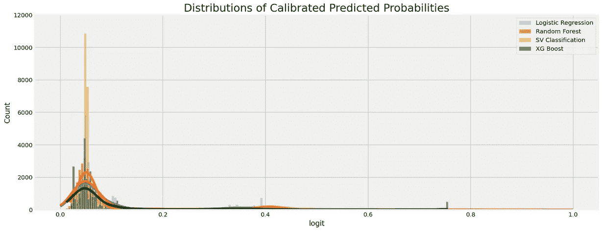***

*****概率缩放后的分布*****

***概括地说，我采取的步骤(为了简化，省略了上面讨论的训练测试评分)是:***

*   ***训练-测试分割数据；***
*   ***grid 在**训练数据**(训练验证集)上使用分层三重交叉验证搜索 5 个模型；***
*   ***启动根据上述网格搜索参数化的 5 个模型；***
*   ***将这 5 个模型放入另一个 gridsearch 中，使用对**训练数据**(训练验证集)的分层三重交叉验证来找到最佳概率比例回归变量。***

***换句话说，两种网格搜索都是纯粹使用训练数据完成的。唯一一次使用测试数据是在对网格搜索前后的模型进行评分时。无论如何，感兴趣的读者可以参考我的 GitHub 页面来检查我采取的具体步骤。***

***对于是否应该为网格搜索后的概率校准分离出完全独立的一批训练数据，存在一些争论。换句话说，将初始数据**分成三份** s - gridsearch 训练集、概率标度训练集和测试集-同时注意对所有三个批次中少数类 1 的出现进行分层。如果一个人有很多数据，我想这可能是一个选择，但是你将需要更多的数据，其中的不平衡越大。然而，我不认为这是绝对必要的，因为概率校准不是为了导出新的模型超参数，而是简单地缩放已经参数化的模型的预测概率。***

# ***概率阈值调整***

***在放弃 NB 之后，我接着在完整的**训练数据**上拟合剩余的四个模型(Logit、RF、SVC & XGB)。这些**网格搜索调整和概率比例模型**然后在 *y_train* 上生成预测概率。这些预测概率用于根据将观察分类为属于**类别 1** 的概率阈值来计算**召回率和精确率**。***

***换句话说，这些是给定各种概率分类阈值的混淆矩阵的召回率和精确率。请注意，这些是 ***而不是*** 通常 y 轴(纵轴)上的精确率和 x 轴(横轴)上的召回率。召回率和精确率都映射在 y 轴上，将预测分类为 1 类的概率阈值沿着 x 轴。***

***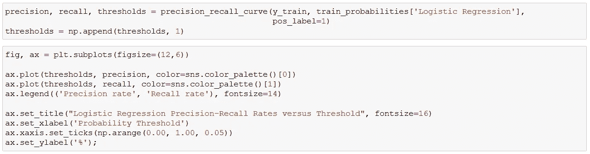***

***如前所述，在召回率和精确率之间有一个权衡**，我们在下面的每个图中都看到了这一点，召回率随着概率阈值的上升而下降，反之亦然，精确率随着阈值的上升而上升。所以如果我们想要 100%的召回率，就把门槛定在 0%就好了！不幸的是，在这种情况下，你将被海啸般的*假阳性*预测淹没，导致极低的准确率。*****

***如果你还记得的话，F1 分数仅仅是更广泛的 F-Beta 统计的一个子集。例如，如果偏好相对于精度更高的召回，那么你应该调整 Beta > 1。总会有一个权衡，深思熟虑的分析师会决定什么是服务于他们目标的最佳权衡。**召回精度阈值组合**是使用预测概率阈值**优化召回精度权衡**的关键。***

***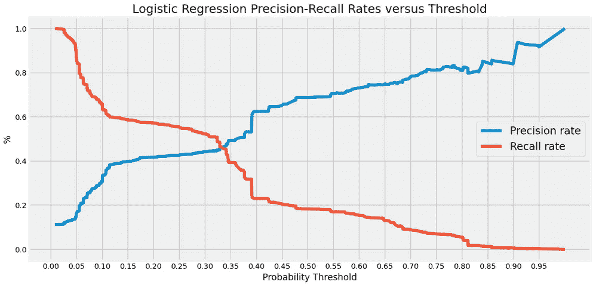******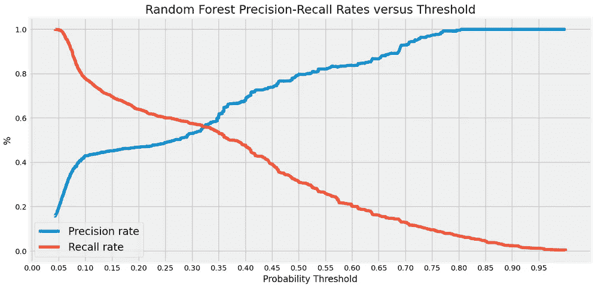******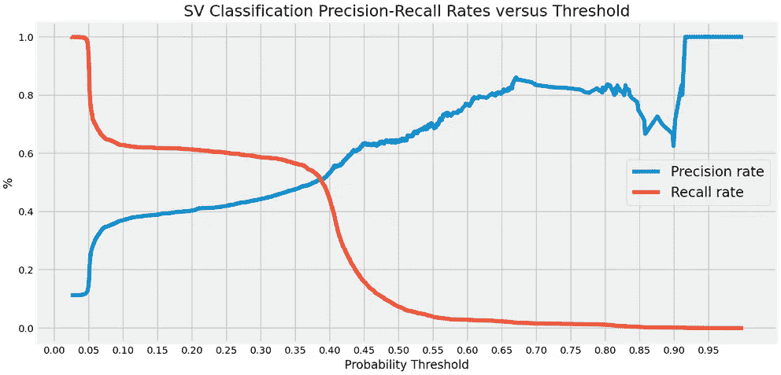******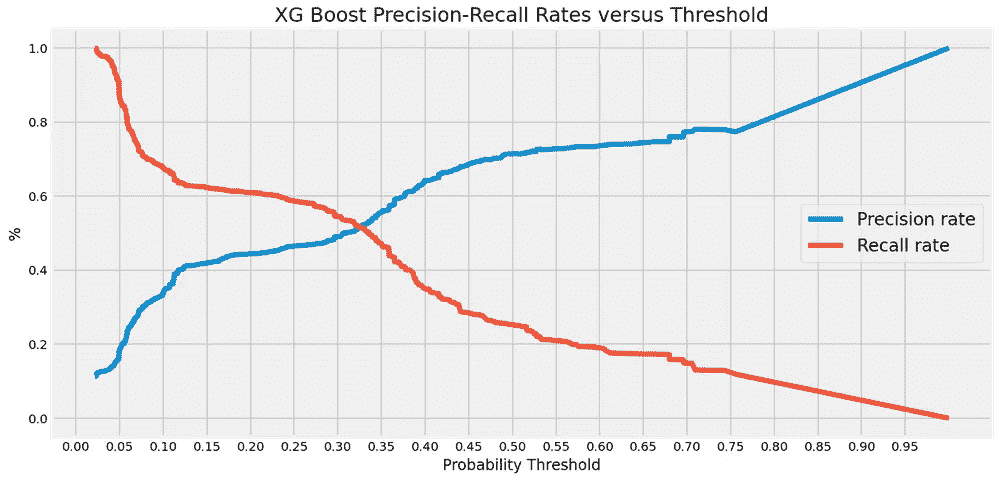***

***下一步是找到最大化 *y_train* 上 F1 分数的概率阈值。然后使用**拟合** **网格搜索调整和概率比例模型**来预测 *y_test* 的概率。对测试集的预测概率应用最佳阈值，以**重新分类类别预测**(分类为新的类别 1 或 0 标签)。然后对阈值调整后的类预测进行评分。同样，如果你有不同的偏好，调整 F-Beta 会给你不同的概率阈值和结果。***

***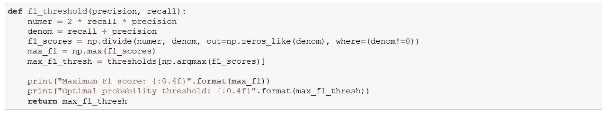***

*****寻找使 F1 分数最大化的概率阈值的代码*****

***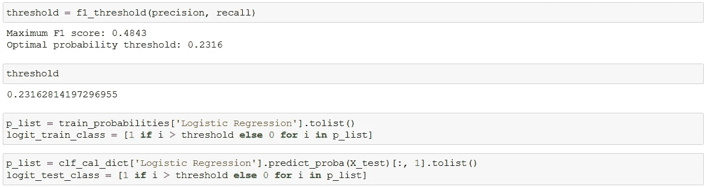***

*****对预测类进行重分类的代码(针对 Logit 模型)*****

# ***最终分数***

***阈值调整后的重新分类预测的**最终得分如下所示。为了便于比较，我再次加入了上面的初始和后网格搜索评分表。记住**朴素贝叶斯**模型已经从这部分分析中去掉了。*****

***最终的**培训** F1 和 Cohen 的 kappa 分数显示所有四个模型都比 gridsearch 后的分数有所提高。**测试分数**当然更重要，它们揭示了阈值调整后的一个**一般改进**，除了**随机森林**算法。***

******

*****训练集和测试集的初始分数*****

******

*****训练集和测试集上的网格搜索后得分*****

***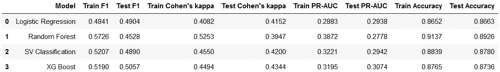***

*****训练集和测试集上的阈值后调整分数*****

***阈值调整显著提高了 **Logit 模型在 F1、Cohen 的 kappa 和 precision-recall AUC 指标上的测试分数**。在这三项指标中，SVC 和 XG Boost 模型得分的增长更加适度。然而， **XG Boost 算法凭借在所有三项指标上的最佳测试分数，保住了其顶级性能**的桂冠。**根据培训和测试分数，SVC 是第二名**，但 **Logit 在测试分数中非常接近第三名**，F1 分数略高，但 Cohen 的 kappa 和 AUC-PR 较低。***

***有趣的是，所有四个模型的**训练和测试准确性分数都上升了**，尽管准确性分数从来不是网格搜索和校准措施的重点。事实上，所有车型(除 NB 外)**的**最终测试准确度得分**是整个练习**中最高的。因此，概率阈值调整不仅改善了除 RF 之外的少数类 1 的预测，还改善了两个类中模型的总体准确性。这表明，即使在处理平衡数据时，阈值调整也可能是有用的。***

***达到这一点所采取的步骤是:***

*   ***启动 5 个网格搜索调整的*和*概率比例模型；***
*   ***对完整的**训练数据**进行模型拟合，预测*y _ train*；***
*   ***导出召回-精度-阈值曲线，并计算每个模型在预测的 *y_train* 上最大化 F1 分数的**概率阈值**；***
*   ***最后，预测 *y_test* ，输出预测概率，应用上面的概率阈值对预测类进行重新分类；***
*   ***对重新分类的类别预测进行评分。***

***当然，永远不要将**测试数据**用于任何网格研究、概率缩放或计算最佳概率阈值。通过这种方式，您可以保持测试数据的完整性，作为前面的步骤在提高分类算法性能方面有多成功的最终仲裁者。最后一步，我们转向得到的**混淆矩阵**。***

# ***混淆矩阵***

***让我们看看精度矩阵，以便更好地评估这些模型的细节。为了保持简洁，我将只关注**表现最好的模型——XG Boost 和改进最多的模型——逻辑回归**的矩阵。***

***下面的图表是 **XGB 的混淆矩阵**，左边是后网格搜索矩阵，右边是后阈值调整矩阵。矩阵的右上象限包含预测的*真阳性*。两个右侧象限共同组成*预测的*正类，两个顶部象限共同保存*实际的*正类。***

***因此，后网格搜索矩阵(左)的**精确率为 830/(830+1065)= **43.80%** ，**召回率**为 830/(562+830) = **59.63%** 。对于**后阈值调整矩阵**(右图)**精确率**为 799/(799+969) = **45.19%** ，**召回率**为 799/(593+799) = **57.40%** 。阈值调整提高了召回率，降低了准确率，导致 **F1 得分从 50.50%小幅攀升至 50.57%** 。*****

******

*****左侧为网格搜索后矩阵，右侧为阈值调整后矩阵*****

***下面的图表是 **Logit 的混淆矩阵。**后网格搜索矩阵(左)的**准确率为 898/(898+1813) = **33.12%** ，**召回率**为 898/(494+898) = **64.51%** 。对于**后阈值调整矩阵**(右图)**精确率**为 795/(795+1055) = **42.97%** ，**召回率**为 795/(597+795) = **57.11%** 。在这种情况下，阈值调整非常显著地提高了准确率，导致 **F1 得分从 43.77%跃升至 49.04%** 。*****

***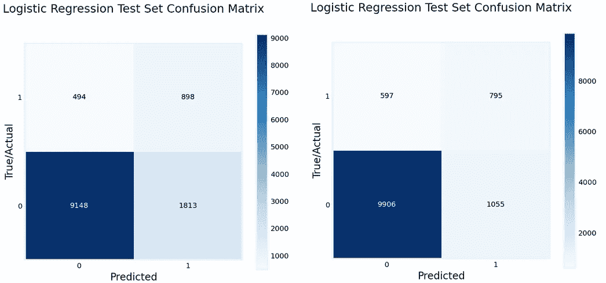***

*****左侧为网格搜索后矩阵，右侧为阈值调整后矩阵*****

***基于混淆矩阵，很明显，XGB 模型始终比 Logit 有更好的准确率。换句话说，XGB 模型的 1 类预测更有可能是真正的 1 类预测。阈值调整有助于大力提高 Logit 模型的准确率，但仍不足以在这一指标上超过 XGB。***

***如果我们考察准确度得分， **XGB 的后 gridsearch 准确度得分**为(830+9896)/sum(所有象限)= **86.83%** ，**后阈值调整准确度得分**为(799+9992)/sum(所有象限)= **87.36%** 。对于 **Logit 型号**同样的数字是(898+9148)/sum(所有象限)= **81.32%** 和(795+9906)/sum(所有象限)= **86.63%** 。***

***细节显示，即使在 XGB 和 Logit 模型(右上象限图)中预测的*真阳性* **的数量下降**，在阈值调整后，准确度得分仍有所提高。这是因为模型在**变得更好，而不是**误分类*误报*(右下象限数字)，对 Logit 来说尤其如此。***

# ***结论***

***这是一个**不平衡数据**的例子，大约八个 0 类目标观测值与一个 1 类观测值之比。因此，我选择了 **F1 分数*和*科恩的 kappa** 作为评分标准。**选择了五个流行的分类模型**(Logit、NB、RF、SVC & XGB)，在将数据分成训练测试集之后，我继续进行通常的**超参数网格搜索**。***

***gridsearch-tuned 模型的**预测概率**被发现**校准不良**，因此它们必须被缩放以反映真实的观测概率。然后将 **gridsearch-tuned *和*概率标度**算法拟合到训练数据中，以预测 *y_train* ，而不是**朴素贝叶斯**模型，该模型由于其极差的校准结果而被放弃。***

***下一步是在每个概率阈值下生成精确度和召回率。找到了在 *y_train* 预测中最大化 F1 分数的**阈值。然后对模型进行 paces 预测 *y_test* ，并提取预测概率。然后根据最大化概率阈值对**类预测进行重新分类**，并进行评分。*****

***结果显示，算法的后网格搜索训练*和*测试分数**在概率阈值调整后普遍提高**，除了**随机森林**(以及被丢弃的**朴素贝叶斯**)。**逻辑回归**显示测试分数有显著提高，但仍不足以在性能排名中挤掉 **XG Boost** (榜首)和**支持向量分类**(亚军)。***

***所有模型的总体**准确度分数**也从阈值调整中受益，尽管准确度从来不是练习的重点。这表明，即使在平衡数据中，调整预测的概率阈值也可能是有用的。总而言之，这些发现展示了使用**预测概率和调整它们的阈值**如何能够提高分类算法的性能。***

***(这个练习的完整 Python 代码和数据可以在我的 *GitHub* [资源库](https://github.com/at-tan/Predicted_Probabilities_Bank_Marketing)中找到。如果直接渲染 GitHub 笔记本文件有问题，使用 [nbviewer](https://nbviewer.org/) 。)***

***如果你在阅读这样的文章中看到了价值，你可以在这里订阅 Medium**来阅读我和无数其他作家的其他文章。谢谢你。*****

**** [## 时间序列中的时间和季节性特征

### 以数据为中心，并在模型校准过程中包括季节性选项

towardsdatascience.com](/time-seasonality-features-in-time-series-7e8236f7b04a)  [## 比特币与宏观因素关系的转变

### 使用回归和统计推断来估计自疫情以来的关系变化

medium.datadriveninvestor.com](https://medium.datadriveninvestor.com/bitcoins-shifting-relationship-to-macro-factors-5465d542078f)  [## 多元时间序列的堆积机器学习模型

### PM 2.5 空气污染数据集的个例研究

towardsdatascience.com](/stacking-machine-learning-models-for-multivariate-time-series-28a082f881)  [## 用线性回归破解 Ames 住房数据集

### 预测和统计推断相结合的模型

towardsdatascience.com](/wrangling-through-dataland-modeling-house-prices-in-ames-iowa-75b9b4086c96)****