# 用强化学习解决 UNO 纸牌游戏

> 原文：<https://towardsdatascience.com/tackling-uno-card-game-with-reinforcement-learning-fad2fc19355c?source=collection_archive---------3----------------------->

## 从头开始的完整演练

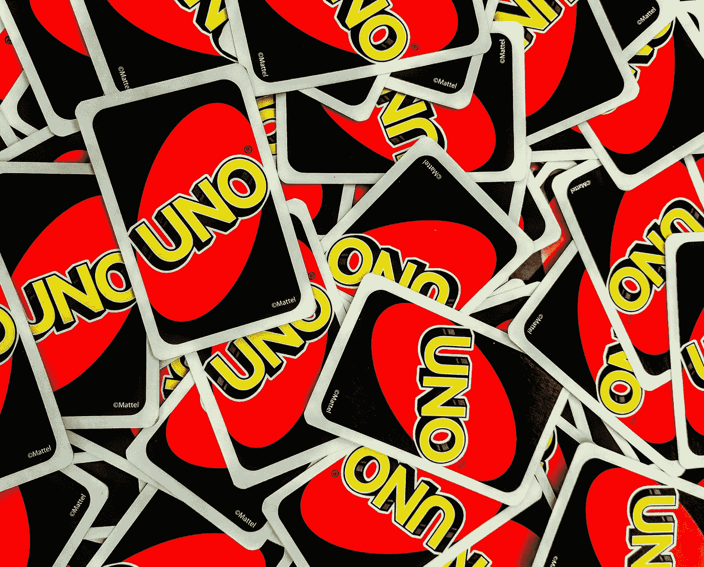

[第三发球](https://unsplash.com/@thirdserving?utm_source=medium&utm_medium=referral)在 [Unsplash](https://unsplash.com?utm_source=medium&utm_medium=referral) 上拍照

在这样的隔离时期，经典的 UNO 纸牌游戏成了我和女友之间最常玩的游戏之一。在无数轮比赛和双方的几次连胜之后，我很好奇是否可以通过分析得出一个最优的游戏策略，从长远来看，这将大大超过。

**我的旅程由以下几部分组成:**

1.  用 Python 从头开始创建 UNO 纸牌游戏的游戏引擎
2.  从模拟一系列 100，000 个游戏中获得游戏统计数据
3.  实施基本的强化学习技术，以发现最佳的游戏策略

# 1.UNO 卡牌游戏引擎

为了训练强化学习(RL)代理如何智能地玩游戏，需要一个成熟的游戏环境。它必须捕捉所有的机制和规则，以便代理可以像真正的人类玩家一样与游戏进行交互。

Python 面向对象的特性允许将代码直观地组织成卡片、卡片组、玩家、回合和游戏的类对象。以下是主要观点…

## 1.1 卡

游戏最细粒度的元素是卡片本身，它具有“颜色”和“值”属性。还可以根据当前打开的牌来评估一张牌是否可玩。

## 1.2 甲板

一个固定的 UNO 牌列表代表一副牌。它在每个游戏开始时被初始化和洗牌。如果这副牌用完了，可以从中抽牌，并重新填牌。

## 1.3 玩家

玩家拥有*名*、*手牌、*和*可玩手牌*作为属性，需要执行多种功能。他必须:

*   确定他当前的*状态*(他持有的牌等)。)
*   认识到他可能采取的*行动*(他可以出的牌)
*   合并来自 RL 代理的决策逻辑

## 1.4 圈

这个类将一个回合中玩家的动作序列聚集在一起。在将 7 张起始牌分发给每个玩家的初始化之后，活动的玩家(轮到的玩家)要么抽一张牌，要么出牌。在这个设置中， *player_1* 正在利用 RL 代理，而 *player_2* 遵循随机策略。

## 1.5 游戏

最后，纸牌游戏只包括一系列回合。因此，执行一轮迭代，直到任何玩家满足获胜条件(没有手牌)。

描述的代码片段试图传达基本的游戏机制。完整的脚本可以在我的 Github repo[https://github.com/bernhard-pfann/uno-card-game_rl](https://github.com/bernhard-pfann/uno-card-game_rl)上获得。

# 2.来自模拟的游戏统计

有了一个全功能的游戏引擎，我们现在可以运行尽可能多的游戏模拟。这有助于深入了解游戏的统计特征，但也有助于训练 RL-agent。我主要对以下问题感兴趣:

*   游戏持续多少回合？
*   玩家第一个转身的优势有多大？
*   游戏过程中最有可能出现的情况是什么？

## 2.1 游戏时长

在生成的 100，000 个模拟样本中，平均游戏长度为 41 回合。13 回合的低得多的模式是由右偏度(超过 100 回合的游戏部分)导致的。

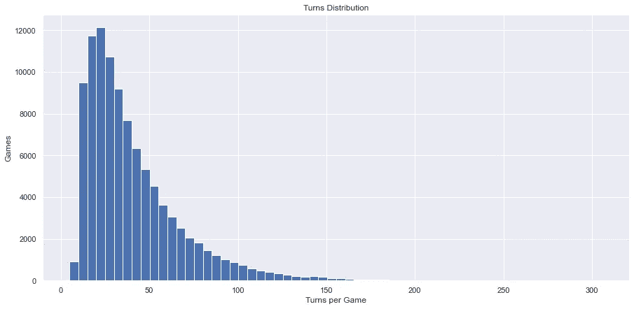

100，000 个模拟游戏中每个游戏的回合分布

样本中最长的游戏持续了 327 个回合，而最短的只花了 3 个回合，这只有通过多张特殊牌(*跳过，反转，* *+2，+4* )的组合才有可能。

## 2.2 先发优势

开始游戏的玩家比他的对手有一定的优势。为了量化这种优势，在以下两种情况下观察两个随机游戏代理的累积长期胜率:

1.  玩家 1 总是先行动(红色模拟)
2.  玩家 1 在每两局游戏中开始第一步(紫色模拟)

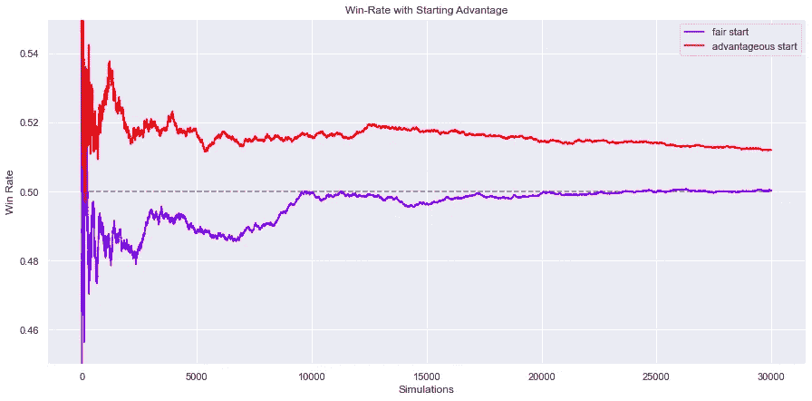

模拟 30，000 场游戏的累积胜率

正如预期的那样，在一个先发制人的公平设置中，两个随机参与的代理人的胜率收敛到 50%。这表明游戏引擎按预期工作。

更有意思的是，始终主动出击的玩家赢得了所有游戏的 52% 。这对应着一个 ca。战胜对手的可能性提高了 4% (52%对 48%)。

## 2.3 比赛过程

像体育分析一样，热图可以用来显示比赛过程的焦点。通过跟踪玩家经历的每一个状态和动作，我们可以识别游戏中最有可能出现的情况。

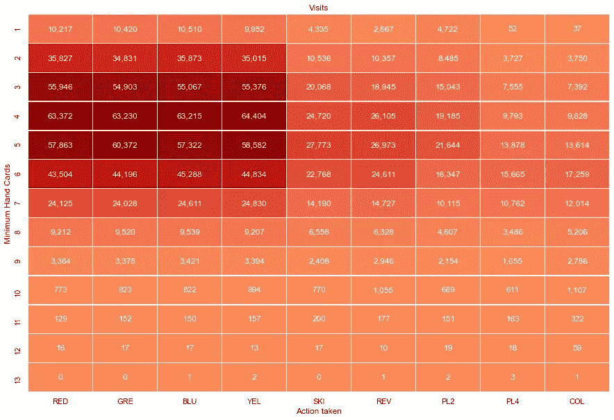

100，000 个模拟游戏中状态动作出现的次数

热图的轴表示玩家手牌的数量，以及在相应时间点采取的行动。显而易见的是，大多数时候玩家拿着 4-5 张牌在“游戏中期”徘徊。所有颜色的普通牌(0-9)最常被使用是有道理的，因为它们是一副牌中最常见的牌。

# 3.强化学习的应用

在 UNO 纸牌游戏中搜索最优策略是强化学习的经典用例。因此，游戏本身可以被构造为有限马尔可夫决策过程(MDP)，这意味着以下特征:

*   **状态:**游戏的每一步都可以用一个状态来描述
*   **动作:**决策者根据自己所处的状态采取动作与游戏互动
*   奖励:采取某些行动可以导致一个令人满意的最终状态(例如赢得游戏)，这是有奖励的

随机因素是通过随机抽取的牌以及对手的移动而固有的，需要大量的模拟来确定长期最优。我应用的基本技术是蒙特卡罗和带有离散状态-动作矩阵的 Q 学习。

## 3.1 定义状态空间

在受监督的机器学习设置中，拟合一个函数来将可用特征映射到输出变量。另一方面，RL 在每一步顺序地和单独地评估每一个动作。因此，需要定义状态、行动和奖励。

状态可以代表决策者可用的任何信息，这些信息对于描述游戏的当前情况是有用的。这可能是他持有的牌的类型，对手持有的牌的数量，或者关于已经打出的牌的信息。

乍一看，UNO 似乎是一个非常简单的纸牌游戏，因为它的规则有限。然而，当计算出一个玩家可能持有的牌的组合时，事情很快就失控了。准确地说，大约有 10 种⁶组合。由于 RL-agent 必须学习每个状态的最佳动作，因此限制状态的数量是有意义的。

因此，我形成了一个 16 位的状态标识，它捕获代理人持有的牌和他可以使用的牌，只区分颜色和特殊牌(跳过、反转等)。)

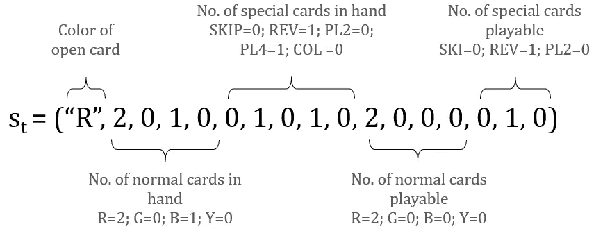

国家的识别

通过将状态标识的每个属性的最大值限制为 2，状态空间被成功地限制为 270，000 种可能性。

## 3.2 可能的行动

代理人决定玩的牌代表他正在采取的行动。应用与上述相同的聚合逻辑会产生 9 种不同的动作:*红色、绿色、蓝色、黄色、跳过、反转、+2、+4、野生颜色*。

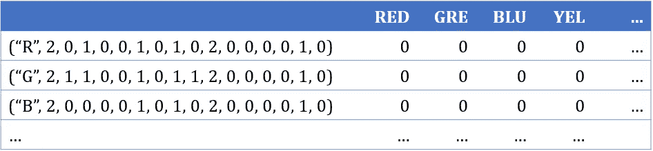

q 表初始化为零

## 3.3 蒙特卡洛代理

给定离散的状态-动作矩阵，代理通过模拟多个游戏来导航字段。当矩阵被初始化为所有值为零时，蒙特卡罗(MC)在每个完成的游戏之后更新所有被访问的状态动作值。

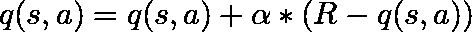

q 值更新功能

状态 *s* 采取行动 *a* 时的 q 值根据本集 *R* 中实现的奖励以及步长参数*α*进行更新。为了决定在相应的状态下采取哪个动作，算法的ε-贪婪形式选择:

*   **以ε概率:**随机行动
*   **具有 1-ε概率:**具有最大 q 值的动作

## 3.4 Q-学习

在其基本形式中，Q-learning 以类似的方式工作。然而，当 MC 在更新 Q 值之前等待每一集的完成时，Q-learning 在每一步都以一个步长的滞后来更新它们。

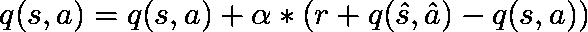

q 值更新功能

因此，q 值取决于步长参数、下一步的回报 *r、*以及在状态 *s-hat* 和 *action-hat* 下一步的 q 值。

因此，两种算法都采用相同的 2 个参数，具有以下效果:

*   **Alpha:** 较高的步长参数会在每次更新时增加 q 值的变化，同时阻止值收敛到更接近其真正的最优值
*   T21:较高的ε允许更多的探索行动，这些行动乍看起来并不有利可图。与此同时，当最优博弈策略被代理人获得时，它会被稀释。

# 4.结果

现在我们已经指定了模型，让我们看看它们是否有用。因此，用一个随机玩家和另一个利用 RL 算法来模拟游戏。作为评价标准，我用的是 RL-player 的累计长跑胜率。

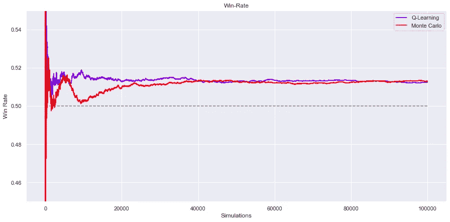

100，000 场模拟游戏的累积胜率

在对两个 RL 模型中的每一个运行 100，000 次模拟之后，可以证明相对于随机代理的一致性能。考虑到运行事件的巨大数量，统计显著性是可以保证的，即使超出的幅度似乎是有限的。

51.5%的胜率意味着 RL 算法比随机玩家多赢 3%。

## 4.1 问题表

为了了解算法对游戏的了解程度，仔细检查 Q 表可能会有所帮助。由于整个表的大小为 270，000 x 8，所以状态是通过手牌的数量来聚集的。

稳步下降的紫色曲线描述了这样一个事实，即手牌较少的州更容易赢得比赛。因此，这些状态具有更高的 Q 值，这有助于 RL 代理选择尽可能快地减少其手牌数量的动作，以便获得奖励。

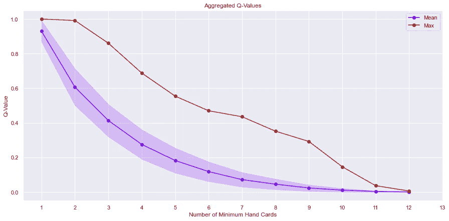

来自 Q 学习模型的聚合 Q 值

## 4.2 国家行动覆盖面

为了判断模型是否已经在足够的模拟上被训练，可以评估状态-动作覆盖。因此，在 100，000 个游戏中已经出现的不同的状态-动作对可以被计数。

总的来说，这两种模型都经历了 ca。六万种不同的组合。乍一看，这低于预期，因为我们现在知道 100，000 个游戏平均有 41 个回合(41 x 100，000 = 410 万)。转弯)。然而，我们也展示了游戏过程是如何集中于在样本中多次出现的某些牌组合。

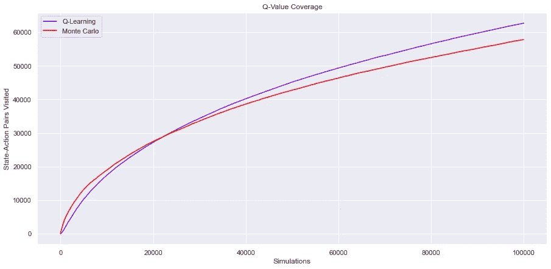

100，000 个模拟游戏期间的状态动作覆盖

由于其更新功能的性质，蒙特卡罗模型的更快的初始覆盖增加并不令人惊讶。

# 5.结论

尽管 RL 模型能够持续地以一定的优势超过随机玩家，但仍然不清楚与真正的人类玩家相比，这种表现会如何。有几个限制阻碍了该算法获得更令人印象深刻的结果:

*   每场游戏中只有很少的几步棋需要战略评估，因为大多数时候，玩家手中不会有超过一张的牌。仅在加州。32%的可玩回合，玩家有多种选择，聪明的行为可以带来更好的表现。

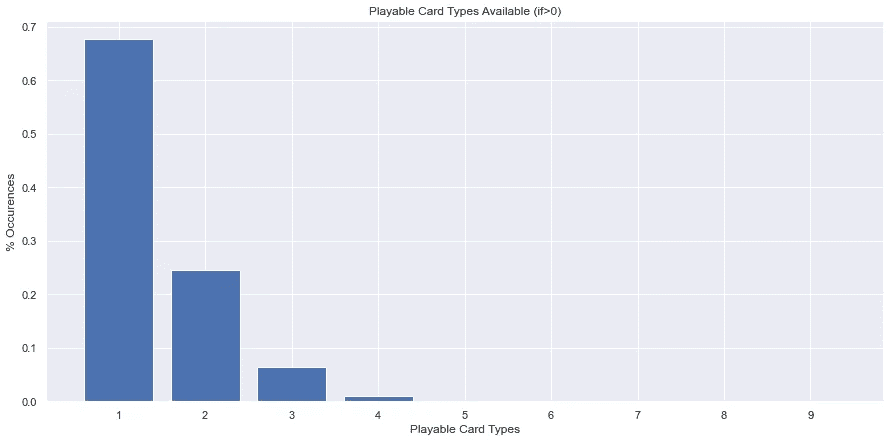

*   **没有包括所有相关的状态信息**，因为这种具有离散状态-动作矩阵的简单形式的 RL 仅适用于有限的一组状态。关于对手拥有的牌的数量或者已经打出的牌的颜色分布的信息可能有助于微调游戏策略。
*   **最后，这是一场运气的游戏！与大富翁或国际象棋等其他棋盘游戏相比，UNO 带来了大量的随机性，这削弱了战略优势的潜力。**

底线是，在下一场 UNO 的比赛中受到挑战时，我会继续相信我的直觉。我展示的作品可以在我的 Github 资源库中找到，任何熟悉高级 RL 方法的人都可以从这里获得。

<https://github.com/bernhard-pfann/uno-card-game_rl> 