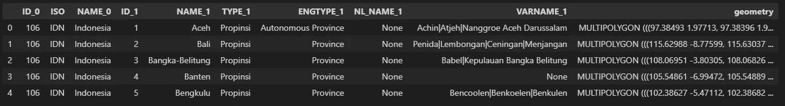
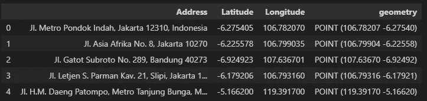
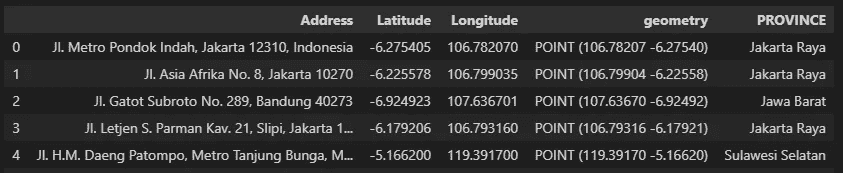

# 使用 Geopandas 将位置标记到 Shapefile 区域

> 原文：<https://towardsdatascience.com/tagging-a-location-to-a-shapefile-area-using-geopandas-5d74336128bf?source=collection_archive---------34----------------------->

## GeoPandas 简化的另一个地理空间用例

照片由 [Marjan Blan | @marjanblan](https://unsplash.com/@marjan_blan?utm_source=medium&utm_medium=referral) 在 [Unsplash](https://unsplash.com?utm_source=medium&utm_medium=referral) 上拍摄

我以前写过一个使用 Geopandas 和 Matplotlib 绘制地图的简单方法。

</a-beginners-guide-to-create-a-cloropleth-map-in-python-using-geopandas-and-matplotlib-9cc4175ab630>  

现在，另一个非常常见的地理空间分析用例是将特定位置标记为预定位置/区域/地区等。例如，假设您是一家实体商店的分析师，想要绘制其关键领域的竞争程度。这些关键区域可以是企业预定义的区域，也可以基于预定的国家区域(如省、区等)。).

你的团队已经收集了足够多的竞争对手地址及其经度坐标列表。要么从第三方公司购买，要么进行艰苦的谷歌搜索，或者两者都有。所以现在你的任务是用一个自定义的城市名来映射这些地址的纬度和经度。您的公司已经有了包含策略性绘制的边框的 shapefile。你所需要做的就是将城市名称与竞争者的位置联系起来。

你不需要任何花哨的算法，GeoPandas 包已经得到了你的支持！

在这个练习中，我们将使用印度尼西亚省的 shapefile，您可以在这里[获得](https://github.com/mrakelinggar/data-stuffs/tree/master/cloropleth_python)，以及我收集的一些随机的印度尼西亚商场地址。你可以在我的 Github [repo](https://github.com/mrakelinggar/data-stuffs/tree/master/latlong_in_shp) 获得它和完整的源代码。

第一步是加载我们需要的包，然后是我们的参考 shapefile 和我们想要标记的地址列表。

印度尼西亚省参考 shapefile 来源于作者

要标记的地址坐标—来源于作者

现在，Geopandas 实际上是一个非常强大的地理空间包，使这项任务变得如此简单。它已经为我们提供了`within`命令，所以我们只有几行简短的代码！

地址标记结果-来源于作者

`within`代码检查我们地址的纬度和经度点是否在我们的参考 shapefile 中。注意，我们需要一次用一个省的参考来检查它。否则，我们将无法正确地标记它(因为两个地址可能在两个不同的省份，如果我们一次对所有参考进行标记，我们将很难正确地标记它)。

就是这样！希望本教程能对您的地理空间分析有所帮助。完整的源代码和数据，你可以在我的 [Github repo](https://github.com/mrakelinggar/data-stuffs/tree/master/latlong_in_shp) 上查看。