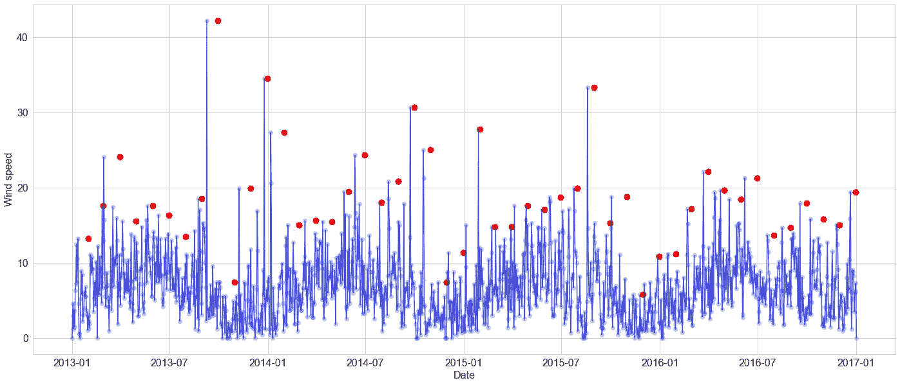
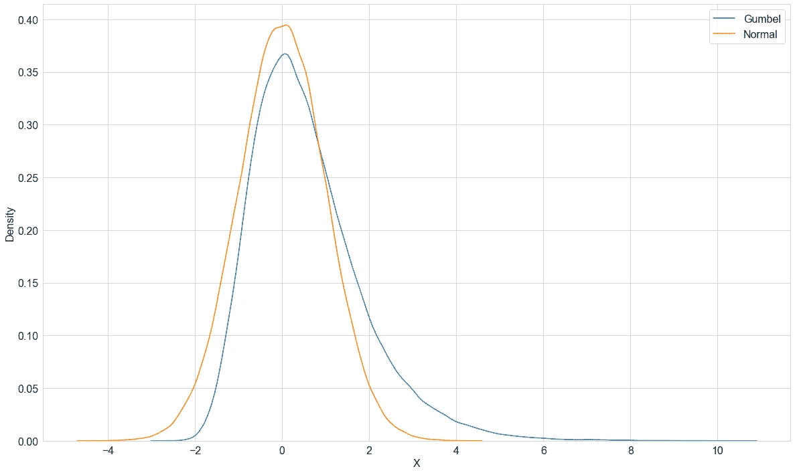
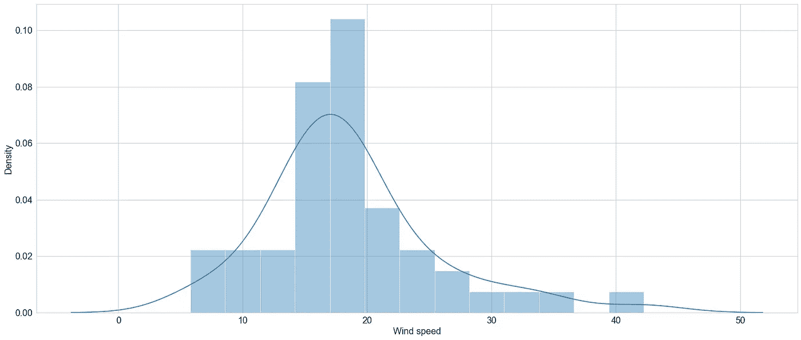
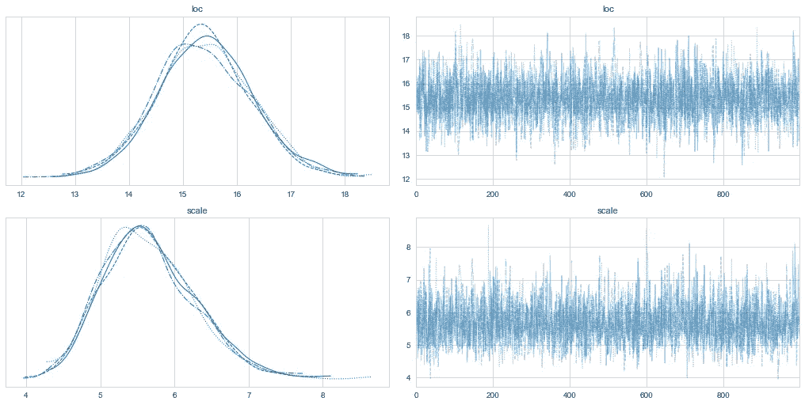
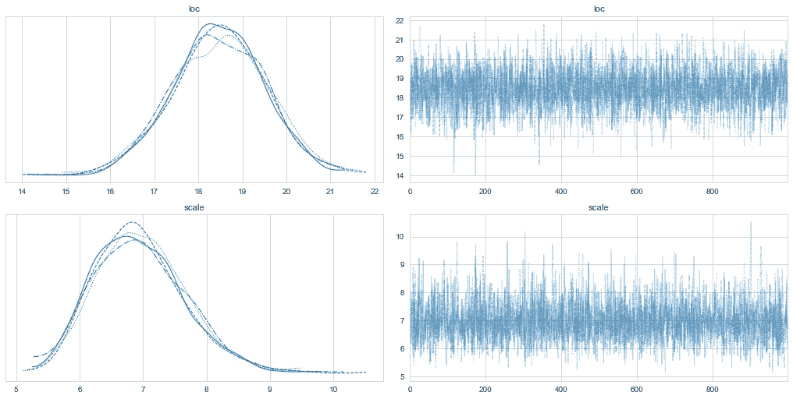
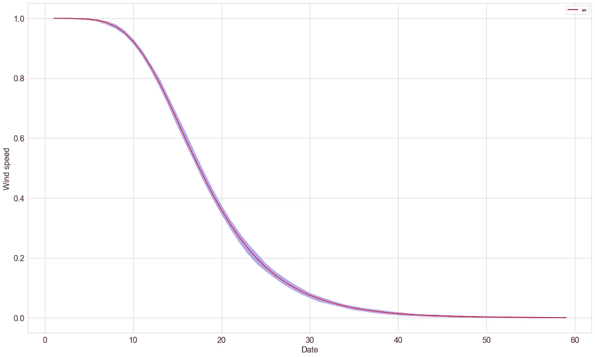

# 尾部事件，它们为什么重要以及如何建模

> 原文：<https://towardsdatascience.com/tail-events-why-they-matter-and-how-to-model-them-4ba979a40aae?source=collection_archive---------7----------------------->

如何用贝叶斯方法为意外和不可能建模？



图片作者。

罕见事件的定义是，嗯，罕见。但是，它们不可避免地会发生，而且当它们发生时，会产生巨大的后果。911 是一个尾部事件。2007/08 年的金融危机是一个尾部事件。冠状病毒是一个尾部事件。你每天使用的许多产品、参与的服务和工作的公司都是[尾事件](https://www.collaborativefund.com/blog/tails-you-win/)。所以，是的，尾部事件很少发生，但一旦发生，其影响是巨大的。

预测尾部事件或极值是**固有的困难**。事实上，作为一名数据科学家，我处理过的最具挑战性的问题之一是估计跨业务关键系统的极值的可能性。虽然精确预测罕见事件实际上是不可能的，但是**估计它们的概率*是*可能的**，但是这需要脱离通常的商业建模。具体来说，它要求使用建模方法，即*考虑显著超出条件均值*的值或事件的可能性。

估计罕见事件概率的原则性方法有助于为决策、风险调整和对策提供信息。虽然有很多方法可以解决这些问题，但以我的经验来看，最容易理解、最可靠和最实用的方法是贝叶斯方法。在这篇文章中，我将提供一个尾部事件的实例，以及如何使用贝叶斯模型来估计它们的概率。

## 极值理论

极值理论(EVT)是统计学的一个分支，处理明显偏离概率分布中心趋势的**值。值得注意的是，一个极值问题从根本上不同于罕见事件预测问题。例如，欺诈检测是一种罕见的事件分类问题，但这不是一个极值问题。*为什么？*因为欺诈等罕见事件很少发生，但却是可预测的，而 EVT 所关注的极端值类型通常难以预测。**

EVT 的最终目的是估计极值发生的概率。这有许多使用案例，特别是在自然科学领域(例如地震和海啸等极端天气事件)，但也包括经济学、金融和工程领域的许多应用问题。

极值可以非常低，也可以非常高。值的方向并不重要。重要的是用于估计其可能性的统计分布。这些分布统称为**极值分布**。有许多极值分布，但是我发现在实践中最直接和有用的是 [**冈贝尔分布**](https://www.itl.nist.gov/div898/handbook/eda/section3/eda366g.htm) **。**

Gumbel 分布类似于正态分布，因为它仅由两个参数**定义，即位置和比例**。但是，与正态分布不同，它是不对称的。这意味着分布的**尾部可能向极值**的方向倾斜。在实践中，这意味着与正态分布相比，Gumbel 分布赋予更多极端事件(即分布尾部的事件或数值)更大的可能性。你可以在下面的图中看到这一点。

```
np.random.seed(123)
n = 100000
fs = {"fontsize" : 16}
plt.figure(figsize=(20, 12))
sns.kdeplot(stats.distributions.gumbel_r().rvs(n), label="Gumbel") 
sns.kdeplot(stats.distributions.norm().rvs(n), label="Normal")
plt.legend(**fs)
plt.xticks(**fs)
plt.yticks(**fs)
plt.ylabel("Density", **fs)
plt.xlabel("X", **fs);
```



图片作者。

## 估计极值的概率

为了在实践中演示 EVT，我将[使用风速数据集](https://www.kaggle.com/sumanthvrao/daily-climate-time-series-data)，其中包括极值。数据绘制如下。您可以在该数据中发现强烈的季节性模式，但也可以发现明显超出正常范围的周期性值。我们需要做的第一件事是分离出这些值。为此，我们可以使用**块最大值**方法。该方法简单地*提取一个范围*(即一个块)内数据的最大值。在这种情况下，我们将提取数据中每个月的最大值。这些点由图中的红点标出。

```
block_maxima_month = (
    df
    .set_index("date")
    .resample("M")
    .max()
    .wind_speed
    .reset_index()
    .query("wind_speed > 5")
)fs = {"fontsize" : 16}
plt.figure(figsize=(24, 10))
plt.scatter(df.date, df.wind_speed, alpha=.3)
plt.plot(df.date, df.wind_speed, alpha=.7, c="b")
plt.scatter(block_maxima_month.date, block_maxima_month.wind_speed, c="red", s=80)
plt.xticks(**fs)
plt.yticks(**fs)
plt.ylabel("Wind speed", **fs)
plt.xlabel("Date", **fs);
```


图片作者。

下一步是拟合块最大值的分布(如下图所示)。为此，我将使用 **PyMC3** 对分布拟合一个简单的贝叶斯模型。为了便于说明，我将对数据进行正态和耿贝尔分布拟合。



作者图片

下面的代码使分布符合块最大值。在这两种情况下，我使用相同的前科。



Gumbel fit 作者图片。



正常拟合-按作者排序的图像

轨迹图显示了对**冈贝尔**(顶部)和**正态**分布的拟合(底部)。在这两种情况下，分布可靠地拟合了数据，如对每个参数的一致探索所示。比较这两种分布是很有趣的，因为它们是由相同的两个参数定义的，但每个都估计了不同的参数值。让我们看看每个分布与极值的实际分布的拟合程度。

对于每个模型，我们首先需要从后验分布中取样。这实质上包括从由估计的位置和比例参数定义的分布中抽取独立的样本。一旦我们有了后验分布，我们就可以将它们与实际数据进行比较。

```
# Extract posterior distributions
ev_post = pm.sample_posterior_predictive(ev_trace, model=ev_model)["lik"].T
norm_post = pm.sample_posterior_predictive(norm_trace, model=norm_model)["lik"].T# Plot density 
plt.figure(figsize=(20, 10))
pm.plot_dist(ev_post, label="Gumbel", textsize=20, hist_kwargs=fs)
pm.plot_dist(norm_post, label="Normal", textsize=20, )
sns.kdeplot(block_maxima_month.wind_speed, label="Actual")
plt.legend(fontsize=14)
```


图片作者。

上图显示了拟合的耿贝尔分布和正态分布以及数据的实际分布。您可以看到，虽然正态分布在拟合数据方面做了合理的工作，但它没有遵循 Gumbel 分布。例如，您可以看到正态分布偏离实际分布的位置相当多，并且也有一个较轻的尾部。相比之下，Gumbel 似乎更符合实际数据。同样值得注意的是冈贝尔分布的长尾效应— **冈贝尔并不排除数据中观察到的更极端事件的可能性**。这正是我们使用这些发行版的原因！

现在我们有了分布，我们可能想做的一件事是估计一个极值被超过的概率。在实践中，这通常是一个非常有用和重要的量化指标。为此，我们可以使用 Gumbel 的后验分布。问题是； ***我们看到超过指定阈值的值的概率是多少？***

上面的代码简单地迭代指定的值，并使用后验 Gumbel 分布来估计看到更大值的概率。这些超越概率绘制如下。例如，风速超过 20 的概率约为 0.38。



作者图片

## 摘要

极值预测是一个有趣但具有挑战性的问题。这篇文章展示了一个通用的方法，你可以用它来开始解决这些问题，但是这可能会变得更加复杂。此外，在这篇文章中，我没有对任何协变量设定极值的可能性。这种分析的一个有趣的扩展是，看看在模型中包括额外的协变量是否有任何价值(例如，前一天或前一周的风速或其他天气模式，如湿度)。最重要的一点是使用极值分布，如 Gumbel 分布。当一个值或事件的可能性大大超过分布的条件均值时，那么你需要一种方法来考虑尾部事件的似然性。

感谢阅读！

附:这个帖子的所有代码可以在[这里](https://conormm.github.io/blog/2021/05/09/tail-events,-bayesian-approaches.html)找到。