# 双标图分析简介:基于印度尼西亚贫困数据的洞察

> 原文：<https://towardsdatascience.com/take-a-decision-based-on-biplot-analysis-on-indonesian-poverty-data-679c28d4ad46?source=collection_archive---------35----------------------->


[迪卡塞娃](https://unsplash.com/@dikaseva?utm_source=medium&utm_medium=referral)在 [Unsplash](https://unsplash.com?utm_source=medium&utm_medium=referral) 上的照片

## [动手教程](https://towardsdatascience.com/tagged/hands-on-tutorials)

## 双标图分析是多元数据的图形表示，它以笛卡尔坐标绘制观察值和变量之间的信息

# 背景

根据 Nurwati (2008)的观点，贫困是人类一直面临的问题。它的问题与人类本身一样古老，其影响可能涉及人类生活的各个方面。换句话说，贫困是一个全球性的社会问题，这意味着这个问题已经引起了全世界的关注，存在于世界上所有的国家，尽管影响是不同的。即便如此，有时人类并不认为贫穷是一个问题。对于那些被归类为穷人的人来说，这是他们日常生活中真实的事情，因为他们生活在贫困中。然而，很难断定他们了解自己的生活状况。

造成贫困的因素包括教育意识水平低、健康状况差、就业机会有限以及与世隔绝。

因此，需要双标图分析来根据人口和贫困因素确定印度尼西亚各省的特征。它的分析可以通过更有吸引力、信息量更大、更具交流性和艺术性的图形表示提供一种简单的理解。此外，使用双标图分析，可以直观地确定每个省的人口和贫困之间的关系。

## 目标

这项研究的目标是:

*   确定印度尼西亚人口和贫困变量之间的关系，如各省人口、贫困线、农民人口比例、平均贫困差距指数(P1)和平均贫困严重程度指数(P2)
*   确定各省之间的相对位置，以便寻找相似的特征
*   了解印度尼西亚各省在人口和贫困变量上的特征
*   根据人口和贫困变量找出贫困水平最低的省份

## 利益

这项研究的好处是:

*   确定与印度尼西亚贫困水平密切相关的变量
*   根据人口和贫困变量确定各省的特点，以便在公共政策讨论中考虑调查结果
*   评估地方政府在实施区域发展以减轻印度尼西亚贫困水平方面的表现

## 领域

研究的范围是，所使用的数据是来自 2010 年印度尼西亚贫困数据和 2010 年村庄潜力数据的二手数据。这些数据可以在 [***印尼中央统计局***](https://www.bps.go.id/) 获得。该文档可在[***https://github.com/audhiaprilliant/Multivariate-Analysis***](https://github.com/audhiaprilliant/Multivariate-Analysis)获得。

# 方法学

## 数据

使用的数据是来自 2010 年印度尼西亚贫困数据和 2010 年村庄潜力数据的二手数据。这些数据可以在*印度尼西亚中央统计局*获得。该数据有如下几个变量:

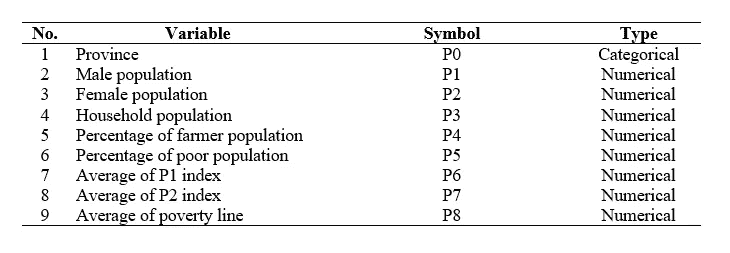

表 1 研究数据(图片由作者提供)

## 数据分析的程序

2010 年印度尼西亚贫困和村庄潜力对应分析研究的步骤如下:

1.  汇总印度尼西亚各省的贫困数据。使用的变量是贫困人口的百分比、P1 指数、P2 指数和贫困线
2.  汇总各省的村庄潜力数据。使用的变量是男性人口、女性人口、家庭人口、农民人口的百分比
3.  基于省名合并印度尼西亚贫困和村庄潜力数据

# 结果和讨论

## 数据预处理和集成

这项研究的第一步是数据预处理。其执行如下:

*   标准化印度尼西亚贫困和村庄潜力数据的省名格式(以大写字母开头)
*   检查印度尼西亚贫困和村庄潜力数据的省名格式
*   检查印度尼西亚贫困和村庄潜力数据的省名格式错误

## 双标图分析

双标图分析是一种多元分析，它试图压缩信息，并使用 ***主成分分析*** 在笛卡尔坐标中显示它们。为了识别成分的方差，需要计算*特征值*。该特征值如表 2 所示。

```
# Load the libraries
library(factoextra)
library(FactoMineR)
# Read the data
data_biplot = read.csv(file = 'Social Poverty Indonesia 2010.csv',
                       header = TRUE,
                       sep = ',')
colnames(data_biplot)
data_biplot = data_biplot[,-10]
str(data_biplot)
# Province as Rownames
data_biplot_no_province = data_biplot[,-1]
rownames(data_biplot_no_province) = data_biplot[,1]
data_biplot = data_biplot_no_province
```

双标图分析

```
# Biplot analysis
res_pca = PCA(data_biplot, 
              graph = FALSE
)
print(res_pca)
# Biplot graph
fviz_pca_biplot(res_pca,
                repel = TRUE,
                col.var = "#2E9FDF", # Variables color
                col.ind = "#696969"  # Individuals color
)
# Calculate the eigenvalue
eig_val = get_eigenvalue(res_pca)
fviz_eig(res_pca,
         addlabels = TRUE,
         ylim = c(0, 50)
)
```

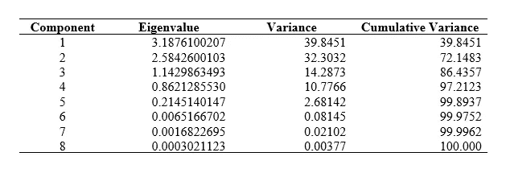

表 2 主成分分析的特征值(图片由作者提供)

从表 2 可以看出，第一个和第二个分量解释了分量方差的 **72.148%** 。因此，双标图分析得到的结果很好地解释了数据的方差。

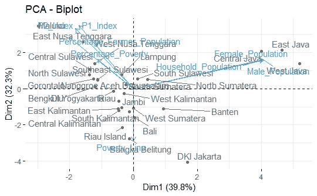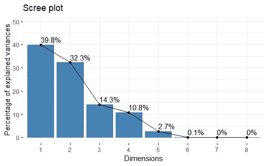

图 1 双标图分析和碎石图(图片由作者提供)

根据图 1(右)中的碎石图，发现在第二个组成部分中，可以解释的方差百分比没有急剧下降。但在第三个组成部分，可以解释的方差百分比的下降急剧下降。这表明第三个成分的添加对解释的方差有影响。但是，对于双图分析，仅选择第一个和第二个组件。两个分量可以解释的方差的总百分比在 **72.148%** 左右。

## 对照双标图分析的结果分析观察值

双标图分析完成后，在确定和评估双标图分析的结果时，对每行(观察值)或每列(变量)进行另一次分析。表 3 显示了两个组成部分(PCA)中每个省的坐标。因为双图分析仅使用第一个组分和第二个组分，所以我们将重点放在前两列。

```
# Graph of observations
ind = get_pca_ind(res_pca)
# Coordinates of observations
ind$coord
```

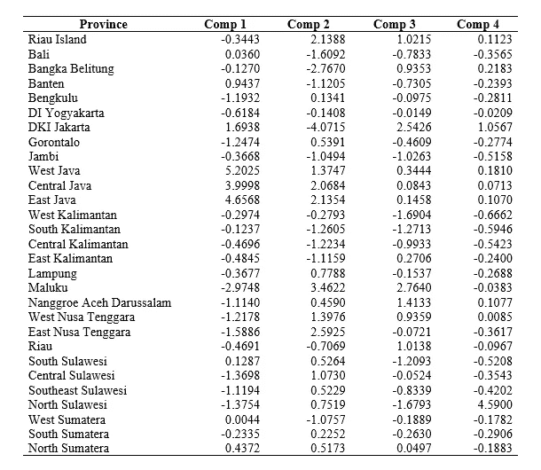

表 3 观察坐标(图片由作者提供)

根据第一和第二成分解释的方差的总百分比为 **72.148%** ，意味着 **27.852%** 的信息缺失。使用第一个分量和第二个分量，我们得到的结果是，可能有观察点不能由双标图正确表示。正确的衡量标准是余弦的平方。如果观察点由双标图充分表示，则第一分量和第二分量中的*平方余弦*之和接近 1。

```
# Squared Cosine of observations
ind$cos2
```

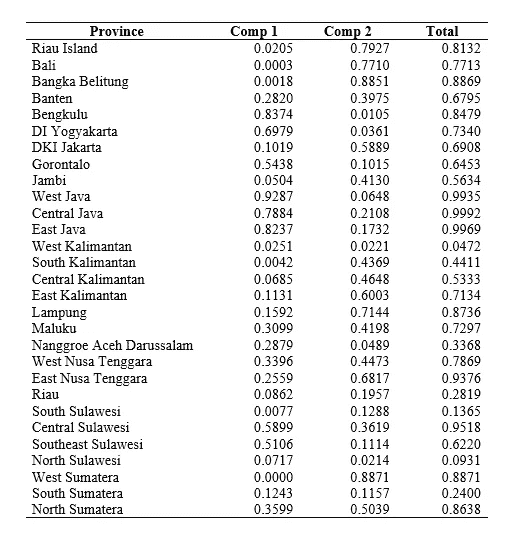

表 4 观测值的平方余弦值(图片由作者提供)

根据表 4，可以得出结论，在双标图中有几个省没有得到很好的代表。它们是万丹、DKI 雅加达、哥伦打洛、中加里曼丹、亚齐、廖内、南苏拉威西、东南苏拉威西、北苏拉威西和南苏拉威西。这是由于那些省份的*平方余弦*很小，低于 **0.7** 。从视觉上看，*平方余弦*的值如图 2 所示。

```
# Color by cos2 values: quality on the factor map
fviz_pca_ind(res_pca,
             col.ind = 'cos2',
             gradient.cols = c('#00AFBB', '#E7B800', '#FC4E07'),
             repel = TRUE # Avoid text overlapping
)
# Cos2 of individuals on 1st component and 2nd component
fviz_cos2(res_pca,
          choice = 'ind',
          axes = 1:2
)
```

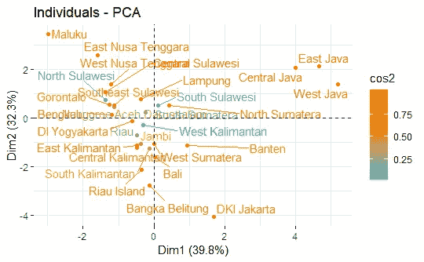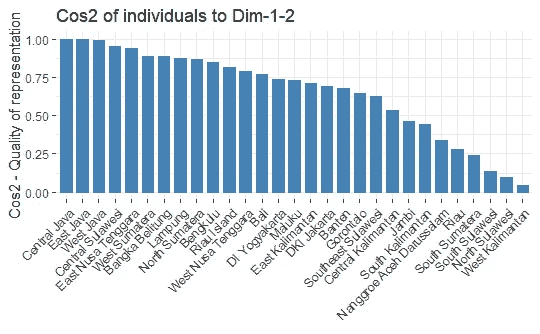

图 2 双标图分析和观察值的平方余弦(图片由作者提供)

## 根据双标图分析结果分析贫困和村庄潜在数据指标

两个分量(PCA)中每个变量的坐标如表 5 所示。因为双图分析仅使用第一个组分和第二个组分，所以我们将重点放在前两列。

```
# Graph of variables
var = get_pca_var(res.pca)var
# Coordinates of variables
var$coord
```

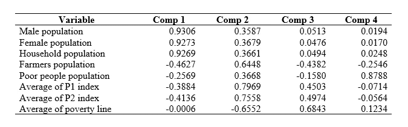

表 5 变量的坐标(图片由作者提供)

使用第一部分和第二部分，其结果是有可能存在双标图不能很好表示的贫困和村庄潜在变量。为了探究这种情况，我们将查看表 6 所示的*余弦平方*。

如果这些指示符被很好地表示，那么第一分量和第二分量中的余弦平方之和将接近 1。变量的*余弦平方*的值如表 6 所示。

```
# Squared Cosine of variables
var$cos2
```

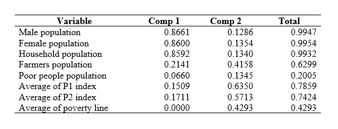

表 6 变量的平方余弦(图片由作者提供)

根据表 9，可以得出结论，有几个变量没有得到很好的体现。这些是贫困人口的百分比和平均贫困线。他们有一个*平方余弦*非常小，低于 **0.7** 。

```
# Color by cos2 values: quality on the factor map
fviz_pca_var(res_pca,
             col.var = 'cos2',
             gradient.cols = c('#00AFBB', '#E7B800', '#FC4E07'),
             repel = TRUE # Avoid text overlapping
)
# Cos2 of variables on 1st component and 2nd component
fviz_cos2(res_pca,
          choice = 'var',
          axes = 1:2
)
```

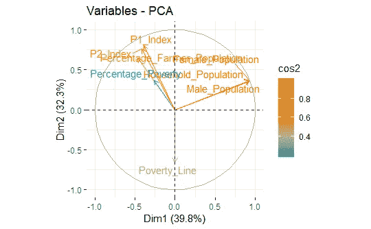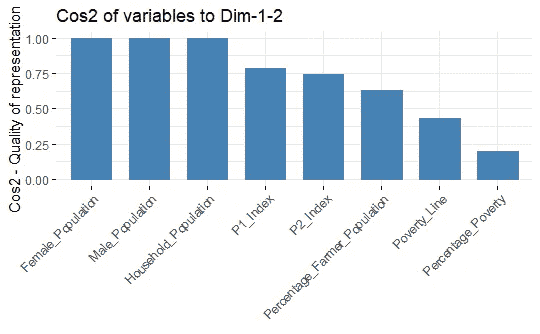

图 3 双标图分析和变量的平方余弦(图片由作者提供)

## 变量的相关性

从这些变量之间的相关性可以看出变量之间的关系。相关性就是这两个向量(变量)形成的角度的 ***余弦*** 。如果向量重合或者两者的角度都接近 0，则相关性接近 1。在 1 附近的两个变量之间的相关性暗示了这两个变量之间的显著关系。男性群体和女性群体的相关性最高，约为 0.9996。另一个最高值在 P1 指数和 P2 指数之间，为 0.9910。

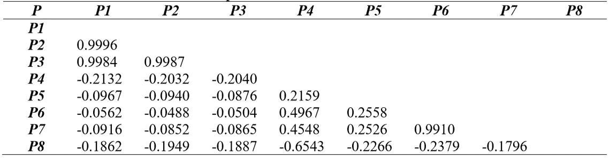

变量的相关性(图片由作者提供)

# 结论和解释

根据图 1，观察值和变量之间的关系可以分为以下四类:

*   ***第一类*** 。它主要由女性人口、男性人口和家庭人口组成。围绕这些变量分布着几个省份，即 ***西爪哇省、中爪哇省、东爪哇省和北苏门答腊省*** 。这表明，与印度尼西亚其他省份相比，这些省份的人口相当多
*   ***第二类*** 。它只有一个变量，那就是贫困线。其类别对应 ***万丹、邦加勿里洞、廖内、巴厘、东加里曼丹、中加里曼丹、南加里曼丹、占碑、西苏门答腊、占碑、廖内、DKI 雅加达*** 。这些省份的贫困线高于印度尼西亚的其他省份
*   ***第三类*** 。它由 P1 指数和 P2 指数主导。由 ***楠榜、东努沙登加拉、南苏拉威西*** 组成。他们有更高的 P1 指数和 P2 指数
*   ***第四类*** 。它有两个主要变量。它们是贫困人口的百分比和农民人口的百分比。由 ***西努沙登加拉省、中苏拉威西省、北苏拉威西省、东南苏拉威西省、亚齐省、明古鲁省*** 组成。

# 参考

[1]努尔瓦蒂。[*Kemiskinan:model pengukuran，permasalahan，and Kemiskinan alternative kebijakan*](http://jurnal.unpad.ac.id/kependudukan/article/view/doc1)(2008)，Jurnal Kependudukan Padjadjaran。10(1): 1–11.