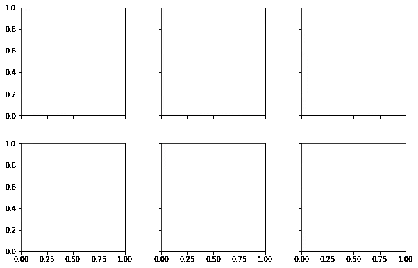
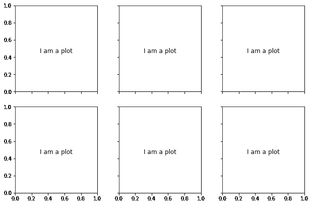
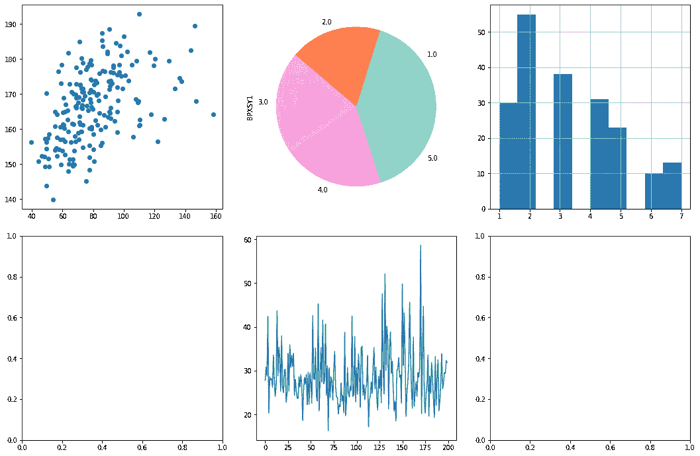
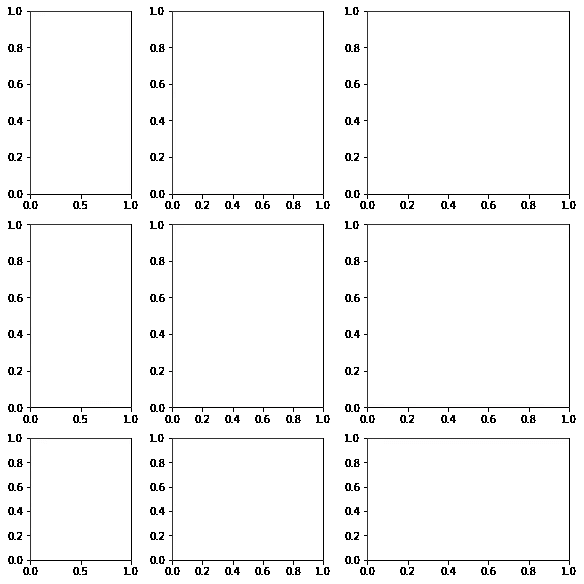
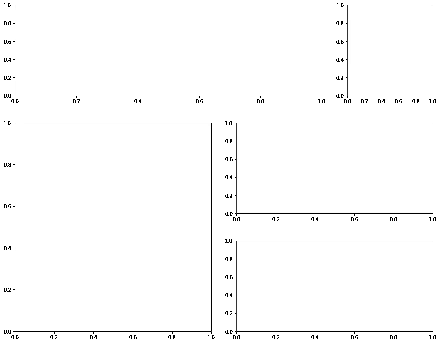
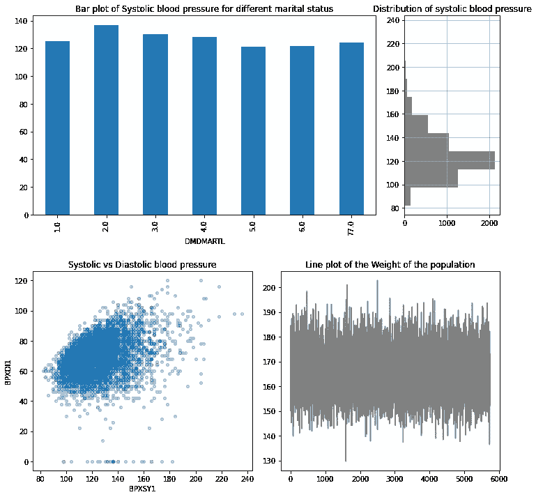

# 完全控制 Matplotlib 中的支线剧情

> 原文：<https://towardsdatascience.com/take-full-control-over-the-subplots-in-matplotlib-71b3bc11ff0b?source=collection_archive---------37----------------------->


[腾雅特](https://unsplash.com/@tengyart?utm_source=medium&utm_medium=referral)在 [Unsplash](https://unsplash.com?utm_source=medium&utm_medium=referral) 上拍摄的照片

## 使用支线剧情和 GridSpec 一起更好地控制

使用支线剧情，将多个情节放在一个图中，对于在一个小空间里总结大量信息非常有用。他们有助于做报告或演示。本文将关注如何有效地使用支线剧情并对网格进行精细的控制。

我们将从基本的子图函数开始，首先制作大小相等的图。让我们进行必要的导入:

```
%matplotlib inlineimport matplotlib.pyplot as plt 
import numpy as np 
import pandas as pd
```

下面是 Matplotlib 中的基本 subplots 函数，它生成两行三列大小相等的矩形空间:

```
fig, ax = plt.subplots(2, 3, sharex = 'col', sharey = 'row', figsize = (9, 6))
fig.tight_layout(pad =3.0)
```



“sharex”参数使同一列中的图具有相同的 x 轴，将“sharey”参数设置为“row”使同一行中的图共享相同的 y 轴。这就是为什么只有外层有 x 轴和 y 轴的值。共享轴心有利也有弊。我们以后再谈。

> **如何访问这个数组中的一个图？**

这些矩形存储在一个二维数组中。让我们把“斧头”打印出来:

```
ax
```

输出:

```
array([[<AxesSubplot:>, <AxesSubplot:>, <AxesSubplot:>],
       [<AxesSubplot:>, <AxesSubplot:>, <AxesSubplot:>]], dtype=object)
```

从上面的输出可以清楚地看出，它实际上是一个二维数组。因此访问其中的一个元素应该使用嵌套的 for 循环。首先在每个矩形中放一些文本:

```
fig, ax = plt.subplots(2, 3, sharex = 'col', sharey = 'row', figsize = (9, 6))
fig.tight_layout(pad = 2)for a in ax:
    for b in a:
        text = 'I am a plot'
        b.annotate(text, (0.3, 0.45), fontsize = 12)
```



主要目的是在那些矩形里放一些真实的图形和地块。下一步我会这么做。但为此，我们需要一个数据集。我将使用这个数据集:

[](https://github.com/rashida048/Datasets/blob/master/nhanes_2015_2016.csv) [## rashida 048/数据集

### 在 GitHub 上创建一个帐户，为 rashida048/Datasets 开发做出贡献。

github.com](https://github.com/rashida048/Datasets/blob/master/nhanes_2015_2016.csv) 

请随意下载数据集并跟随。

在这里，我使用 pandas 导入数据集:

```
df = pd.read_csv('nhanes_2015_2016.csv')
df.columns
```

输出:

```
Index(['SEQN', 'ALQ101', 'ALQ110', 'ALQ130', 'SMQ020', 'RIAGENDR', 'RIDAGEYR', 'RIDRETH1', 'DMDCITZN', 'DMDEDUC2', 'DMDMARTL', 'DMDHHSIZ', 'WTINT2YR', 'SDMVPSU', 'SDMVSTRA', 'INDFMPIR', 'BPXSY1', 'BPXDI1', 'BPXSY2', 'BPXDI2', 'BMXWT', 'BMXHT', 'BMXBMI', 'BMXLEG', 'BMXARML', 'BMXARMC', 'BMXWAIST', 'HIQ210'], dtype='object')
```

我将再次制作一个 2x3 的绘图数组，并在“ax”元素中设置绘图。我们将像二维数组一样简单地通过索引来访问每个“ax”元素。我希望你记得如何索引一个二维数组。如果您需要复习，请查看这篇文章:

[](/indexing-and-slicing-of-1d-2d-and-3d-arrays-in-numpy-e731afff0bbe) [## Numpy 中 1D、2D 和 3D 数组的索引和切片

### 本文从基础到高级展示了 Numpy 数组的索引和切片。

towardsdatascience.com](/indexing-and-slicing-of-1d-2d-and-3d-arrays-in-numpy-e731afff0bbe) 

因此，下面是如何访问“ax”元素并在其中设置绘图。我给你留了两个空位。请随意装满它们。我的想法是演示如何去做。

```
fig, ax = plt.subplots(2, 3, figsize = (15, 10))
fig.tight_layout(pad = 2)ax[0, 0].scatter(df['BMXWT'], df['BMXHT'])
ax[1, 1].plot(df['BMXBMI'])
df['DMDHHSIZ'].hist(ax = ax[0, 2])
df.groupby('DMDEDUC2')['BPXSY1'].mean().plot(ax = ax[0, 1], kind='pie', colors = ['lightgreen', 'coral', 'pink', 'violet', 'skyblue'])
plt.show()
```



请注意，我没有将“sharex”设置为“col”、“sharey”或“row”。这样剧情就没什么帮助了。因为饼图没有传统的 x 轴和 y 轴。直方图和散点图具有非常不同的范围。请你自己试试。

上面所有的图都是一样大的。我是说同样的高度和宽度。事情不一定是这样的。一个子绘图组中的绘图可以有不同的高度和宽度。这可以使用“add_gridspec”函数来完成。

```
fig = plt.figure(constrained_layout=True, figsize=(8, 8))s = fig.add_gridspec(3, 3, width_ratios = [2, 3, 4], height_ratios = [3, 3, 2])for row in range(3):
    for col in range(3):
        ax = fig.add_subplot(s[row, col])
```



> **对网格进行更精细的控制**

这可以使用“支线剧情”和“GridSpec”来完成。这里有一个例子。我会在图后说明:

```
plt.figure(figsize = (15, 12))
grid = plt.GridSpec(3, 4, wspace =0.3, hspace = 0.3)plt.subplot(grid[0, :3])
plt.subplot(grid[0, 3])
plt.subplot(grid[1:, :2])
plt.subplot(grid[1, 2:])
plt.subplot(grid[2, 2:])
```



让我解释一下这里发生的事情。首先，我们做了一个 3x4 的网格。这意味着三行四列。接下来，我们通过网格索引来定制地块的大小。

```
plt.subplot(grid[0, :3])
```

使用这些代码，我们可以索引网格并定制形状。grid[0，3]'这里是取第一行的前三个地块，做一个更大的地块。我们将行索引放在首位。因为它是第一行，所以 row-index 是 0，而 column index 是 0 到 3，因为我们取前三列。可以写成 0:3。但当它以 0 开头时，可以写成:3。

下一个是“grid[0，3]”。这个更简单。0 表示行索引为 0，3 表示列索引为 3。

使用“grid[1::2]”，我们正在制作一个大的正方形。行索引从 1 开始，一直到末尾。列索引从 0 开始，包含 2 个图。所以，它需要指数为 0 和 1 的图。所以列索引变成 0:2，可以写成:2。

“[1，2:]”引用行索引 1。列索引从 2 开始，一直到末尾。

grid[2，2:]'表示行索引 2 和列索引 2 到结尾。

现在你知道了如何索引网格和定制形状的图，让我们再做一个并在其中放一些真实的图。

```
plt.figure(figsize = (12, 12))
grid = plt.GridSpec(4, 4, wspace =0.3, hspace = 0.8)g1 = plt.subplot(grid[0:2, :3])
g2 = plt.subplot(grid[2:, 0:2])
g3 = plt.subplot(grid[:2, 3])
g4 = plt.subplot(grid[2:, 2:])df.groupby('DMDMARTL')['BPXSY1'].mean().plot(kind = 'bar', ax = g1)
g1.set_title("Bar plot of Systolic blood pressure for different marital status")df['BPXSY1'].hist(ax = g3, orientation = 'horizontal', color='gray')
g3.set_title("Distribution of systolic blood pressure")df.plot('BPXSY1', 'BPXDI1', kind='scatter', ax = g2, alpha=0.3)
g2.set_title("Systolic vs Diastolic blood pressure")df['BMXHT'].plot(ax = g4, color='gray')
g4.set_title('Line plot of the Weight of the population')
```



在这里！完整的情节。

## 结论

如果你已经运行完了上面的所有代码并且能够理解它们，使用支线剧情应该很容易，并且你现在可以完全控制支线剧情了。以下是该内容的视频版本:

欢迎在[推特](https://twitter.com/rashida048)上关注我，并喜欢我的[脸书](https://www.facebook.com/rashida.smith.161)页面。

## 更多阅读:

[](/an-ultimate-cheatsheet-of-data-visualization-in-seaborn-be8ed13a3697) [## 用 Python 的 Seaborn 库实现数据可视化的终极指南

### 对学习者来说也是一个很好的资源

towardsdatascience.com](/an-ultimate-cheatsheet-of-data-visualization-in-seaborn-be8ed13a3697) [](/do-you-need-a-masters-degree-to-become-a-data-scientist-ab894c2a8d41) [## 成为数据科学家需要硕士学位吗？

### 我作为波士顿大学数据分析专业硕士学生的经历和体会

towardsdatascience.com](/do-you-need-a-masters-degree-to-become-a-data-scientist-ab894c2a8d41) [](/an-ultimate-cheat-sheet-for-numpy-bb1112b0488f) [## Numpy 入门指南

### 日常工作所需的所有 Numpy 功能

towardsdatascience.com](/an-ultimate-cheat-sheet-for-numpy-bb1112b0488f) [](/a-complete-guide-to-time-series-data-visualization-in-python-da0ddd2cfb01) [## Python 时序数据可视化完全指南

### 这应该给你足够的资源来制作时间序列数据的视觉效果

towardsdatascience.com](/a-complete-guide-to-time-series-data-visualization-in-python-da0ddd2cfb01)