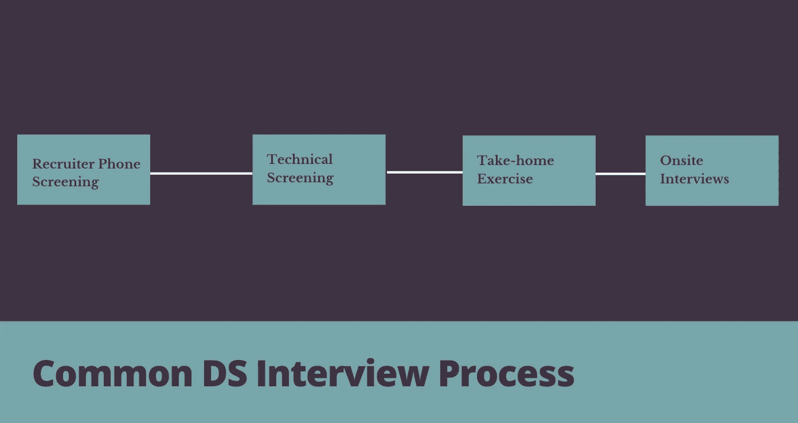

# 带回家的练习可以成就或毁掉你的 DS 面试

> 原文：<https://towardsdatascience.com/take-home-exercises-can-make-or-break-your-ds-interviews-5aac8b63f6d1?source=collection_archive---------10----------------------->

91 杂志在 [Unsplash](https://unsplash.com?utm_source=medium&utm_medium=referral) 上拍摄的照片

## [办公时间](https://towardsdatascience.com/tagged/office-hours)

## 如何处理你的课后练习——可以说是面试中最重要的部分，也是你最能控制的部分

## **什么是**带回家的练习？

如今，越来越多的公司将带回家练习作为数据科学(DS)面试流程的一部分。事实上，到目前为止，我面试过的 90%以上的科技公司都有带回家的面试，通常是在技术筛选之后和现场面试之前。通常会给你一个样本数据集和一系列开放式问题，比如这里的[示例](https://datamasked.com/wp-content/uploads/Insights.html)。大多数公司会给你一个机会在现场面试中向面试官或小组展示你的结果。

作者图片

## **为什么雇主都爱带回家的练习？**

带回家练习是从雇主的角度评判候选人的一个很好的方式，因为它最接近你作为 DS 的日常工作，让雇主看到你的真正潜力，并让他们看到你如何从头到尾处理一个复杂的问题。正是因为这个原因，许多公司都非常重视带回家的练习(我知道这一点，因为我自己也参加过几次面试)。我目睹过现场编码做得不够好的考生通过带回家的练习来救赎自己；我也见过那些以优异成绩通过技术考试的候选人，由于不重视带回家的练习而毁掉了他们成功的机会。

## 你应该如何对待带回家的练习？

因为我知道带回家练习的重要性，它们过去似乎让我望而生畏:“我从哪里开始？”“即使招聘人员告诉我不应该花费超过 2-3 个小时，我还应该花费超过 2-3 个小时吗？”“我应该在网上查资料吗？”。我读了很多关于如何准备 DS 面试的文章，我自己也写了几篇关于如何准备和完成课后练习的文章，但是我没有找到任何好的资源，所以我决定整理一下我作为面试官和被面试者的经验，为你如何利用课后练习脱颖而出提供一些想法。

1.  **总是，总是，总是对给你的数据进行质量检查**

正如我提到的，带回家的练习通常包含一个小样本数据集，供您探索并帮助回答提出的问题。以我的经验，给考生的数据几乎总有一些“错误”或“不准确”在里面；这可能是一些错误标记的时间戳，或者是明显不准确的后期信息。这些“陷阱”被放入数据集中，以测试 DS 应该具备的最重要的资格之一——对现实生活中数据不准确性的意识，以及有效审查和清理数据集的能力。

通常，样本数据集足够小，足以发现任何明显的错误；如果没有，尝试从数据集中随机抽取一些行来测试数据的完整性。这只是 QA 的起点，旨在捕捉数据中任何明显的不准确之处(例如，某个日期的所有时间戳都在午夜，而所有其他日期的时间戳分布在一天中的不同时间)。在您进入分析的下一步— EDA(探索性数据分析)时，QA 将继续进行。

**2。从 EDA(探索性数据分析)开始分析**

[法卡斯特](https://en.wikipedia.org/wiki/User:Farcaster)在[英语维基百科](https://en.wikipedia.org/wiki/)

每个 DS 应该已经熟悉 EDA 过程以及如何进行；但如果你不是，

> EDA 是在任何建模之前对数据执行的初始过程。它旨在提供对数据的初步理解，帮助确定数据清理的必要性(如果数据中存在异常值或异常)，并提供使用汇总统计和可视化快速形成和/或测试假设的机会

Python *Pandas* 包中有方便的函数(*形状、信息、描述等。*)和 R *dplyr* 这一步可以派上用场的包。在本文中，我不打算深入探讨 EDA 的细节，但我想简要指出关于带回家练习需要注意的几个重要事项:

*   **缺失值:**特别注意缺失值是很重要的，尤其是如果你认为它将是你后续分析的关键变量。为缺失值制定缓解计划也同样重要(例如，删除行或使用中值/平均值填充缺失值)。
*   **异常值:**通过绘制变量的分布图，应该很容易发现任何异常值；对异常值存在的原因以及是否需要修正/清理数据进行假设是很重要的。
*   **相关性:**快速绘制所有变量之间的相关性图通常会让你对要测试的假设有一个很好的想法，如果你决定为这个练习建立一个模型，相关性分析还可以在特征选择方面提供指导。

**3。假设驱动**

在我的上一篇文章中([麦肯锡教给我的能让你成为更好的数据科学家的 5 课](/5-lessons-mckinsey-taught-me-that-will-make-you-a-better-data-scientist-66cd9cc16aba?source=your_stories_page-------------------------------------))，我提到了在钻研数据之前**拥有假设** **的重要性。这将帮助您限制范围，并为您的分析提供方向。这也有助于你创建一个叙述来组织你的分析，这将有助于你稍后向面试官展示你的结果。**

GIF 的

如前所述，EDA 将有助于提出这些假设，您可以稍后证明或反驳。不要害怕假设会被证明是错误的；只要假设一开始是合理的，这本身就是一个有趣的结论，可以包含在你的文章中。

**4。清楚地陈述假设，并尽可能支持它们**

与现场面试相比，带回家练习的最大缺点是很难问清楚问题，也很难与面试官交流。你可能没有完成练习所需的所有信息；可能是你不确定面试官对问题的哪个方面最感兴趣，或者是你缺少分析所需的数据。克服这个缺点的最好方法是清楚地陈述你所做的任何假设；许多候选人忘记了这一点，这使得评审人员很难理解你的分析。这些假设可以基于研究，甚至轶事证据或简单的常识(尽管如果你有一个强大的来源或数据点来支持它们通常会更好)。面试官可能会在你带回家练习的现场演示中挑战你的假设，所以确保你的选择总是有一个好的理由。

**5。始终将其与业务影响联系起来**

在我之前的文章中([麦肯锡教给我的让你成为更好的数据科学家的 5 课](/5-lessons-mckinsey-taught-me-that-will-make-you-a-better-data-scientist-66cd9cc16aba?source=your_stories_page-------------------------------------))，我也提到了将所有分析与业务影响联系起来的重要性；同样的规则也适用于带回家的练习。

大多数公司提供了他们真实数据的样本，或者至少是代表他们真实数据的数据。他们问的问题可能与他们的业务相关，因此展示你的商业头脑(相信我，这是 DS 中罕见的技能)并证明你将能够产生可衡量的影响是很重要的。

**6。有结构化的可交付成果**

每个人(希望)都知道招聘人员在每份简历上花的时间不超过 2 分钟，所以以一种容易理解的方式组织你的简历是非常重要的。带回家的练习也是如此——它们通常由招聘团队成员审查，他们在日常工作之外帮助招聘过程，所以他们可能会花**2 分钟以上，但不会超过 20 分钟**“评分”你的带回家练习。让他们的工作变得简单，让你的交付物有条理，关键信息清晰。

我的 DS 带回家的可交付成果通常有三个组成部分— **代码+写作+演示文稿。确保你的代码简洁易读，格式良好，并且有注释来帮助读者理解。在注释中清楚地陈述任何假设，而不是隐藏在代码本身中(参见上面的第 4 点)。报告可能是大多数面试官在陈述之前用来判断你的分析的，所以确保你遵循报告或研究论文的格式，并在开始时有一个执行摘要。当把一副牌放在一起时，记住[自上而下的沟通](/5-lessons-mckinsey-taught-me-that-will-make-you-a-better-data-scientist-66cd9cc16aba)是很重要的，在深入细节之前，从关键信息开始你的牌。**

**8。准备演讲**

除非你是一个经验丰富的演示者，否则一定要练习演示。保持条理并记住你想表达的所有观点是很难的，尤其是当你在面试中处于压力之下的时候；因此，请务必记下演示者的笔记。当然，你不可能预料到面试官会问的所有问题，但要试着对你的假设和设想进行压力测试，这样你就不会措手不及，可以为你在分析中做出的任何选择辩护。

10。不要害怕利用外部资源

通过外部资源，我不是说让你的朋友做你的练习；我的意思是在网上查资料。与现场面试相比，带回家练习的最大优势是你可以利用你能找到的任何资源。这就像是学校的开放式网络考试，好好利用吧。无论是第三方数据还是竞争对手研究，只要是公开信息，都是公平博弈。从我的经验来看，大多数面试官会欣赏你的额外努力和主动性。

GIPHY 制作的 GIF

你可能会想，“招聘人员让我花 2-3 个小时做这个练习，我怎么能完成你提到的所有事情？”。事实是，你不能。我每次带回家练习都要花 2-3 个小时以上，尽管招聘人员总是告诉我并非如此。我并不是要你花一周的时间来完成它(那太夸张了)，而是要认真对待它，就像你在为团队做一个迷你项目一样。毕竟，你会希望这份工作能准确地反映你的工作质量，因为面试官会把它作为一个窗口来一窥你的能力和态度。让带回家的练习成为你的 DS 面试，或者至少，不要破坏它。

希望这篇文章对你以后 DS 面试的带回家练习有帮助。我将在下一篇文章中继续我的面试系列，我将介绍在 面试中需要注意的 ***。***