# 把它带到推特上:国会议员的社交媒体分析

> 原文：<https://towardsdatascience.com/take-it-to-twitter-sentiment-analysis-of-congressional-twitter-in-r-ee206a5b05bc?source=collection_archive---------10----------------------->

## [实践教程](https://towardsdatascience.com/tagged/hands-on-tutorials)

## 通过情感分析理解国会对社会和政策问题的观点

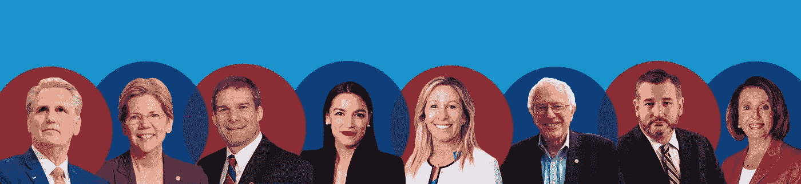

图片由作者提供，肖像来自[政府印刷局](https://memberguide.gpo.gov)

**推特和美国政治**

自特朗普政府上台以来，推特的使用在美国政治中已经被讨论得令人生厌。虽然前总统特朗普已经离任，但社交媒体应用的重要性仍然保持不变。Twitter 现在已经成为国会议员与选民接触并就政策问题发表意见的主要途径。

随着新的拜登政府上台，国会两党合作已经成为政治中每一个重大问题的前沿。由于参众两院的差距很小，两党成员都支持立法对于有效的政府来说是至关重要的。虽然双方都在谈论两党支持的必要性，但在这个极度极化的时代，他们在社交媒体上反映了这种需求吗？

为了检验这个问题，我收集了现任国会议员的推文。一名国会议员拥有和(似乎是)操作的所有账户都被抓取了推文。虽然许多政治家都有团队运营他们的社交媒体，但这项分析的具体目标是查看来自国会议员自己的账户的推文。

为了研究这个问题，我收集了现任国会议员的推文。国会议员拥有和运营的所有账户都被取消了。虽然许多政治家都有团队运营他们的社交媒体，但这项分析的具体目标是查看来自国会议员自己账户的推文。

对于这个具体项目，主要关注领域是:

1.  国会议员是如何在推特上谈论彼此的(包括本党成员和反对党成员)？
2.  他们在推特上谈论社会和政策问题的方式是积极的还是消极的？
3.  什么关键词最常用于社会和政策问题？这些关键字在不同的政党中有什么不同？

**推文收集和预处理**

为了进行这项分析，必须确定国会议员的推特账户。癌症分类组织在他们的网站上有一个电子表格，上面有所有国会议员的主要信息。虽然这是一个坚实的基础，但我注意到名单上有一些成员不再任职。这份名单的一个局限是，它只列出了国会议员的政府账户；但是，许多人有其他帐户，这些帐户通常使用频率更高。因此，我手动在 Twitter 上查找每个成员，以确认国会账户是准确的，并发现现任国会成员拥有的任何其他个人资料。我把这些额外的账户分为三类:个人账户、竞选账户和新闻办公室账户。个人账户通常在他们的简历中如此陈述，并且通常比国会议员的国会账户更活跃。当且仅当推文呈现为来自国会议员时，才会收集竞选账户。任何披露由国会议员团队运营的账户都被排除在外..最后，新闻办公室账户是在与竞选账户类似的条件下收集的。如果该账户的个人资料表明推文并非来自国会议员本人，则该账户不包括在内。以这种方式收集账户的目的是为了只分析来自国会议员的推文。

在所有 535 名国会议员中，有 532 人被发现至少有一个推特账户。2021 年 4 月去世的前众议员阿尔西·黑斯廷斯(D-FL)没有推特账户。他的席位目前也是空缺的；因此，没有来自佛罗里达州第 23 区的推文可以分析。众议员克里斯·史密斯(新泽西州共和党)也被发现没有推特账户。最后一个没有分析的成员是众议员杰夫·范·德鲁(新泽西州共和党)。众议员范·德鲁拥有一个推特账户；然而，它在 2021 年 2 月被删除。把任何可以收集到的推文都包括进来是不合适的，因为他的推文的时间跨度与所有其他账户不一样。

还有另外两个账户无法收集推文。共和党众议员道格·拉玛尔法(Doug LaMalfa)和民主党众议员佐伊·洛夫格伦(Zoe Lofgren)的私人账户不包括在这项分析中。考虑到一般观众无法接触到这些内容，将它们包括在内是没有意义的，因为这项分析的目的是了解国会议员如何公开展示自己。

最终，1016 个与国会议员有关的账户被确认。这包括 517 个政府账户、320 个个人账户、166 个竞选账户和 17 个新闻办公室账户。

推文收集于 2020 年 11 月 3 日至 2021 年 7 月 25 日期间。第一批推文是在 4 月 25 日发布的，6 月 15 日和 7 月 25 日又增加了一些推文。因为额外的推文被附加到现有的数据帧，所以被删除的推文可能被包括在数据帧中。tweet 是使用 Twitter API 和 get_timeline 函数从 r 中的 rtweet 包中收集的，由于 Twitter API 的限制，只能从任何帐户中提取最近的 3，200 条 tweet。自 2020 年 11 月 3 日执行最初的收集以来，没有任何国会议员发推文超过 3200 次。当额外的 tweet 被追加到之前的集合中时，会根据 tweet 的内容、tweeter 的屏幕名称以及创建时间来检查重复的 tweet。这允许新的推文被保留，任何重复的被删除。下面的嵌入式代码中提供了收集推文和检查重复项的示例代码，其中“TwitterAccounts”是包含国会账户的数据框，“Handle”是包含每个 Twitter 屏幕名称的列。

```
library(rtweet)Tweets <- vector()
for (i in TwitterAccounts$Handle){
  df <- get_timeline(i, n=3200) #Collects the most recent 3,200 Tweets from each handle
  Tweets <- rbind(Tweets, df) #Binds into one large df 
}#Used when appending additional tweets to existing dfNewTwitterDf <- rbind(OldTwitterDf, Tweets)
NewTwitterDf <- NewTwitterDf %>% mutate(screen_name= tolower(screen_name)) %>% #Standardizes handles to all be lowercase
  distinct(text, screen_name, created_at, .keep_all = TRUE) #Checks for dups based on tweet, user, and time tweeted
```

虽然确定了 1016 个与现任国会议员有关的账户，但只有 976 个账户在 2020 年 11 月 3 日至 2021 年 7 月 25 日期间发布过推文。大部分被删除的账户都是 11 月 3 日之后不再活跃的活动账户。从这些账户中，收集了指定时间段内的 541，689 条推文。这些作为分析中使用的推文。

**国会议员的推特资料和行为**

在对任何文本进行处理之前，对以下简单措施和国会议员的参与进行了审查。下图中，976 个账户的关注者数量(截至 2021 年 7 月 25 日)按州进行了分析和细分。在所有账户中，只有 35 个账户拥有超过 100 万的关注者，最受欢迎的账户由下面图 1 中的账户标识。

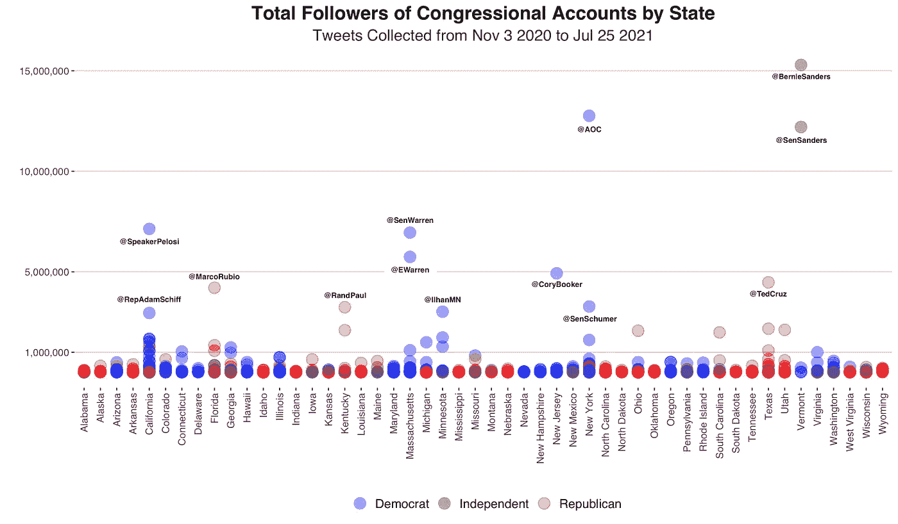

图一。按账户统计的国会议员追随者总数。作者图片

可以看到，大多数高关注度账户(超过 1，000，000 个关注者)由民主党人拥有(35 个中的 20 个)。这也反映了总体趋势。共和党国会议员账户的平均粉丝数为 106，521 人，中位数为 15，024 人，而民主党或无党派人士(与民主党一起组成两个独立参议员核心小组)的平均粉丝数为 253，327 人，中位数为 31，570 人。然而，如果将独立人士(主要由伯尼·桑德斯推动)的追随者数量从民主党的数量中剔除，平均追随者数量将降至 199，693 名，中位数为 31，496 名。不管怎样，总体趋势似乎是民主党比共和党更受欢迎。

收集国会议员推文的参与度也很重要。这是用每个账户在每条推文中获得的收藏和转发的平均数计算出来的。只有原始推文被用于这些计算，这意味着转发没有被用来准确衡量国会议员的参与度。民主党人似乎再次略胜共和党人，民主党人平均每条推文获得 1171 个收藏夹，共和党人平均每条推文获得 627 个收藏夹。由于某些成员收到了大量参与，这些数字可能被夸大了，因为民主党人的平均收藏夹数为每条推文 94 个，共和党人的平均收藏夹数为每条推文 58 个。

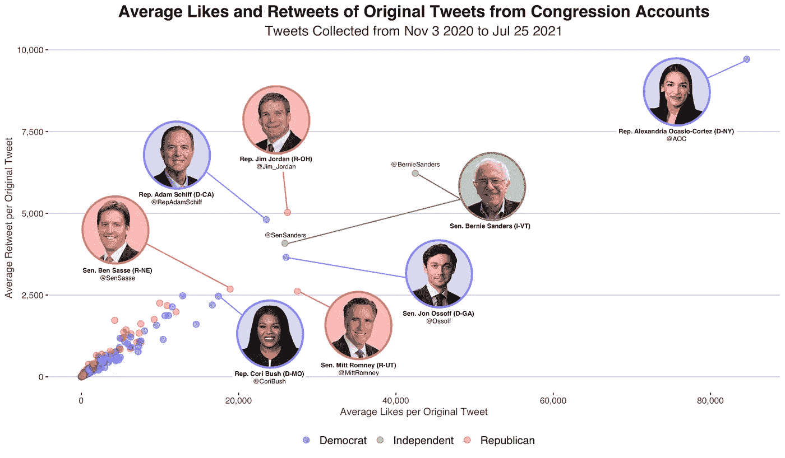

图二。通过账户参与国会议员的原创推文。图片由作者提供，肖像来自[政府印刷局](https://memberguide.gpo.gov)

尽管如此，看起来大多数账户收到的转发似乎与他们收藏的数量成比例，绝大多数账户收到的收藏不到 500 条。值得注意的是，自 2020 年 11 月 3 日以来，国会议员的所有推文中，只有三条获得了超过 100 万个赞，所有推文都来自众议员亚历山大·奥卡西奥-科尔特斯的个人账户(@AOC)。

**文本处理**

接下来，对这些账户的推文内容进行了分析。对所有推文进行预处理，使它们能够被分析。首先，所有表情符号都被转换成了文本。这是通过使用 rtweet 包中来自 Unicode.org 的“表情符号”数据帧完成的。数据框包含两列，一列包含每个表情符号，另一列包含表情符号的等效文本。当推文被标记化时，为了使事情可以解释，表情符号描述中的空格被替换为连字符，因此它们被视为单个标记，并且“表情符号”一词被附加到每个描述中。比如说，“😀被转换成了“笑脸表情符号”在此之后，一个简单的循环检查每个表情符号的推文，并将其替换为相应的文本。下面提供了示例代码。

```
library(rtweet)Emojis <- emojis 
Emojis$description <- str_replace_all(Emojis$description, " ", "-") %>% paste(" ", .,"emoji ", sep="-")for(i in 2284:2623){Election$text <- str_replace_all(Election$text,
                as.character(Emojis[i,1]), #Identify Emoji
                as.character(Emojis[i, 2]))} #Replace with word
```

接下来，标签被清理。为此，字符“#”被替换为单词“hashtag ”,以帮助识别哪些字符串是 hashtag 的一部分。随后，所有标点符号和大写字母都从文档中删除。所有的数值也被从每条推文中删除；但是，在此之前，数字“45”和“46”被转换为“45”和“46 ”,因此不会被删除。这些被选中，因为它们通常在美国政治中具有重要的语义价值:第 45 任总统特朗普和第 46 任总统拜登。

在进行任何其他处理之前，先创建一个帧。这个框架用于运行情感分析(稍后描述)。然而，为了实现这一点，需要一个没有任何进一步文本处理的框架，因为 tweets 中的单词需要保持不变，以使情感库工作。

该文档还使用 r 中的 tm 库进行词干分析。这允许时态偏差(vote，votes，voted，voting)和复数(ballot，votes)读起来是一样的。由此产生的一个问题是，单词“policy”、“policies”和“police”都被读作同一个字符(词干后的 polici)。鉴于这些词有不同的含义，尤其是在当代政治中，必须加以区分。因此，在词干化之前，单词“policy”或“policies”的所有实例都被更改为“policygov”和“police ”,而单词的其他形式保持不变以进行词干化。这使得两个词之间的区别得以保留。

这项工作完成后，停用词，也就是那些经常使用的单个意义很小甚至没有意义的词，被删除了。虽然 R 中的 tm 库包含一个停用词库，但它包含了像“states”这样的词。当用在动词方面时，这个词没有什么意义；然而，在美国政治领域，这个词需要保留。为了防止排除政治上重要的词，删除了修改后的停用词列表。

最后，使用 tm 包中的 stripWhitespace 函数删除了 tweets 中所有多余的空白。最终结果是两个数据框，一个能够在清理推文后运行情感分析，另一个用于词干提取和停用词删除完成后单词袋模型的标记化。下面提供了所有这些清理是如何完成的代码。

```
Twitter$text <- tolower(Twitter$text) #Removes capitalization 
Twitter$text <- removePunctuation(Twitter$text) #Removes punctuation 
Twitter$text <- str_replace_all(Twitter$text, "policy|policies", "policygov") #Chnages policy (Document) to "policygov"
Twitter$text <- str_replace_all(Twitter$text, "45", "fortyfive") #Changes number 45 to words
Twitter$text <- str_replace_all(Twitter$text, "46", "fortysix") #Changes number 46 to words
Twitter$text <- gsub("[[:digit:]]+", "", Twitter$text) #Removes all numbersTwitterSentiment <- Twitter #Creates a data frame for sentiment analysisTwitter$text <- stemDocument(Twitter$text) #Stems document
Twitter$text <- removeWords(Twitter$text, StopWords) #Removes all stopwords from a custom vector
Twitter$text <- stripWhitespace(Twitter$text) #Collapses all white space in a tweet
```

**情感分析**

一个感兴趣的领域是国会议员推文的情绪。这是一个获取一段文本并分析用于确定情绪或分配一个数值的单词的过程，以便对其积极或消极进行评级。

使用上面描述的情感框架，推文被分配了一个唯一的 ID 号，这样就可以进行标记化，并且每条推文仍然可以在以后被识别。然后使用 tidytext 包中的 unnest_token 函数将 Tweets 拆分成单独的令牌。这产生了一个数据帧，其中每行包含给定的原始 tweet ID 号和每个单词。

接下来，也从 tidytext 包中加载了 afinn 情感库。这就创建了一个包含列的数据框架:一个包含充满感情的单词和相应的情感的数据框架。情绪等级从-5(非常消极)到+5(非常积极)。然后这个库被加入到每个令牌中。如果一个词包含在一条推文中，但不包含在 afinn 库中，则该情感被标记为 n a。在此之后，每条推文被汇总，从而计算出推文中所有词的平均情绪。如果一条推文中的所有单词都是 n a，则该推文的情感编码为 0(中性情感)。下面是一个使用众议员 Val Demings (D-FL)的 tweet 的例子，以及这个过程的代码。

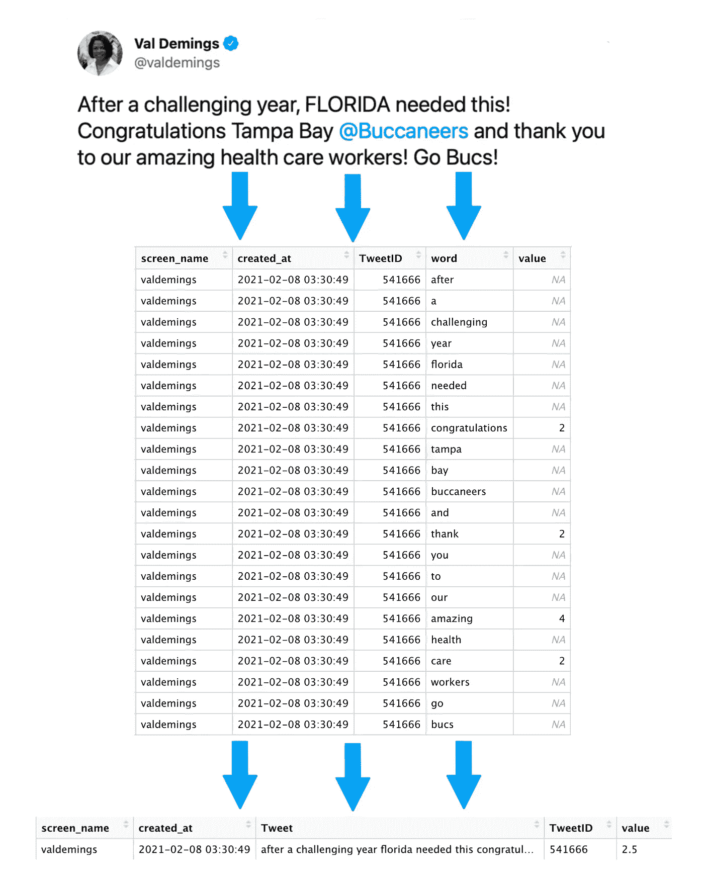

图 3。提取推文情感的示例。作者图片

```
library(tidytext)TwitterSentiment <- TwitterSentiment %>% mutate(TweetID=1:nrow(TwitterSentiment)) #unique ID for each tweetafinn <- TwitterSentiment %>% unnest_tokens(word, tweet) %>% #extracts each word in a tweet to its own row
  left_join(., get_sentiments("afinn")) %>% #Attaches sentiment from afinn library to each word
  select(-word) #removes word columnafinnTweets <- aggregate(value ~ TweetID, data=afinn, FUN=mean) %>% #Averages sentiment for all words in a tweet
  left_join(TwitterSentiment, ., by="TweetID") %>% #Adds sentiment to original df with complete tweet and data
  mutate(afinn = ifelse(is.na(value)==TRUE, 0, value)) #Changes tweets with NA sentiment to 0
```

如代码所示，当 tweet 中的所有单词都是 n a 时，NAs 被填充为 0。afinn 库中没有感情色彩的单词不会被替换为 0，因为这将抵消长推文。例如，在上面来自众议员 Val Demings 的推文中，如果 NAs 在聚合平均值之前填充了零，则推文的情绪将为+0.45。然而，假设她在推特上写道，“祝贺坦帕湾海盗队，感谢我们了不起的医疗工作者！”这条推文的情绪将为+0.77，因为它的中性词较少。尽管这两个短语在语义上几乎相同，但它们却有着完全不同的情感。因此，在加入 afinn 库后，除非所有单词都是 NA，否则 NA 不会被 0 填充。

**国会情绪**

一旦确定了所有推文的情绪，就确定了每个国会议员所有账户的平均情绪。这显示了积极(或消极)的国会议员如何公开展示自己。根据这一分析，发现所有拥有 Twitter 账户的国会议员的平均情绪为+0.56，这意味着，从整体上看，平均国会议员在推特上发表的言论略多一些。事实上，在拥有 Twitter 账户的 532 名成员中，只有 25 人有平均负面情绪。所有国会议员的平均情绪呈现在下面的地图中，情绪最高和最低的议员以及其他经常提到的国会议员分列出来。此外，情感等级(从 1 开始表示最负面，以 532 结束表示最负面)被标记。此外，没有 Twitter 帐户的三个成员在各自的州中显示为灰色六边形。每个六边形都标有州和他们代表的国会选区或参议员的“Sen”。缩写“MAL”代表“一般会员”,在适用的情况下使用。

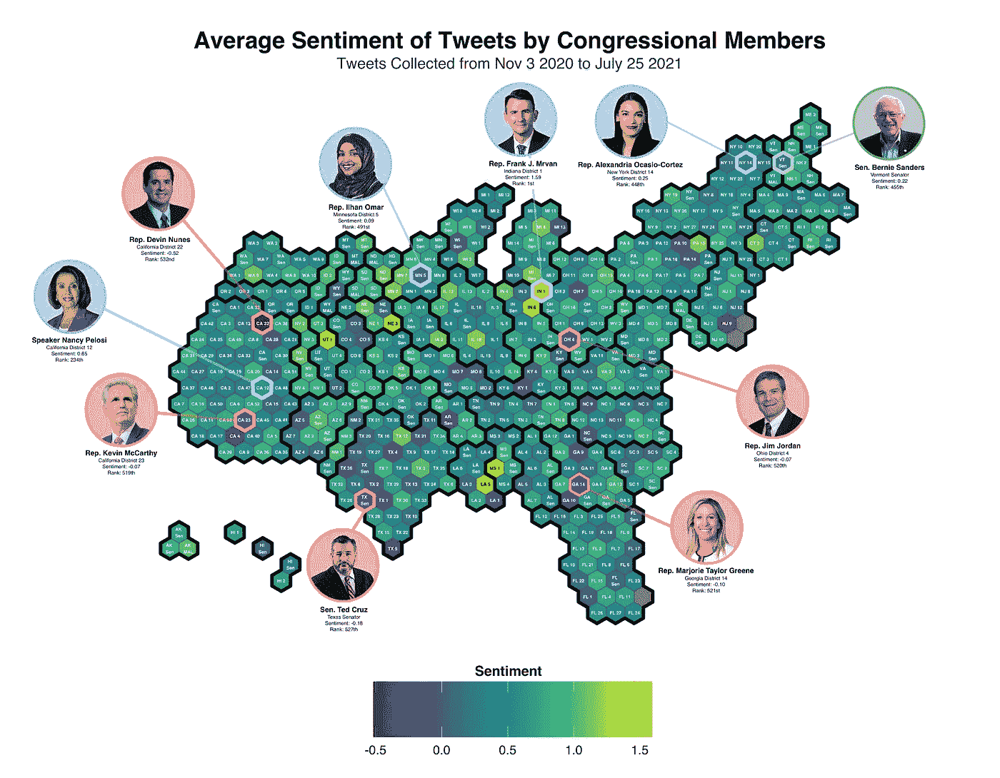

图 4。国会议员的平均推特情绪。图片由作者提供，肖像来自[政府印刷局](https://memberguide.gpo.gov)

值得注意的一件有趣的事情是，一些被谈论最多的政客情绪最低落。在情绪排名中，几乎所有经常被谈论的国会议员都进入了倒数 100 名。这可能是因为他们利用自己的平台对政策提案、时事或其他成员进行批评或负面评论，以向其大量受众推广自己的议程；然而，没有进行正式的分析来测试这一点。

**通过提及进行互动**

另一个感兴趣的领域是政治家之间如何互动。为了衡量这一点，每个政党收集和汇总了每个政治家的情绪。首先，使用 Twitter 数据集中提供的 mentions_screen_name 变量，任何提到国会议员的 976 个帐户的推文都被提取出来。使用上面讨论的 tweet 情绪方法，每个政治家提到他们的账户时的平均情绪被确定并按党派分开。这意味着民主党人和共和党人的平均情绪可以由每个国会议员来决定。下面的图 5 和图 6 显示了调查结果，以及每个国会议员被一个政党提及的次数。同样，出于分析目的，两位独立参议员都被视为民主党人，但在图表中以独立人士的身份出现。

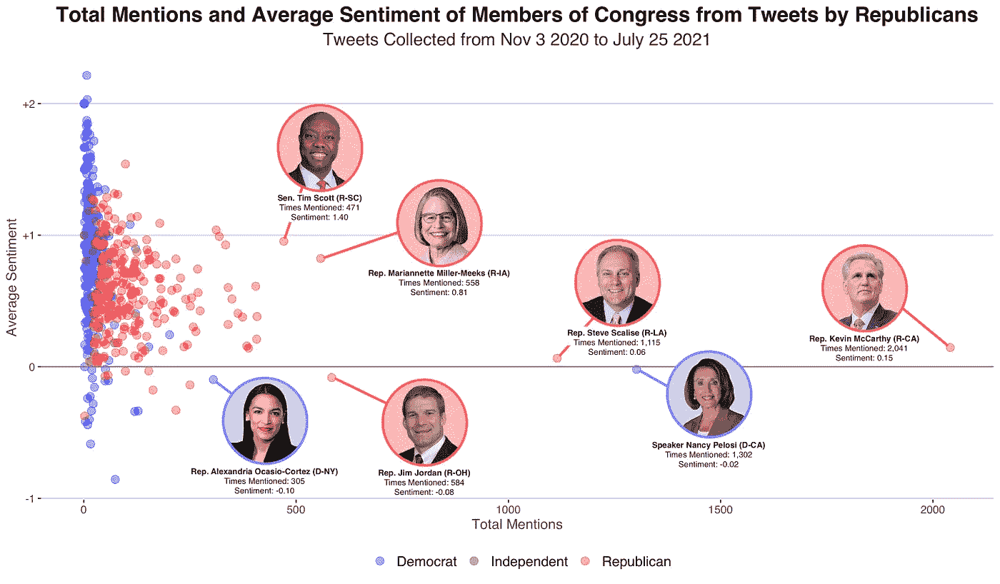

图 5。基于共和党推文的国会议员平均情绪。图片由作者提供，肖像来自[政府印刷局](https://memberguide.gpo.gov)

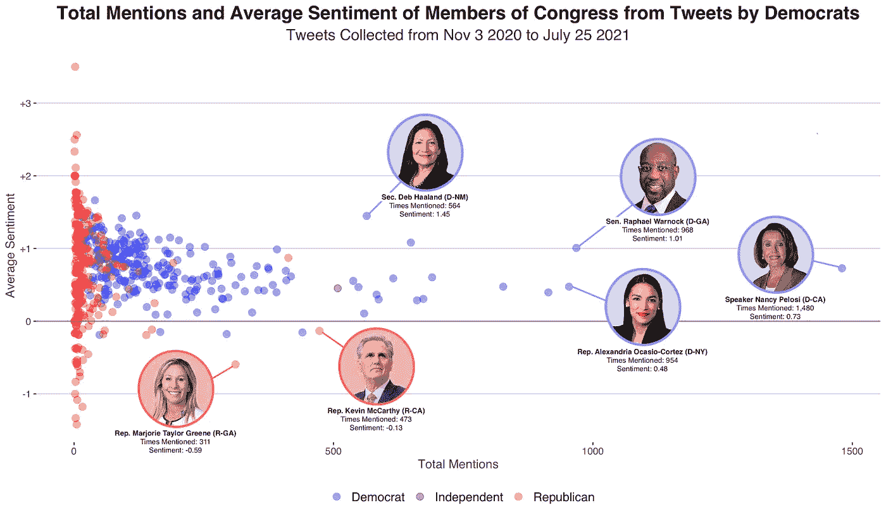

图 6。基于民主党推文的国会议员平均情绪。图片由作者提供，肖像来自[政府印刷局](https://memberguide.gpo.gov)

有趣的是，图表惊人地相似，几乎所有的政治家，不管是哪个党派，都聚集在 0 以上，这意味着，在大多数情况下，所有成员都是以积极的态度被提及的。0 以下的，对于双方来说，几乎都是对方的专属成员。然而，也许最有趣的是，对方的成员大量聚集在 x 轴上的 0 附近。这意味着双方几乎都不会在推文中提到对方。这有两大含义。首先，许多会员的平均情绪是由一两条推文决定的。因此，四肢是高度和应采取的一粒盐。第二，在一个两党合作几乎成为每项立法核心的时代，政客们在谈论自己的成员时倾向于坚持自己的成员，至少在 Twitter 上是这样。虽然积极的一面是，在大多数情况下，政客们没有在推特上负面地谈论对立的政党成员，以促进合作并给选民和追随者留下两党合作的印象，但政党之间需要进行更多的互动。

对于这一点和进一步进行的情感分析，应该注意的一个重要警告是，根据 afinn 库，一些推文可能看起来是负面的，但在上下文中不是。众议员孟昭文(纽约州民主党人)就是一个例子。她是民主党人在推特上提到最多的政治家之一(被提到 440 次)，民主党人也有轻微的负面情绪(情绪为-0.15)。这并不是因为她被认为是不受欢迎的，而是因为她是新冠肺炎仇恨犯罪法案 H.R. 1843 的发起人。当提到她时，许多国会议员也提到了她的法案，阿芬图书馆正在将一种负面情绪附加到“仇恨”一词上。虽然对于特定的例子来说，这是一个值得注意的重要警告，但对推文的整体分析更能反映 afinn 图书馆坚定的观点，而不是像这样的例外。

**对问题的看法**

虽然国会议员可能不会经常谈论彼此，但他们有一个重叠的领域是对社会和政策问题的讨论。确定了所有推文的观点后，可以检查成员如何讨论当代问题。

随机选择了四个有争议的当代问题进行研究:黑人的命也是命、移民、基础设施和最低工资。在 2020 年的竞选活动中，一直到第 117 届国会的立法，这些问题都被频繁讨论，因此产生了许多推文，以便进行彻底的分析。

仅使用提到这些问题的推文，计算了所有国会议员的平均情绪(如果他们有关于所述问题的推文)。下面的图 7、图 8、图 9 和图 10 展示了他们对每个问题的看法以及发推文的频率。

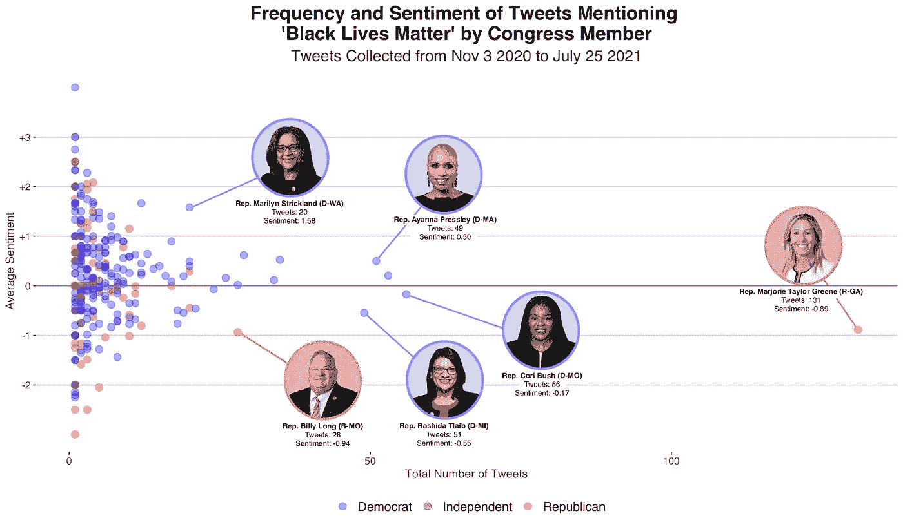

图 7。国会议员提及黑人的命也是命的推文的频率和平均情绪。图片由作者提供，肖像来自[政府印刷局](https://memberguide.gpo.gov)

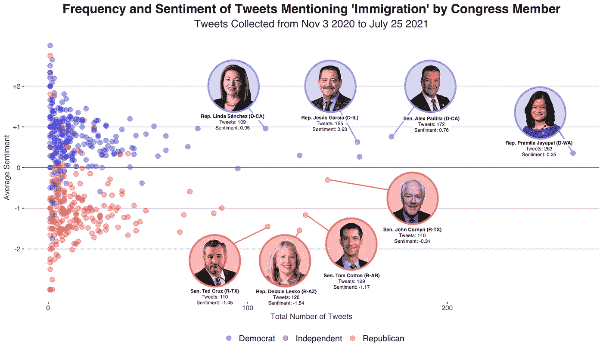

图 8。国会议员提及移民的推特频率和平均情绪。图片由作者提供，肖像来自[政府印刷局](https://memberguide.gpo.gov)

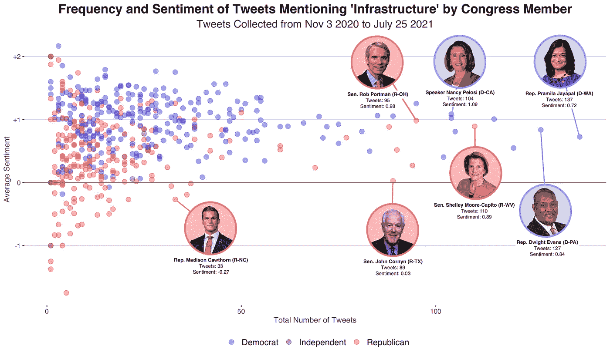

图 9。国会议员提及基础设施的推文的频率和平均情绪。图片由作者提供，肖像来自[政府印刷局](https://memberguide.gpo.gov)

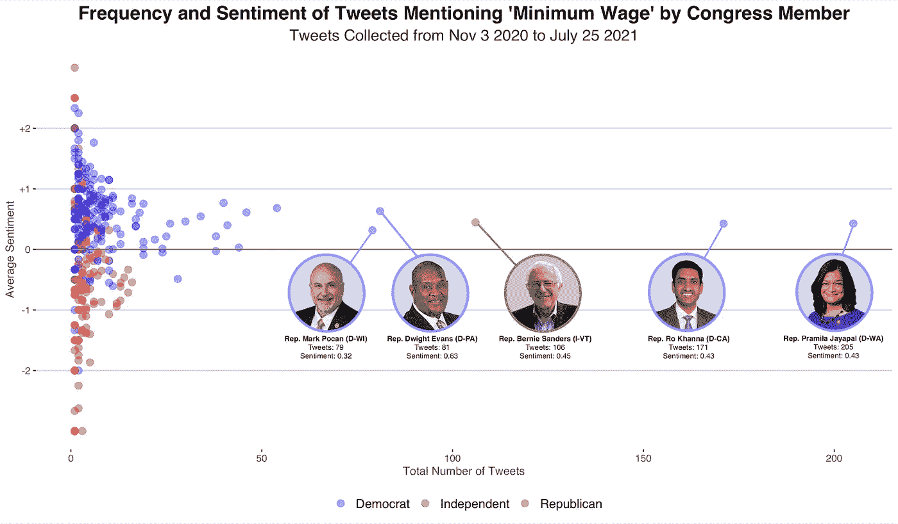

图 10。国会议员提及最低工资的推特频率和平均情绪。图片由作者提供，肖像来自[政府印刷局](https://memberguide.gpo.gov)

从图表中可以明显看出，对于几乎每一个问题，两党在观点上都有明显的分歧。即使在基础设施的情况下，几乎所有的推文在情绪上都略有积极，似乎民主党人整体上仍比共和党人更积极。就推特的频率而言，似乎两党在移民和基础设施问题上有类似的趋势，他们党的大多数人都提到过几次这个问题，少数成员经常在推特上谈论这个问题。对于最低工资的问题，看到几乎所有的推文热门都是民主党人。

至于黑人的命也是命，可以看出，与红色相比，图表中绝大多数是蓝色圆点。这表明，总体而言，与共和党人相比，更多的民主党人至少在一条推文中提到了黑人的命也是命。有趣的是，这个问题最频繁的推特是众议员 Majorie Taylor Greene (R-GA)。事实上，她占了所有共和党关于黑人的命也是命的推特的 25%以上。鉴于她在这个问题上的直言不讳，这并不令人惊讶；但是，值得注意的是，这是四个问题中唯一一个顶级高音有负面情绪的问题。应该注意的是，关于黑人的命也是命的推文自然倾向于负面，因为围绕它的事件(如谋杀)会对 afinn 图书馆产生负面影响。因此，负面情绪可能不反映政治家对问题的看法，而是反映他们选择关注什么事件。

虽然各方在问题上似乎存在分歧，但应进行测试来检验这种分歧。因此，对双方在两个问题上的平均情绪差异进行了双尾学生 t 检验。此外，为了检查这些差异的影响大小，计算了 Cohen's d。所有这些测试的结果如下表所示。

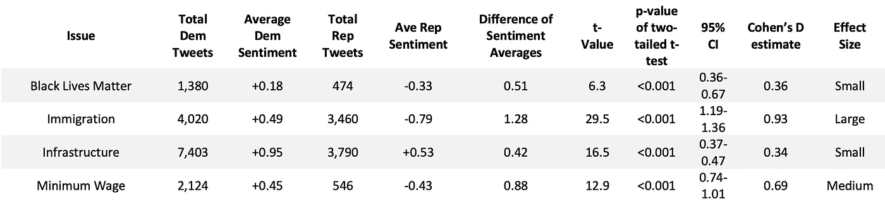

表 1。统计分析结果显示，各方推特情绪存在差异。作者图片

与共和党人的平均情绪相比，民主党人在所有四个问题上的平均情绪之间存在高度静态的显著差异。除基础设施外，所有问题中，民主党人的平均情绪是积极的，共和党人的平均情绪是消极的。根据科恩的 d 估计，基础设施和黑人的命也是命的问题被视为具有较小的影响规模。因此，尽管各方各自问题的平均情绪存在差异，但这种影响的大小相对较小；然而，根据科恩的估计，最低工资和基础设施问题分别产生了中等和大的影响大小。因此，根据关于它们的推文，这些政策问题出现了最大的党派分歧。令人吃惊的是科恩对移民的估计特别高。在 0.93，这个大的影响大小表明，这是当民主党人和共和党人基于他们的推文情绪的观点差异最大时选择的所有问题的政策领域。

**谈论问题**

鉴于民主党人和共和党人在政策问题上的推文方式存在明显差异，看看每个问题最常使用的关键词会很有趣。为此，使用了移除了停用词和词干的 Twitter 数据帧。再一次，任何提及四个社会或政策问题之一的推文都被分开。从那里，使用 tidytext 包的 unnest_token 函数部分，计算出一条 tweet 中所有 unigram(一个单词的令牌)和 bigrams(两个单词的令牌)的频率。然后对每个政党的这些频率求和，以收集一个政党在关于特定政策或社会问题的推文中使用一元词或二元词的总次数。独立推特再次被归入民主党。

在此之后，找到了一个问题的前 25 个单词或双词。下面的四张图展示了民主党人和共和党人在推特上最常见的标志。

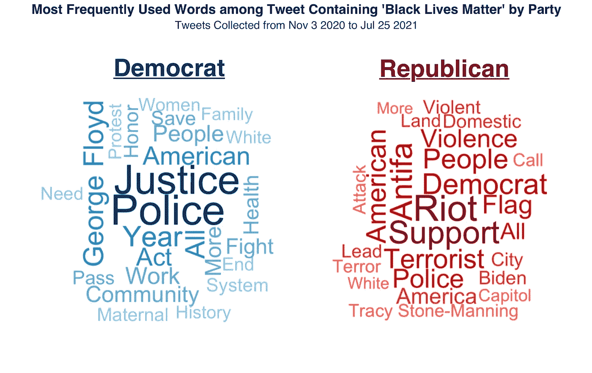

图 11。按党派分列的关于黑人的命也是命的推文中出现频率最高的词和短语。作者图片

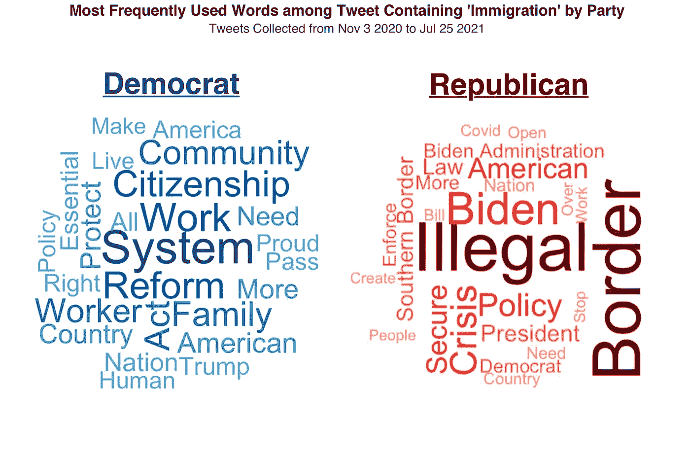

图 12。按党派分列的关于移民的推文中最常用的词和短语。作者图片

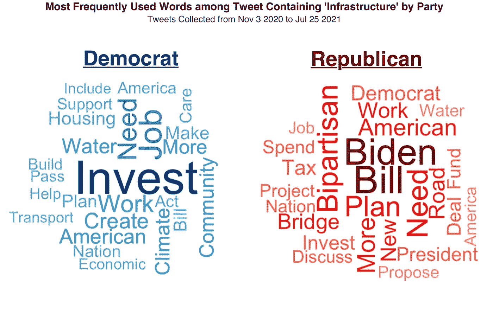

图 13。按政党分列的关于基础设施的推文中出现频率最高的词和短语。作者图片

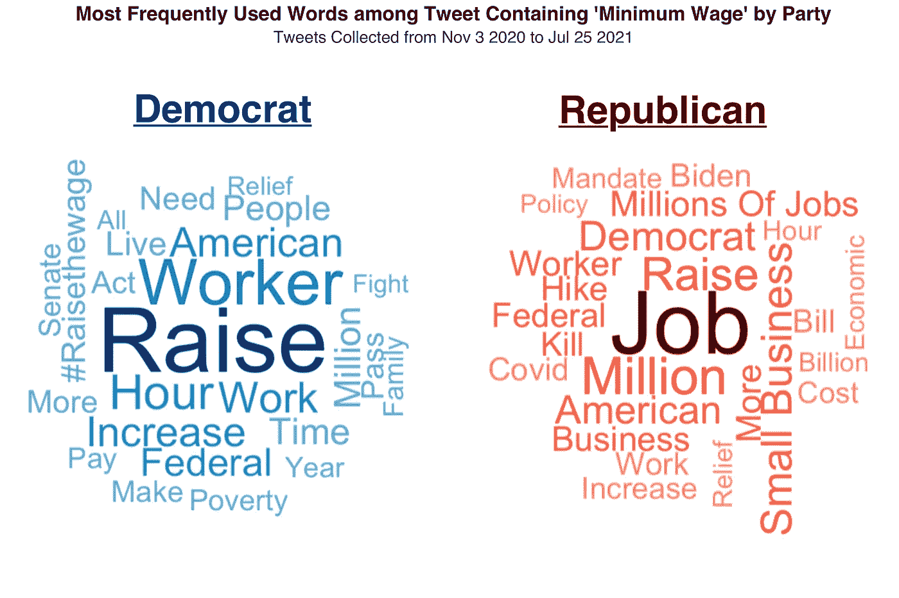

图 14。推特上关于政党最低工资的最常用词和短语。作者图片

这些文字云不仅揭示了各方对某一问题的看法，而且有助于解释他们的观点趋势。最令人兴奋的领域之一是政党在黑人的命也是命问题上的分歧。正如在科恩的 d 测试中看到的，情绪差异的影响大小被认为是很小的。然而，这可能是因为双方都在负面地谈论这个问题，但方式不同。从单词 clouds 可以看出，“抗议”是民主党人经常使用的词之一，根据 afinn library，它携带了-2 的情绪。与此同时，共和党人经常用“暴乱”和“暴力”这两个词来形容黑人的命也是命，这两个词分别带有-2 和-3 的情绪。在这里，我们可以看到，虽然双方都在使用负面的词语，但抗议和暴乱的内涵是截然不同的。还应该重申的是，众议员马乔里·泰勒·格林(Marjorie Taylor Greene)占了所有共和党关于黑人的命也是命的推文的大约 27%，这意味着这个词云可能更能反映她的观点，而不是共和党的整体观点。尽管如此，她在这里的突出表明了她对这个问题的关注，但也明显缺乏共和党的推文，特别是与民主党的推文数量相比

需要注意的一个有趣的事情是，“拜登”是共和党推文中所有问题使用频率最高的词之一；然而，“拜登”并没有出现在民主党推文的任何词云上。进一步分析的一个有趣领域是确定拜登的名字在什么背景下被使用:这是否仅仅因为他是现任总统(因此是一个重要的观点)，或者更确切地说是因为他们在批评他在这些问题上的做法。

**关键外卖**

从进行的情感分析和关于问题的推文符号化中，可以看到一些关键的收获。

1.  民主党人和共和党人在推特上谈论问题的方式有明显的不同。从我们选择的社会和政策问题来看，t 检验和科恩的 d 检验表明，两党的情绪有明显的差异。再看看 clouds 这个词，可以看出民主党人和共和党人很少用类似的词来描述选定的问题。这表明，国会议员不再将 Twitter 作为推动两党合作的平台，而是加倍重视党派分歧，并向选民公开这一点。
2.  共和党人倾向于在推特上发布比民主党人更负面的问题，即使是在有两党支持的问题上，如基础设施。这种现象的发生可能有几个原因，包括选择的主题，当前政府的民主，或 Twitter 的总体行为。另一种可能性是，这显示了国会的党派分歧，即使在政策协议方面，情绪和热情也是不平等的。
3.  频繁或充满激情的推特用户有能力在推特上主导一个政党的情绪和观点。正如众议员马乔里·泰勒·格林(Marjorie Taylor Greene)所见，如果一个政客在推特上发布足够多的信息，他就可以主导一个问题。在较小的程度上，这也适用于众议员 Pramilia Jayapal (D-WA)，他被发现是 4 期 select 中 3 期的最频繁的推特用户。
4.  虽然民主党在最受关注的账户方面领先，但共和党高层正在接近相同的参与度。民主党成员拥有 35 个账户中的 20 个，粉丝超过 100 万，众议员亚历山大·奥卡西奥-科尔特斯在她收到的平均点赞和转发中脱颖而出；然而，获得最多参与的账户在共和党和民主党之间的比例接近 50:50。
5.  要想兴风作浪，你可能必须消极。正如在所有议员的情绪图中看到的，一些谈论最多的人被认为是所有国会议员中情绪最消极的人。从这一分析中，还不清楚是负面情绪得到了更多的关注，还是最知名的国会议员自然地发了更多负面的推文。

**需要进一步检查的领域**

有几个方面需要进一步检查。首先，应该审查更广泛的问题。虽然这四个问题因其普遍性而被选中，但除了基础设施，它们都是亲民主党的问题(民主党正在推动的问题)。应该检查共和党人正在推动的问题，看看民主党人如何在推特上谈论这些问题。

此外，各方讨论问题的不同方式可以呈现出迷人的洞察力。例如，当谈到枪支立法时，看看“监管”、“控制”或“第二修正案”如何影响参与度(点赞和转发)和情绪，可以揭示出政党如何向其追随者提出这些问题的见解。

最后，对于一些政策问题，使用不同的情感库可能更有用。正如我们在黑人的命也是命看到的，带有负面情绪的词语自然会被双方使用；然而，讨论“骚乱”和“抗议”显示了在这个问题上的不同观点，这在语义价值中不容易捕捉到。使用不同的库或不同的过程可能能够更好地捕捉各方之间的这种差异。

*感谢您的阅读。如有任何问题，欢迎在 brm2143@columbia.edu 给我发电子邮件，或通过* [*LinkedIn 这里*](http://linkedin.com/in/blake-m-79a74513a) *联系我。*

*注:所有国会议员的照片都是他们的官方肖像，因此是公共领域的一部分。照片取自* [*政府印刷所的员导照片*](https://memberguide.gpo.gov)