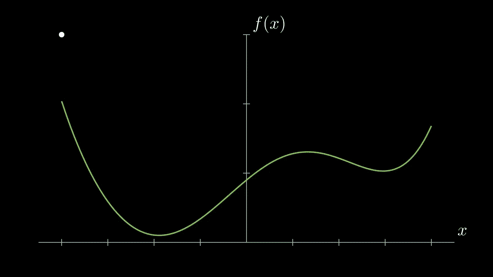
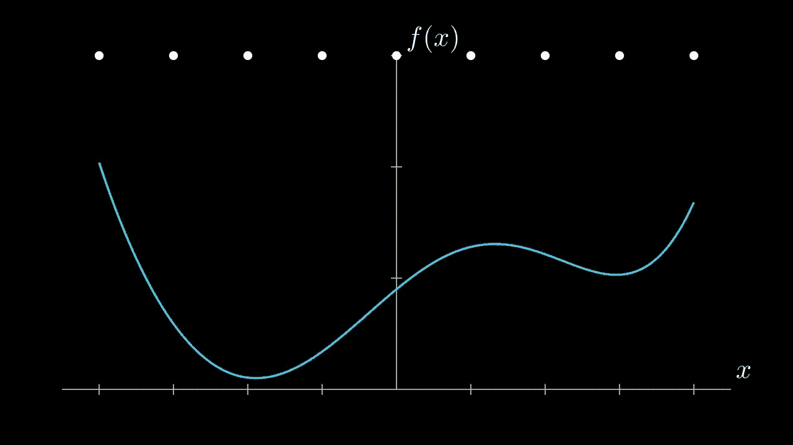
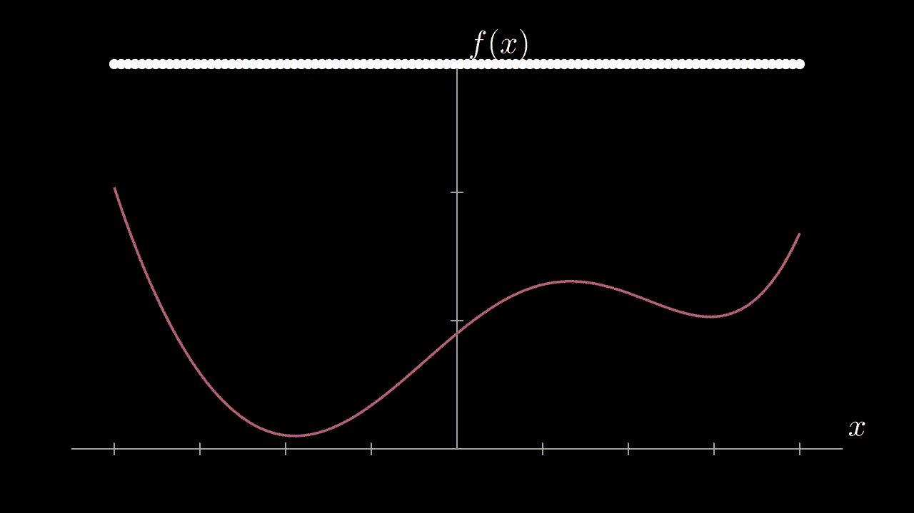

# 使用 Manim 将您的 Python 可视化提升到一个新的水平

> 原文：<https://towardsdatascience.com/take-your-python-visualizations-to-the-next-level-with-manim-ce9ad7ff66bf?source=collection_archive---------8----------------------->

## [提示和技巧](https://towardsdatascience.com/tagged/tips-and-tricks)

## 这个 Python 包创建了令人印象深刻的动画，既能让你的观众惊叹，又能清楚地展示数学和编程概念。

高效地将数学思想和结果传达给各种不同的受众是每个优秀的数据科学家都需要的技能。当向非技术观众演示时，包含什么信息总是一个大问题。

来自数学背景，我总是希望包括我的结果背后的过程的简要的高层次的解释。问题是，解释机器学习概念背后的想法并不容易。对于大多数更关心可行见解的股东来说，解释这些概念的好处可能不值得我们在演示中花费时间和精力。


著名的 Lorenz 吸引子蝴蝶模式的范例——图片由作者提供。

虽然大多数时候我们不会在演示文稿中包含技术信息，但仍有必要包含技术信息的时间和地点。

也许你不是在向股东听众演讲，而是在向你的人工智能/人工智能研究团队演讲。或者，也许你很幸运，你的非技术老板对理解数据科学过程感兴趣，并要求你建立一个全面的演示文稿。

在这些情况下，最重要的事情是用快速和简洁的方式有效地解释先进的数学思想。向相对不熟悉的人传达数学思想的最佳方式可能是从高层次清晰地说话，而不是漫无边际的技术细节。

我相信好的视觉化是我们在做这件事时所拥有的最有效的工具。

# 什么是曼尼姆？

Manim 是一个建立在 Python 之上的强大的数学动画包。如果你的目标是通过动画创建数学思想的高级解释，那么看看 Manim 就知道了。

如果你曾经有幸在 YouTube 上观看过 [3Blue1Brown](https://www.youtube.com/channel/UCYO_jab_esuFRV4b17AJtAw) 的视频，格兰特使用 Manim 来创建他所有的动画，并且是以大多数人能够开始理解的方式有效地交流非常复杂的数学思想的最佳之一。如果你真的想看看 Manim 能做些什么，去看看他的视频，你会印象深刻的。

即使你不打算像 [3B1B](https://www.youtube.com/channel/UCYO_jab_esuFRV4b17AJtAw) 一样在你的演示中解释数学概念，一个伟大的可视化结果动画也可以吸引你的观众，并使其更上一层楼！

Manim 非常强大，因为它构建在 Python 之上，允许我们利用它的编程工具。这个想法将在下面的例子中展示，我们将学习构建一个基本的 Manim 场景，然后学习如何应用一些 Python 来将相同的动画带到下一个级别。

# Manim 入门

首先，一些家务。在将 Manim 安装到您的 Python 环境之前，检查他们的[安装文档](https://docs.manim.community/en/stable/installation.html)，因为它确实需要一些依赖项，比如`ffmpeg`和`pycairo`。

因为我运行的是较新的苹果硅 M1 芯片，我在安装这些依赖项时遇到了一些问题。所以我选择按照安装指南在 Google Colab 笔记本上运行 Manim，它运行得很流畅。我将把它推荐给任何正在寻找一种不用本地安装就能快速试验 Manim 的方法的人。在 Colab 上运行的说明在这里的 [Manim 文档中列出](https://docs.manim.community/en/stable/installation/jupyter.html#google-colaboratory)，我将在下面简要概述它们。

首先打开一个新的 Google Colab 笔记本。然后在笔记本顶部复制、粘贴并执行以下代码:

```
!sudo apt update
!sudo apt install libcairo2-dev ffmpeg \
 texlive texlive-latex-extra texlive-fonts-extra \
 texlive-latex-recommended texlive-science \
 tipa libpango1.0-dev
!pip install manim
!pip install IPython — upgrade
```

这应该会在 Colab 环境中设置依赖项并安装 Manim。接下来，重启你的运行时(按照上面输出的指示)，然后你就可以通过执行`from manim import *`来导入 Manim 了。*注意:以后重新启动此笔记本时，您可能需要重新运行上面的安装代码。

# 创建一个 Manim 场景

Manim 的操作是基于类的；创建一个动画通常从定义一个从 Manim 场景类(或三个场景)派生的类开始。动画本身的脚本将放在 Scene 的 construct()方法中。

```
class ExampleAnimation(Scene):
  def construct(self):
     . . . #animation script here
```

在这个构造函数中，我们现在可以使用包中包含的各种可用对象(Manim 称之为 Mobjects)、轴、跟踪器以及 play 和 animate 方法来构建动画。

如果您在本地运行 Manim，那么您可以在您的终端中用`manim ExampleAnimation`或任何您命名的类来调用脚本。如果你像我一样选择了在 Google Colab 中工作，为了呈现包含脚本的单元格的输出，你需要在单元格的顶部添加一行额外的神奇代码。复制并粘贴

```
%%manim -qm -v WARNING ExampleAnimation
```

在单元格的顶部，用您使用的名称替换 ExampleAnimation。运行单元将产生一个动画输出，并带有下载选项。

# 建造一座建筑物

我将在这次演示中使用的示例动画是基于他们文档中的 [Manim 示例库](https://docs.manim.community/en/stable/examples.html)中的一个。在这个动画中，曲线上的一个点向函数的最小值移动。我建议你在继续之前看看这个和其他的例子，因为下面的矿从零到一百真的很快。

在我的动画中，我添加了更多的天赋，圆点从页面的顶部开始，下降到曲线上，然后沿着曲线滑动找到局部最小值。该脚本相当长，很难在媒体上观看；请导航到这个 [Colab 笔记本](https://colab.research.google.com/drive/1QTVHgyXXEXkLNydGm2RiD56XB1b4uflp?usp=sharing)来查看实际代码，因为我在下面描述了这个过程背后的想法。该动画的构建需要几个步骤:

*   首先定义所有特征；轴和极限、点、函数及其图形。将它们添加到 self。
*   创建两个 ValueTracker 对象，一个用于 x 维度，一个用于 y 维度。这些 ValueTracker 对象可以随着它们的变化而变化。
*   请注意，当我们为更新程序设置点的初始点和位置时，我们不能只调用点(x，y)。我们必须调用它作为我们定义的轴的属性，并使用 coord_to_point 方法，以便 Manim 理解。那看起来像`ax.c2p(. . .)`。
*   为点移动对象创建一个更新程序。创建动画时，更新程序会检查并更新每一帧的对象位置。我们实际上需要两个这样的更新函数，一个将点从天花板上放下，一个将它沿着线滑动。
*   第一个更新器使用`move_to()`方法将点移动到由 ValueTrackers 定义的适当位置。该点最初被放置在其“初始位置”，但每帧被移动到`(ValueTracker_X, ValueTracker_Y)`。
*   第一个动画(称为`self.play(ValueTracker.animate.set_value(. . . .))`)将 Y ValueTracker 从其初始值更改为在 X ValueTracker 位置评估的函数值。
*   这里也使用了像`self.wait(t)`这样的方法，允许我们让动画静止‘t’秒钟。
*   在第一个动画之后，我们必须移除点更新器并创建一个新的。
*   第二个更新器将使用`move_to()`方法来保持点位于点`(ValueTracker_X, function(Value_Tracker_X))`上。随着 X 的变化，Y 的值被设置为在 X 处评估的函数值。
*   然后，第二个动画将点的 X 值设置为函数最小值的 X 值。使用`.argmin()`方法计算并提取最小值的 x 索引。
*   运行动画并保存它！

这些步骤的全部代码可以在我的 Google Colab 笔记本上看到，这是这个 [Manim 项目](https://colab.research.google.com/drive/1QTVHgyXXEXkLNydGm2RiD56XB1b4uflp?usp=sharing)的代码。单点示例的输出如下所示:



最小单点—作者提供的图像

## 触及表面

信不信由你，这部动画并没有真正触及为什么 Manim 如此强大的表面。一个小点在动？这其中的创意在哪里？线上其他地方的点呢？不难想象我们下一步想做什么——创造同样的东西，但是用一堆点！幸运的是，python 中的编程概念，如 lists 和 for 循环，使这变得非常简单。

# 多点！

在展示这个动画的整个脚本之前，我将描述一些我们需要做的重要改变。首先，我们需要更多的点。使用 list comprehension 创建尽可能多的对象非常简单，然后将它们全部添加到一个`VGroup()`类中，该类跟踪一组矢量化对象。

此外，因为每个点将位于不同的位置，所以我们需要对应于每个点的 X 和 Y 对值跟踪器。幸运的是，使用列表理解创建它们也很容易。这里我们暗示 n 索引的点将被附加到 n 索引的 ValueTrackers。对于动画的每一步，我们仍然只需要一个 Updater 函数，但是它要求我们跟踪点的索引和 ValueTrackers，这样它们才能正确应用。同样，python 使这种索引匹配变得简单明了。

然后，我们需要为每个点创建一个动画，如上所述，其中它期待其正确的索引值跟踪。这些动画可以方便地存储在一个列表中，并且可以同时调用。我们还可以在这里利用 python 中的条件语句，因为我们需要两组动画，一组用于移动到左局部最小值的点，另一组用于移动到右局部最小值的点。这就像在列表理解中创建动画一样简单，它检查点的初始点是否在函数中心相对最大值的两侧。

我还在这个版本中添加了一些动画方法，比如`LaggedStart()`，它错开了每个点的动画开始，给动画一个非常平滑、令人愉悦的外观。

在本文中包含整个代码有点多，所以请再次打开并参考[这个 Colab 笔记本](https://colab.research.google.com/drive/1QTVHgyXXEXkLNydGm2RiD56XB1b4uflp?usp=sharing)获取脚本。输出如下所示:



9 点示例—作者提供的图像

哇，看起来比单点动画好多了！！

## 甚至更多的点！

从 1 点到大于 1 点需要相当大的变化。但是，现在我们已经有了一个可以做 1 以上事情的脚本，python 使得改变我们想要的点数变得非常容易。它就像改变创建我们的点和值跟踪器的列表的限制一样简单(加上对动画播放时间的一些改变，所以它看起来仍然很平滑)。

下面我制作了一个 100 点的动画，只对上面的代码做了一些改动。但是我觉得有点过了…看看能不能操纵剧本做一个 50 点的动画。你只需要改变 3 个简单的东西(VT 列表和 Dots 列表)就可以让它工作。之后，你可以玩动画设置，让它看起来平滑美观。



100 点！—作者图片

# 结论

在技术演示中，出色的视觉效果是吸引观众的最佳方式之一。人们对视觉解释的反应很好，尤其是害怕数学的非技术人员。**用 Manim 来弥合这个鸿沟吧！**即使你没有展示技术信息，你的展示中令人难以置信的 Manim 动画也会吸引你的观众，让你的老板们惊叹不已！

## 参考资料:

*   [Manim 教程文档](https://docs.manim.community/en/stable/tutorials.html)
*   [3Blue1Brown YouTube 频道](https://www.youtube.com/c/3blue1brown/featured)寻找灵感。
*   [我的 Colab 笔记本](https://colab.research.google.com/drive/1QTVHgyXXEXkLNydGm2RiD56XB1b4uflp?usp=sharing)这些动画。

我没有在我的 Manim 教程笔记本中包含洛伦兹吸引子动画。如果你很好奇它是怎么产生的，你应该自己试一试；)或者给我发邮件提问，我会很乐意联系到你——jonny.hofmeister@gmail.com