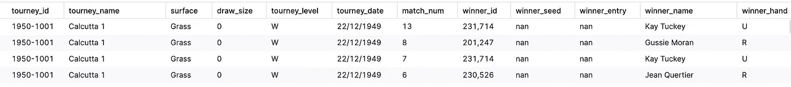
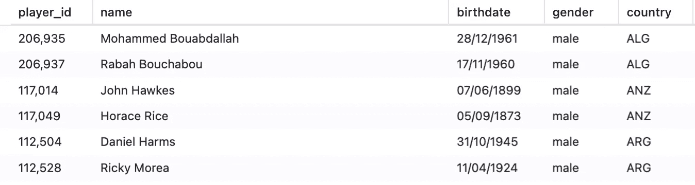
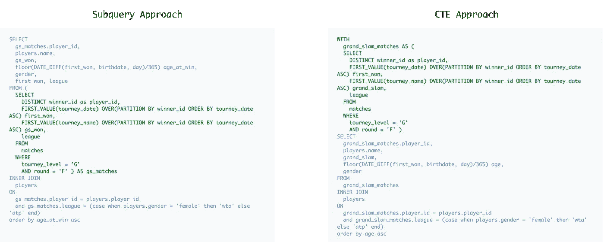
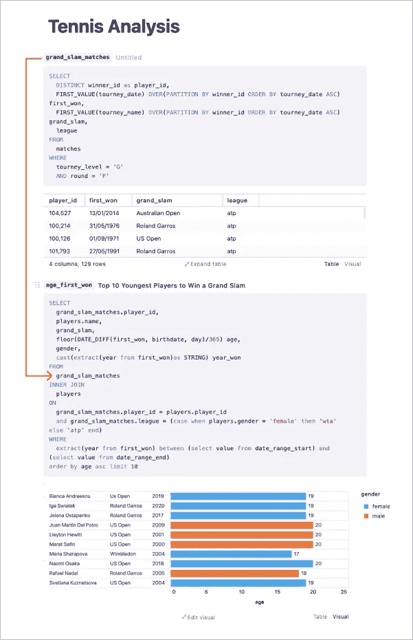
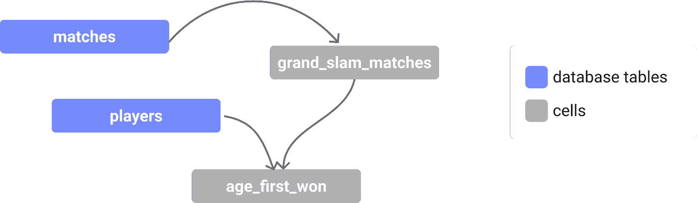
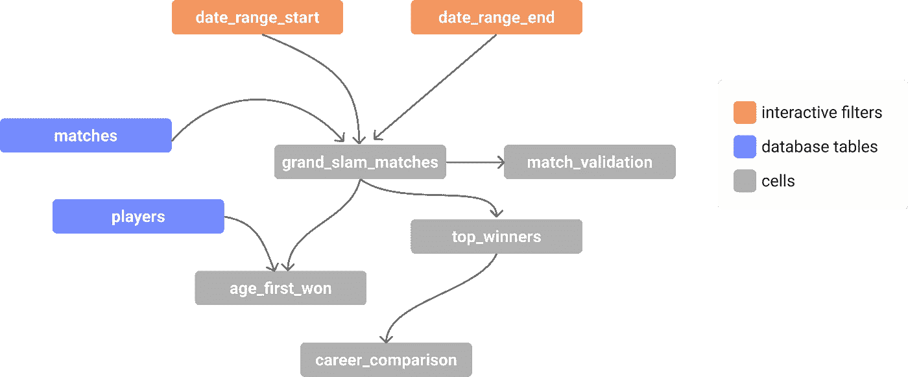

# 让您的 SQL 从优秀走向卓越:第 1 部分

> 原文：<https://towardsdatascience.com/take-your-sql-from-good-to-great-part-1-3ae61539e92a?source=collection_archive---------3----------------------->

## 有了 cte，你可以走得更远。

上周，我看到一条[推文](https://twitter.com/BecomingDataSci/status/1384571468525223942?s=20)，这让我想到:*如果可能的话，有哪些 SQL“窍门”我会很快回去自学？这个简单的问题很快变成了一系列文章，阐述了我最喜欢的一些方法，解释了它们为什么有用，以及如何使用它们。我选择的主题是:*

第 1 部分:常见的表表达式

[第二部分:关于那些日子的一切](/take-your-sql-from-good-to-great-part-2-cb03b1b7981b)

[第三部分:其他连接](/take-your-sql-from-good-to-great-part-3-687d797d1ede)

[第 4 部分:窗口功能](/take-your-sql-from-good-to-great-part-4-99a55fd0e7ff)

*有没有一个被低估的 SQL 方法对您有所帮助？给我留言吧！*

好了，接下来是第一部分:CTE！

# 什么是 CTE？

公共表表达式(cte)是在单个查询中可用的临时表。

它们使用以下语法:

```
WITH cte_name AS 
  (SELECT ... FROM ... )
SELECT * FROM cte_name; 
```

# 为什么它们很重要

为了说明为什么这种看似良性的查询构造如此有益，让我们看一个例子。假设我有两张桌子:

1.  比赛:网球比赛统计的大文件
2.  球员:网球运动员元数据文件



网球比赛预告



网球运动员预览

**我想知道每位选手在获得第一个***[**大满贯决赛**](https://en.wikipedia.org/wiki/Grand_Slam_(tennis)) **时的年龄。***

*要做到这一点，我需要从*表中找到每个球员赢得大满贯的第一个*时间，然后使用 ***球员*** 表将该日期与他们的生日进行比较。***

**解决这个问题有很多方法，但大体上可以归结为两种方法:**

****

**作者图片**

**虽然这两种方法在长度上相似，并且应用的逻辑相同，但是 CTE 方法有几个明显的优势:**

## **1.比较好理解。**

**如果回答这个问题的第一步包括获得每个球员赢得大满贯的第一时间，那不应该是你读的第一件事吗？**

**对于子查询，执行的顺序几乎是不可能辨别的，因为您不得不扫描最低级别的缩进，并一步步向上，直到最后到达第一行。**

**cte 让您能够以一种简单明了的方式构建查询，这不仅有利于您编写查询，也有利于其他被迫解释查询的人。**

## **2.更快的迭代。**

**如果我想知道最年轻的球员进入大满贯决赛但失败了怎么办？或者是赢得任何锦标赛决赛的年龄最大的球员，而不仅仅是大满贯？**

**我可以很容易地调整我的 CTE***grand _ slam _ matches***来回答这些问题，而不必担心我是否在正确的子查询中进行了更改。**

**当我们与数据进行“对话”时，很多数据分析都涉及到对查询的快速迭代调整。当我们有复杂的查询时，这些“调整”会膨胀成痛苦的任务；cte 为您提供了一个常识性的结构来快速完成这些调整。**

## **3.可信验证**

**像每个优秀的分析师一样，我会*总是*验证我的结果(😉)，而 cte 让这变得简单多了。因为我可以检查每个单独的 CTE，所以我可以快速识别任何验证错误的来源，并对单个逻辑步骤进行故障排除，而不是处理混乱的子查询。**

**我想那是 40——如果你还记得分数的话，我很乐意。**

# **CTE 加电👾**

**CTE 在单个查询级别上的好处很多，但是如果我们能够利用 CTE 的好处，并将其应用于我们的整个分析，而不仅仅是一个查询，会怎么样呢？**

**随着 [SQL 笔记本](https://count.co)最近的进步，我们可以开始看到当我们将 CTE 构造应用到更大规模时会有什么可能。**

**在这些笔记本中，每个单元格代表一个 CTE，每个单元格都可以被任何其他单元格引用，实际上创建了一个完整的 cte 连通图。**

****

**我们的分析在 Count.co 完成**

**或者作为一个连通图:**

****

**我们的分析表现为一个连通图。图片作者。**

**这能让你做的事情令人惊讶。您仍然可以享受单个 CTE 的好处，例如在逻辑流中构建分析，进行快速迭代和验证检查，此外，它还允许查询和文本的参数化。**

> **累积的效果更像是一个应用程序，而不是一个查询。**

**如果我们想扩展我们的分析以包括更多的查询，我们可以将更多的单元格链接在一起。如果我们想要包含全局过滤器，我们可以将它们添加到笔记本中，并像其他单元格一样将它们链接起来。**

****

**图片作者。**

**你可以在这里看到上面这张连通图的笔记本:**

 **** 

**您可以在这里了解更多关于 SQL 笔记本的信息[。](https://count.co)**

# **CTE 最佳实践**

1.  **使用唯一且有意义的列名和 cte 名(请不要用“cte”作为…)**
2.  **试着把它们变成“通用的”,这样你就可以很容易地返回并调整逻辑**

# **进一步阅读**

*   **CTE 文档为 [PostgreSQL](https://www.postgresql.org/docs/9.1/queries-with.html) 、 [BigQuery](https://cloud.google.com/bigquery/docs/reference/standard-sql/query-syntax#with_clause) 、[雪花](https://docs.snowflake.com/en/sql-reference/constructs/with.html)、[红移](https://docs.aws.amazon.com/redshift/latest/dg/r_WITH_clause.html)、 [MySQL](https://dev.mysql.com/doc/refman/8.0/en/with.html)**
*   **[如何在 SQL 中使用 CTEs](/using-ctes-to-improve-sql-queries-dfcb04b7edf0)**

*****敬请关注第 2 部分即将推出的内容！*****