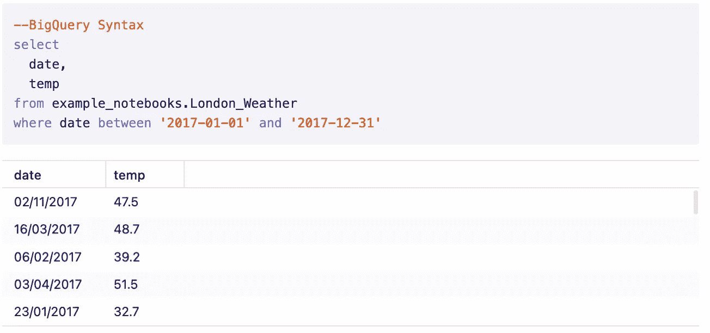
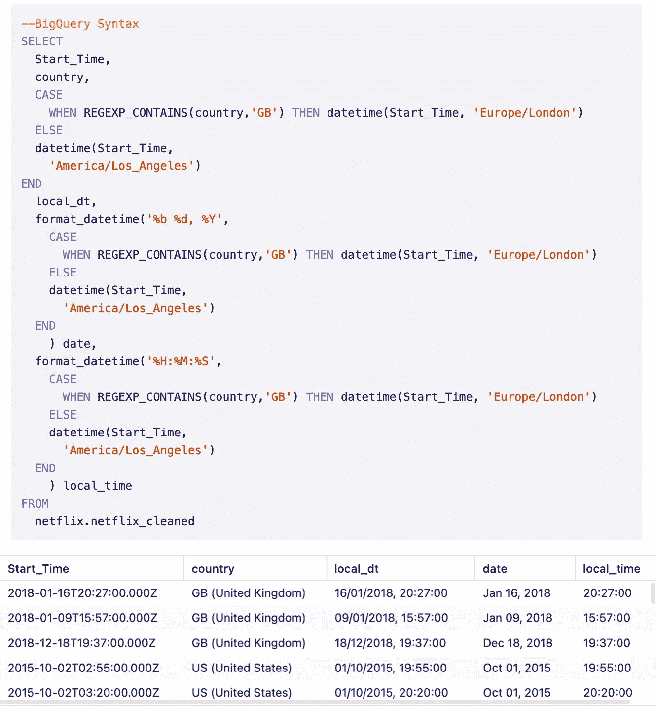
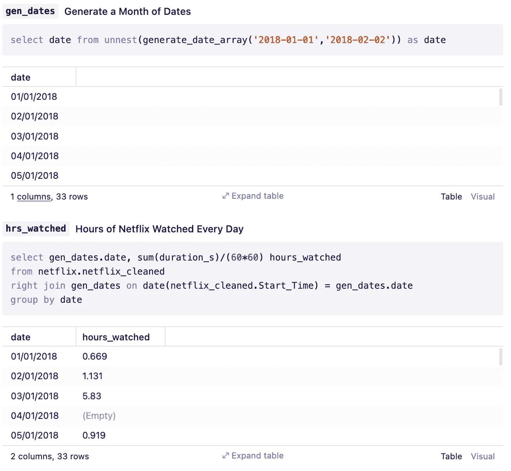

# 让您的 SQL 从优秀走向卓越:第 2 部分

> 原文：<https://towardsdatascience.com/take-your-sql-from-good-to-great-part-2-cb03b1b7981b?source=collection_archive---------4----------------------->

当你打电话时，并不总是在那里，但总是准时。

这是关于我最看重的 SQL“技巧”的 4 部分系列的第 2 部分。查看该系列中的其他内容:

第一部分:[常见的餐桌用语](/take-your-sql-from-good-to-great-part-1-3ae61539e92a)

第 2 部分:所有关于这些日期的内容

第三部分:[其他加入](/take-your-sql-from-good-to-great-part-3-687d797d1ede)

第四部分:[窗口功能](/take-your-sql-from-good-to-great-part-4-99a55fd0e7ff)

*您对一个被低估的 SQL 技巧有什么建议吗？* [*让我知道*](mailto:hello@count.co) *！*

但是，现在我们来看主要事件:

# SQL 中的日期和时间⏰

无论您编写 SQL 有多长时间，处理日期和时间从来都不是一项受欢迎的任务。它们非常棘手，会在你最意想不到的时候耽误你几个小时。

因此，在这一期的系列文章中，我将介绍一些有用的日期/时间“技巧”,新手和专家都可以从中受益。

# 行动卡🎮

在深入研究代码之前，评估一下我们可以使用的高级工具是很重要的。这就像玩棋盘游戏[疫情](https://en.wikipedia.org/wiki/Pandemic_(board_game))(太快了？)，并且让你的角色的动作牌总是可见，这样你就能在每一回合都被提醒该做什么动作。

下面是我们的 SQL 日期/时间操作卡，包括我们可以在日期/时间执行的操作。在每个 is 动作中有一系列单独的函数和语法，但是在这个高层次上计划我们的分析是有帮助的。

例如，如果您有一些带有字符串日期列的销售数据，而您的老板想要查看季度合计，您将需要:

1.  **将字符串解析成日期(“2020 01 10”➡️2020–01–10)**
2.  将日期截短为每个季度的开始日期(2020 年 1 月 10 日➡️ 2020 年 1 月 1 日)
3.  将这些日期以图表或表格的形式显示出来(2020 年 1 月 1 日➡️“2020 年第一季度”)

SQL 日期/时间动作卡。图片作者。

SQL 的每一种方言都有自己的函数来执行这些操作，可悲的是，还有自己的语法。因此，我不会煞费苦心地详细介绍每一个动作，而是将您引向以下指南:

*   [big query 中的日期和时间](https://count.co/sql-resources/bigquery-standard-sql/dates-and-times)
*   [雪花中的日期和时间](https://count.co/n/Vo8Sn9DLQ8C?vm=e)

# 我的 MVHs(最有价值的黑客)🏆

好了，现在有趣的部分——什么是实际的、有用的技巧。以下是我最喜欢的日期/时间“黑客”列表:

## 1.隐式铸造

大多数数据库都有一种“隐式转换”的感觉，这意味着在某些情况下，你可以键入一个日期字符串(“2020–01–01”)，数据库会自动计算出你想要使用的日期是 2020 年 1 月 1 日。

这对于日期列的过滤特别有用。

**例如:**下面的查询将获取 2017 年伦敦的所有天气数据。

**为什么我喜欢它:** 如果我们没有这个，我就必须总是将我的字符串转换/解析为日期，或者在过滤时使用提取函数来获得我想要的日期部分。但是对于像这样简单的日期范围，使用字符串格式“YYYY-MM-DD”作为过滤器是我永远不会停止的事情。

ℹ️ **警告:**与我的下一个观点直接冲突的是，大多数数据库都要求这些日期采用标准的 ISO 格式:“YYYY-MM-DD”，但有些数据库允许你自定义这种格式。

## 2.放眼全球

作为一个生活在欧洲的美国人，每当我看到 2020/10/06 这样的日期，我都会有一瞬间的恐慌，我不确定我们是在谈论 10 月 6 日还是 6 月 10 日。

而且，当我看到 2020/10/06 上午 10:00 的时候，我更迷茫了。是当地时间上午 10 点吗？ [UTC](https://en.wikipedia.org/wiki/Coordinated_Universal_Time) ？夏令时？

即使您的数据和团队都位于同一时区，考虑如何存储和显示日期和时间也是至关重要的。

为了解决这个问题，我喜欢:

1.  始终使用 UTC 时间戳，如果需要，为时区调整的日期和时间创建新列
2.  当显示日期时，我总是在最后一步将日期重新格式化为:年月日(2020 年 10 月 6 日)。(但我知道，世界上大多数国家可能会有不同的做法😂)

**示例**:在对我的[网飞数据](https://count.co/n/wgTgjkXGhAK)的分析中，每个程序的开始时间都以 UTC 时间戳的形式给出。但是为了计算出一天中我看电视最多的时间，我需要将它转换成当地时间。

标准化我的全局时间戳的格式。

**我喜欢它的原因:** 让我安心地看到用 UTC、**和**当地时间表示的日期和时间，这样我就可以选择如何处理每个问题。

ℹ️ **警告:**每个工具都有不同的默认日期显示方式。例如，在许多 BI 工具中，时间戳会自动调整为本地时间，因此您定制的转换可能是多余的。如果有疑问，请更改您的计算机时区，看看查询输出是否会改变！

## 3.生成日期

如果我想知道事情什么时候没有发生，而不是在我们的数据集中找出事情发生的时间，会怎么样？那个用户*不是*什么时候用过我们的 app？

这种工作需要一组完全不来自我们数据的统一日期。

**这在做队列分析时特别有用。**

**例子**:假设我想知道在给定的时间段内(包括我不看任何网飞的时候)，我每天看了多少小时的电视。我需要生成我想看到的日期，然后将其加入我的网飞数据。当我那天没有看任何电视时，该日期应该会出现一个空值:

我喜欢它的原因:发现某件事情*没有*发生的频率有时就好像并不比它发生的时候更重要。

ℹ️ **警告:**令人烦恼的是，每种 SQL 语法都有*非常*不同的实现方式。

*我错过了一些日期/时间 SQL 技巧吗？请在评论中告诉我*👇

# 进一步阅读

*   [PostgreSQL](https://www.postgresql.org/docs/9.1/datatype-datetime.html) 、 [BigQuery](https://cloud.google.com/bigquery/docs/reference/standard-sql/date_functions) 、[雪花](https://docs.snowflake.com/en/sql-reference/functions-date-time.html)、[红移](https://docs.aws.amazon.com/redshift/latest/dg/Date_functions_header.html)、 [MySQL](https://dev.mysql.com/doc/refman/8.0/en/datetime.html) 的日期/时间文档
*   如果字幕看起来很熟悉，在这里欣赏一些 90 年代的节拍。