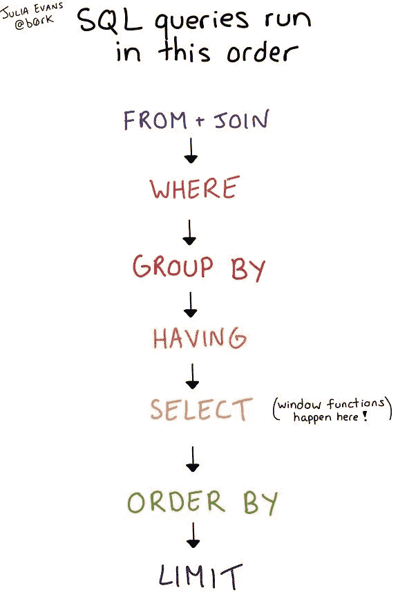
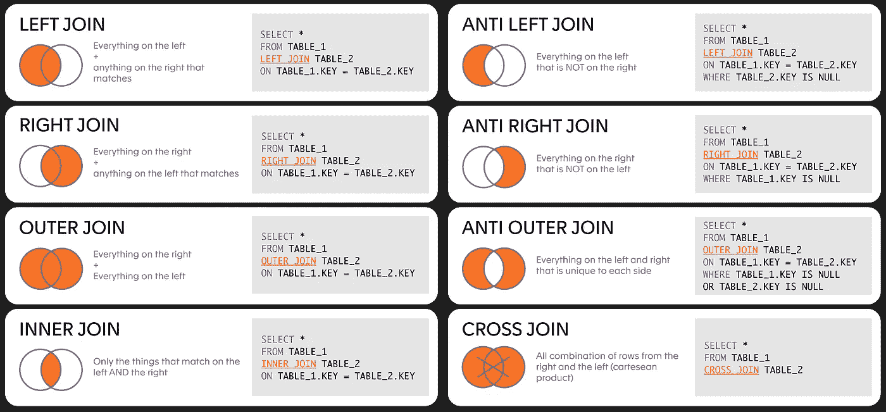
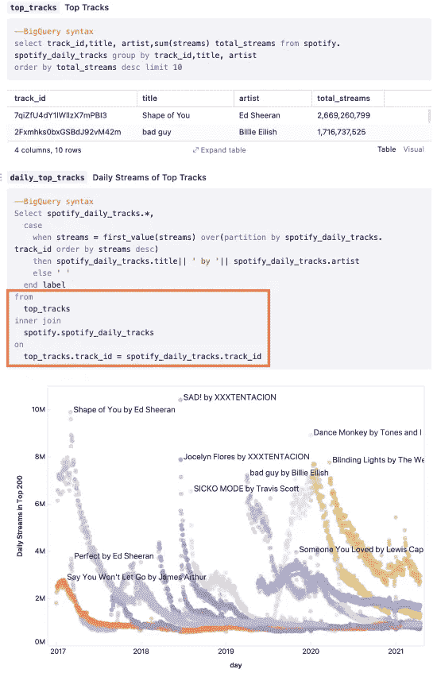
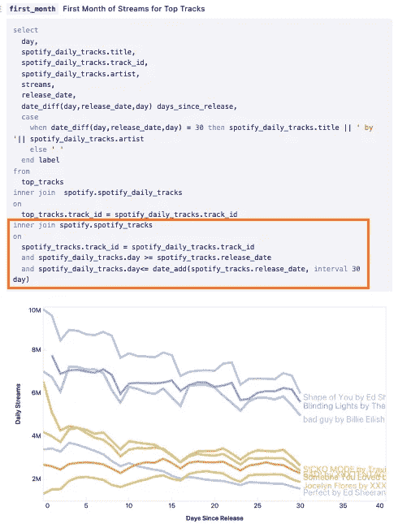
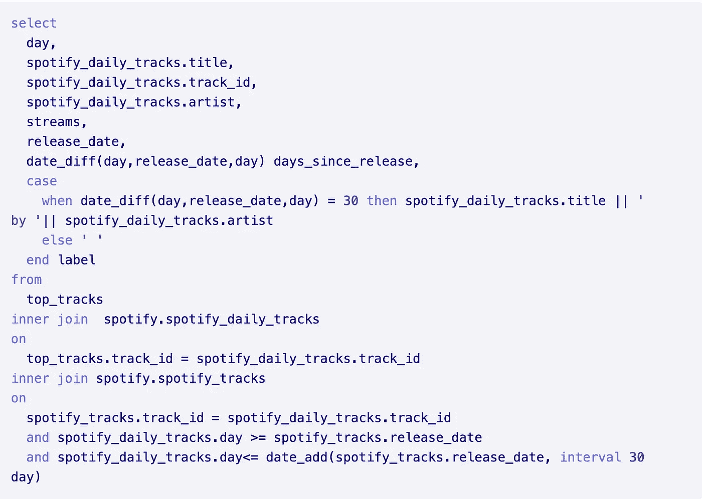
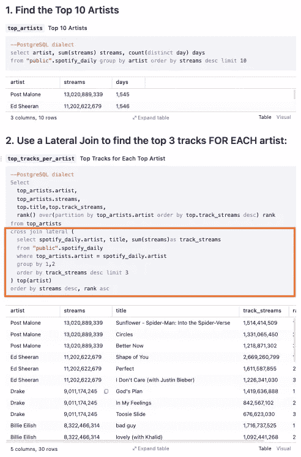
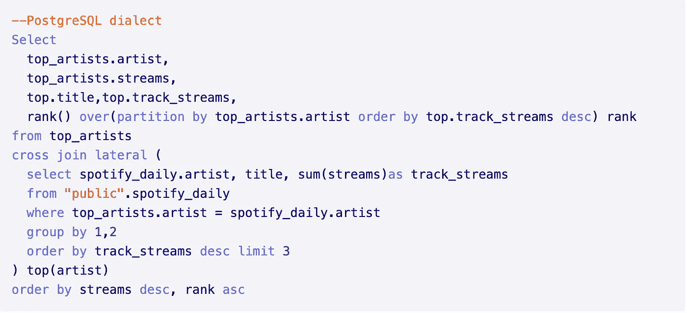

# 让您的 SQL 从优秀走向卓越:第 3 部分

> 原文：<https://towardsdatascience.com/take-your-sql-from-good-to-great-part-3-687d797d1ede?source=collection_archive---------0----------------------->

## 加入运动的时间到了

这是关于我最看重的 SQL“技巧”的 4 部分系列的第 3 部分。查看该系列中的其他内容:

第一部分:[常用表表达式](/take-your-sql-from-good-to-great-part-1-3ae61539e92a)

第二部分:[关于那些日子的一切](/take-your-sql-from-good-to-great-part-2-cb03b1b7981b)

第 3 部分:其他连接(你在这里📍)

第四部分:[窗口功能](/take-your-sql-from-good-to-great-part-4-99a55fd0e7ff)

*有没有一个被低估的 SQL 技巧让你与众不同？* [*让我知道*](mailto:hello@count.co) *！*

# 卑微的加入

联接不是任何人都喜欢的 SQL 部分。它们不像窗口函数那样华丽，也不像 cte 那样具有变革性。然而，它们无疑是我们访问和转换关系数据的最强大的工具。

所以在进入我最喜欢的使用连接的方式之前，我想我应该提醒自己为什么我们应该更加关注这个长期被忽视的连接。

## 1.优化能力

SQL 查询不会按照它们被写入(或读取)的顺序运行。事实上，SELECT 语句是查询运行时最后完成的步骤之一。

运行的查询的第一部分是 FROM/JOIN 子句，这意味着如果我们想提高查询性能(谁不想)，我们应该首先看看我们的老朋友 JOIN。



朱莉娅·埃文斯拍摄的照片。

## 2.创造性解决问题

我欣赏连接的另一个不太技术性的原因是，它们允许我们更有创造性地思考我们的数据分析。它们就像我们的乐高积木上的饰钉，允许我们建造比我们的单个表格数据库本身更大的东西。

这种能力和灵活性是我们今天仍然使用关系数据库的主要原因之一，尽管它们已经有将近 50 年的历史了。

# 默认连接

尽管有太多的连接类型可供我们使用，但大多数人都默认使用左连接。这有一些非常合理的理由。我们(在西方世界中)从左向右阅读，从我们提到的第二个表中添加列对我们来说更容易概念化，并且它的计算开销更小。

但是在有些情况下，将一串左连接链接在一起可能需要更多的工作，并且计算成本超出了您的承受能力。对于这些场景，我们可以看看一些更容易被忽略的连接类型:



常见连接类型。图片作者。

# 您没有充分使用的 JOIN 功能

## 1.内部联接，而不是过滤掉空值

我经常看到人们做这样的事情:

```
SELECT ...
FROM X
LEFT JOIN Y
ON X.KEY = Y.KEY
WHERE Y.KEY IS NOT NULL
```

这实际上只找到了表 X 和 Y 的共同点(也称为内部连接)。)

```
SELECT ...
FROM X
INNER JOIN Y
ON X.KEY = Y.KEY
```

**为什么喜欢:** 刚刚好。但更具体地说，它更有效，因为你不需要那么多的 WHERE 语句，它更快更容易键入，也更容易让别人理解。这本身并不是一种黑客行为，而是提醒了一个事实，即内部连接是存在的，它通常可以为您处理大量的过滤工作。

**举例:**

如果我想找到 Spotify 每日播放量最高的 10 首歌曲，我可以:

1.  查找流量最大的 10 首歌曲
2.  使用内部连接将其连接回我们的每日流数据:



内部联接示例。([链接](https://count.co/n/U4y4XkaeQLx#pSLvVsHNqFy))

在这个例子中，上面的查询版本(带有 top_tracks 内部连接 daily_streams)在 BigQuery 中处理 27 MB 的数据需要 **0.9** 秒。

左连接选项(daily _ streams LEFT JOIN top _ tracks…WHERE…)处理 27 MB 需要 **1.9** 秒。

虽然这两种方法都很快，但是您可以看到它如何扩展到更大的数据。

## 2.范围联接

当我们想到连接时，我们倾向于只想到等式，例如 key == key。但是我们经常需要一个更精确的逻辑来将两个表合并在一起。

为此，我们可以做一个范围连接，或者是一个不等式的连接。例如:

```
SELECT ...
FROM X
LEFT JOIN Y 
ON X.KEY >=Y.RANGE_START AND X.KEY <= Y.RANGE_END
```

**为什么喜欢:** 当你需要根据一些时间逻辑来联接两个表的时候，这些真的很棒。想想看，当你的用户购买了他们的第一个产品后，试图找到他们做 X 的实例，或者找到在他们的免费试用窗口内发生的所有行为。如果没有范围连接，所有这些都将是痛苦的，甚至是完全不可能的。

**例如:**

让我们继续我们的 Spotify 数据，假设我们希望找到热门歌曲的每日流媒体数据，但只针对歌曲发布后 30 天的数据。



范围联接示例([链接](https://count.co/n/U4y4XkaeQLx#P8xT4hByqsG))



放大 SQL

在这个例子中，你可以看到，我们简单地扩展了我们的第一个例子，在我们的内部连接中增加了一些条件，以确保我们只选择音轨发布后 30 天内的数据。

**ℹ️警告:**不是每个 SQL 方言都支持不等式连接。这对我来说是相当惊人的，但在你开始尝试它并得到一个模糊的错误之前，检查一下仍然是一个好主意。然后切换到新的 SQL 方言。

## 3.横向连接

我参加横向加入派对的时间相对较晚，但我不得不说我喜欢到目前为止我所看到的。我花了一段时间才弄清楚它们到底是什么，但本质上理解横向连接有两个关键:

1.  它们允许我们访问 FROM 语句后面的列。
2.  它们的操作类似于 FOR EACH 运算符，因为它们是针对查询的每一行进行计算的。

**为什么喜欢:** 对 SQL 中的每一个操作做的能力都非常得心应手，尤其是当你需要为你的基表中的每一行生成新行的时候。

此外，横向连接允许您在同一个查询中构建自己，从而简化查询逻辑。这种逻辑合并有两个例子[这里](https://vladmihalcea.com/sql-lateral-join/)和[这里](https://popsql.com/learn-sql/postgresql/how-to-use-lateral-joins-in-postgresql#data-set)。

**举例:**

为了与 Spotify 保持一致，假设我们希望找到 Spotify 前 10 名艺术家的前 5 首歌曲。

为此，我们可以:

1.  查找前 10 名艺术家
2.  对于每位艺术家，使用横向连接找到他们的前 5 首曲目:



看完整分析[这里](https://count.co/n/W2O2UEyL4Em)。



放大 SQL

你也可以用一个窗口函数来做这件事，这恰好是本系列的下一个主题！

**ℹ️警告:**不是每个 SQL 方言都有横向连接的概念。例如，BigQuery 通过 UNNEST 使用隐式横向连接。亲自试用之前，请检查您的工具文档！

# 进一步阅读

在研究今天的帖子时，我发现以下链接最有帮助:

*   [PostgreSQL 中带有横向连接的迭代器](https://blog.crunchydata.com/blog/iterators-in-postgresql-with-lateral-joins)
*   [什么 SQL？！？横向连接](https://ddrscott.github.io/blog/2017/what-the-sql-lateral/#enough-nesting-lateral-join-save-me)
*   [什么是范围连接，为什么速度这么快？](https://www.vertica.com/blog/what-is-a-range-join-and-why-is-it-so-fastba-p223413/)

# 结束语

所有使用的例子都是在[count.co](https://count.co)中构建的，这是为分析师构建的 SQL 笔记本。您可以与以下示例互动:

  

还有这里:

  

直到下次我们讨论窗口函数的时候！

*有我错过的一些加入 SQL 的技巧吗？请在评论中告诉我*👇