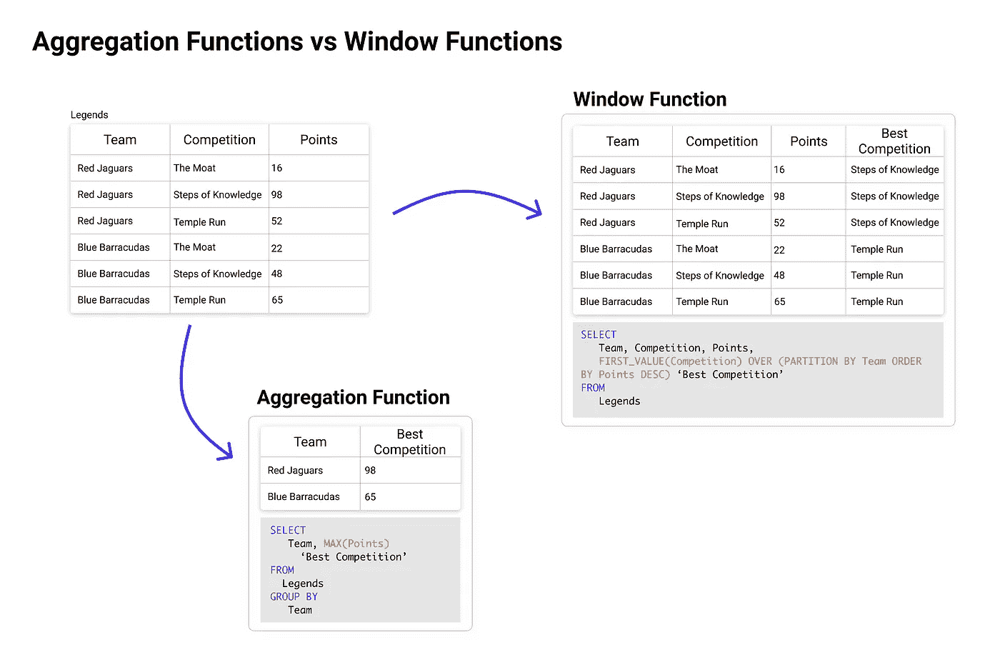
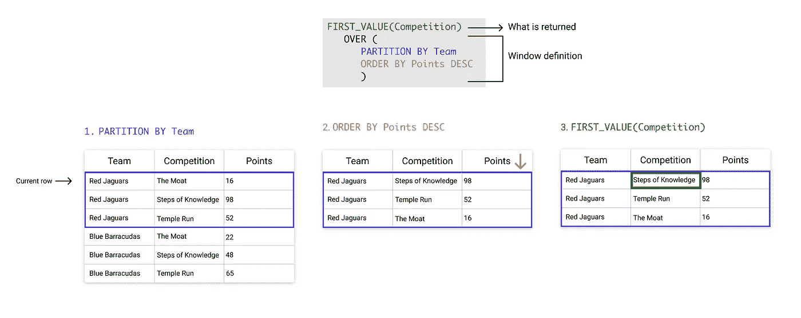
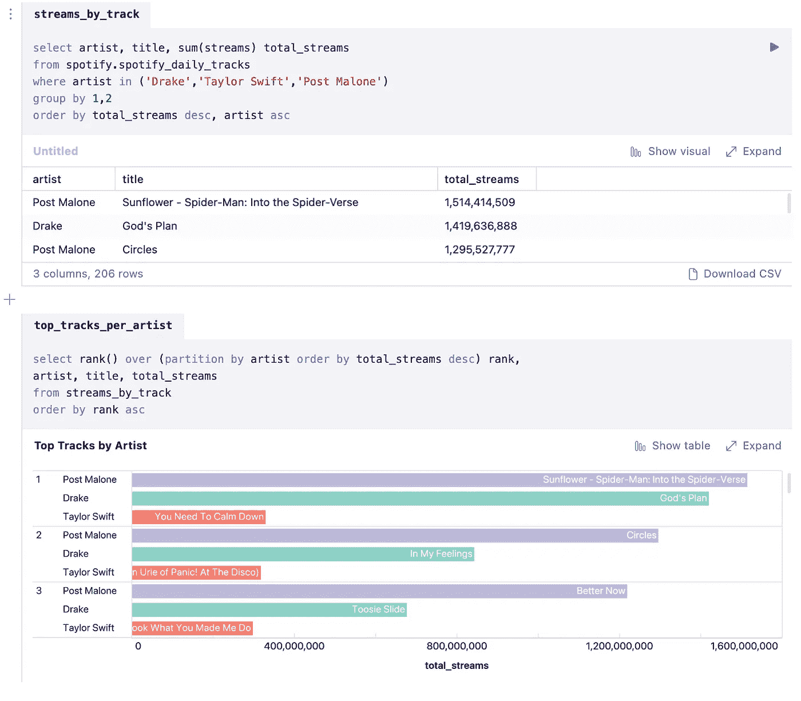
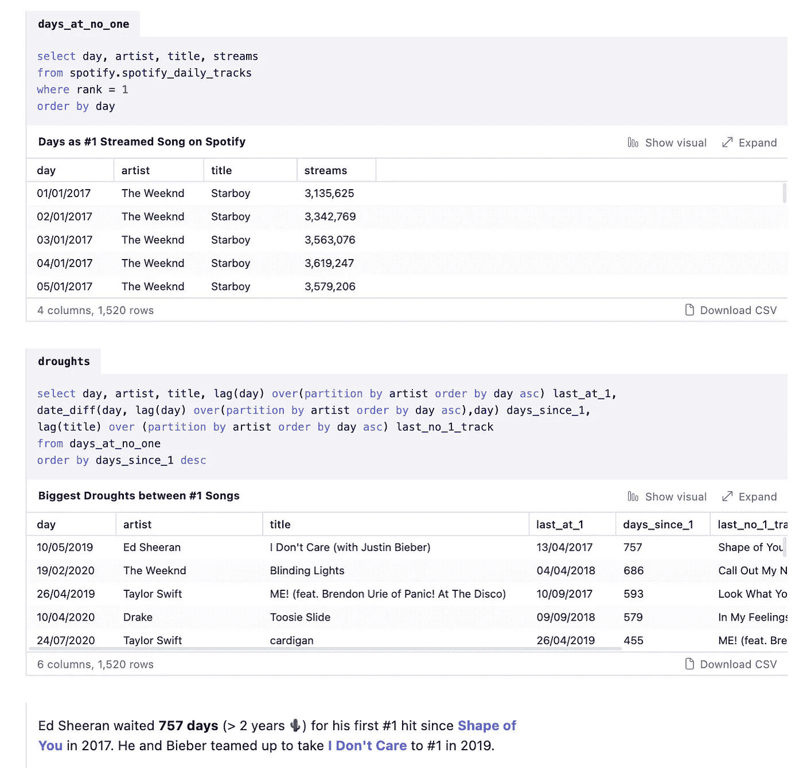
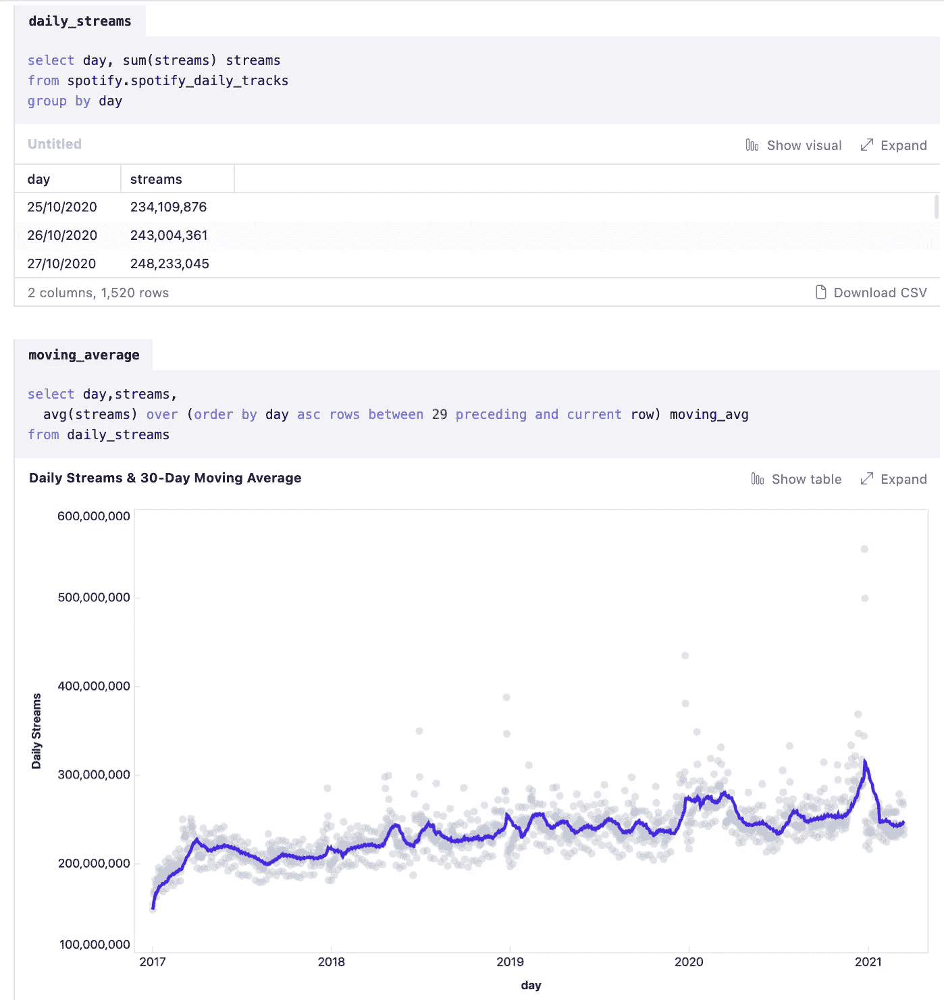

# 让您的 SQL 从优秀走向卓越:第 4 部分

> 原文：<https://towardsdatascience.com/take-your-sql-from-good-to-great-part-4-99a55fd0e7ff?source=collection_archive---------8----------------------->

## *大家最喜欢的 SQL 作弊代码。*

这是关于我最看重的 SQL“技巧”的 4 部分系列的第 4 部分。

查看该系列中的其他内容:

*   第一部分:[常见的餐桌用语](/take-your-sql-from-good-to-great-part-1-3ae61539e92a)
*   第二部分:[关于那些日子的一切](/take-your-sql-from-good-to-great-part-2-cb03b1b7981b)
*   第三部分:[其他加入](/take-your-sql-from-good-to-great-part-3-687d797d1ede)
*   第 4 部分:窗口函数(你在正确的地方)

这是我计划的最后一部，但如果你想看更多，请在评论中给我留言！

但是，现在我们来看看#内容。

# 介绍

窗口函数是 SQL 用户最喜欢的功能之一。它们非常强大，可以快速消除嵌套子查询和烦人的交叉连接。

然而，由于它们极其冗长的实现和无用的关键字，许多人害怕深入窗口函数的水域。在深入研究我最喜欢的一些窗口函数用例之前，本文将简要介绍窗口函数的工作原理。

*本笔记中的所有示例都是使用 BigQuery 语法构建的，但是不同方言之间基本没有什么区别。这里* *可以查看&编辑代码全文* [*。*](https://count.co/n/lA6QPC5R0T3)

# 解释的窗口功能

> 在 SQL 中，**窗口函数**或**分析函数**是使用一行或多行中的值为每行返回一个值的函数— [大查询](https://cloud.google.com/bigquery/docs/reference/standard-sql/analytic-function-concepts)

了解窗口函数的关键是它们为指定表格的每一行计算一个值**。这与聚合函数形成对比，聚合函数将**汇总指定**组**的**值。**

图片作者。

当我们看一些虚构的[隐藏神殿的传说](https://www.youtube.com/watch?v=bhef_fxMQP0)数据时，我们可以看到这出戏。为了找到每个团队的**最佳**事件，我们可以看到如何使用简单的聚合函数 MAX 返回每个团队的最高分，但它不会告诉我们*哪个*比赛是他们的最佳**。**

要用聚合函数做到这一点，我们必须将初始结果返回到原始表中，以找出红色美洲虎在哪个比赛中获得了 98 分。有点痛苦，☠️.

相比之下，通过使用窗口功能，我们可以快速找到每个团队的最佳活动。让我们来分析一下它是如何工作的。

# 窗口函数的剖析

乍一看，窗口函数很复杂，但是当你分解它们时，它们比你想象的要简单得多。

要创建一个窗口函数，你必须做两件事:

1.  定义返回的内容
2.  定义您的窗口

图片作者。

## 定义什么是返回↪

一般来说，窗口功能可以分为三种类型:

1.  **导航功能**:返回给定特定位置标准的值(例如 first_value、lag、lead)
2.  **编号功能**:根据每行在指定窗口中的位置，给每行分配一个编号(如 rank，row_number)
3.  **分析功能**:对一组数值(如 sum，avg，max)进行计算

可用的具体函数将取决于您的数据库。使用参考资料部分中的指南来查看您的数据库中有哪些内容，或者查看我在此处构建的深入指南:

 [## 窗口函数说明| BigQuery 语法和示例|计数

### 关于 SQL 窗口函数你需要知道的一切。窗口函数，或称之为分析函数…

count.co](https://count.co/sql-resources/bigquery-standard-sql/window-functions-explained) 

## 定义您的窗口🪟

在您的窗口函数中，OVER 关键字之后的所有内容都代表您的窗口定义。

OVER 子句具有以下组件:

*   分区依据:每个窗口由什么组成(例如，重新启动间隔…)
*   排序依据:如何对每个窗口的行进行排序
*   X 之前和 Y 之后之间的行:在每个窗口中使用哪些行

现在我们有了基本的东西，让我们看看我们能用这些东西做什么…

# 窗口功能欺骗代码🕹

## 1.排名结果

像“购买最多的 5 件商品是什么”这样的问题很简单，但是如果加上“按地区”这样的问题，你的查询会变得非常复杂。

能够根据指定的数据分组对结果进行排序，可以开启各种新的分析可能性，例如找到用户购买的第二件商品，或者比较用户第一次和第二次访问您的网站时的使用模式。

**举例:**如果我想找到三位流行歌手的热门曲目:Drake、T Swift 和 Post Malone，我可以使用 **rank** 函数，按**歌手**划分，并按**流**排序，来计算每首曲目的排名。

然后，我们可以很容易地比较每个艺术家的前 3 首歌曲，并看到德雷克和波斯特马龙排名第三的歌曲仍然在泰勒最热门的歌曲中排名第一。

图片作者。内置[计数](https://count.co/n/lA6QPC5R0T3#qT09pVB2MZx)。

## 2.计算两个事件之间的时间

数据的结构通常是每行代表一个事件。这使得查找事件之间的时间变得棘手，因为它涉及到**查找 2 行之间的时间增量，而不是 2 列。**

但是，这就是窗口函数的用武之地！特别是滞后和超前。

**例子**:我想找出 Spotify 艺人在他们的第一热门歌曲之间最大的干旱。为此，我:

1.  找到每天排名第一的曲目。
2.  找到了前一天的**艺术家每次都是第一，使用**滞后**。**
3.  **然后我发现了当天他们是第一名和最近一天他们是第一名之间的差异。**

****

**图片作者。内置[计数](https://count.co/n/lA6QPC5R0T3#og05HZRZtpF-7qhcs)。**

## **3.“移动”计算**

**当进行任何类型的时间序列分析时，您通常会看到在很长一段时间内发生的一系列事件。这种数据往往是“嘈杂的”，因为它充满了每天的变化，这使得很难透过树木看到森林。**

**与移动平均值一样，移动计算是一种将时间序列数据汇总到一定水平的好方法，可以让您确定一些高层次的模式，而不会失去与底层细节的联系。**

****示例:**在这种情况下，我想查看每日 Spotify 流的 30 天移动平均值。这将让我快速查看流是否随时间增加，以及有多少值得注意的异常值，等等。**

****

**图片作者。内置[计数](https://count.co/n/lA6QPC5R0T3#QhYsmi4lf3H-b55id)。**

# **车窗功能注意事项和最佳实践**

**⚠️窗口函数不能位于查询的 WHERE 或 HAVING 部分，因此您需要使用 cte 或子查询来基于窗口函数结果进行过滤。*参见本系列第 3 部分* *中的* [*图，了解为什么不能将窗口函数添加到 WHERE 和 HAVING 查询部分。*](/take-your-sql-from-good-to-great-part-3-687d797d1ede)**

**⚠️在同一个查询中组合窗口和典型的聚合函数是非常麻烦的，如果不是完全不可能的话。如果可以的话，尽量避免。**

**💡如果您想要“分组”窗口函数查询的结果，请使用 DISTINCT。**

**⚠️总是用窗口函数检查你的结果，因为如果数据不是你所期望的那样结构化，你很可能得到错误的结果。**

# **参考资料:**

*   **big query([docs](https://cloud.google.com/bigquery/docs/reference/standard-sql/analytic-function-concepts))([guide](https://count.co/sql-resources/bigquery-standard-sql/window-functions-explained))中的分析函数**
*   **雪花中的窗口功能([文档](https://docs.snowflake.com/en/sql-reference/functions-analytic.html) ) ( [向导](https://count.co/sql-resources/snowflake/window-functions))**
*   **MySQL 中的窗口函数( [docs](https://dev.mysql.com/doc/refman/8.0/en/window-functions.html) )**
*   **MS SQL 中的窗口函数( [docs](https://docs.microsoft.com/en-us/sql/t-sql/queries/select-over-clause-transact-sql?view=sql-server-ver15) ) ( [guide](https://www.sqlshack.com/use-window-functions-sql-server/) )**
*   **PostgreSQL 中的窗口函数( [docs](https://www.postgresql.org/docs/9.1/tutorial-window.html) )**
*   **红移中的窗口函数([文档](https://docs.aws.amazon.com/redshift/latest/dg/c_Window_functions.html))**