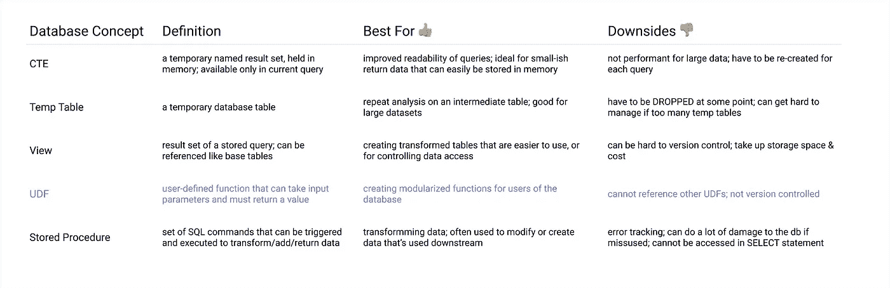
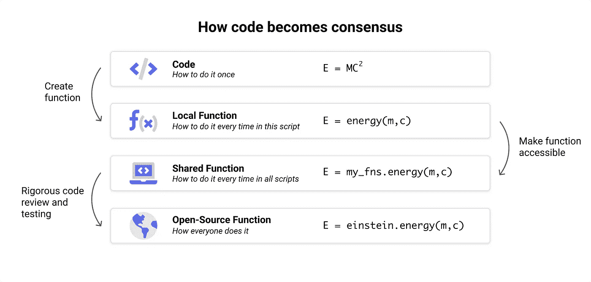
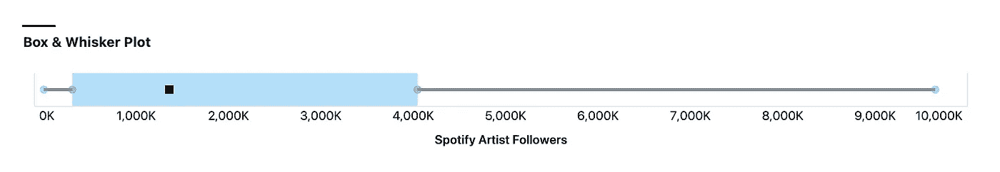
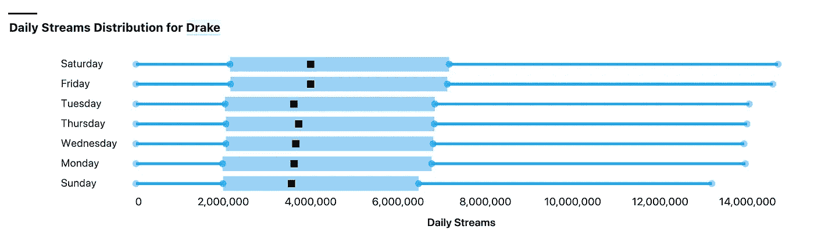
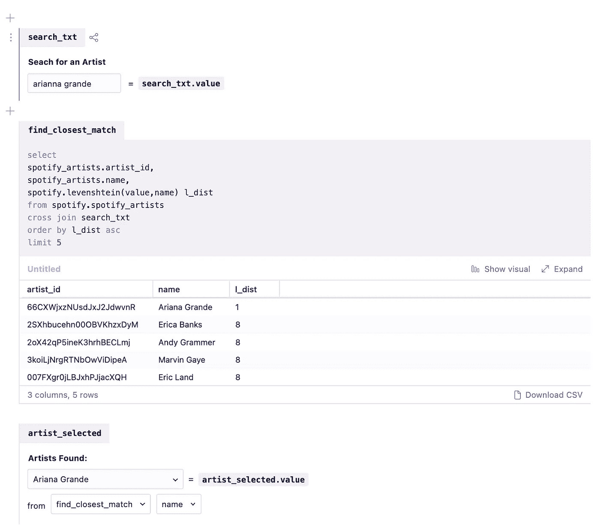
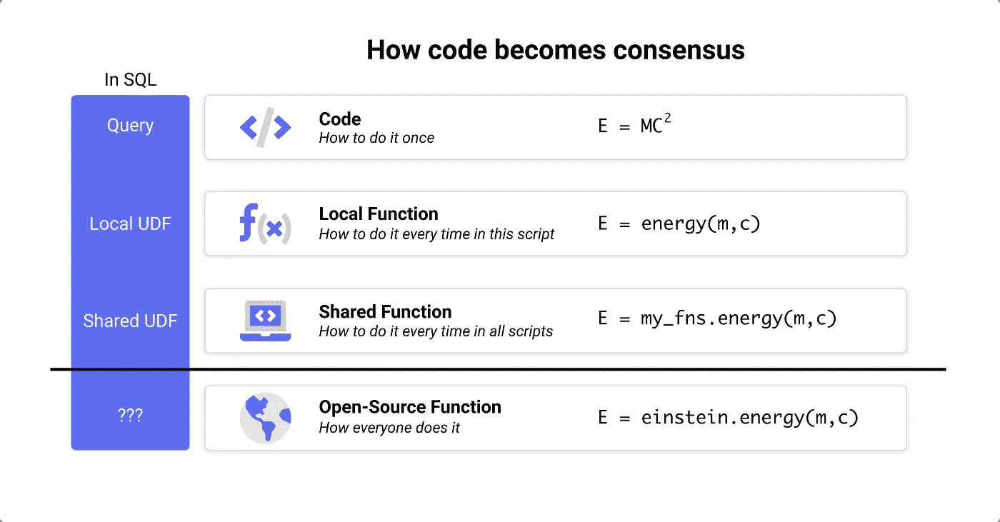

# 让您的 SQL 从优秀走向卓越:第 5 部分

> 原文：<https://towardsdatascience.com/take-your-sql-from-good-to-great-part-5-7c996dbcc527?source=collection_archive---------15----------------------->

## UDF 能为你做什么？

# 介绍

我知道我说过这是一个 4 部分系列，但谁不喜欢奖金内容？这个版本是关于用户定义函数(UDF)的。

使用以下链接查看该系列的早期版本:

*   第一部分:[常用表表达式](/take-your-sql-from-good-to-great-part-1-3ae61539e92a)
*   第二部分:[关于那些日子的一切](/take-your-sql-from-good-to-great-part-2-cb03b1b7981b)
*   第三部分:[其他加入](/take-your-sql-from-good-to-great-part-3-687d797d1ede)
*   第四部分:[窗口功能](/take-your-sql-from-good-to-great-part-4-99a55fd0e7ff)

# 用户定义的函数

UDF([用户定义函数](https://en.wikipedia.org/wiki/User-defined_function))是在 SQL 中创建定制函数的一种方式。

例如，如果我想找到一个数字的立方，我可以在查询中执行以下操作:

```
--bigquery syntax
SELECT power(<COLUMN>,3) as cubed
FROM <TABLE>
```

但是如果我想创建一个函数来立方任何我可以使用的数字，而不是幂，我可以创建一个名为**的立方:**

```
--bigquery syntax
CREATE OR REPLACE FUNCTION
   <DATASET>.cubed(x FLOAT64)
   RETURNS FLOAT64 AS ( POWER(x,3) );
```

然后，每当我想立方体的东西，我可以调用我们的新功能:

```
SELECT
   <DATASET>.cubed(3),
   <DATASET>.cubed(2.2)-- 27.0 , 10.648000000000003
```

重要的是，现在任何对我的数据库有查询权限的人也可以使用这个新功能。

## UDFs 101

UDF 的实现在您使用的每个数据库中都有所不同(有趣！)，所以在使用它们之前，一定要检查您自己的 DB 文档。但是它们都有一些共同点:

*   UDF 可以接受输入参数(比如“x”的立方)
*   必须输出一个值(任何类型)
*   通常不能引用其他的 UDF(但是再次检查你的数据库)
*   可以是本地的，只存在于当前查询中
*   或者跨模式或数据库共享和存在
*   通常可以使用 SQL 之外的其他语言(例如 Python、JavaScript、Java)创建，但是请再次检查您的数据库以了解详细信息



数据库概念总结。图片作者。

# 处于最佳状态

UDF 的功能让我们看到了 SQL 是多么接近于一种“合适的”编码语言。



图片作者。(信不信由你，这个灵感来自这个[宝石](https://www.youtube.com/watch?v=FFroMQlKiag)

Python 或 R 最受欢迎的特性之一是能够通过使用函数来模块化代码以便重用。像 pypi、tidyverse 和 npm 这样的平台更进一步，让用户在团队之外和整个用户社区共享这些功能。

今天，大多数 SQL 都是作为独立的脚本编写的，但是 UDF 便于在脚本之间共享逻辑，模拟其他“真正的”编程语言的模块系统。

更重要的是，UDF 给了我们一个框架，让 SQL 更好地为我们和我们周围的人服务。我们可以使用 UDF 来:

## 简化不常使用 SQL 的用户的常见操作

假设销售团队经常每季度查看一次数据，但是很难获得正确格式的数据。为了提供帮助，我可以创建一个函数，将任意日期(*2020–01–02*)转换为四分之一(*Q1–2020*)，这样他们就不会与[迂腐的日期格式化函数](/take-your-sql-from-good-to-great-part-2-cb03b1b7981b)发生冲突，可以继续进行分析。

## 做一些在 SQL 中不可能的事情

因为您可以使用其他语言来创建 UDF，所以您有能力为 SQL 注入它没有的功能。例如，您可以使用 JavaScript NLP 库创建一个函数来查找两个单词之间的 Levenshtein 距离(链接),让您更容易地对文本列进行模糊连接，这在 SQL 中是众所周知的困难。

# 在最坏的情况下

但我们并非都生活在 UDF 乌托邦中，这是有原因的。尽管 UDF*可能*很棒，但它们的缺点经常让我们怀疑它们是否值得我们去费心。

特别是:

## UDF 是孤立的🏝

UDF 通常需要管理员权限来创建和维护，这意味着只有某些用户能够看到它们是如何定义的。但是任何用户都可以使用这些相同的功能，这意味着许多人会盲目地使用他们看不到的功能。

它们的定制性质也意味着，对于那些在这些功能中挣扎的人来说，没有任何帮助。我的销售团队无法使用谷歌来查看他们为什么会在我创建的季度函数上出错，因为我是唯一知道它如何工作的人。

## UDF 很难理解🤔

此外，如果我使用 SQL 之外的东西(例如 JavaScript)构建了一个 UDF，我*真的*不能和很多人分享。如果它突然停止工作，而我又不在身边，我不确定我的数据团队能否修复它。正如一位睿智的大叔曾经说过的那样:“权力越大，责任越大。”

结合起来，这两个缺点威胁到我们使用 SQL 的基本原因之一:**它是一种低级查询语言**。这意味着虽然它很冗长，但它是相当标准化的。我不用担心有人用不知道函数和方法的奇库；每个人都在使用相同的标准 SQL 函数和语法。

这就是我们的权衡。我们如何使用 UDF 来帮助我们和我们周围的人更好地使用 SQL，而不破坏它作为一种普遍理解的语言的优势？

# 我最喜欢的 UDF

鉴于这种权衡，我喜欢将 UDF 仅用于两件事:

1.  不需要真正解释的超级简单的事物(如中位数)
2.  超级先进的东西，只会被少数人使用，我确信这些人了解它们是如何工作的

⚠️:我建议不要将 UDF 用于任何类似业务逻辑的东西(例如，以某种方式计算收入的函数)。对于这样的事情，最好能够向用户展示你做了什么，并解释为什么，因为这是理解结果的基础。

## 我最喜欢的 UDF

**中位数**

*来源:*[*big query-utils*](https://github.com/GoogleCloudPlatform/bigquery-utils/blob/master/udfs/community/median.sql)

BigQuery(以及其他)没有针对 MEDIAN 的原生函数，而是依赖于 PERCENTILE_CONT 窗口函数。这很好，但是我发现它(1)很烦人，并且(2)很难向初级用户解释，因为它需要理解窗口功能。

为 BigQuery 编写的这个代码片段计算一列的中值:

```
**CREATE** **OR** REPLACE **FUNCTION** <DATASET>.median(arr **ANY** TYPE) **AS** ((      **SELECT** IF (
     MOD(ARRAY_LENGTH(arr), 2) = 0,     (arr[**OFFSET**(DIV(ARRAY_LENGTH(arr), 2) - 1)] + arr[**OFFSET**(DIV(ARRAY_LENGTH(arr), 2))]) / 2,     arr[**OFFSET**(DIV(ARRAY_LENGTH(arr), 2))]
   )
  **FROM
**  (**SELECT** ARRAY_AGG(x **ORDER** **BY** x) **AS** arr **FROM** UNNEST(arr) **AS** x)
 ));
```



用 UDF 中值绘制盒须图。([链接](https://count.co/n/RHmVhHzZpIp?b=7WKfS1XCzmf))

**工作日**

*来源:* [*SQL 片段*](https://sql-snippets.count.co/t/udf-weekday/227)

这无疑属于“在 SQL 中要做的简单但烦人的事情”一类。一些方言有办法获得实际的星期名称，但在许多情况下，我不得不一次又一次地做这个可爱的 case 语句。所以现在可以是一个叫做 **weekday** 的函数。

```
**CREATE** **OR** REPLACE **FUNCTION** <DATASET>.weekday(dt DATE) **RETURNS** STRING **AS** (
     **case when** extract(DAYOFWEEK **from** dt) = 1 **then** 'Sunday'
     **when** extract(DAYOFWEEK **from** dt) = 2 **then** 'Monday'
     **when** extract(DAYOFWEEK **from** dt) = 3 **then** 'Tuesday'
     **when** extract(DAYOFWEEK **from** dt) = 4 **then** 'Wednesday'
     **when** extract(DAYOFWEEK **from** dt) = 5 **then** 'Thursday'
     **when** extract(DAYOFWEEK **from** dt) = 6 **then** 'Friday'
     **when** extract(DAYOFWEEK **from** dt) = 7 **then** 'Saturday'
 **end
**  );
```



有了这个 UDF，你可以更容易地做一周中的一天的分析。([链接](https://count.co/n/Q4ewytTDHBk))

**Levenshtein 距离**

*来源:* [*费利佩·霍法*](https://hoffa.medium.com/new-in-bigquery-persistent-udfs-c9ea4100fd83)

[Levenshtein distance](https://en.wikipedia.org/wiki/Levenshtein_distance) 通过将一个字符串改变为另一个字符串所需的改变来测量两个字符串之间的“距离”,因此这是一种很有帮助的方法，可以找到除了拼写错误或其他轻微差异之外匹配的单词。

从技术上来说，这在不使用 JavaScript 库的情况下用 SQL 实现是可能的，但这要容易得多

```
CREATE OR REPLACE FUNCTION fhoffa.x.levenshtein(a string, b string)
RETURNS INT64
LANGUAGE js AS """
  return fuzzball.distance(a,b);
"""
OPTIONS (library="gs://fh-bigquery/js/fuzzball.umd.min.js");
```



使用 Levenshtein 距离解释用户拼写错误。([链接](https://count.co/n/Q4ewytTDHBk?vm=e))

# UDF 的未来角色

最近一直在想 UDF 会在 SQL 的进化中扮演什么角色。我们对能够轻松重用 SQL 的渴望变得越来越强烈，这也是我从分析师那里听到的最频繁的请求之一。



SQL 如何继续进化？图片作者。

不难想象，UDF 是推动 SQL 走出本地极限并进入新时代的解决方案的一部分——在这个新时代，我们 SQL 用户可以共同构建强大的代码模块，供所有人分发和共享。

为了推动这项工作，我们启动了这个 [SQL 片段集合](https://sql-snippets.count.co/)。在这里，SQL 用户可以通过在您公司的数据库之外创建、共享和改进 UDF 并进入更大的社区，开始朝着开源解决方案努力。

# 在哪里可以找到更多的 UDF👀

*   BigQuery: [bigquery-utils](https://github.com/GoogleCloudPlatform/bigquery-utils/blob/master/udfs/community/median.sql)
*   大查询:[菲利浦·霍法的公共大查询 UDF](https://hoffa.medium.com/new-in-bigquery-persistent-udfs-c9ea4100fd83)
*   MySQL: [mysqludf](https://github.com/mysqludf)
*   [每日 SQL 片段 twitter feed](https://twitter.com/SqlSnippets)

*知道更多 UDF 的来源？请在评论中告诉我！*