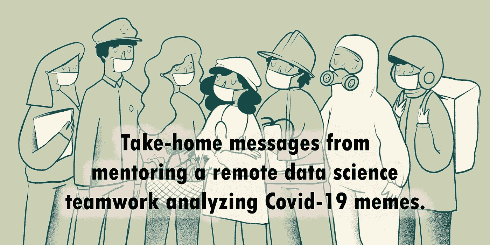
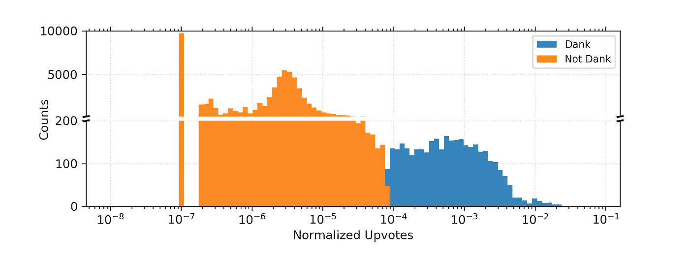
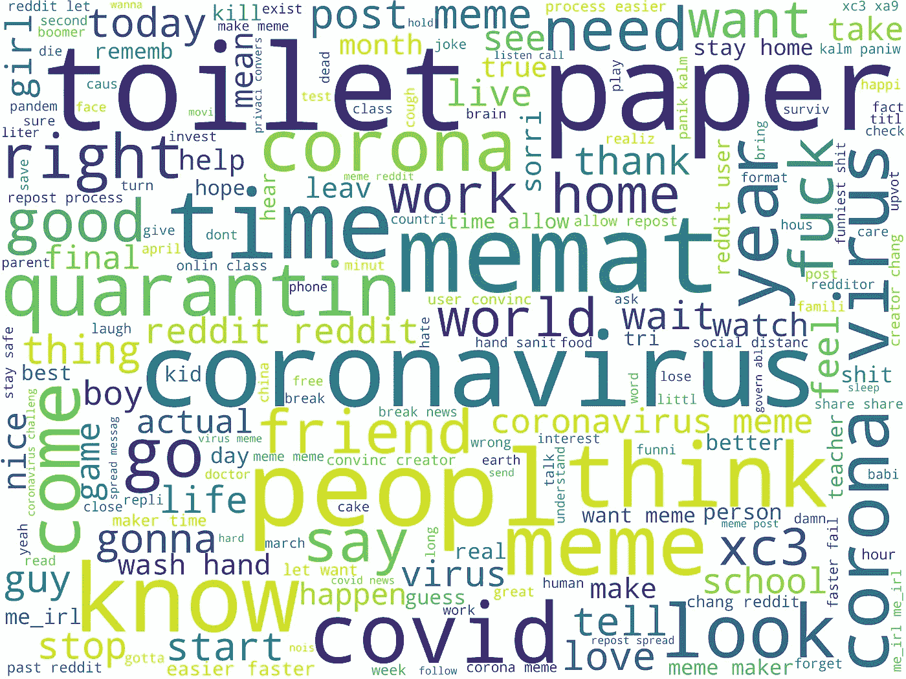

# 从一个关于迷因流行的数据科学项目中吸取的经验教训

> 原文：<https://towardsdatascience.com/takeaways-from-mentoring-a-data-science-project-4d3c95f17483?source=collection_archive---------27----------------------->

## 指导远程数据科学团队分析新冠肺炎迷因的收获。潮湿不潮湿？

潮湿不潮湿？——这是模因世界中的一个好问题，模因是充满幽默的病毒式互联网内容，反映了当前在网络世界中传播的趋势。就在疫情疫情爆发前，AIT Budapest 的一群才华横溢的学生将这一主题作为他们数据科学项目的核心。

> 我作为导师加入了他们，帮助他们解决与数据科学相关的问题，并发现自己参与了一个令人兴奋的研究项目，该项目已经从一项大学任务发展成为一篇研究文章，并在最近几天发表。

你可以想象，我们从这个项目中学到了很多。因此，我想分享一些与数据科学相关的一般性观点，这些观点对任何对数据科学感兴趣或从事类似项目的人都很有用。所以，让我们开始吧！

*图片由作者根据* [*Unsplash*](https://unsplash.com/photos/EJrK0J8Jr7U) *改编。*

# 好数据—好项目

在过去的几年里，模因已经成为一种社会现象，尤其是在新冠肺炎疫情时代，人们比以往任何时候都更倾向于在线互动。迷因可以吸引人们对文化和政治主题的注意，并且可以表达公众最关注的东西。它们已经成为一个有趣的研究课题，不仅从数据科学的角度，而且从网络科学和社会计算机科学的角度。在这个小组中，我们旨在用现代机器学习技术研究模因的受欢迎程度与其内容之间的关系。

> 首先，我们需要高质量的数据，我们必须了解如何利用我们的功能来回答目标问题。

我的学生决定调查最大的社交新闻和娱乐网站 Reddit 上的迷因。虽然已经有一些数据集可供数据科学家探索迷因世界，例如 Kaggle，但我建议我们从 Reddit 收集迷因，以获得我们想要的所有元数据，并拥有更大的数据集。另外，我们收集了 2020 年 3 月 17 日至 2020 年 3 月 23 日的数据，这是全球冠状病毒爆发的开始。在第一次数据清理步骤后，我们有 80362 条基于图像的迷因记录，其中包含大量元数据，如上传投票数、发布迷因的子编辑、标题等。

> 我认为这是将这个项目从大学小组工作发展成一个严肃的研究项目的第一步，我们收集了大量有趣的数据进行分析。通往成功的下一步是商业理解。

# 了解您的数据—每个数据科学项目的关键

当我们收集了大量基于图像的迷因时，下一步就是要弄清楚是什么特征表达了迷因的流行。

> 我们有每个迷因的投票数，但我们不能简单地用它作为我们的目标变量。为什么？

我们的图文模因来自最大的模因子群，代表致力于创造和分享模因的社群。拥有更多订户的子街道往往会获得更多的上行投票，这表明上行投票和订户之间存在正相关。为了消除这种网络效应，我们必须将上传投票数除以发布该迷因的子编辑的订阅人数，从而使上传投票数标准化。

> 现在我们有了目标变量，下一课是识别 Reddit 上模因的病毒性质使这些数据非常适合二进制分类任务。我们只看归一化 upvotes 的分布。

*归一化上票数的分布。来源:* [*潮湿不潮湿？-分析和预测 Reddit* 上的模因流行度](https://doi.org/10.1007/s41109-021-00358-7)

归一化上票数的分布表明，大多数模因获得的上票数很少，而少数模因获得的上票数很多。这给了我们形成二元分类标签的直觉，叫做*潮湿或不潮湿*。根据我们的目标标签，病毒或潮湿的模因通常与非病毒模因相差两个数量级，我们通过将前 5%的模因算作*潮湿*而其余的*非潮湿*来制定目标标签。

> 这样，我们制定了我们的数据科学任务，使用监督学习算法根据不同的特征集对迷因的受欢迎程度进行分类。

# 尝试不同的模型

我们深入研究了各种技术，从光学字符识别(OCR)到从图像中提取文本，通过 python 中的 OpenCV 获得低级图像特征，甚至通过 Keras 的 VGG-16 神经网络获得更多特征。研究最受欢迎的迷因的文本和图像内容在疫情疫情爆发时的样子令人兴奋。我们甚至从抓取的迷因中的所有文本生成了一个词云。

*从我们搜集的模因中的所有文本生成的词云。来源:* [*潮湿不潮湿？-分析和预测 Reddit 上的模因流行度*](https://doi.org/10.1007/s41109-021-00358-7)

我们用随机森林和梯度推进模型研究了图像或文本特征对确定病毒模因是否有更大的预测能力。我们还尝试用卷积神经网络进行迁移学习，根据原始图像数据预测模因的受欢迎程度。

> 在我看来，下一个重要的收获是，我们不仅尝试了一种机器学习模型，而且在不同的功能集上尝试了不同的模型。这样，我们可以更好地理解数据，并可以得出更普遍的结论。

# 准确性与 AUC

> 在任何数据科学项目中，确定使用哪些指标来评估模型的性能总是很重要的。我们认识到准确性并不总是我们所追求的。为什么？

想象一下我们不平衡的数据集和我们的二元分类任务，其中 5%的数据是*潮湿*，标记为 1，而其余的是*不潮湿*，标记为 0。让我们设想一个虚拟模型，它预测每个实例的标签 0。那么，这个模型将有 95 %的准确率！这不是我们真正想要的，是吗？

AUC 得分，也称为 ROC 曲线下的面积，衡量二元分类器的性能。它的值在 0.5-1 的范围内，其中 0.5 是随机分类器的性能，而 1 表示完美的模型。对我们来说，这是一个非常好的指标，因为它也适用于不平衡的数据集。此外，事实证明，这是比 accuracy⁴.更好的衡量标准

# 取样可能很棘手

处理不平衡数据集并不容易，尤其是当我们知道随机森林和梯度推进集成分类器在原始 form⁵⁶.中处理不平衡数据时表现不佳我们可以尝试使用为此设计的模型，就像我们通过使用来自 im burn pythonpackage⁷的平衡随机森林所做的那样，或者我们可以试验采样技术。

> 当我们尝试上采样时，我们遇到了一个常见的错误:在将数据集分成训练集和测试集之前，永远不要对其进行上采样。

它导致了“完美”的度量，并且很难猜出哪里出了问题。发生的情况是，在分割之前进行上采样，相同的实例可能落入训练集和测试集中。然后，很容易猜测出模型的测试集具有更好的度量，因为在测试集中有一些模型被训练的实例。

也不建议乱用测试 set⁸.如果我们修改它的分布，它不会反映我们的人口。

> 我们学到的是，如果我们首先应用分层抽样来获得测试集，效果会更好。然后，我们可以在训练集上应用任何采样技术。

# 摘要

作为这个数据科学项目的一部分，利用不同的机器学习技术预测模因的流行程度，这是一次很好的经历和挑战。我在上面强调了一些一般的要点，希望你也会觉得有用。总而言之，我分享了关于数据理解、不同模型、评分标准和抽样的想法。如果你对这个项目的细节感兴趣，我推荐你阅读我们的文章。

# 承认

我为我的组员凯特·巴恩斯、蒂尔农·里森米、Minh Duc Trinh、伊莱·莱希和我们的组长罗兰·莫隆泰教授感到无比自豪。你们都做得非常出色！

## 参考

[1] Barnes，k .，Riesenmy，t .，Trinh，M.D. *et al.* [Dank or not？Reddit 上模因流行度的分析与预测。](https://doi.org/10.1007/s41109-021-00358-7) (2021)应用网络科学 **6、** 21。

[2][https://www.reddit.com/](https://www.reddit.com/)

[3]萨扬·戈斯瓦米。 [Reddit 迷因数据集](https://www.kaggle.com/sayangoswami/reddit-memes-dataset/)。(2018)Kaggle.com

[https://www.kaggle.com/sayangoswami/reddit-memes-dataset](https://www.kaggle.com/sayangoswami/reddit-memes-dataset)

[4]，，凌，[用 AUC 和精度评价学习算法。](https://ieeexplore.ieee.org/document/1388242) (2005) IEEE 知识与数据工程汇刊，17(3)，299–310。doi:10.1109/tkde

[5] Brownlee，J.: [用于不平衡分类的装袋和随机森林。](https://machinelearningmastery.com/bagging-and-random-forest-for-imbalanced-classification/) (2020)，机器学习掌握

[6]刘，s，王，y，张，j，陈，c，向，Y.: [利用集成学习解决 Twitter 垃圾邮件检测中的类不平衡问题](https://www.researchgate.net/publication/311623674_Addressing_the_class_imbalance_problem_in_Twitter_spam_detection_using_ensemble_learning)，(2017)，计算机&安全 69，35

[7]Guillaume lematre*等人*。不平衡学习:一个 Python 工具箱来解决机器学习中不平衡数据集的诅咒。 (2017)《机器学习研究杂志》，18(1)559–563。

[8] [为什么采样提升了我的模型的性能？](https://datascience.stackexchange.com/questions/60764/why-did-sampling-boost-the-performance-of-my-model)、(2019) StackExchange。