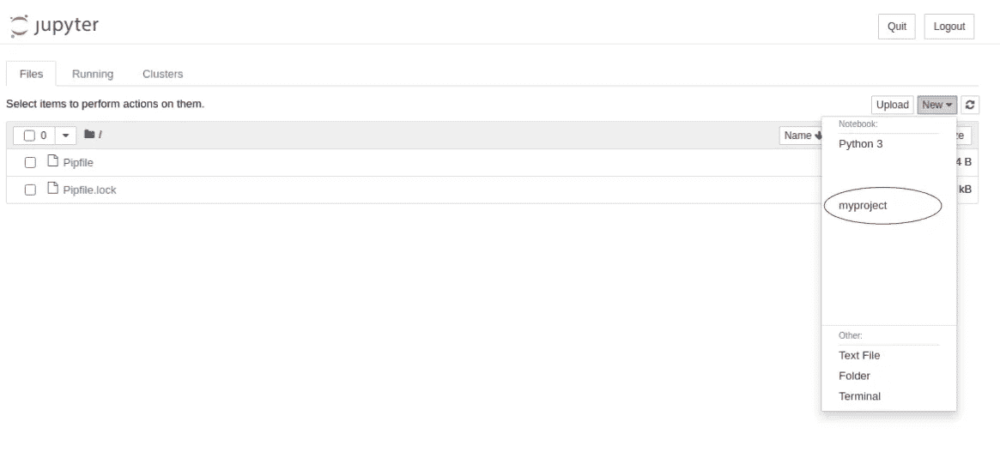

# 掌控您的工作流程

> 原文：<https://towardsdatascience.com/taking-control-of-your-workflow-943b9a8e7edf?source=collection_archive---------30----------------------->

## 使用 pyenv 和 pipenv 在 Python 中建立令人敬畏的虚拟环境，让你的同事再次喜欢你


照片由 [Kari Shea](https://unsplash.com/@karishea?utm_source=medium&utm_medium=referral) 在 [Unsplash](https://unsplash.com?utm_source=medium&utm_medium=referral) 上拍摄

**读者注意:**有许多方法可以创建管理 Python 版本和依赖项的虚拟环境。这篇文章介绍了我的首选方法，但是我鼓励您探索各种选项，并决定哪种方法最适合您！

# 为什么您需要虚拟环境

也许你创建了一个很酷的机器学习数据管道或开发了一个杀手级应用程序，下一步就是与世界分享它！然而，如果您没有跟踪和记录您使用的 Python 版本或所需的依赖项，那么与您共享它的人将会遇到许多令人头痛的安装错误。

## **输入 pyenv + pipenv**

Pyenv + pipenv 提供了一种方法来指定 Python 版本，并在项目级别安装和跟踪依赖项，从而使将代码交付到生产环境变得更加轻松。

# 基础知识

1.  使用这些[安装](https://github.com/pyenv/pyenv)说明安装`pyenv`
2.  使用`pip install pipenv`安装`pipenv`
3.  通过在终端中执行以下操作来创建和启动虚拟环境

```
**# create a project directory**$ mkdir myproject
$ cd myproject**# use pyenv to install and set a specific Python version**$ pyenv versions **# don't use the system version**
$ pyenv install 3.8.5
$ pyenv local 3.8.5**# create a virtual environment with pipenv**$ pipenv install
$ pipenv shell
(myproject) $ python --version **# 'myproject' indicates active****# install dependencies and check dependency list**(myproject) $ pipenv install pandas
(myproject) $ pip freeze**# deactivate Pipenv** (myproject) $ exit **# 'myproject' will disappear**
```

执行完上面的操作后，您现在将拥有一个`pipfile.lock`文件。只要这个文件伴随着你的代码，那么就像在文件的位置运行`pipenv install`一样简单，所有的依赖项都会被安装。

# 更进一步——Jupyter 笔记本

使用 pipenv 和定制的 IPython 内核管理 Jupyter 笔记本中的依赖项实际上是可能的。扩展上面的`myproject`示例，在终端中执行以下命令。

```
**# activate pipenv virtual environment for 'myproject' directory**$ cd myproject
$ pipenv shell**# install ipykernel and map custom kernel to virtual environment**(myproject) $ pipenv install ipykernel
(myproject) $ python -m ipykernel install --user --name=myproject**# launch a Jupyter Notebook**(myproject) $ jupyter notebook
```

从 Jupyter 笔记本中，你可以在内核列表中选择`myproject`内核。这将强制笔记本只使用 pipenv 虚拟环境中安装的依赖项！！



在 Jupyter 笔记本中选择自定义 ipykernel

# 摘要

如果您目前没有管理 Python 版本和依赖项，或者如果您管理了并且看起来很麻烦，那么使用 pyenv + pipenv 是一个很好的解决方案。它很容易安装，一旦你开始使用它，你永远不会回头。编码快乐！