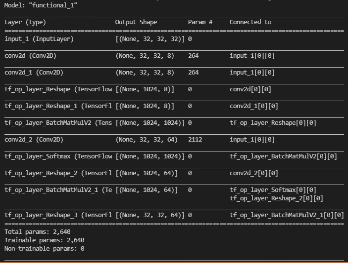

# 让 Keras 和 TensorFlow 更上一层楼

> 原文：<https://towardsdatascience.com/taking-keras-and-tensorflow-to-the-next-level-c73466e829d3?source=collection_archive---------7----------------------->

## 充分利用 Keras 和 TensorFlow 的 11 个技巧和诀窍

保罗·赫顿在 [Unsplash](https://unsplash.com?utm_source=medium&utm_medium=referral) 上的照片

时代是一个美丽的项目。虽然 TensorFlow 和 PyTorch 过去一直在竞争最先进的技术，但 Keras 的目标是 *us* ，需要完成工作的专业人士。我们可以使用去年的模型，而不是打赌下一个变形金刚杀手或 ResNet 的崇拜者。作为 TensorFlow 的一部分，Keras 已经有近两年的时间了，这表明该框架支持易用性和生产率，而不是速度。作为 TensorFlow 和 Keras 的用户，我在本文中分享了我多年来开发的一组技巧和诀窍，以将这些框架提升到一个新的水平。

我强调这不是一个优化指南。相反，这些技巧旨在使开发模型和实现定制功能变得更容易——所有这些都不会牺牲 Keras 最可爱的方面，它为您完成了大部分工作。

开始了。

# 始终使用函数式 API

使用 Keras 定义模型有三种主要方法:作为层列表(顺序方法)，作为功能组合(函数方法)，或者通过继承模型(子类化方法)。从树中，*总是选择功能方法*。

使用 Keras 功能 API 的一个简单例子

在上面的例子中，我们定义了一个 64 维的输入层，然后定义了一个 256 个神经元的隐藏层，最后是一个两类输出层。功能方面在第 4 行和第 5 行的末尾。隐藏层是处理输入的函数。同样，输出是处理隐藏层的函数。第 6 行定义的模型本身只是这个函数调用链的起点和终点。

你可以在 Keras 文档上阅读更多关于[功能 API 的内容。](https://keras.io/guides/functional_api/)

使用函数式 API 的原因很简单:它有最好的支持，没有限制。相比之下，顺序方法只支持前馈模型(不允许跳过连接或分支)，而子类化 API 对保存/加载模型和分布式训练的支持有限。此外，其他不太常见的特性，如 web 或移动平台的移植模型，在使用函数式 API 时也能更好地工作。

# 使用闭包创建块

使用函数式 API 时，最大的问题是如何在坚持函数式语法的同时创建可重用的代码片段。解决办法？关闭。

闭包的一般定义是指在它之外定义的变量的函数。在计算机科学词汇中，它“捕捉”了这些变量。在 Python 中，这与嵌套函数(在其他函数中定义的函数)的概念密切相关，但并不局限于此。下面是一个例子:

在 Keras 中使用闭包定义简单 ResBlock 的示例

上面的代码片段展示了如何创建一个函数(resblock ),该函数返回另一个函数(_block ),该函数捕获“n_filters”参数。当通过一个层被调用时，这个第二个函数将通过添加一个典型的 ResBlock 的所有步骤来继续函数调用链，如在原始论文( [2015](https://arxiv.org/abs/1512.03385) 、 [2016](https://arxiv.org/abs/1603.05027) )中所定义的。

使用这种语法的好处在于，它允许您将超参数(定义为第一个函数的参数)与调用该层的先决条件(定义为内部函数的参数)分开。此外，它允许您在两个级别上都放置自定义逻辑。例如，上面的示例展示了如何预处理“start”参数，以确保使用 1v1 卷积至少有“n_filter”通道。

使用闭包在 Keras 中实现 2D 自我关注

**对于高级用户:**展示闭包在一个更复杂的例子中，我们实现了一个 2D 瓶颈查询-值-键关注块，类似于[自我关注甘斯](https://arxiv.org/abs/1805.08318)上所描述的。首先，我们定义了超参数 *n_filters* ，在第一个函数的范围内，我们将瓶颈的程度指定为 *n_filters* 的八分之一。然后，在内部函数中，我们使用 1v1 卷积对查询和值项进行瓶颈处理，并将所有三个输入重新整形为 1D 向量。接下来，我们将注意力得分计算为查询和值之间的最大点积，最后，将其与关键术语相结合以获得输出。

从第 27 行开始，我们创建了第二个闭包来简化我们刚刚编码到 2D 自我关注块中的 2D 关注，该块同时将单个输入映射为查询、值和键。这些实现共同展示了如何使用闭包的外部和内部范围，以及如何组合闭包以进一步扩展它们的功能。

人们可以将第 18-21 行替换为内置的 [tf.keras.layers .注意力层，以获得更少的从头开始的解决方案](https://www.tensorflow.org/api_docs/python/tf/keras/layers/Attention)。我刚刚意识到，在编码了这个例子之后:x

# 将操作用于自定义代码

在层链中，虽然很明显只有层可以链接在一起，但事实是大多数 TensorFlow 操作都可以用作层。我知道的唯一先决条件是它接受并输出张量。使用原始 ops 代替纯层的优势有几个。我强调它的可读性更强，更轻量级，也更透明。另外，使用 ops 有完全的控制权。

尽可能使用 TensorFlow ops 修改 2D 注意力示例

在上面的代码片段中，计算注意力分数和输出所需的操作被转换为简单的 TensorFlow 操作。这种语法更接近于你在 Numpy、PyTorch 甚至 JAX 中看到的语法。

使用 ops 的缺点是当你需要增加重量时。为此，最好尽可能使用内置层。在上面的例子中，我们坚持使用卷积层，其余的使用 ops。对于那些熟悉注意力公式的人来说，有时它包括一个最终的比例参数(gamma)。坦白地说，我不会打扰。

好吧，对于那些有麻烦的人，需要权重的简单缩放和移位操作可以使用 1v1 卷积来模拟，或者更好的是，批量范数或层范数。

# 为简洁的摘要包装自定义代码

使用 ops 的另一个缺点是在运行 model.summary()时会变得很难看。例如，上面的代码片段产生了以下内容:

调用 model.summary()时，ops 会有多难看

有两种方法可以解决这个问题:

1.  实现从[层](https://www.tensorflow.org/api_docs/python/tf/keras/layers/Layer)继承的功能
2.  实现从[包装器](https://www.tensorflow.org/api_docs/python/tf/keras/layers/Wrapper)继承的功能
3.  将一切封装在另一个[模型](https://www.tensorflow.org/api_docs/python/tf/keras/Model)中

第一种方法是最麻烦的，因为您需要处理 Keras 内部。然而，当您想用其他东西来扩充现有的层实现时，第二种方法非常有效。一个完美的用例是[光谱归一化](https://arxiv.org/abs/1802.05957)的[插件的实现](https://www.tensorflow.org/addons/api_docs/python/tfa/layers/SpectralNormalization)。然而，第三个是最实际的(有一些警告)。

这个想法是你可以使用模型作为层(就像你可以使用大多数操作作为层一样)。如果您有一组重复的层(如上面的 Attention 实现)，您可以将其打包到一个模型中，并在您的网络中使用该模型。这样，您可以将整个子网命名为一个实体。

警告是两个:(1)模型没有”。“形状”属性，以及(2)模型不会自动命名。如果自定义块试图访问前一层的形状(如上面的 ResBlock 实现)，前者会咬你一口，如果是模型，它会失败。后者将触发一个 Keras 异常，要求所有层都有唯一的名称。因此，对于**高级用户**，我留给您一个*的 hacky* 装饰器，它会弄乱唯一 id 的全局名称空间，并用 shape 属性对创建的模型进行猴子式修补🙈。

使用自动命名和形状属性将自定义块包装为模型的装饰器

理解这个片段是留给读者的练习。

# 关于自定义训练循环的注释

当 TensorFlow 2.0 发布时，要创建定制的训练例程，如 GANs 的对抗性训练，需要完全放弃 model.fit()调用，并从头开始重新实现它。这样做是不小的壮举。你必须做你的纪元，有效地得到下一批，写训练和测试步骤，运行你的回调和度量，建立一个进度条，等等。混合精度或分布式培训的加分。这是关于定制训练循环的[官方文档](https://www.tensorflow.org/guide/keras/writing_a_training_loop_from_scratch#end-to-end_example_a_gan_training_loop_from_scratch)。

TensorFlow 2.2 给了我们一个使用子类化模型的好理由:你可以在使用 *model.fit()* 的同时覆盖 *train_step* 、 *test_step、*和 *predict_step* 调用来定制训练。对于胆小的人来说，重新执行这些呼叫仍然不是一件事情。然而，你不需要重新发明整个战车，只需要轮子。

到目前为止，我所知道的实现这些调用的最佳参考是源代码本身(它被认为是文档)。你可以在这里找到它。

到目前为止，我建议在所有情况下都坚持使用函数式 API。为了继续，您可以对 *train_step* 、 *test_step、*和 *predict_step* 调用进行猴子修补。语法有点问题，monkey patching 是一个相当糟糕的解决方案，但是它很有效:)。毕竟，如果您正在编写定制的训练循环，那么您已经对 Python 的魔力了如指掌。

无论如何，这里是维基百科关于猴子补丁的[陷阱部分](https://en.wikipedia.org/wiki/Monkey_patch#Pitfalls)

Monkey 修补使用函数式 API 定义的模型的训练步骤的示例

这个愚蠢的片段展示了如何对 *train_step* 调用打猴子补丁，以计算它被调用的次数。注意，第 19 行激活了 eager mode，强制 Keras 不要跟踪这个函数到 graph-mode，这将导致它只被调用两次。现实世界的用例不需要使用渴望模式，只需要像这样愚蠢的演示。

# 知道如何遍历模型

您是否曾经问过自己如何迭代所有的模型层，并在每个层上做一些事情？当您需要对每个图层应用一些东西或收集内部数据(如每个图层的平均权重)时，遍历会非常方便。这里的技巧是不要忘记迭代子模型。

向模型的所有层添加权重衰减

这是一个如何将权重衰减添加到模型所有层的示例。该算法是对所有层的深度优先扫描，使用递归来深入研究子模型、子模型的子模型等。注意这段代码只支持少数层，但是很容易扩展到其他层。

# 使用正确的数据类型

使用正确的数据类型可以节省 50%(比如从 float64 到 float32)到 93%的内存(从默认的 int64 到瘦 uint8)。我曾在下面的文章中写过这个问题:

</memory-efficient-data-science-types-53423d48ba1d>  

特别是对于 TensorFlow 和 Keras 来说，有一件事人们通常会不假思索地坚持:一键编码和交叉熵。经验法则是用一键编码对标签进行编码，并为每个类输出一个值。这种做法通常是安全和正确的。然而，对于大规模数据集或具有大量类的问题，使用稀疏标注和稀疏交叉熵可能会改变生活。

稀疏标签是以索引形式存储的标签:例如，第七个类由数字 7 表示，而不是由第七个位置设置为 1 的零向量表示。对于 1000 个类的问题，这是更紧凑的数量级。一个 uint16 数对一千个浮点数。默认情况下，大多数数据集使用稀疏标签进行打包，我们强制将它们一次性打包。

[稀疏交叉熵](https://www.tensorflow.org/api_docs/python/tf/keras/losses/SparseCategoricalCrossentropy)是[分类交叉熵](https://www.tensorflow.org/api_docs/python/tf/keras/losses/CategoricalCrossentropy)的一个变种，它将你的模型输出以一个热点格式与真实标签以索引格式进行比较。结合这种损失和稀疏标签，你节省了大量的内存，否则将花费在英亩的零。

“关于定制训练循环的注释”的片段展示了一个使用稀疏交叉熵的例子。

# 额外提示

**不要忘记急切模式:** TensorFlow 在开始抱怨形状和不兼容数据类型的内部错误时可能会很棘手。大多数这些在渴望模式下很容易被发现或者不会发生。记住使用渴望模式有助于追踪 bug 的源头，或者在将 bug 缩小到图形模式问题(比如使用正确的数据类型)之前关注全局。

**对 tf.data 也使用渴望模式:**使用数据 API 是一件痛苦的事情，因为它总是将一切追溯到图形模式。从 TensorFlow 2.6 开始，您可以为数据 API 激活调试模式。这项功能仍处于试验阶段，但会非常方便。[下面是怎么做的](https://www.tensorflow.org/api_docs/python/tf/data/experimental/enable_debug_mode)。

**使用 Lambda 回调:**当使用昂贵的指标跟踪训练进度时，使用 [Lambda 回调](https://www.tensorflow.org/api_docs/python/tf/keras/callbacks/LambdaCallback)类注入要在 epoch end 上运行的代码是值得的。如果您的度量非常慢，您可以使用 epoch 参数跳过在奇数个时期执行代码，或者每十个时期执行一次。

**让自己成为一个库:**当你使用深度学习时，你将不得不实现不同的层和架构。使用所有内置的东西作为构建模块，有些很容易实现，有些则不容易。因此，保留一个方便的 layers.py 文件来保存多年来您必须编写的所有自定义内容是值得的。

他的一切都是为了现在。如果您对本文有任何问题，请随时发表评论或与我联系。

如果你是中新，我强烈推荐[订阅](https://ygorserpa.medium.com/membership)。对于数据和 IT 专业人员来说，中型文章是 StackOverflow 的完美搭档，对于新手来说更是如此。注册时请考虑使用[我的会员链接。](https://ygorserpa.medium.com/membership)

感谢阅读:)