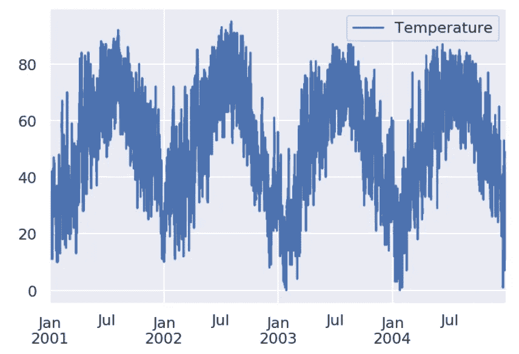
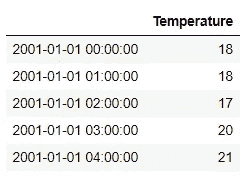
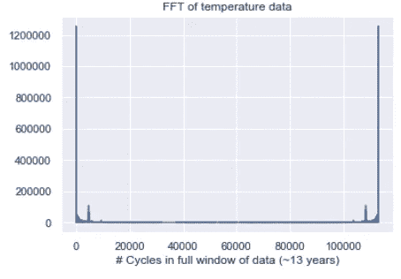
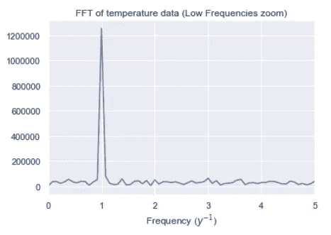
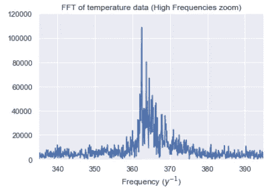
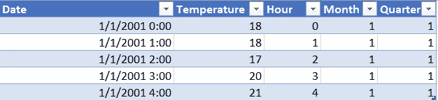
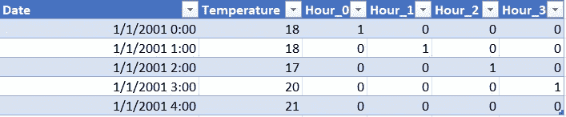
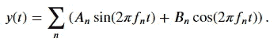
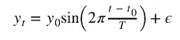
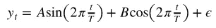

# 考虑季节性的时间序列分析

> 原文：<https://towardsdatascience.com/taking-seasonality-into-consideration-for-time-series-analysis-4e1f4fbb768f?source=collection_archive---------3----------------------->


克里斯·劳顿在 [Unsplash](/s/photos/season?utm_source=unsplash&utm_medium=referral&utm_content=creditCopyText) 上的照片

## [理解大数据](https://towardsdatascience.com/tagged/making-sense-of-big-data)

## 使用季节性指标或傅立叶分析

顾名思义，季节性是指时间序列数据的季节性特征。它是在一年内以一定频率重复的可预测模式，如每周、每月、每季度等。证明季节性的最直接的例子是看温度数据。在地球上的大多数地方，我们总是认为夏天的温度会高一些，而冬天的温度会低一些。

在时间序列预测中，如需求预测，考虑季节性是非常重要的。例如，我们可以预期冰淇淋的销售有季节性，因为每年夏天的销售额会更高。考虑销售季节性影响的模型在时间序列预测中会更准确。一般来说，时间序列分析的目标是利用数据的时间特性来建立更复杂的模型。为了正确预测事件，我们需要实施技术来发现和模拟数据中的长期趋势、季节性和残留噪声。本文将重点讨论如何检测数据中的季节性，以及如何将季节性纳入预测中。

## 检测季节性

在将季节性放入模型之前，我们需要知道数据是如何重复的，重复的频率是多少。如果您非常了解数据的背景，检测季节性会非常简单。例如，我们知道一年中夏天的温度会高一些，冬天的温度会低一些。要发现您不熟悉的数据的季节性，简单的方法是绘制数据并观察时间序列的周期性信号:



观察温度的季节性

上图显示了每年重复的模式。即使每个夏天达到的高度各不相同，我们仍然可以看到温度在夏天最高，在冬天最低的模式。

温度数据在一天内也有季节性，我们可能不知道温度在一天内如何波动。我们可以在较低的频率下绘制数据，或者使用一种称为**快速傅立叶变换( *FFT)*** 到的算法来检测重复频率。任何周期信号都可以表示为几个幅度、相位和频率不同的正弦波之和。一个时间序列可以用称为 ***傅立叶变换*** 的数学工具转换成它的频率分量。FFT 的输出可以被认为是数据的所有频率成分的表示。在某种意义上，它是一个直方图，每个“频率仓”对应于信号中的一个特定频率。每个频率分量都有振幅和相位，并表示为复数。通常，我们只关心振幅，以确定数据中最高的“频率仓”是什么。在这里我不会在数学上讲太多细节，但是如果你感兴趣，[Cory Maklin](/fast-fourier-transform-937926e591cb)的这篇文章很好地解释了这一点。要在数据集中执行 FFT，我们可以使用 Scipy 中的 FFT 模块。以具有 13 年每小时温度的温度数据集(temps)为例。数据集如下所示:



对数据集执行以下代码:

```
from scipy.fftpack import fft
import numpy as np
import matplotlib.pyplot as pltfft = fft((temps.Temperature — temps.Temperature.mean()).values)
plt.plot(np.abs(fft))
plt.title("FFT of temperature data")
plt.xlabel('# Cycles in full window of data (~13 years)');
```

并不是说在第一步中，我们减去温度的平均值，以避免较大的零频率分量。用 13 年的数据绘制整个数据集可能无法很好地显示模式，如下图所示:



没有虚部的实信号的傅立叶变换关于频率范围的中心是对称的。绘制长时间范围内的 FFT 可能无法提供我们想要的最相关的信息。因此，我们可以放大以检查不同频率级别的“频率仓”。我们预计温度具有每日季节性，因此我们放大查看从第 0 天到第 5 天的“直方图”:

```
plt.plot(1./13 * np.arange(len(fft)), np.abs(fft))
plt.title("FFT of temperature data (Low Frequencies zoom)")
plt.xlim([0,5])
plt.xlabel('Frequency ($y^{-1}$)');
```

下图显示了每日季节性，因为“频率箱”在“第 1 天”的频率非常高:



同样，我们可以放大到第 365 天左右的频率，以检查每年的季节性:

```
plt.plot(1./13 * np.arange(len(fft)), np.abs(fft))
plt.title(“FFT of temperature data (High Frequencies zoom)”)
plt.ylim([0,120000])
plt.xlim([365–30, 365 + 30])
plt.xlabel(‘Frequency ($y^{-1}$)’);
```

下图显示了 365 天达到高峰时的年度季节性。



FFT 是转换时间序列数据的一个很好的工具，因为它可以被绘制成“频率直方图”。图表将显示数据重复模式的频率，从而检测数据的季节性。

## 增加季节性

检测到季节性后，有几种方法可以将季节性合并到模型中，以更好地执行时间序列预测。本文将介绍利用季节指标、傅立叶分析和 SARIMA 模型在时间序列预测中加入季节性。

**1、添加季节性指标**

将季节性因素添加到模型中最直接的方法是添加季节性指标。季节指标是描述每次观测的“季节”的分类变量。以温度预测为例。为了指示每日的季节性，在训练模型时，您可以使用“小时”作为观察的特征。该功能将像任何其他功能一样，在预测温度时采用一天中某个小时的固定效果。为了包括每年的季节性，我们应该以同样的直觉在模型中添加“月”和“季度”作为特征。使用上面列出的数据集，每个观测值应包括以下特征:



包括季节性指标

“小时”、“月”、“季度”变量是我们应该包括的特征，以捕捉数据中的季节性。尽管它们是数值形式，但它们实际上是分类变量而不是数值变量。注意，如果我们使用线性模型进行预测，为了包含这些分类变量，我们需要首先使用像[一键编码](https://scikit-learn.org/stable/modules/generated/sklearn.preprocessing.OneHotEncoder.html)这样转换器来转换这些变量。转换后，“小时”变量应该如下所示:



“小时”变量的五个观察值被转换成四列，显示小时的不同值。您可以说我们没有将 Hour_4 作为一列包含在这里，以避免多重共线性。如果小时只有五个值，不在前四个值中，则自动表示该观察值取第五个值。使用 Pandas 进行一键编码的一个简单方法是使用函数 [get_dummies():](https://pandas.pydata.org/pandas-docs/stable/reference/api/pandas.get_dummies.html)

```
pandas.get_dummies(data, drop_first=True)
```

该函数会将分类变量转换为虚拟变量，从而准备好放入线性模型。这些虚拟变量被称为季节性指标。

如果您的预测模型不假设线性关系，您不需要进行一次性编码。例如，如果您使用树模型，只需将分类变量作为特征放入模型中。如果分类变量是文本形式的，在放入模型之前，给每个类别分配数字。(将“一月”改为“1”)

**2、傅立叶分析**

任何信号都可以表示为不同频率𝑓𝑛和振幅𝐴𝑛和𝐵的正弦和余弦的线性组合:



傅立叶变换将信号分解成一组频率，使我们能够确定构成时间序列的主要频率。以温度数据为例。从上面的图中，我们知道温度大致是正弦曲线。因此，我们知道一个合理的模型可能是:



其中 *y0* 和 *t0* 是待学习的参数。对于季节变化，t 通常为一年。虽然该函数在 *y0* 中是线性的，但在 *t0* 中不是线性的。然而，使用傅立叶分析，上述情况相当于:



此函数在 A 和 b 中是线性的。因此，我们可以创建一个包含一个或多个时间尺度上的正弦项的模型，并使用线性回归来拟合数据。以下代码显示了构建年、半年和日季节性作为特征，并在线性回归模型中使用它们来预测温度的过程:

```
df['sin(year)'] = np.sin(df['julian'] / 365.25 * 2 * np.pi)
df['cos(year)'] = np.cos(df['julian'] / 365.25 * 2 * np.pi)
df['sin(6mo)'] = np.sin(df['julian'] / (365.25 / 2) * 2 * np.pi)
df['cos(6mo)'] = np.cos(df['julian'] / (365.25 / 2) * 2 * np.pi)
df['sin(day)'] = np.sin(df.index.hour / 24.0 * 2* np.pi)
df['cos(day)'] = np.cos(df.index.hour / 24.0 * 2* np.pi)regress = LinearRegression().fit(X=train[['sin(year)', 'cos(year)', 'sin(6mo)','cos(6mo)','sin(day)','cos(day)']], y=train['temp'])
```

上面的 FFT 图对于确定哪种季节性应该包含在回归中非常有用。请注意，这里没有使用常规日期，而是使用儒略日作为 t 变量。儒略日是自儒略历开始以来的天数(公元前 4713 年 1 月 1 日)，因此它是一个连续的数字。

除了加入季节性指标或使用傅立叶分析，我们还可以使用 SARIMA 模型，即在 ARIMA(自回归综合移动平均)模型中加入季节性成分。[本教程](https://machinelearningmastery.com/sarima-for-time-series-forecasting-in-python/)有兴趣的话详细描述萨里玛模型。

感谢您阅读这篇文章。这是我所有博客帖子的列表。如果你感兴趣的话，可以去看看！

[](https://zzhu17.medium.com/my-blog-posts-gallery-ac6e01fe5cc3) [## 我的博客文章库

### 我快乐的地方

zzhu17.medium.com](https://zzhu17.medium.com/my-blog-posts-gallery-ac6e01fe5cc3) [](https://zzhu17.medium.com/membership) [## 阅读朱(以及媒体上成千上万的其他作家)的每一个故事

### 作为一个媒体会员，你的会员费的一部分会给你阅读的作家，你可以完全接触到每一个故事…

zzhu17.medium.com](https://zzhu17.medium.com/membership)