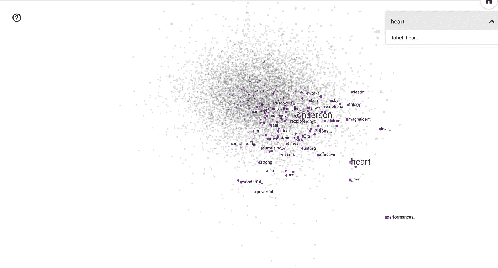
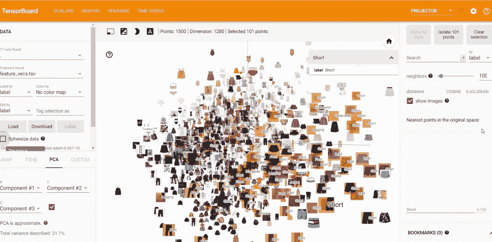

# 将 TensorBoard 嵌入式投影仪推向新的高度

> 原文：<https://towardsdatascience.com/taking-the-tensorboard-embedding-projector-to-the-next-level-bde53deb6bb7?source=collection_archive---------6----------------------->

## TensorBoard 投影仪允许以图形方式表示低维嵌入。在这里，我将向您展示如何呈现嵌入所涉及的图像，而不是显示一个点。


弗兰基·查马基在 [Unsplash](https://unsplash.com?utm_source=medium&utm_medium=referral) 上拍摄的照片

TensorBoard 嵌入投影器是一种非常强大的数据分析工具，特别适用于解释和可视化低维嵌入。为了做到这一点，首先，它将降维算法应用于 UMAP、T-SNE、PCA 或自定义之间的输入嵌入，以将它们的维度减少到三个，并能够在三维空间中呈现它们。

地图生成后，该工具可用于搜索与嵌入相关的特定关键词或突出显示空间中的相似点。最终，它的目标是提供一种方法来更好地解释我们的机器学习模型正在生成的嵌入，以检查根据我们的定义相似的嵌入是否在 3D 空间中绘制。

当我们想要显示的嵌入来源于单词时，用它所引用的标签来绘制点就足够了，这正是在 [TensorBoard 文档](https://www.tensorflow.org/tensorboard/tensorboard_projector_plugin)中呈现的用例。



投射在 TensorBoard 上的单词嵌入。来源: [TensorFlow](https://www.tensorflow.org/tensorboard/tensorboard_projector_plugin) 。

然而，如果我们想要投影图像嵌入，在这种情况下，标签将是不相关的。另一方面，如果我们显示图像，而不是可视化 3D 点，它肯定会允许我们检查附近是否绘制了类似的图像。

> 这正是本教程的目的。



投影到张量板上的图像嵌入。

## 履行

> **在开始之前，本教程假设您有一个在 TensorFlow 上开发的模型和一个包含用于训练/测试该模型的图像路径的数据集。投影嵌入应该是最后一个阶段。**

第一步是在 Jupyter 笔记本中加载 TensorBoard 和我们将要使用的扩展。

```
%load_ext tensorboardimport csv
import numpy as np
import tensorflow as tf
from PIL import Image
```

接下来，我们将创建第二个模型，它具有与原始模型相同的输入，但产生低维表示。这取决于原始模型所使用的架构。通常，您可以在应用激活函数之前使用最后一层，或者如果嵌入的大小较小，则可以使用最后一层之前的一层。

```
embeddings = tf.keras.models.Model( 
    inputs=model.inputs, 
    outputs=model.layers[-1].output 
)
```

一旦我们的*嵌入器*被创建，我们需要获取将在 TensorBoard 投影仪上显示的图像样本。原因是该工具在浏览器中运行，不能显示大量图像。然而，对于大约 1000 到 1500 张图像的样本，结果已经提供了很高的可解释性。在本例中，样本取自[验证集](/how-to-split-a-tensorflow-dataset-into-train-validation-and-test-sets-526c8dd29438)。

```
def get_img(img_path):
    img = tf.io.read_file(img_path)
    # convert the compressed string to a 3D uint8 tensor
    img = tf.image.decode_jpeg(img, channels=3)
    # resize the image to the desired size for your model
    img = tf.image.resize_with_pad(img, 100, 100)
    return img# Generate embeddings
images_pil = []
images_embeddings = []
labels = []
for x in raw_val_ds.take(1500): 
    img_path = x[0]
    img_tf = get_img(img_path) # Save both tf image for prediction and PIL image for sprite
    img_pil = Image.open(img_path.numpy()).resize((100, 100))
    img_embedding = embeddings(tf.expand_dims(img_tf, axis=0))
    images_embeddings.append(img_embedding.numpy()[0])
    images_pil.append(img_pil) # Assuming your output data is directly the label
    label = x[1] 
    labels.append(label)
```

为了给 TensorBoard 提供嵌入，我们需要在我们将从启动 TensorBoard 的文件夹中输出一个 *feature_vecs.tsv* **。**

```
with open(f’{LOG_DIR}/embeddings/feature_vecs.tsv’, ‘w’) as fw:
    csv_writer = csv.writer(fw, delimiter=’\t’)
    csv_writer.writerows(images_embeddings)
```

最后，我们将生成一个 *sprite* 或我们图像的拼贴，以便 TensorBoard 稍后可以单独地可视化它们，关注它们的嵌入。

> 注意:图像需要与嵌入的顺序相同。

```
one_square_size = int(np.ceil(np.sqrt(len(images_embeddings))))
master_width = 100 * one_square_size
master_height = 100 * one_square_sizespriteimage = Image.new(
    mode=’RGBA’,
    size=(master_width, master_height),
    color=(0,0,0,0) # fully transparent
)for count, image in enumerate(images_pil):
    div, mod = divmod(count, one_square_size)
    h_loc = 100 * div
    w_loc = 100 * mod
    spriteimage.paste(image, (w_loc, h_loc))spriteimage.convert(“RGB”).save(f’{LOG_DIR}/embeddings/sprite.jpg’, transparency=0)
```

可选的，我们也可以输出 *metadata.tsv* 来链接一个嵌入了某个标签的图片(然后能够通过它进行搜索)。这可以是例如图像的类别。

> 同样，标签的顺序与嵌入的顺序相同。

```
with open(f’{LOG_DIR}/embeddings/metadata.tsv’, ‘w’) as file: 
    for label in labels:
        file.write(f”{label}\n”)
```

## 结果

一旦生成了必要的文件，我们只需要针对我们的日志数据启动 TensorBoard。这可以通过在单元格中执行:

```
%tensorboard — logdir LOG_DIR
```

这里您可以看到在 [TensorBoard](/a-better-comparison-of-tensorboard-experiments-b6d6b42e5d9e?source=your_stories_page-------------------------------------) 中选择投影仪选项卡时的预期结果。


> 在不同的降维算法之间进行测试，直到你对投影满意为止！

## 结论

在本教程中，我们已经看到了如何利用 TensorBoard 不仅表示单词嵌入，还表示图像嵌入以及它们所引用的图像。这可以在分析[深度学习模型](/the-million-dollar-question-when-to-stop-training-deep-learning-models-fa9b488ac04d?source=your_stories_page-------------------------------------)时提供可解释性洞察。

如果你想发现更多像这样的帖子，你可以在下面找到我:

*   [GitHub](https://github.com/angeligareta)
*   领英
*   [个人网站](https://angeligareta.com/)