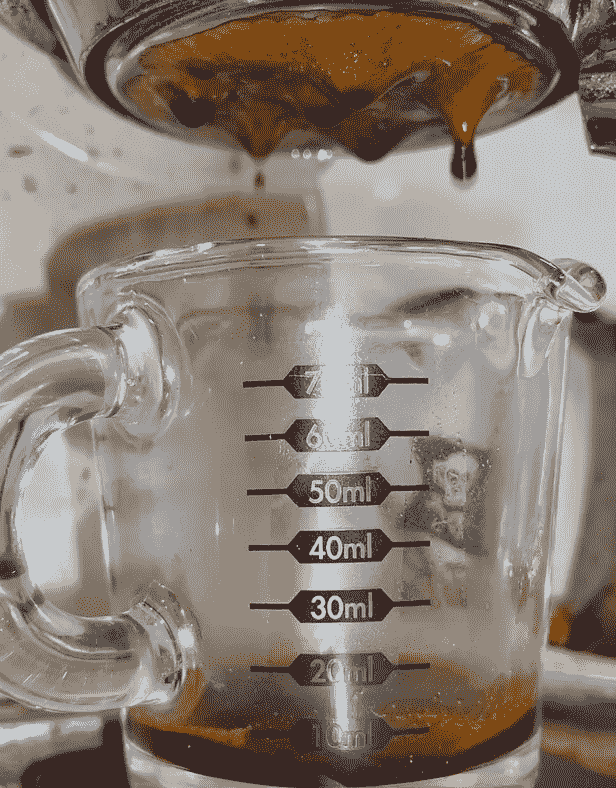
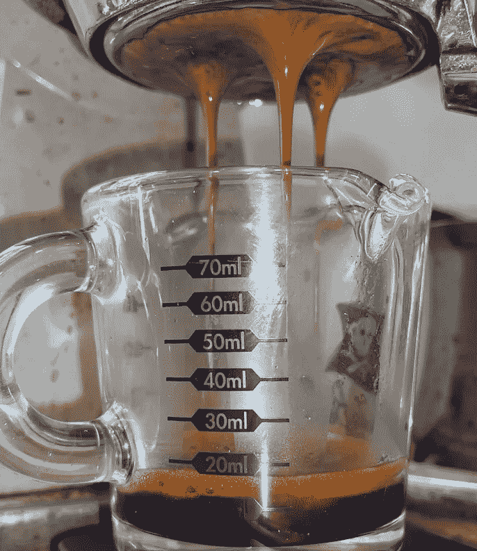
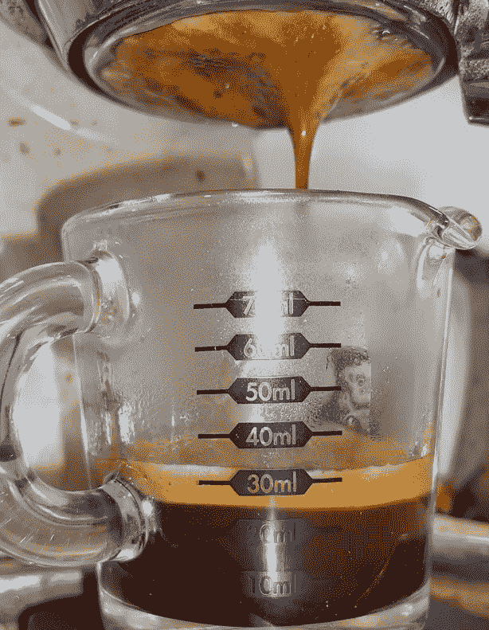

# 浓缩咖啡的夯实压力

> 原文：<https://towardsdatascience.com/tamp-pressure-for-espresso-80f153c47619?source=collection_archive---------29----------------------->

## 咖啡数据科学

## 探索压力对拍摄的影响

浓缩咖啡是迄今为止制作咖啡最丰富的方法，但也是最困难的方法。每一个镜头都有挑战，因为多个变量汇集在一起形成了一个美丽的东西。研磨设置、夯实压力、水温、压力、预注入、剂量、篮子、研磨机和机器都起作用。对于初学者来说，最具挑战性的障碍是能够理解他们应该根据其他镜头的运行方式做出什么调整。

我一直在看我为我的浓缩咖啡拍摄做失败分析的所有方法，我认为看几个变量会很有趣。在开始，我想分别看看这些变量，并展示我所看到的，希望它能帮助其他人更好地看到他们的投篮输出，并理解从那里去。

本文重点介绍 3 个夯实设置。对于每一个，我把地面放在一个篮子里，用牙签分发，并用自动校平机夯实。我把中心做得不那么密集，以对抗杠杆机器中固有的[旋转](https://rmckeon.medium.com/espresso-machine-donuts-deeper-analysis-into-extraction-cd7e602468d)。我也用同样的篮子和同样的豆子拍了三张照片。然后我用一个天平来测量每一个的夯压。与其他人相比，我的夯击也比较轻，[之前关于夯击压力的数据](/espresso-preparation-grinding-distribution-and-tamping-50f452f78aa8)显示，超过 5 磅(2.27 千克)的压力会降低提取率。

我为每个镜头都拍了视频。每一行都是 5 秒的时间。列是 200 克、400 克和 600 克夯压。

200 克…………400 克……..600 克

所有图片由作者提供

镜头非常相似。流量日志没有讲什么特别的故事，除了 600g 的镜头流量稍微慢一点。

这些照片的冰球底部也没有揭示任何特别的东西，除了 400 克的照片有点片面。200 克底部有更多的黑斑，而 600 克夯实的中心几乎没有黑斑。

200 克…………400 克……..600 克

200 克、400 克和 600 克捣棒

# 绩效指标

我使用两个指标来评估技术之间的差异:最终得分和咖啡萃取。

[**最终得分**](https://towardsdatascience.com/@rmckeon/coffee-data-sheet-d95fd241e7f6) 是评分卡上 7 个指标(辛辣、浓郁、糖浆、甜味、酸味、苦味和回味)的平均值。当然，这些分数是主观的，但它们符合我的口味，帮助我提高了我的拍摄水平。分数有一些变化。我的目标是保持每个指标的一致性，但有时粒度很难确定。

</coffee-solubility-in-espresso-an-initial-study-88f78a432e2c>**用折射仪测量总溶解固体量(TDS)，这个数字结合弹丸的输出重量和咖啡的输入重量用来确定提取到杯中的咖啡的百分比，称为**提取率(EY)** 。**

# **品味和 EY**

**至于口感，400g 的镜头口感最好。对于 TDS/EY，600g 表现最好，但它非常接近 400g 夯实。**

********

**从时间上来说，600g 的夯棒覆盖滤网的时间最长，输液时间更长，但两者还是蛮像的。**

****

**制作好的浓缩咖啡的关键是实验和尝试一些不同的夯实压力。尝试几个不同的变量，并试图了解如何进行调整，直到你得到天堂的味道。然后继续调整你所有的变量，直到你到达天堂的下一层，因为所有这些不同的变量都是相互关联的。**

**如果你愿意，可以在推特[和 YouTube](https://mobile.twitter.com/espressofun?source=post_page---------------------------)上关注我，我会在那里发布不同机器上的浓缩咖啡照片和浓缩咖啡相关的视频。你也可以在 [LinkedIn](https://www.linkedin.com/in/robert-mckeon-aloe-01581595?source=post_page---------------------------) 上找到我。也可以在[中](https://towardsdatascience.com/@rmckeon/follow)关注我，在[订阅](https://rmckeon.medium.com/subscribe)。**

# **[我的进一步阅读](https://rmckeon.medium.com/story-collection-splash-page-e15025710347):**

**[浓缩咖啡系列文章](https://rmckeon.medium.com/a-collection-of-espresso-articles-de8a3abf9917?postPublishedType=repub)**

**工作和学校故事集**

**[个人故事和关注点](https://rmckeon.medium.com/personal-stories-and-concerns-51bd8b3e63e6?source=your_stories_page-------------------------------------)**

**[乐高故事启动页面](https://rmckeon.medium.com/lego-story-splash-page-b91ba4f56bc7?source=your_stories_page-------------------------------------)**

**[摄影启动页面](https://rmckeon.medium.com/photography-splash-page-fe93297abc06?source=your_stories_page-------------------------------------)**

**[使用图像处理测量咖啡研磨颗粒分布](https://link.medium.com/9Az9gAfWXdb)**

**[改良浓缩咖啡](https://rmckeon.medium.com/improving-espresso-splash-page-576c70e64d0d?source=your_stories_page-------------------------------------)**

**[断奏生活方式概述](https://rmckeon.medium.com/a-summary-of-the-staccato-lifestyle-dd1dc6d4b861?source=your_stories_page-------------------------------------)**

**[测量咖啡研磨分布](https://rmckeon.medium.com/measuring-coffee-grind-distribution-d37a39ffc215?source=your_stories_page-------------------------------------)**

**[咖啡萃取](https://rmckeon.medium.com/coffee-extraction-splash-page-3e568df003ac?source=your_stories_page-------------------------------------)**

**[咖啡烘焙](https://rmckeon.medium.com/coffee-roasting-splash-page-780b0c3242ea?source=your_stories_page-------------------------------------)**

**[咖啡豆](https://rmckeon.medium.com/coffee-beans-splash-page-e52e1993274f?source=your_stories_page-------------------------------------)**

**[浓缩咖啡用纸质过滤器](https://rmckeon.medium.com/paper-filters-for-espresso-splash-page-f55fc553e98?source=your_stories_page-------------------------------------)**

**[浓缩咖啡篮及相关主题](https://rmckeon.medium.com/espresso-baskets-and-related-topics-splash-page-ff10f690a738?source=your_stories_page-------------------------------------)**

**[意式咖啡观点](https://rmckeon.medium.com/espresso-opinions-splash-page-5a89856d74da?source=your_stories_page-------------------------------------)**

**[透明 Portafilter 实验](https://rmckeon.medium.com/transparent-portafilter-experiments-splash-page-8fd3ae3a286d?source=your_stories_page-------------------------------------)**

**[杠杆机维修](https://rmckeon.medium.com/lever-machine-maintenance-splash-page-72c1e3102ff?source=your_stories_page-------------------------------------)**

**[咖啡评论和想法](https://rmckeon.medium.com/coffee-reviews-and-thoughts-splash-page-ca6840eb04f7?source=your_stories_page-------------------------------------)**

**[咖啡实验](https://rmckeon.medium.com/coffee-experiments-splash-page-671a77ba4d42?source=your_stories_page-------------------------------------)**