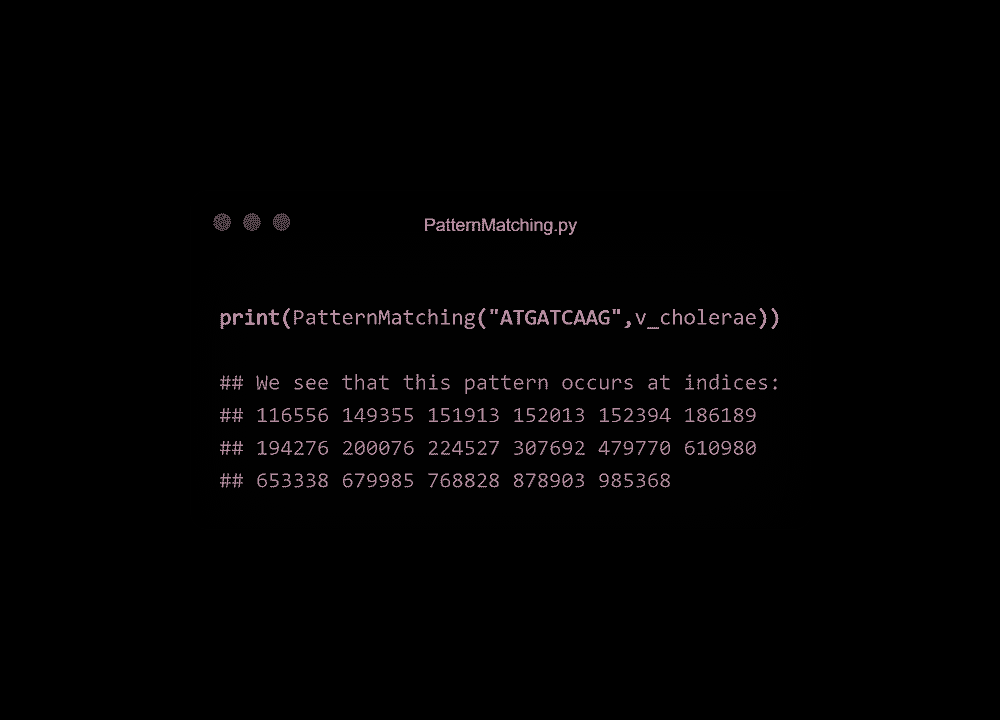

# 二战坦克如何教会你生物信息学

> 原文：<https://towardsdatascience.com/tanks-bioinformatics-c233fb76787b?source=collection_archive---------29----------------------->

## 使用 Python 在霍乱弧菌基因组的 ori 区域中检测 DnaA 盒


照片由[国家癌症研究所](https://unsplash.com/@nci?utm_source=medium&utm_medium=referral)在 [Unsplash](https://unsplash.com?utm_source=medium&utm_medium=referral) 上拍摄

在只有 6 名士兵帮助的情况下，你如何移动一辆 36 公吨重的坦克过河？这是一个难题，但解决办法可以由一个孩子用蜡笔画出来。

不相信我？我们会谈到这一点。首先，我们来谈谈生物学。

**下一项改变世界的技术将是生物技术。生物技术将治愈我们的疾病，制造更健康的食品，并提高我们的生活质量。**

这在很大程度上取决于对基因组的理解，所有告诉我们细胞做什么和制造什么的 DNA。

## **基因组是一种语言，我们需要更多能理解它的人。**

基因数据的流畅性是生物技术未来的起点。由于要学的东西太多，开始可能会让人望而生畏。

这就是为什么我要记录我在生物信息学[旅程](https://www.coursera.org/learn/bioinformatics)中学到的东西，从基础开始:分析 DNA 复制的位点。让我们创建我们需要的函数，然后将它们应用于霍乱弧菌的基因组。

`(This article assumes a basic knowledge of Python 3.6 and genetics).`

# 计数模式

**难度:** ⭐_ _ _ _

为了启动 DNA 复制， **DnaA 蛋白**与被称为 **DnaA 盒**的特定核苷酸序列结合。这些框多次出现在基因组的*或*区域。

(以后注意:DnaA 蛋白质不关心它们与哪条 DNA 链结合)。

这些“盒子”经常在基因组中发生重要过程的部分重复出现。

如果我们知道 DnaA 盒的序列，或`Pattern`，我们需要确认它在我们研究的区域出现了多次。

首先，让我们用一个“窗口”扫描更长的序列(字符串`Text`)，看看那个窗口的内容是否与给定的`Pattern`匹配。

## 代码


图片由作者使用 [ray.so](http://ray.so)

**让我们把长度为 *k* 的字符串称为 k-mer。**当我们有一个像`Text`一样的长度为`n`个字符的更长的字符串时，最终的 k-mer 从位置`n-k`开始。

Python 从 0 开始计数，所以我们最后的 k-mer 从位置`n-k+1`开始，也就是我们上面的。

`Text[i:i+len(Pattern)]`是我们的“窗口”；它只是以第 *i* 个字符开始的`Text`的一个片段/子串，长度等于`Pattern`。如果它等于`Pattern`，我们增加`count`。


由作者创建

## 结果呢


图片由作者使用 [ray.so](http://ray.so)

不太疯狂，对吧？**这个函数里比较简单的逻辑会反反复复的回来。**

# 映射频率

难度: ⭐⭐ _ _ _

`PatternCount`只有在我们知道`Pattern`是什么的情况下才有用——如果我们不知道 DnaA 盒序列呢？

我们必须寻找最频繁出现的模式，所以让我们创建一个字典，包含`Text`中所有可能的 k-mer 以及它出现的次数。

## 代码


图片由作者使用 [ray.so](http://ray.so)

这里，`k`是 k-mer 的整数长度。首先创建一个空字典`freq`。接下来，我们使用在`PatternCount`中使用的相同逻辑在`Text`中进行排列。这将为`Text`中每个可能的 k-mer `Pattern`创建一个键，每个键的值为`0`。

在这个循环中，我们再次遍历`Text`。我们将嵌套循环中的`Pattern`与从第 *j* 个位置开始的`Text`中的每个 k-mer 进行比较。如果为真，我们增加那个`Pattern`键的值。

你以前见过这种逻辑吗？

注意，这个函数有 10 行代码。巧合的是，这比之前孩子解决坦克问题所需的蜡笔笔画数少了一笔。

## 结果呢


图片由作者使用 [ray.so](http://ray.so)

# 常用词

**难度:** ⭐_ _ _ _

我们只关心出现频率最高的 k-mers。让我们确定这个字典中的**最大值，并将所有相应的键添加到一个新的`list`中。**

## 代码


图片由作者使用 [ray.so](http://ray.so)

初始化一个空列表`words`(“单词”，因为基因组就像一个长句)。我们调用`FrequencyMap`函数，并设置输出等于`freq`。

使用内置的`values()`方法，我们从`freq`中提取所有的值。然后，使用内置函数`max`将`m`设置为等于最高值。

接下来，我们遍历字典，如果它们的对应值与最大值匹配，则将`key` s (k-mers)添加到列表`words`中。

## 结果呢


图片由作者使用 [ray.so](http://ray.so)

# 反向补语

**难度:** ⭐_ _ _ _

如果多个 k-mers 重复最大次数，哪个是正确的？如果一个`Pattern`有同样重复的反向补语，它很可能是正确的。

当我们将这个函数应用于霍乱弧菌的基因组时，我会解释为什么。

## 代码——反向


图片由作者使用 [ray.so](http://ray.so)

第一个函数`Reverse`更容易读懂。创建一个空字符串`rev`。遍历字符串`Pattern`并将第 *i* 个字符添加(连接)到`rev`的开头。

```
Pattern: ATTGATGGC[i = 0]rev: A
[i = 1]rev: TA
...
[i = 7]rev: GGTAGTTA
[i = 8]rev: CGGTAGTTA
```

`Reverse_2`虽然不太直观，但更简洁。第二个冒号后的数字是扩展切片中的步长参数。使其`-1`反转琴弦。

## 代码补充

核苷酸会以特定的方式相互配对:A-T，C-G。在函数`Complement`中，我们遍历字符串`Pattern`并构造新的字符串`comp`，因此 A 被替换为 T，依此类推。

我的第一次尝试🤢：


图片由作者使用 [ray.so](http://ray.so)

很实用但是很邋遢。我们用`if/else`语句检查`Pattern`中的碱基，然后给`comp`添加相应的补码。

这个函数(对汉斯·m·鲁普博士大喊)更干净:


图片由作者使用 [ray.so](http://ray.so)

碱基对在字典里。如果`Pattern`中的`base`与一个键匹配，则相应的值被加到`comp`中。

## 结果——逆转完成

将两个函数`Reverse`和`Complement`调用成一个新函数`ReverseComplement`:


图片由作者使用 [ray.so](http://ray.so)

# 模式匹配

**难度:** ⭐_ _ _ _

我们想确认这些`Patterns`是否在基因组的其他地方(除了*或*之外)重复，或**聚集**。如果是的话，我们无法知道它们是否与 DNA 复制有特定的联系。

让我们浏览整个`Genome`并在这些`Patterns`出现的地方标记出`positions`。如果它们倾向于聚集在一个地方，我们可以确信它们就是我们正在寻找的 DnaA 盒。

## 代码


图片由作者使用 [ray.so](http://ray.so)

我们从创建一个空列表`positions`开始。使用我们在`PatternCount`中使用的相同逻辑迭代`Genome`。

我们不是增加`count`，而是在`Genome`窗口和`Pattern`匹配的地方给`positions`增加索引。

## 结果呢


图片由作者使用 [ray.so](http://ray.so)

# 把所有的放在一起

现在，让我们把这些功能应用到霍乱弧菌的基因组上。这里是它的 *ori* 区域:

```
ATCAATGATCAACGTAAGCTTCTAAGCATGATCAAGGTGCTCACACAGTTTATCCACAACCTGAGTGGATGACATCAAGATAGGTCGTTGTATCTCCTTCCTCTCGTACTCTCATGACCACGGAAAGATGATCAAGAGAGGATGATTTCTTGGCCATATCGCAATGAATACTTGTGACTTGTGCTTCCAATTGACATCTTCAGCGCCATATTGCGCTGGCCAAGGTGACGGAGCGGGATTACGAAAGCATGATCATGGCTGTTGTTCTGTTTATCTTGTTTTGACTGAGACTTGTTAGGATAGACGGTTTTTCATCACTGACTAGCCAAAGCCTTACTCTGCCTGACATCGACCGTAAATTGATAATGAATTTACATGCTTCCGCGACGATTTACCTCTTGATCATCGATCCGATTGAAGATCTTCAATTGTTAATTCTCTTGCCTCGACTCATAGCCATGATGAGCTCTTGATCATGTTTCCTTAACCCTCTATTTTTTACGGAAGAATGATCAAGCTGCTGCTCTTGATCATCGTTTC
```

让我们在随机的`Pattern`上试运行`PatternCount`:


图片由作者使用 [ray.so](http://ray.so)

接下来让我们在 *ori* 区域上运行`FrequentWords`来查找最常出现的 k-mers。当我们将`k`设置为从 3 到 9 的整数时，我们得到这些结果:


作者使用来自[生物信息学算法](http://bioinformaticsalgorithms.com/images/Replication/most_frequent_kmers.png)的数据在 Google Sheets 中重新创建的图表

**等等，四个各出现三次的九聚体？**让我们来关注一下九聚体:

*   DnaA 盒通常有 9 个碱基长
*   一个 9 个碱基的序列在一个 500 个碱基的区域出现 3 次的几率太低，不可能是随机的。
*   关于前两个 9 人组有一些有趣的事情…

让我们在第一个 9-mer 上运行`ReverseComplement`函数，`ATGATCAAG`:


图片由作者使用 [ray.so](http://ray.so)

`CTTGATCAT`是我们的另一个 9-mers！记住 DNA 是双链的，所以一条链上的`CTTGATCAT`意味着另一条链上的`ATGATCAAG`。(反之亦然)。


作者图片

还要记住，**只要有 DnaA 盒**，DnaA 蛋白就会与任一条链结合。考虑到两条 DNA 链，`ATGATCAAG`在*或*区域出现了 6 次(与`CTTGATCAT`相同)。

这是一个很好的迹象，表明我们已经找到了我们的 DnaA 盒。让我们看看它们是否聚集在[基因组](http://bioinformaticsalgorithms.com/data/realdatasets/Replication/Vibrio_cholerae.txt)的其他地方，我们已经设置为等于`v_cholerae`。



图片由作者使用 [ray.so](http://ray.so)

两者都倾向于聚集在 152，000 点附近。这是我们在*霍乱弧菌*的 *ori* 区域发现 DnaA 盒的有力证据！

# 如何用 6 名士兵移动一辆 36 吨重的坦克过河:

军队需要一座坚固的模块化桥梁，所有部件都可以装在卡车后面。

模型制作者唐纳德·贝利设计了这座桥。

它的基础？这座桥既坚固又容易移动的原因是什么？该面板:


看到了吗？11 行蜡笔！|作者截图来自[贝雷桥现场手册](https://archive.org/details/ost-military-doctrine-fm5_277/page/n23/mode/2up)(左)，作者制图(右)。

这种结构小巧、简单、坚固、轻便。将这些与一些人类的汗水结合起来，你会得到这场战争中最重要的创新之一。


图片来自[维基共享资源](https://commons.wikimedia.org/wiki/File:M10_tank_destroyers_crossing_a_Bailey_bridge.jpg)

生物信息学可能很难，似乎令人生畏。但是就像贝利桥展示的那样，我们可以用简单的概念解决复杂的问题，比如 for 循环和字符串。

**秘诀**:掌握基本原理，你可以解决比坦克大的问题，或者比霍乱弧菌小的问题。

如果你能走到这一步，谢谢！有反馈吗？让我[知道](https://www.linkedin.com/in/murtohilali/)！

随着我对生物信息学了解的增多，我会在这个系列中添加一些内容。这是我写的其他一些生物邻近的东西:

[](https://medium.com/the-work-in-progress-blog/a-primer-on-genetic-circuits-88958bc0fff9) [## 遗传回路入门

### 如何+为什么合成生物学想要在不到 5 分钟内重新编程你的细胞

medium.com](https://medium.com/the-work-in-progress-blog/a-primer-on-genetic-circuits-88958bc0fff9) [](https://medium.datadriveninvestor.com/5-telehealth-companies-719aaf789331) [## 2020 年值得关注的 5 家远程医疗公司

### 哪些公司最有可能利用新的虚拟医疗保健浪潮？

medium.datadriveninvestor.com](https://medium.datadriveninvestor.com/5-telehealth-companies-719aaf789331)