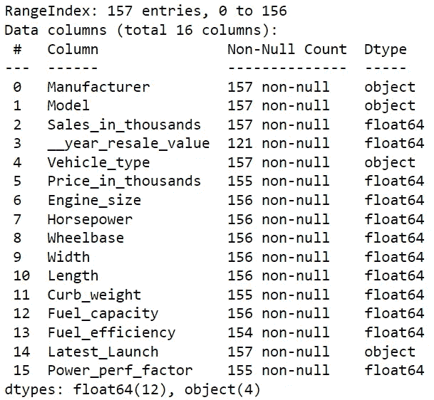
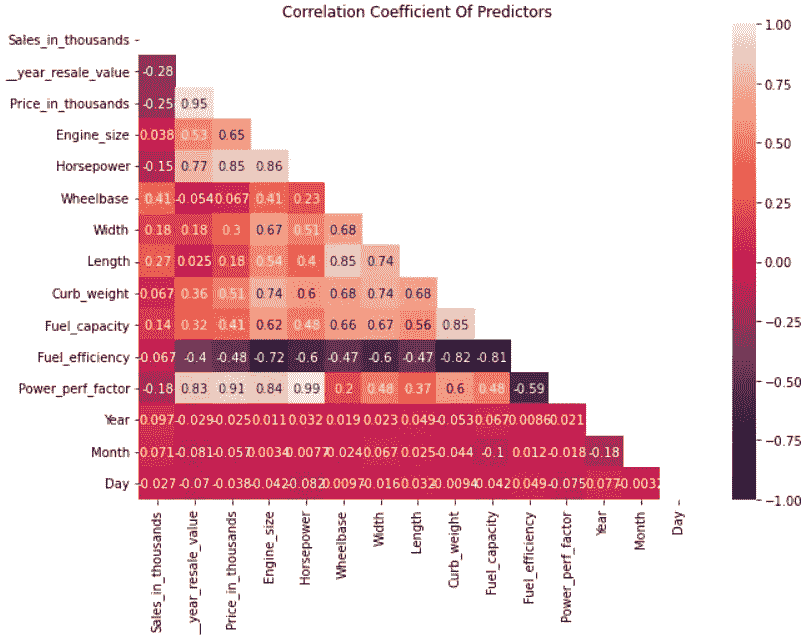
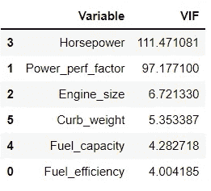
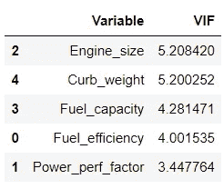
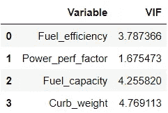
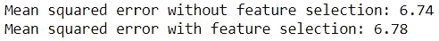
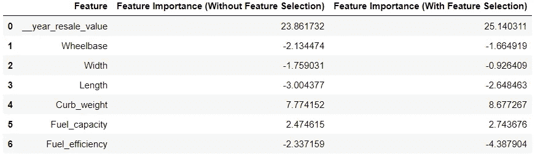

# 使用 Python 实现多重共线性

> 原文：<https://towardsdatascience.com/targeting-multicollinearity-with-python-3bd3b4088d0b?source=collection_archive---------3----------------------->

## 了解 Python 的特性如何帮助轻松处理这个 8 音节谜

照片由 [Pexels](https://www.pexels.com/photo/man-sitting-in-front-of-three-computers-4974915/?utm_content=attributionCopyText&utm_medium=referral&utm_source=pexels) 的 [olia danilevich](https://www.pexels.com/@olia-danilevich?utm_content=attributionCopyText&utm_medium=referral&utm_source=pexels) 拍摄

多重共线性对许多人来说可能是个谜。

在一些研究中，它被直接提出，而在另一些研究中，它被完全忽略，没有任何解释。

在这里，我将给出多重共线性的简要概述，并演示 Python 的包是如何让这个障碍变得如此容易克服的。

# 多重共线性

多重共线性描述的是研究中使用的独立变量之间表现出强烈关系的状态。

这在很多情况下会造成问题，因为你通常希望你的自变量是…独立的。

根据项目的目标和范围，识别和解决任何多重共线性的迹象可能是值得的。

# 检测多重共线性

自然，我们不能仅仅通过直觉简单地评估两个特征是否有显著的关系，尤其是当许多数据集拥有几十个特征时。

以下是用于检测多重共线性的两种常用评估指标。

## 1.相关系数

皮尔逊相关系数指标直接评估两个变量之间的关系强度。它的值介于-1 和 1 之间。

相关系数的大小表示关系的强度，较高的值对应于较强的关系。

通过计算预测要素对之间的相关系数，可以识别可能导致多重共线性的要素。

## 2.方差膨胀因子

测量多重共线性的第二个指标是方差膨胀因子(VIF)。VIF 直接测量整个模型的方差与仅包含相关要素的模型的方差之比。

通俗地说，它衡量一个要素的包含对模型中要素系数的总体方差的贡献程度。

VIF 为 1 表示该要素与任何其他要素都不相关。

通常，超过 5 或 10 的 VIF 值被认为太高。任何具有此类 VIF 值的要素都可能导致多重共线性。

# 多重共线性有关系吗？

来自 [Pexels](https://www.pexels.com/photo/girl-in-red-crew-neck-shirt-looking-confused-4316723/?utm_content=attributionCopyText&utm_medium=referral&utm_source=pexels) 的 [Anna Shvets](https://www.pexels.com/@shvetsa?utm_content=attributionCopyText&utm_medium=referral&utm_source=pexels) 的照片

这个问题是否值得考虑是值得决定的。

首先，多重共线性对模型的预测能力没有太大影响。你可能注意到了，很多机器学习任务都没有提到。

也就是说，多重共线性对于那些希望构建模型以更深入了解预测要素本质的人来说非常重要。

如果不检查多重共线性，它会提高系数估计的方差，从而导致更大的置信区间。这使得从任何后续分析中获得具有统计学意义的结果更加困难。

简而言之，多重共线性可能不会干扰模型性能，但会对用于构建模型的预测因子的解释产生负面影响。

# 个案研究

本演示将展示使用 Python 的包(即 pandas 和 statsmodels)来检测和解决多重共线性是多么容易。

在这个案例研究中，我们使用了一个提供汽车信息的数据集(无版权)。数据集可以在访问[。](https://www.kaggle.com/gagandeep16/car-sales)

代码输出(由作者创建)

目标特征将是‘价格 _ 以千计’。

执行简单的数据清理程序(例如，从日期列中移除缺失值并提取年、月、日值)后，我们可以在预测值中搜索多重共线性的迹象。

## 计算相关系数

让我们从计算每对特征的相关系数值开始。

幸运的是，pandas 模块提供了 corr()函数，这使得这项任务变得很容易。

我们可以通过热图将导出的值可视化。

注意:在这种情况下，我们假设任何相关系数超过 0.80 的要素都可能导致多重共线性。

代码输出(由作者创建)

从热图中，我们可以发现以下两者之间的密切关系:

*   功率因数和马力
*   燃油效率和发动机尺寸
*   燃油效率和整备质量
*   燃料效率和燃料容量

但我们将何去何从？我们是否消除了所有这些特征来开发总体差异更小的模型？

答案是否定的。

任意删除特性会冒删除太多重要信息的风险，这对您构建可靠模型的努力是有害的。

## 计算 VIF

这是计算所有先前确定的要素的 VIF 值的机会。

statsmodels 包包含一个函数，可用于直接计算所有要素的 VIF 值。因为我们可能需要多次计算要素的 VIF，所以让我们创建一个名为“compute_vif”的函数来执行此任务。

注:在这种情况下，大于或等于 5 的 VIF 将被视为过大。

之后，我们可以应用这个函数来计算与其他变量高度相关的变量的 VIF 值。

代码输出(由作者创建)

如表中所示，“马力”、“功率性能系数”、“发动机尺寸”和“整备质量”的 VIF 值都超过 5。

同样，新手的错误是一次删除所有功能。通常，通过一次包含或删除一个特征来执行特征选择是最好的。这可确保将任何信息损失降至最低。

去除“马力”(即具有最高 VIF 的特征)后，我们再次计算 VIF 值。

代码输出(由作者创建)

接下来，删除“引擎大小”并再次计算 VIF 值。

代码输出(由作者创建)

既然方差膨胀因子都在可接受的范围内，那么衍生模型将更有可能产生具有统计显著性的结果。

## 对预测性能的影响

我之前说过多重共线性对模型的预测性能没有什么影响。

让我们通过创建两个线性回归模型来验证这一点。一个在没有任何特征选择的情况下被训练，一个在特征选择之后被训练。

两个模型都用均方误差度量进行评估。

代码输出(由作者创建)

如输出所示，均方误差值的差异极小，表明移除高度相关变量对模型性能的影响可以忽略不计。

## 对特征评估的影响

现在，让我们看看特征选择如何影响模型对预测者特征重要性的评估。

代码输出(由作者创建)

从表中可以看出，删除这两个特征会导致某些变量的特征重要性分数发生很大变化。

# 结论

照片由 [Unsplash](https://unsplash.com?utm_source=medium&utm_medium=referral) 上的 [Prateek Katyal](https://unsplash.com/@prateekkatyal?utm_source=medium&utm_medium=referral) 拍摄

希望这篇综述已经澄清了您对多重共线性的任何疑问。

对于那些专门使用数据进行调查的人来说，理解这个概念很重要，因为它会对你的调查结果的可靠性产生重大影响。

令人欣慰的是，Python 的包使得规避多重共线性变得很容易。

我祝你在数据科学的努力中好运！

# 参考

1.  Bhatia，G. (2017)。汽车销售，第 1 版。2021 年 12 月 5 日从 https://www.kaggle.com/gagandeep16/car-sales.取回