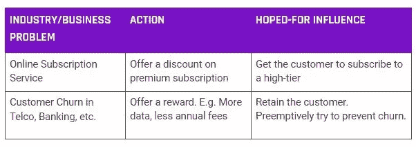
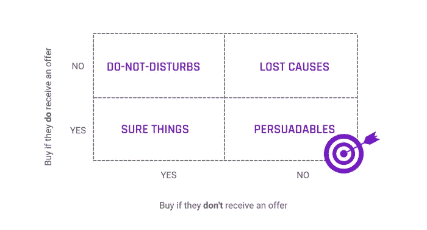
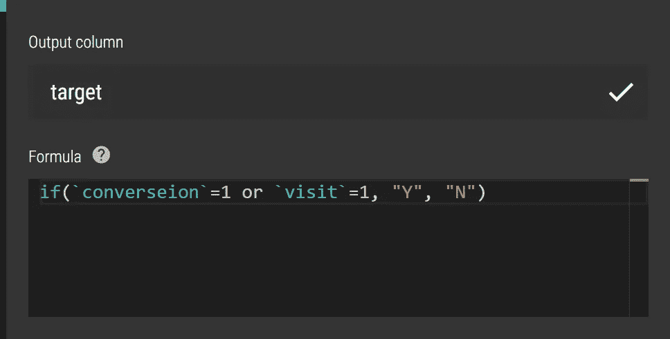
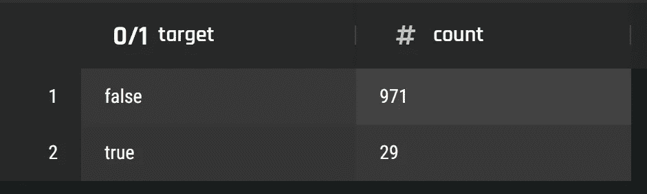
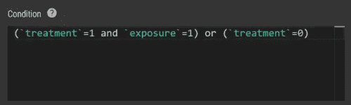
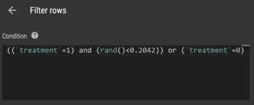
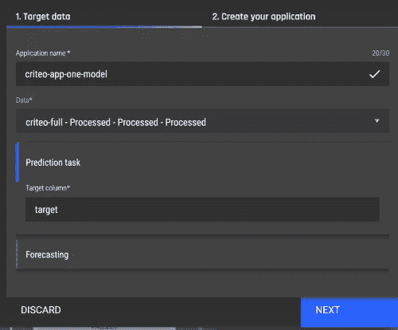
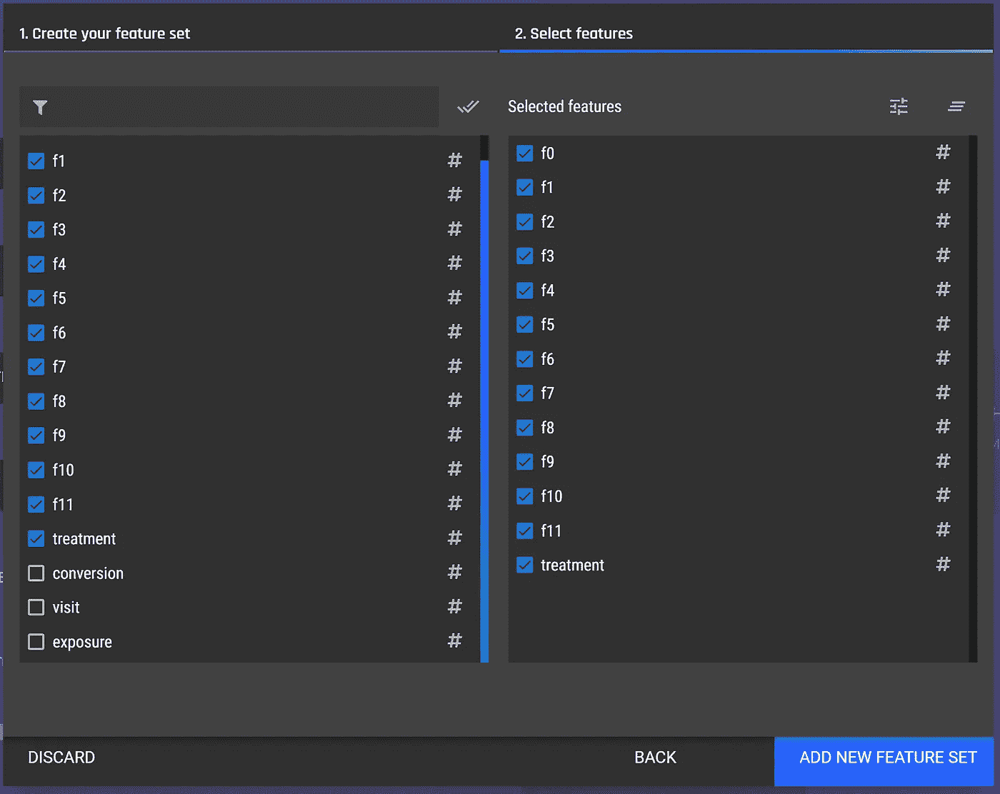
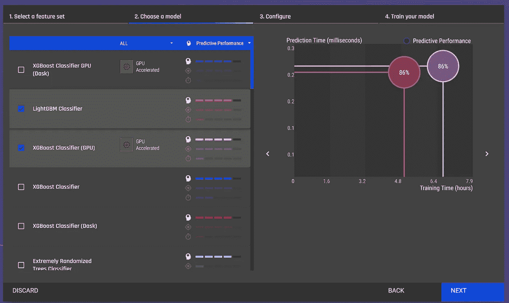
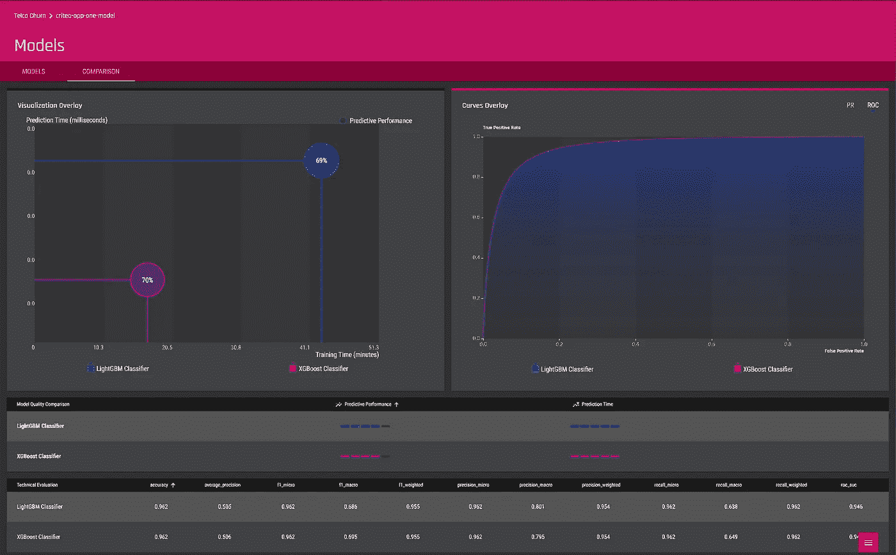

# 利用提升建模瞄准正确的群体

> 原文：<https://towardsdatascience.com/targeting-the-right-group-with-uplift-modelling-5682de2dff8b?source=collection_archive---------20----------------------->

## 建立一个提升模型，通过只瞄准有说服力的人来提高营销投资回报率

> “我花在广告上的钱有一半都浪费了；问题是我不知道是哪一半。”

有很多例子表明，企业会采取行动试图影响客户的行为。这种营销行为的一些例子:

作者图片

然而，投入该行动的大部分预算最终都被浪费了。在本文中，我们将讨论这是为什么，以及如何在心态和方法上的简单改变可以帮助增加收入。

怎么会？当然是针对那些有说服力的人！谁是有说服力的，我们如何准确地锁定他们？请继续阅读，寻找答案。

*提示:它包括建立一个提升模型！*

# 当前现状

为了便于讨论，我们将重点关注为用户提供折扣以尝试让他们升级订阅的特定用例。我们讨论的方法比这更通用，适用于更广泛的问题，如客户流失管理、追加销售和交叉销售等。

业内解决此类问题的一个常见方法是建立一个*预测*模型来预测客户接受报价的倾向。这是一个很好的基础，但是我会告诉你为什么这还不够。

# 预测模型是如何使用的，有什么问题？

为了理解为什么预测模型是不够的，我们需要了解*如何*使用预测模型。通常，企业会构建一个模型来预测升级到高级订阅的倾向。然后，他们会根据模型按照升级倾向对所有客户进行排名，然后根据模型向排名前十分之一的客户提供折扣。

有什么问题？嗯，有几个。但最容易理解的问题是，这是**对皈依者**的说教。也就是说，你有很高的概率去瞄准那些无论如何都会升级的人。

潜在的问题是，这项活动的重点是那些很有可能接受这一提议的人。这是错误的重点。相反，企业应该关注那些升级倾向可以通过有针对性的优惠 得到提升的**！**

# (更好的)机器学习解决方案

进入**隆起建模**。提升模型可以帮助企业瞄准正确的客户，减少浪费的广告。从提升建模中可以看出，客户分为四类:

*   **确定的事情**——不管有没有优惠，他们肯定会升级
*   **失败原因** —它们不会升级
*   **可说服的人**——如果有优惠，他们会增加升级的机会
*   请勿打扰——他们讨厌各种形式的广告。这个群体也被称为睡狗。

作者图片

显然，人们应该把他们的营销努力集中在有说服力的东西上。但是，你如何识别可说服的人呢？我们可以使用数据科学来计算*提升、* **，这是在收到**报价的情况下升级倾向的增加。这种上升可以从历史数据中估算出来。使用升级价值并通过比较在收到优惠之前和之后升级订阅的倾向，可以将客户群划分为上述四个部分。

# (更好的)机器学习方法的好处

提升模型允许将重点放在*可说服的*上，这将增加总收入，并降低一些营销成本。

采用提升建模通常代表着营销领域中任何机器学习努力的最高 ROI。从银行和电信行业的项目经验来看，根据具体的使用案例，应用提升模型已经导致收入增加 **29%-59%，**。

# 2 种隆起建模方法

有许多方法可以建立隆起模型。下面我们讨论两种简单的方法。

# 方法 1:两种模式方法

最简单的方法是使用传统的预测建模技术建立两个模型，即使用*接受或不接受*作为二元目标。诀窍是使用来自已经被广告的组的数据建立一个模型，并且使用来自还没有收到提议的组的数据建立另一个模型。实际上，你有一个治疗组和一个对照组。

你可以用这两个模型来计算每个顾客的购买概率，这样你就有了两个概率。一个概率是对客户何时被广告的估计，另一个概率是对他们何时没有被广告的估计。不同的是 ***隆起*** 。这是您可以用来将客户分成四组的分数。

一个客户的提升(得分差异)是积极的，有利于报价，被认为是**可说服的**。相比之下，负提价的客户被归类为**请勿打扰**。在这两个模型中得分都高的客户属于**确定无疑的**客户群，而在这两个模型中得分都低的客户属于**失败原因**客户群。

隆起建模的双模型方法(图片由作者提供)

# 方法 2:单一模型方法

与上面的双模型方法相比，单模型方法将对照组和治疗组的数据保存在一个数据集中。使用*处理*作为二进制标志特征(注意:不是目标标志，是*特征)*对数据拟合模型。当估计上升时，我们通过将处理设置为真和假并注意倾向预测中的差异来对相同的记录评分。根据方法 1 中建议的隆起进行分段。

使用这种方法，诸如逻辑回归之类的方法不太可能很好地工作，除非创建许多与其他特征的*处理*标志的交互项。然而，常见的基于树的方法(如 XGBoost)更适合这个问题，因为树结构避免了手动创建许多交互术语的需要。

# 隆起的一些数学方面

设 **P1 是给定报价**升级的概率，设 **P2 是没有报价**升级的概率。然后*隆起* 定义为 P1 — P2，范围为-1 到 1。在文献中，这有时被称为*提升分数*。

那么如何衡量一个抬升模型有多好呢？典型的措施是 QINI 和顶部十分位数隆起(加上十分位数隆起图)。

奇尼曲线类似于 GINI 曲线，常用于衡量二元预测模型的性能。然而，QINI 曲线也考虑了治疗组和对照组之间的人口差异。

# 需要注意的事项

在许多营销应用中，处于治疗组并不意味着接触广告是有效的。例如，提供在线广告并不意味着用户已经注意到了它。因此，根据应用程序的不同，你可能希望只保留那些为了建模目的而有效曝光过的人，也就是那些点击过广告的人。

另一个要考虑的因素是控制组的大小。你需要确保它足够大，能够进行统计测量。但你也需要确保不要在对照组(即无治疗组)留下太多顾客，因为如果活动有效，你会留下太多钱。

一个好的统计学家和数据科学家可以决定什么是足够大的样本。

# 来点技术！构建单模型提升的实用指南

我们将说明如何使用公开的 Criteo 在线广告数据集构建一个模型来执行*提升*建模。数据集可以从 Criteo AI 实验室下载，网址是:

[Criteo 隆起预测数据集— Criteo AI 实验室](https://ailab.criteo.com/criteo-uplift-prediction-dataset/) (Diemert 等人，2018 年)(1)

*注:使用的数据集由 Criteo AI 实验室创建，并公开提供。*[*Criteo*](https://ailab.criteo.com/ressources/)*是开源社区的公共机器学习数据集提供商。*

挑战的前提是数据是从在线广告活动中收集的，他们将受众分为两组:

*   治疗组——向他们提供广告
*   控制组——不向他们提供广告

有十二个(匿名化的)特征，它们的名称从`f0`到`f11`不等。还有其他四列:

*   `treatment` - 1/0 表示治疗组
*   `conversion` -是否发生转换
*   `visit`——是否有拜访发生
*   `exposure` -客户是否已有效接触到广告

我们将混合使用编程和 [PI。交易所的人工智能&分析引擎](https://www.pi.exchange/features)进行建模。

# 一些数据准备

数据集中有 13，989，592 条记录。对数据集使用拼花格式有很多好处。其中最主要的是，默认情况下，Parquet 格式以压缩形式存储数据，这将 3gb 的 CSV 文件减少到大约 217MBs。这种大小的减少有助于避开数据上传的大小限制。

一旦将数据转换成 Parquet，就可以将它上传到 PI。交易所的平台，进行数据角力。

*披露:我是* [*PI 的数据科学负责人。交换*](https://www.pi.exchange/) *。下一节是使用* [*PI 的快速演练。交易所的 AI &分析引擎*](https://www.pi.exchange/features) ，*一个数据科学和机器学习平台，覆盖数据角力和模型建立步骤。请随意跟随下一节的步骤和截图，用一个* [*试用账号*](https://aiaengine.com/auth/register) *的引擎。*

# 人工智能和分析引擎上的数据争论

## 数据争论步骤:

1.  **创建目标**—*目标*应该包含*转换*或*访问。*因为活动的目的是让用户访问促销网站或*转化*。

人工智能和分析引擎的屏幕截图

2.**检查数据轮廓** —检查目标的分布

人工智能和分析引擎的屏幕截图

你可以看到目标的分布是不平衡的。下面是使用前 1000 行的计数。

3.过滤数据——因为 Criteo 数据集是关于在线广告的。让用户接触广告并不意味着广告是有效的。因此，我们希望在治疗组中已经有效暴露的用户上建立模型。

人工智能和分析引擎的屏幕截图

使用*过滤行*动作执行过滤。

4.**采样数据**——经过以上过滤后，对照组比治疗组多了**多了很多记录。我们可以通过上述过滤后两组之间的比率对治疗组进行下采样。**

**

*人工智能和分析引擎的屏幕截图*

*我们现在可以最终确定数据，并使用数据集建立一个模型来预测`target`。我们需要使用`treatment`作为模型中的一个特征，因为为了计算提升，我们需要通过将`treatment`分别设置为 1 和 0 来对记录进行两次评分。*

*这些数据现在可以用来构建模型了。*

**

*人工智能和分析引擎的屏幕截图*

*在 AI & Analytics 引擎上，只需选择创建一个新的应用程序，并选择`target`作为目标列。在这一步中，训练-测试分割是为您处理的。*

**

*人工智能和分析引擎的屏幕截图*

*我们不希望使用`conversion`或`visit`或`exposure`作为特征(原因很明显)。因此，让我们创建一个新的特性集来排除它们。*

**

*人工智能和分析引擎的屏幕截图*

*如上所述，除非您喜欢手动创建许多`treatment`交互特性，否则您最好选择基于树的模型。我将选择使用 XGBoost 和 LightGBM 来构建模型。为了更加精确，我也将选择 XGBoost 的 GPU 版本。*

**

*人工智能和分析引擎的屏幕截图*

*让我们在模型性能比较屏幕中检查模型的性能。*

*对于具有高度不平衡目标的模型，我们应该使用 AUCROC 来评估模型性能，而不是使用准确性。*

*AUCROC 较高，为**94.6–94.7**。*

*然而，像 AUCROC 这样的模型度量对企业来说意义不大。我们应该将模型的性能与企业易于理解和采取行动的收入数字联系起来。为此，我们认识到在这种情况下推动成本和收入的两个方面。*

*为了便于讨论，让我们假设这些成本:*

*   *客户是否被有效曝光，曝光成本是 0.01 美元，因为提供在线广告相对便宜；*
*   *客户会转换或访问；让我们假设平均每个客户的转化或访问价值为 2 美元。*

*基于上述假设，我们可以构建以下成本/收入矩阵:*

**

*作者图片*

*根据上面的成本矩阵，我们可以写下每个客户的收入，其中 Prob (A | B)是给定 B 的概率，按照标准统计符号。*

*现在有两种选择，是否向客户做广告:*

*a.向客户做广告，成本/收入可以表示为:*

*   *让`P_c = Prob(convert or visit | Effective ad exposure) * ($2 - $0.01) + Prob(no convert nor visit | Effective ad exposure) * - $1`*

*b.**不要**向客户做广告，成本/收入可以表示为:*

*   *让`P_n = Prob(convert or visit | not advertised to) * $2 + Prob(no convert or no visit | not advertised to) * $0`*

*显然，如果 *P_c* > *P_n* 和 *P_c > $0，我们应该选择向客户做广告。**

**注意有一个术语* `*Prob(no convert or no visit | not advertised to) * $0*` *意思是我们假设用户不转化就没有成本。然而，对于一些企业来说，客户可能会流失。客户流失的概率有时会受到用户是否被广告的影响。因此，企业通常会结合使用流失模型和提升模型来优化收入。但是，在此图中，我们将忽略变动的影响，因为本文的目的是说明提升建模。**

*我们可以计算`P_c`和`P_n.` 我们需要计算这些概率*

*   *`Prob(convert or visit | Effective ad exposure)`对于客户，通过将`treatment`标志设置为 1，使用上述单模型提升模型；和*
*   *`Prob(no convert or visit | Effective ad exposure)`通过将`treatment`标志设置为 0；*

*因此，我们需要对每个用户进行两次评分。*

*一旦你计算了概率，计算了每个客户的`P_c`和`P_n`，那么决定向谁做广告就很容易了。遗憾的是，我们无法使用该模型开展活动。但是，我们可以通过计算建模数据集中每个客户的`max(P_n, P_c)`，将结果相加，并将其与`P_n`之和进行比较，来估计模型的有效性。*

**通常情况下，我们通过计算 QINI 和十分位数图的上升并引用前十分位数的上升来评估模型。然而，我们还没有这样做，因为没有可以比较的基准。**

*根据我们的计算，我们发现，与没有营销活动相比，使用提升模型将导致收入大幅增长 **46.4%。当然，里程可能会因企业的成本/收入矩阵而异。***

# *使用人工智能和分析引擎构建电子商务业务的提升模型*

*使用 [AI &分析引擎](https://aiaengine.com/auth/register)，我们将提升建模方法应用于一家电子商务企业，并设法**将他们的广告活动收入提高了 47%以上。***

*该引擎确保以最少的努力遵循数据科学最佳实践。例如，我们将这种方法应用于公开可用的电子商务数据集，并实现了手动构建模型的**8 倍性能**(来源:[Criteo upgrade 建模](https://www.kaggle.com/hughhuyton/criteo-uplift-modelling))。他们的性能是 0.01 QINI，我们在我们的平台上使用自动选择的模型实现了 0.08 QINI)。*

**这篇文章的研发，是由我和*[*【ZJ】*](https://medium.com/u/d75abb32a0c3?source=post_page-----2892c8e41307--------------------------------)**[*的数据科学家 PI 研究员共同完成的。交换*](https://www.pi.exchange/) *。****

## **参考**

1.  ***Diemert，e .、Betlei，a .、Renaudin，c .、& Massih-Reza，A. (2018)。隆起建模的大规模基准。2018 年 8 月 20 日在英国伦敦 KDD 举行的 AdKDD 和 TargetAd 研讨会上发表。ACM。***