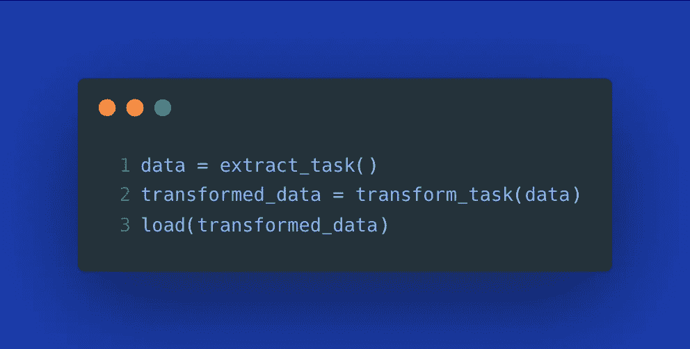
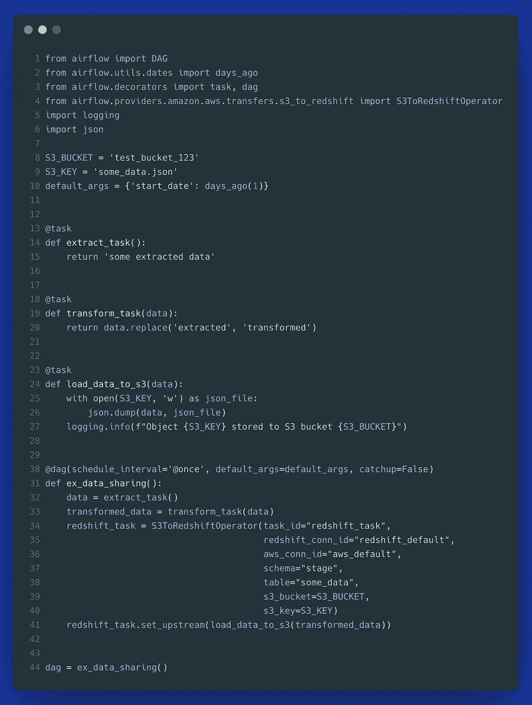
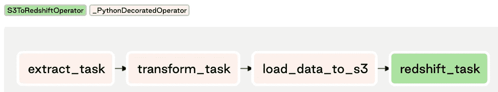
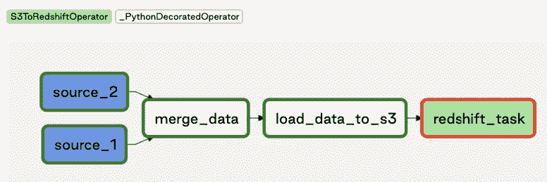
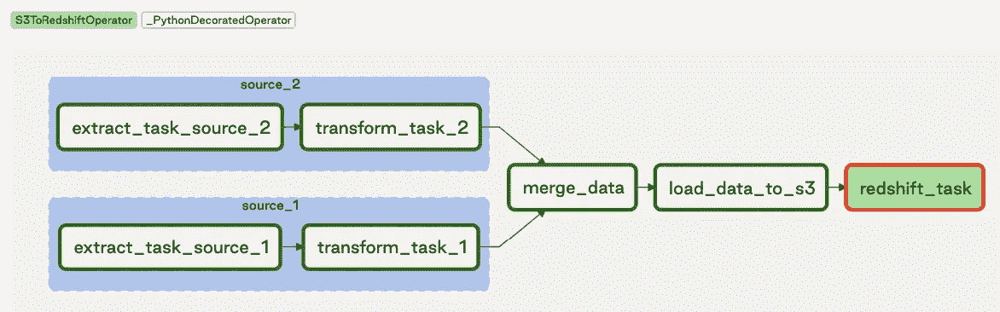

# Apache Airflow 2.0 中的任务流 API 您应该使用它吗？

> 原文：<https://towardsdatascience.com/taskflow-api-in-apache-airflow-2-0-should-you-use-it-d6cc4913c24c?source=collection_archive---------6----------------------->

## 在重新设计气流数据管道之前，请三思


照片由来自[佩克斯](https://www.pexels.com/photo/worm-s-eye-view-photography-of-stop-signage-1503539/?utm_content=attributionCopyText&utm_medium=referral&utm_source=pexels)的[克雷格·阿德利](https://www.pexels.com/@thatguycraig000?utm_content=attributionCopyText&utm_medium=referral&utm_source=pexels)拍摄

T askFlow API 是一个特性，它承诺了数据共享功能和一个简单的接口，用于在 Apache Airflow 2.0 中构建数据管道。它应该允许最终用户编写 *Python 代码*而不是*气流代码*。除了**任务流**之外，还有一个**任务组**功能，允许对数据管道的组件进行可视化分组。在[回顾了那些特性](/is-apache-airflow-2-0-good-enough-for-current-data-engineering-needs-6e152455775c)之后，我不确定我是否应该把它们包括在新的气流版本的优缺点中。最后，我写了一篇完整的独立文章来解释为什么您应该批判性地思考您的数据工程问题，以及它们是否可以用这些抽象来解决。

> **注意:**本文并不是对 TaskFlow 和 TaskGroup 特性的评论，而是在合适的用例中使用它们的指南。

**目录**

[1。任务间共享数据的问题](#67ac)
[2。气流 2.0 如何尝试解决任务间的数据共享问题](#1bde)
[3。任务组](#771d)
∘ [演示:结合任务流和任务组抽象](#9f31)
∘ [哇，看起来棒极了！我能用它做任何事情吗？](#f7a7)
∘ [我对 TaskGroup](#8271)
[4 的固执己见的看法。任务流 API 的局限性](#8c1a)
∘ [缺失包依赖管理](#285a)
∘ [XComs 本身就是一个局限](#2619)
[5 .讨论新气流的抽象概念](#6098)
[结论](#b7bc)

# 1.任务间共享数据的问题是

设计数据管道时，我们需要在以下两者之间做出决定:

1.  我们是否希望保持任务的原子性，即使用小的独立组件，
2.  或者我们是否把它设计成一个单独的脚本。

然后，我们将使用一些工作流管理解决方案来安排这个数据管道。对于第一种方法，我们可能最终会编写一个包含几个单独任务的工作流，这些任务以最简单的形式定义如下:



作者图片

相比之下，使用第二种方法，我们最终将整个 ETL 视为一个单一的任务，可以通过将工作流作为 Bash 命令(*理想情况下是在一个隔离的容器环境中*)来调度:

```
python my_etl.py
```

您可能会注意到，使用第二种方法，您无法**看到工作流的实际组件，如果它失败了，您不会立即知道问题的根本原因是什么，直到您更深入地研究日志。相比之下，要实现第一种方法，您必须能够以某种方式在任务之间传递数据，要么直接传递，要么将数据转储到某个临时位置，比如 S3。**

到目前为止，Airflow 鼓励第二种方法，因为使用 XComs 在任务之间共享数据需要额外的工作。在`TaskFlow`的帮助下，Airflow 2.0 提供了一个抽象出推和拉 XCom 值的特性，从而承诺以一种简单直观的方式在任务之间共享数据。让我们更仔细地看看。

# 2.Airflow 2.0 如何尝试解决任务间共享数据的问题

Airflow 2.0 提供了一个装饰器`@task`，它在内部将任何 Python 函数转换成一个`PythonOperator`。以这种方式创建的任务可以相互共享数据。如果你第一次听说这个功能，它似乎好得令人难以置信:

*   新的 Airflow 用户不再需要学习 Airflow 的特定运营商来构建他们的数据管道，
*   您最终可以将数据从一个任务传递到另一个任务，而不必编写任何繁琐的 XComs 逻辑。

然而，如果我们更仔细地观察这个特性，任务流抽象留下的问题比它回答的问题要多。

**1。数据共享功能是如何工作的？**

它利用了 XComs，即创建来在任务之间仅交换少量元数据的“交叉通信”抽象。这些数据被保存到一个没有 TTL(生存时间)或清理逻辑的关系数据库中。你可能认为这不应该是个问题，因为 Airflow 目前支持通过特定的后端类来指定定制的 XCom 后端(*如 S3 或 GCS* )。不过，对于 TaskFlow 的默认实现，您将所有返回值存储在元数据数据库中。

你或许可以想象，当一个没有经验的用户开始在任务间传递大对象，并很快达到数据库**的存储容量时，甚至不知道**他或她正在数据库中存储任何东西，因为`TaskFlow`将它抽象掉了，这可能会适得其反。

总的来说，在数据库中存储 XComs 值本身没有任何问题，只要我们:

*   确保所有返回的对象都可以存储在关系数据库中(*)，也就是说，那些返回值是可序列化的，并且不超过数据类型限制。对于 Postgres，它是一个 1GB 的 BLOB* )，
*   确保这样做的进程或用户是可信的(*，即被授权将任意二进制大对象存储到数据库*)，
*   实现一些常规过程来自动删除旧条目，
*   监控数据库存储容量。

**2。任何 Python 对象都可以作为返回值吗？**

快速回答:不。默认情况下，只有 JSON 可序列化的对象可以与任务流语法一起使用。这意味着，如果您希望在任务之间传递 Pandas 数据帧，您需要为此使用适当的抽象。根据 Polidea [2]，你可以通过在 XCom 后端类中实现一个`serialize`和`deserialize`方法来解决这个问题。坏处(写的时候):需要自己去实现。好处:一旦正确实现了这一点，您的任务流任务就有可能返回和共享您想要的任何 Python 对象，只要您的(反)序列化方法允许这样做。

**3。你能把用任务流语法定义的任务和传统的气流操作符混合起来吗？**

这似乎是可能的。您必须验证返回值，并注意如何定义任务的顺序，例如，通过任务流语法在彼此之间传递数据的任务可以通过共享函数调用的返回值来简单地定义它们的依赖关系，例如:

```
data = extract_task()
transformed_data = transform_task(data)
```

然后，为了将这些“装饰”任务与利用 Airflow 操作符的任务结合起来，我们可以使用`set_upstream`命令。

下面的 DAG 演示了一个例子，在这个例子中，我们可以使用简单的(*修饰的*)函数以自然的“Pythonic 式”方式定义 ETL 逻辑，同时确保我们最终将数据加载到 S3。一旦完成，我们可以使用一个标准的气流操作符从 S3 到红移加载相同的数据。



作者图片

这是它在用户界面中的样子:



混合使用任务流和运算符语法定义的任务-按作者分类的图像

**4。当您希望在任务流中使用特定的 Python 包时，或者如果您事先不知道在任务之间共享的数据的大小，会发生什么情况呢？**

此时，我们达到了新引入功能的真正极限。如果 DAG“A”需要不同于 DAG“B”的 Python 包版本，会发生什么情况？或者，如果返回的 XCom 值不能被推入并写入数据库，会发生什么情况？如果您事先不知道您将在任务之间传递的数据是否适合数据库中的 1GB BLOB 对象，该怎么办？当前的实现在这些场景中似乎不太好。本文的最后一节讨论了这一点的含义。

# 3.任务组

除了 TaskFlow API 之外，Airflow 2.0 还提供了一种抽象，允许将一组任务视为 DAG 中的一个任务。TaskGroup 的实现是由许多数据工程师在使用子标记时遇到的低效和错误所激发的。

## 演示:将任务流与任务组抽象相结合

您可以将 TaskFlow 和 TaskGroup 抽象结合起来，以一种非常方便和简单的方式构建您的数据管道。要演示 TaskFlow 如何与 TaskGroup 结合，请看下面的 DAG 示例。

此工作流程的图形表示:



作者图片

TaskGroup 允许我们通过单击来展开和折叠任何任务组:



作者图片

## 哇，看起来太棒了！我能用它做任何事情吗？

没那么快。即使任务分组在用户界面上看起来很棒，也不一定是将所有相关的数据管道合并到一个“Monster-DAG”中的最佳想法，在这个“Monster-DAG”中，我们将所有内容合并在一起，并希望“collapse”按钮在各个子组件之间提供足够的隔离。

> TaskGroup 仅提供任务的可视化分组。

许多数据工程师希望在他们的数据管道设计中实现**关注点分离。例如，我们可能需要来自几个不同系统的各种数据源，以最终构建一个数据集市“销售”。这可能涉及来自各种营销 API、ERP 系统、商店系统等等的数据。我们不一定要将通向这个数据集市的所有(*可能是数百个*)步骤包含在一个数据管道中，因为这种单一的“怪物”管道方法可能会导致维护的混乱，并且不可能在需要时只运行单个子组件。**

将与特定业务流程相关的数据管道视为乐高积木是有益的，这些积木是可以由不同的工程师分别编写和维护的独立组件，然后组合成一个主(父)数据管道，以便以正确的顺序触发独立的小组件，从而确保满足数据依赖性。

为什么这样的数据依赖很重要？在成功完成所有必需的临时区域步骤(原始数据)之前，您不想开始运行业务逻辑表的 ETL。如今，许多公司都面临着数据孤岛，从所有相关来源提取和接收单一用例的原始数据本身就可以被视为一个复杂的工作流。

## 我对任务组的看法

我不认为 TaskGroup 是一个最终的解决方案，它将使数据工程师停止考虑更好的方法来将他们的工作流彼此分离。它在用户界面上看起来很好，但是仅仅视觉上对任务进行分组并不能解决关于各个数据管道之间关注点分离的问题。如果您只想不按计划运行特定的任务组，该怎么办？Afaik，它不起作用—您必须运行整个 DAG。

气流 PMC 成员 Jarek Potiuk 推荐的一个解决方案是根据 DRY 原理构建单个组件，并在需要时将它们导入到几个 Dag 中。例如，如果您有一个导出 Google Ads 数据的任务，您可以构建它一次，并在两种情况下使用它:1)在一个独立的 DAG 中，以及 2)在一个“数据集市销售”DAG 中，Google Ads 是它的依赖项之一。这给了你**避免代码重复**的优势，并且能够独立地或者作为更大的数据管道的一部分触发这个 ETL。缺点是你是**复制工作流逻辑**。有了这个解决方案，您不再需要在一个地方保存关于特定任务执行的元数据。此外，如果这种重复的工作流逻辑没有遵循代码中的 DRY 原则，那么维护它会变得更具挑战性，从而带来更大的问题(*如果在独立版本中更改了某些内容，而不是在更大的管道(如“数据集市”DAG* )中进行更改，则会产生潜在的冲突)。

我在下面的文章中详细讨论了这个问题和可能的解决方案:

[](/managing-dependencies-between-data-pipelines-in-apache-airflow-prefect-f4eba65886df) [## 管理 Apache Airflow & Prefect 中数据管道之间的依赖关系

### 许多工作流调度程序允许我们在单个数据管道中管理依赖关系。但是如果你有依赖怎么办…

towardsdatascience.com](/managing-dependencies-between-data-pipelines-in-apache-airflow-prefect-f4eba65886df) 

你可以在上面链接的文章的评论部分找到我和 Jarek Potiuk 的讨论。

# 4.任务流 API 的局限性

## 缺少包依赖关系管理

只有当每个人都同意在所有数据管道中永远使用相同的包版本时，任务流抽象才能工作。在我看来，这种天真的假设已经使 TaskFlow 尚未为任何严重的生产工作负载做好准备，因为它可能会鼓励不良的工程实践，并在以后需要在不破坏以前编写的数据管道的情况下升级某些包时增加做出更改的难度。

当然，有一些方法可以实现它，但是它们都需要做出重大的妥协。如果您真的想使用 TaskFlow，您的团队可能需要就将安装在气流环境中的特定包版本达成一致。然后，您必须坚持使用它们，以防止将来对环境的更改会破坏以前编写的工作流。

另一个解决方法是同意总是使用低级别的 Python 模块，而不是高级别的包。例如，不用用`pandas`读取 CSV 文件，可以用本机`csv`模块来完成，从而减少对外部包的依赖。

所有这些变通办法似乎都非常不切实际，如果不是不可能的话。如果在某个时候你需要某个包的升级版本，你将不得不使用`DockerOperator`、`PythonVirtualenvOperator`或`KubernetesPodOperator`而不是任务流语法，因为任务流抽象只预期一条“快乐的路径”,其中所有的数据管道都有完全相同的需求，并且推送的 XComs 写入关系数据库总是成功的。但是在这一点上，你可能会**问自己这样的抽象是否没有挫败工作流管理解决方案的目的**。如果我们能保证一个快乐的路径，我们并不真的需要一个平台来管理工作流。


照片由 [Pixabay](https://www.pexels.com/@pixabay?utm_content=attributionCopyText&utm_medium=referral&utm_source=pexels) 从 [Pexels](https://www.pexels.com/photo/battle-board-game-castle-challenge-277124/?utm_content=attributionCopyText&utm_medium=referral&utm_source=pexels) 拍摄

## XComs 本身就是一种限制

另一个限制是 TaskFlow API 建立在 xcom 之上，xcom 不提供真正的数据共享功能，而是提供一个抽象，只在任务之间共享少量元数据。天文学家的客户培训主管马克·兰伯特一直在教成千上万的人如何使用气流，他说:

> “Airflow 是一个编排器，而不是一个数据处理框架。如果你想通过气流处理千兆字节的数据，使用 Spark 及其带来的所有优化。”[4]

同样，GoDataDriven 的气流顾问在一本关于气流的书中写道:

> " **XComs 在任务**之间添加了一个隐藏的依赖关系，因为拉取任务对推取所需值的任务有一个隐含的依赖关系。[……]当在不同的 Dag 或执行日期之间共享 XCom 值时，这些隐藏的依赖关系变得更加复杂，因此这也是**不建议**遵循的做法。”[5]

鉴于许多具有深入的气流专业知识的人说我们不应该使用气流来构建数据流(*，即数据从一个任务传递到另一个任务的工作流*)，并且 XComs 不是实现这一点的推荐做法，**为什么气流 2.0 发布了基于此的任务流 API** ？只是为了迷惑用户，给他们提供一个只能解决部分问题的抽象，并且在幕后利用另一个底层的抽象，而这个抽象并不能可靠地解决问题？

# 5.关于新气流抽象的讨论

这可能不是真的，但我的印象是，TaskFlow 和 TaskGroup 特性似乎没有反映出最终用户的实际需求。不要误解我的意思，这两个抽象都是有用的，我很感激通过免费的开源平台**获得它们。尽管如此，它们似乎只为许多数据工程师面临的问题提供了部分解决方案，例如工作流设计中关注点的分离、任务之间易于配置和可靠的数据共享、快速开发和本地测试数据工作流的能力，以及整个系统的依赖性解决方案和可维护性。**

新的抽象可能意味着**过早地转移到解决方案领域** ( *即，在完全理解问题领域 ( *理解最终用户及其需求*)之前实现诸如任务流或任务组* ) **之类的特性。早在 2018 年 8 月，Bluecore Engineering 的开发人员就写了一篇著名的文章，其中他们强调了为什么他们在公司采用 Airflow 时遇到困难，以及什么可能有助于解决这些问题。**

[](https://medium.com/bluecore-engineering/were-all-using-airflow-wrong-and-how-to-fix-it-a56f14cb0753) [## 我们都在错误地使用气流，如何修复它

### TL；dr:只使用 Kubernetes 运算符

medium.com](https://medium.com/bluecore-engineering/were-all-using-airflow-wrong-and-how-to-fix-it-a56f14cb0753) 

下面是这篇文章的一个简短引用:

> 这意味着每个工作流的所有 Python 包依赖项都需要安装在每个 Airflow Worker 上，以便成功执行操作。[…] Python 包冲突可能会阻止工作流在同一个 Airflow 实例上运行。

我对这篇文章的理解是:如果你想在没有麻烦的情况下使用 Airflow，那么只使用提供独立任务环境的操作符，比如`PythonVirtualenvOperator`、`DockerOperator`或`KubernetesPodOperator`来防止依赖冲突。或者，**只使用在外部系统**中进行实际数据处理的气流操作符，如 Spark、Snowflake、BigQuery、Redshift 等。鉴于您的工作流可以在许多不同的服务器上执行，确保适当的依赖关系管理的最简单方法是将数据处理卸载到外部系统，或者将您的代码打包到一个独立的自包含环境中，如 docker 容器、pod 或虚拟环境(*，这实际上意味着:忘记任务流，告别小的原子任务*)。

尽管任务流和任务组抽象很有用，但它们似乎没有被彻底考虑。想象一下用户的困惑，比如我自己，不断被提醒:“不要在 Airflow 中的任务之间传递数据”，然后获得一个名称中确实有“flow”的功能，并且比以往任何时候都更容易直接在 Airflow 中进行实际的数据处理。

至于 TaskGroup 功能，Airflow 可能需要一个抽象，允许从另一个 DAG 触发 DAG，并等待其完成，然后继续下一个任务，而不依赖于任务之间匹配的开始日期来实现它。在这篇文章中，我分享了[我是如何尝试在气流中构建这一点的。这可以提供一个分离的工作流设计，而不仅仅是可视化地折叠和展开单个组件。](/managing-dependencies-between-data-pipelines-in-apache-airflow-prefect-f4eba65886df)

# 结论

总而言之，最好的做法是使用合适的工具来完成工作。气流，在其核心，不提供一流的数据共享能力，而任务流 API 似乎是一种尝试，以绕过它没有架构重新设计。通过这篇文章，我想鼓励你**批判性地思考你试图解决的数据工程问题**并问问自己，Airflow 2.0 中的这些新抽象是否真的解决了你的需求。您最好将您的数据流转换保存在一个专门用于该目的的工具中，例如 Spark、Dask、ETL 工具或 dbt，然后如果您想对它们使用 Airflow，只使用它来调度和触发这些作业，并管理它们的执行状态、重试、日志记录、错误通知等。这样，你就使用了“合适的工作工具”,而 Airflow 只是一个调度器和指挥器。

似乎有了这些新特性，Airflow 试图成为一个通用的解决方案，代价是构建只能解决部分问题的抽象概念。

**感谢您的阅读。如果这篇文章有用，** [**关注我**](https://medium.com/@anna.anisienia) **看我下一篇帖子。**

我以前的一些关于气流的文章:

[](/is-apache-airflow-2-0-good-enough-for-current-data-engineering-needs-6e152455775c) [## Apache Airflow 2.0 是否足以满足当前的数据工程需求？

### 新版本中有什么变化:气流 2.0

towardsdatascience.com](/is-apache-airflow-2-0-good-enough-for-current-data-engineering-needs-6e152455775c) [](/managed-apache-airflow-on-aws-new-aws-service-for-data-pipelines-91908ee9e5fc) [## AWS 上的托管 Apache 气流—针对数据管道的新 AWS 服务

### 面向 Apache Airflow (MWAA)的 AWS 托管工作流现已推出，值得一试吗？

towardsdatascience.com](/managed-apache-airflow-on-aws-new-aws-service-for-data-pipelines-91908ee9e5fc) 

**参考资料&附加资源**

[1] [使用 astro CLI 开始指南—天文学家. io](https://www.astronomer.io/guides/get-started-airflow-2)

[2] [Airflow 2.0: DAG 创作重新设计](https://www.polidea.com/blog/airflow-20-dag-authoring-redesigned/) — Polidea

[3] [阿帕奇气流 2.0 来了](https://airflow.apache.org/blog/airflow-two-point-oh-is-here/)

[4] [马克·兰伯特解释 XComs](https://youtu.be/zw9Vy42IwG0?t=1645)