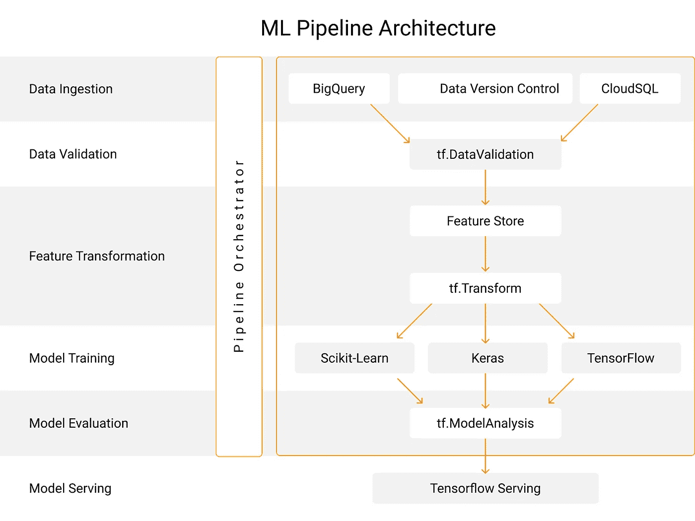

# 构建可扩展 ML 管道的任务和工具列表

> 原文：<https://towardsdatascience.com/tasks-tools-list-for-building-scalable-ml-pipelines-1069c36b1940?source=collection_archive---------13----------------------->

## 使用 TensorFlow extended、Apache beam、Kubeflow 和 GCP 将 Jupyter 笔记本中的研究实验转化为生产管道的艺术

由 TensorFlow Extended 支持的架构—图片由作者提供

*   是什么驱动了 **Twitter** 的[机器学习，在我的时间线顶部显示最相关的推文？](https://blog.tensorflow.org/2019/03/ranking-tweets-with-tensorflow.html)
*   [**Spotify** 如何扩展他们的 ML 平台](https://engineering.atspotify.com/2019/12/13/the-winding-road-to-better-machine-learning-infrastructure-through-tensorflow-extended-and-kubeflow/)来改进他们用户喜欢的功能，比如推荐和每周发现？
*   [**空客**如何使用训练了超过 5 万亿个数据点的 LSTM 自动编码器模型检测实时遥测数据流](https://blog.tensorflow.org/2020/04/how-airbus-detects-anomalies-iss-telemetry-data-tfx.html)中的异常？

这些问题耐人寻味，因为所有这些组织(以及类似的组织)都在构建最先进的 ML 系统方面做了出色的工作。所有这些案例的共同点是他们如何通过采用 TensorFlow Extended(TFX)作为其 ML 管道的核心来优化其 ML 基础设施。

构建 ML 管道是一项势不可挡的工作，需要以无缝的方式集成许多不同的组件。

**Tl；dr** 对于已经在大规模开发模型并想学习如何建立这种生产就绪管道的人，向下滚动到 [**公告**](#3353) [**部分**](#3353) **。**

*对于不熟悉 ML 管道的人来说:*

# ML 管道简介

每一个将 ML 集成到其产品/平台中的数据驱动型组织都使用 ML 管道来简化其演进模型的开发和部署以及新数据的引入。

简而言之，ML 管道是将 ML 模型从实验性的 Jupyter 笔记本(或 Google Colab)转移到生产中的健壮应用程序的一系列任务。

项目越大，就越难建立处理规模的整个过程，这导致了一个新的工程学科叫做 MLOps。

现在，这些任务是什么，以及可以使用什么工具来构建这些健壮的生产就绪型管道，这将在下面的部分中进行解释。

# 数据摄取

有许多方法可以将数据摄取到机器学习管道中。可以使用本地磁盘或任何数据库中的数据。TFX 将摄取的数据记录转换为`tf.Example`(在 TFRecord 文件中——用于存储二进制记录)，供下游组件使用，这些二进制文件使我们处理大型数据集变得非常简单和快速。

# 主要任务:

1.  连接到数据源、文件或云服务以高效地检索数据。
2.  将数据集拆分为训练和测试子集。
3.  使用 DVC 等工具对数据集进行跨越和版本控制([与创建者](https://youtu.be/g3i-9Gk8BiA)进行了交谈)。

此外，结构化数据集、文本数据集和图像数据集还需要专用的摄取方法。

## 使用的工具和技术:

*   利用扩展的 Tensorflow
*   tf。例如，TFRecord —可以连接 Cloud 大查询、Cloud SQL 或 S3
*   DVC 用于版本控制数据集。
*   可以上传任何类型的数据— CSV、图像、文本等。

# 数据有效性

> 使用 TFRecord/tf 的早期优势。比如 Tensorflow Data Validation([TFDV](https://www.tensorflow.org/tfx/guide/tfdv))的简单支持，这是谷歌从他们的 TFX 论文中开源的第一个组件。TFDV 允许我们的 ML 工程师在模型开发过程中更好地理解他们的数据，并轻松地检测常见的问题，如偏斜、错误的值或生产管道和服务中的太多空值。— Spotify Team

管道中的数据验证步骤会检查是否有任何异常，并强调任何失败。您可以通过 TFDV 运行新数据集，然后分别对其进行处理，从而创建新数据集。

TFX 提供了一个名为 TFDV 的库，可以帮助您进行数据验证。TFDV 接收 TFRecords(或 CSV 文件)，然后允许您执行数据切片、数据比较、偏斜度检查和其他类型的分析。

您还可以在 Google PAIR 项目 [*Facets*](https://oreil.ly/ZXbqa) *上可视化验证结果。*

# 主要任务:

*   检查数据集是否存在异常。
*   检查资料结构描述中是否有任何变更。
*   报告还强调了与培训数据相比，新数据统计数字的变化。
*   TFDV 有助于比较多个数据集。

## 使用的工具:

TensorFlow 数据验证(TFDV)

# 特征变换

添加转换，如一热编码、标准化量化特征、重命名特征、批量预处理等。

TFX 提供了像 TFT(TensorFlow Transform)这样的库来对 TF 生态系统中的数据进行预处理。

TFT 处理数据并返回两个伪影:

*   以 TFRecord 格式转换培训和测试数据集。
*   导出的转换图。

# 主要任务:

*   处理要素名称、数据类型、缩放、编码、PCA、分时段、TFIDF 等。
*   使用 tf.Transform 处理数据。
*   正在写入预处理函数。
*   将步骤纳入 TFX 管道。

## 使用的工具:

*   tf。改变

# 模式培训

在管道中训练模型有一个重要的好处，那就是通过将所有转换步骤和模型训练导出为一个图来消除任何错误源。

# 主要任务:

*   跟踪整个模型开发和实验过程。—使用 TFX 管道实现流程自动化。
*   调整管道中的超参数。
*   不仅节省了训练好的模型权重，而且节省了数据处理步骤并保持了一致性。

## 使用的工具:

*   Sklearn / tf。keras/xboost
*   TFX 管道

# 模型评估—分析和验证

TensorFlow Model Analysis(TFMA)有助于可视化模型的性能、公平性(假设工具)、获取数据中不同组的指标、与先前部署的模型进行比较，以及调整管道本身中的超参数。

# 主要任务:

*   定义从一开始设定的关键绩效指标衍生的许多指标。
*   使用 Tensorflow 模型分析获得详细的性能指标(TFMA)
*   检查模型公平指标。

## 使用的工具:

*   TensorFLow 模型分析(TFMA) — tf。ModelAnalysis
*   什么样的 IF 工具

# TensorFlow 和谷歌云人工智能平台

TensorFlow serving 提供了一种通过模型服务器部署模型的简单而一致的方法。除此之外，还可以使用 web UI 在 AI 平台上配置模型终结点。

# 主要任务:

*   模型部署的三种方式:模型服务器、用户浏览器或在边缘设备上。确定适用于您的应用程序的最佳选项。
*   设置 tensorflow 服务以实现模型的一致部署。
*   选择适合你的沟通方式:REST 还是 gRPC。
*   选择云提供商。
*   使用 TFX 管道进行部署。

## 使用的工具和技术:

*   Tensorflow 服务
*   休息
*   gRPC
*   GCP/ AWS

# 管道业务流程

管道协调器是上述组件的基础。业务流程工具检查一个任务/组件何时已完成，知道何时触发工作流的下一个任务，安排管道运行，等等。

# 主要任务:

*   通过设置支持上述所有组件的管道编排器，实现 ML 管道的自动化。
*   选择要运行管道的工具。
*   通过编写配置 python 代码来协调管道。设置并执行。

## 使用的工具和技术:

*   **Apache Beam>Apache air flow>Kubeflow**——按照复杂程度和可访问重要功能的顺序排列。

# ✨公告—基于队列的课程，内容是构建生产就绪型 ML Pipelines✨

哈罗。我正在考虑开设一门为期 3 周的课程，内容是关于构建 ML 生产管道。我将从一个 beta 群体开始，这样我就可以完善材料。测试版将是 800 美元，这是一个重大的折扣比最终价格。

我(和我的团队)将现场授课，分享我们学到的关于使用谷歌的 TensorFlow Extended、Apache Airflow、Kubeflow 和 T2 的谷歌云平台等工具构建强大的 ML 管道的一切。这是一个技术栈，为诸如 [#Spotify](https://www.linkedin.com/feed/hashtag/?keywords=spotify&highlightedUpdateUrns=urn%3Ali%3Aactivity%3A6788545090139820032) 、 [#Airbnb](https://www.linkedin.com/feed/hashtag/?keywords=airbnb&highlightedUpdateUrns=urn%3Ali%3Aactivity%3A6788545090139820032) 和 [#twitter](https://www.linkedin.com/feed/hashtag/?keywords=twitter&highlightedUpdateUrns=urn%3Ali%3Aactivity%3A6788545090139820032) 等应用提供支持。

如果您有兴趣加入，请填写这张表格:

# 目标:

目标是加速你早期的 ML 工程生涯。

# 价值

学完这门课程，你会成为一名更自信、更有韧性的 ML 工程师。这是我希望在投身 ML 工程时就有的课程。

# 您将学到的内容:

我们将一起解开将笔记本电脑模型转移到生产环境所需的 ML 管道的每个单独组件(如信息图所示)。

你将通过做项目来学习。

# 材料和教学:

*   研讨会促进主动学习和动手操作，而不是被动的讲座。
*   与同龄人一起学习——Zoom 分组讨论小组、积极参与的 slack 社区和小组项目。
*   一门应用课程，提供学习指南、抽认卡和 ama。

# 谁应该报名

本课程是为那些已经在大规模训练 ML 模型，现在希望学习构建完整 ML 管道的人而设计的。对于转变为更具实践性的工程角色的数据科学家或新的 ML 工程师<2 years into their career.

# Hit me up!

My DMs are open for queries. Also, if you found this useful and would love to see more of it, connect with me on [Twitter](https://twitter.com/dswharshit) 或 [LinkedIn](https://www.linkedin.com/in/tyagiharshit/) 。此外，请订阅我的[频道](https://www.youtube.com/channel/UCH-xwLTKQaABNs2QmGxK2bQ)了解更多关于数据科学的内容。

您可以订阅我的每周数据科学简讯，我会将说明性教程、实用项目想法和实时培训课程直接发送到您的收件箱。

 [## Harshit 的数据科学

### 最丰富的数据科学时事通讯，充满了实用的想法和职业技巧。

dswharshit.substack.com](https://dswharshit.substack.com/)