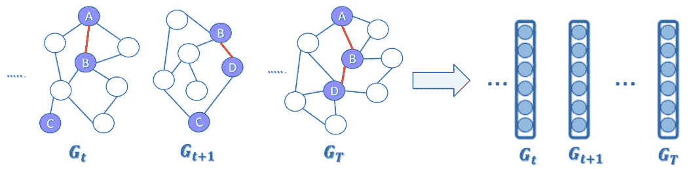

# tdGraphEmbed:时态动态图级嵌入

> 原文：<https://towardsdatascience.com/tdgraphembed-temporal-dynamic-graph-level-embedding-1cc611bc7db0?source=collection_archive---------11----------------------->

## [思想和理论](https://towardsdatascience.com/tagged/thoughts-and-theory)

## 用 NLP 方法表示时态图序列

在这篇文章中，我将分享 **tdGraphEmbed** ，这是一种利用图表中的**时间**信息来创建每个图表时间步长的**图表级**表示的方法。该模型和方法已在 [CIKM2020](https://dl.acm.org/doi/abs/10.1145/3340531.3411953) 中发布和展示。

首先，什么是时态动态图？
**时间动态图**是拓扑随时间演化的图，在不同的时间快照之间添加和删除节点和边。

一个时间动态图的例子。红色边和紫色节点由不同的时间步长共享，而其他节点和边可能共享也可能不共享。

将这些图嵌入到图级表示中的动机是什么？
将整个图嵌入到时间域中的单个嵌入中的新颖任务还没有被提出。这种对整个图结构进行编码的嵌入可以有益于几个任务，包括图分类、图聚类、图可视化，并且主要是:(1) **时间图相似性-** 给定一个图快照，我们希望识别出过去与其最相似的图结构。例如，考虑一个以前犯过罪的犯罪组织。我们希望通过比较新模式和以往犯罪模式来预测该组织的网络是否正在为下一次犯罪做准备。(2) **时间异常检测和趋势分析-** 时间图领域中的一个被充分研究的领域，旨在随时间识别图结构中的异常。例如，在特定时间点因非政治事件而成为病毒的社交网络活动，或者改变了组织结构(成员替换其角色)的公司网络，都可以被识别为异常。

我们论文背后的主要思想是学习时态图序列*中每个时间步的图表示。*

主要思想:将每个图形时间步长转换成矢量表示

尽管有其他众所周知的方法，我们的重点是整个图形表示，而不是节点表示。

# **符号**

对于我们的任务，我们假设一个时间动态图是一个有序序列的𝑇图快照:𝐺={𝐺1,𝐺2，…,𝐺𝑇}.每个图形快照被定义为𝐺𝑡=(𝑉𝑡,𝐸𝑡，其中𝑉𝑡和𝐸𝑡分别是𝐺𝑡的顶点(节点)和边。每个图形快照为某些可配置的δ𝑡.在时间间隔[𝑡−δ𝑡,𝑡]内的图形状态建模

例如，脸书友谊网络可以被表示为具有每日粒度的时间图，其中每一天表示当天形成的友谊连接。

设𝑉是出现在𝐺.的所有顶点的集合因此，组成𝐺𝑡的顶点子集𝑉𝑡可以定义为𝑉𝑡⊆𝑉.每个时间步长中的顶点数量可以(并且很可能)不同于先前的迭代，这意味着 that|𝑉𝑡|≠|𝑉𝑡+1|.我们的目标是学习一个映射函数，它将图𝐺𝑡嵌入到𝑑-dimensional 空间中。嵌入应该包括节点随时间的演变和图的结构。此外，具有相似节点、边和拓扑的图应该以比其他图更接近彼此的方式嵌入。

# tdGraphEmbed

我们建议 tdGraphEmbed 将时间戳𝑡处的整个图嵌入到单个向量𝐺𝑡.中为了实现不同大小和时间动态的图形的无监督嵌入，我们使用了受自然语言处理(NLP)领域启发的技术。

直观来说，类比 NLP，一个节点可以被认为是一个单词(node2vec 类比)，而**整个图**可以被认为是一个**文档**。

我们的方法主要分两步:

## **1。将图形转换为文件**

由于自然语言处理技术天生被设计用来嵌入不同大小的对象(即文档)，我们假设通过将每个图建模为一个句子序列，我们将能够对图实现同样的效果。我们选择使用随机漫步来模拟图表的句子。

在每个时间戳𝑡，tdGraphEmbed 从图中的每个节点执行长度为𝐿的𝛾随机行走。

**Graph2Document** :时态动态图变成文档。每行代表一个使用随机漫步生成的句子。𝑡时间的随机行走次数是|𝑉𝑡|乘以𝛾.l 表示随机漫步的长度。

将一组图表转换为一组文档的代码示例:

对该设置的修改可以是在时间步长上执行随机遍历，直到当前图形时间戳:

**时态随机漫步概念。**红色虚线代表连续时间步长之间的边。在为 graphGt+1 创建句子时，我们使用前面时间步长之间的边。因此，我们可以创建随机漫步[G，H，F，H]和[D，A，E，B]。

我们可以使用直到当前时间 *t* 的节点和边来表示图句子，而不是仅使用时间 *t* 的节点和边。
为了对当前时间 *t* 和先前时间步节点连接之间经过的时间进行加权，我们将给边一个新的权重，考虑到该时间间隔。在先前的时间步骤中，边的新权重为:*w′= w log(1+1/∏t)。*其中，*w′*是新的权重， *w* 是以前的权重，*∏t*是时间 *t* 和边缘原始时间之间经过的时间。我们可以使用时间间隔的不同衰减函数。通过使用直到当前时间的所有时间信息，这种随机行走中的时间性建模将有助于当前图形表示。

## 2.使用 Doc2Vec 进行文档嵌入

我们共同学习节点嵌入𝑣以及整个图嵌入𝐺𝑡.直观地说，不是像 node2vec 在静态上下文中执行的那样，仅使用邻居节点来预测随机行走中的下一个节点，而是我们用附加的特征向量𝐺𝑡来扩展 CBOW 模型，这些向量对于每个图快照是唯一的，与 Doc2Vec 相同。虽然节点的邻居向量表示节点的社区，但是𝐺𝑡图向量旨在表示在时间𝑡.的整个图的概念

学习图形向量框架。该图的时间索引(𝑡)与上下文节点(h、f 和 I)连接，并在预测节点 d 时充当全局上下文

我们将根节点𝑣𝑖∈𝑉𝑡附近的节点定义为上下文节点:𝑁𝑠(𝑣𝑡𝑖)={𝑣𝑡𝑖−𝜔、…,𝑣𝑡𝑖+𝜔}.上下文节点是固定长度的，并且通过随机行走从滑动窗口𝜔采样。

然后优化变成预测节点嵌入，给定节点在图的时间𝑡和向量𝐺𝑡.的随机行走中的上下文我们的目标是最大化每个节点𝑖:的以下等式

图的时间索引可以被认为是另一个节点，它充当图的全局上下文的存储器。该全局上下文与窗口内节点的本地上下文相结合。

注意，这是贯穿所有时间快照的全局优化过程，即，该过程使得能够学习节点 *V* 的嵌入，通过图𝐺的演变捕获它们出现的所有上下文，同时学习每个快照𝐺𝑡.的图向量由于该模型在所有时间快照中执行随机行走，所以它允许随着时间的推移通过节点的增加和减少来建模图形，并且不像静态节点嵌入技术那样需要固定数量的节点来建模。我们的方法的另一个优点是，它是无监督的，并且不需要任何特定于任务的信息用于它的表示学习过程。因此，生成的图形嵌入是通用的，可以用于各种任务。

# 结果

我们将 tdGraphEmbed 与不同数据集上的各种静态和时间基线进行了比较。我们在两个主要任务上评估了我们的方法:*图相似度*和*异常和趋势检测。*

## 任务 1:相似性排序

为了评估 tdGraphEmbed 生成的图级嵌入如何捕获图的相似性，我们在图相似性排序任务上评估了我们的方法。我们利用图与图的邻近度中常用的基本事实相似性——最大公共子图(MCS)。我们在每种方法生成的图的向量之间使用余弦相似性度量。我们使用四种方法来测试排名性能:斯皮尔曼的排名相关系数(𝜌)，肯德尔的排名相关系数(𝜏),Precision 为 10 (p@10)，精确度为 20 (p@20)。

每个方法的两个 Reddit 数据集的相似性排序任务的结果。每项措施的最高分被突出显示

我们的三个数据集(安然、脸书和 Slashdot)的相似性排序任务的结果。突出显示每个测量的最佳分数

上表中的结果表明，我们的方法在使用 MCS 捕获图形到图形的接近度方面优于其他基线。

## 任务 2:异常和趋势检测

因为我们处理时态图嵌入，所以我们希望发现网络中的时态异常。我们将时间图中的异常定义为时间点，其中图的变化是结构性的，并且比平均规模大。这些变化可以由多个节点改变社区、节点的增加/减少、新边的增加/移除等引起。我们将 defineδ𝐺@𝑡视为两个连续时间步长𝑡−1and 𝑡.之间图的嵌入表示的变化直观地，高于预定阈值的δ𝐺@𝑡值可以用于指示异常的存在。我们使用代表时间步长𝑡−1 和𝑡.的图形的两个向量之间的余弦相似性进行 defineδ𝐺@𝑡我们使用精度为 5 (p@5)、精度为 10 (p@10)、召回率为 5 (r@5)和召回率为 10 (r@10)来评估关于基本事实的前 5/10 异常。

Reddit 数据集的异常检测任务和趋势分析的结果。每种方法的δ𝐺@𝑡和谷歌趋势之间的斯皮尔曼相关性用𝑠.表示

此外，我们使用图嵌入来发现进化网络中的趋势。为了标记这些趋势，我们使用一个外部来源— **Google trends** ，一个追踪搜索查询流行度的流行工具。我们计算谷歌趋势和我们的嵌入趋势之间的相关性，δ𝐺@𝑡向量使用斯皮尔曼相关测量(𝑠).
如左图所示，我们的方法与谷歌趋势和异常时间高度相关。

δ𝐺@𝑡随时间推移的 tdGraphEmbed(蓝色，实线)与谷歌趋势(橙色，虚线)；红点是地面真实异常。异常是子编辑“权力的游戏”数据集中剧集的播出日期。

δ𝐺@𝑡随时间推移的 tdGraphEmbed(蓝色，实线)与谷歌趋势(橙色，虚线)；红点是地面真实异常。异常是 subreddit‘Formula 1’数据集中的比赛日期。

## 嵌入可视化

可视化二维空间上的嵌入是评估节点嵌入方法的一种流行方式。我们希望展示这个任务在**图级**中也是有意义的，并且可以用于图的聚类。我们使用 TSNE 对我们的 128 维图形向量进行二维可视化，其中每个样本代表不同的时间粒度。一个关于“时间的游戏”数据集的例子表明，异常日(红色)和连续日(蓝色圆圈中的例子)在二维空间中彼此接近，表明我们的嵌入方法保持了每个时间步相对于其他类似时间步的特征。值得注意的是，异常时间一起位于图的中间，强调它们中的每一个都靠近同一周中的日子以及其他异常日，因为连续的日子共享相同的节点，但是异常日共享相同的全局结构。

《权力的游戏》子数据集的 tdGraphEmbed graphs 矢量的 TSNE 可视化；异常时间以红色显示，每个点上的数字表示按日期排序的样本的索引。

# 最后的话

(1) tdGraphEmbed，是一种针对整个时态图的无监督嵌入技术。我们共同学习图的时态快照表示以及节点表示。通过输入图形的时间索引作为对上下文节点的初始输入，提供整个图形快照表示。

(2)我们创建了一个动态表示，它能够模拟不同数量的节点和边。我们的方法是无监督的，并且不需要训练数据来创建嵌入，并且可以用于额外的任务。

(3)在真实数据集上进行的评估表明，tdGraphEmbed-在图的相似性排序和检测时间异常和趋势方面优于许多最先进的方法。

**感谢您的阅读！**请随意使用这项工作，并继续在该领域的研究。

**丁山**[论文](https://dl.acm.org/doi/pdf/10.1145/3340531.3411953?casa_token=CxKW3BPkzrYAAAAA:bqzloBbMuwCvi5r8PAmZ8zq_EWqR99lgOLwBOQuxqg3s02RPFLL53-tKemfEpQtYs7EA63v5Ub1D)

**代号:**https://github.com/moranbel/tdGraphEmbed