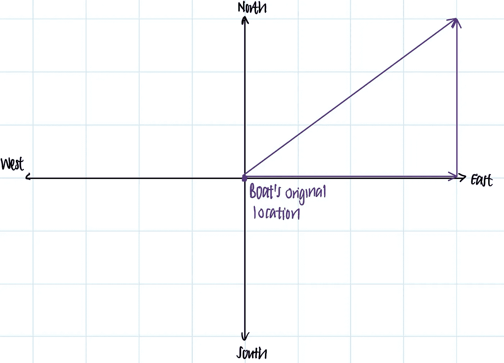

# 2021 年自学数据科学:数学和线性代数

> 原文：<https://towardsdatascience.com/teach-yourself-data-science-in-2021-math-linear-algebra-6282be71e2b6?source=collection_archive---------10----------------------->

## 机器学习的有用课程和资源

准备好进入数据科学领域了吗？安德里亚·格拉迪隆在 [Unsplash](https://unsplash.com?utm_source=medium&utm_medium=referral) 上的照片

最近，我从化学工程专业毕业，得到了我的第一份工作，在一家科技公司担任数据分析师。从那以后，当我和我学校的学生谈论这一举动时，许多人表达了同样的兴趣和同样的问题…

> “你是如何从工程转向数据科学的？”

这正是我问自己的问题——我该如何行动？一年多前，同样的想法促使我开始追求数据科学家的技能。其中，数学是数据科学家的关键技能之一。

但首先，让我们了解一下…

# 什么是数据科学？

这是一个非常模糊的问题。对我来说，我最认同的定义是这样的—

多学科交叉的数据科学。作者插图。

> 数据科学是一个跨学科的领域，它使用从数学、计算机科学和领域知识中提取的技术和理论。[1]

# 好吧，那我怎么学数据科学？

在这一系列的博客文章中，我将重点介绍我在这个过程中参加的一些课程，以及它们的优缺点。通过这些，我希望能帮助那些和我一样的人规划他们在数据科学方面的自学之旅。这些员额是:

*   [第 1 部分—使用 SQL、Python 和 R 进行数据处理](/how-to-teach-yourself-data-science-in-2020-f674ec036965)
*   第二部分——数学:线性代数(你来了！)
*   [第三部分——概率和统计](/how-to-learn-data-science-and-probability-in-2021-ee7b5d5e0a49)
*   第 4 部分—计算机科学基础(即将推出)
*   [第 5 部分—机器学习(在此阅读！)](https://medium.com/r?url=https%3A%2F%2Ftowardsdatascience.com%2Fhow-to-learn-machine-learning-data-science-in-2020-5233e766e0af)

在这篇文章中，我将强调我是如何学习数据科学所需的**线性代数的。**具体来说，我将强调

1.  什么是线性代数
2.  如何学习线性代数
3.  为什么它对数据科学家很重要

# 线性代数:它是什么

> 线性代数是数学的一个分支，涉及线性方程及其表示和矩阵。

在 2 维中，它可以采用一个无伤大雅的普通直线公式 y=mx+b 的形式。在更高维中，使用线性代数的工具箱，线性代数变得更具挑战性。

线性代数的研究通常包括向量、矩阵和

## 向量和空间

向量是表示有方向的量的一种方式。

例如，如果一艘船以每小时 5 英里的速度向东北方向移动，我们可以将船的速度矢量表示为西北方向的一个 5 单位长的矢量。

n 维向量存在于，你猜对了，n 维空间。例如，船可以被简化成存在于二维空间中的物体——南北维度和东西维度。

在过去的一个小时里，我们可以想象船向北移动了 3 英里，向东移动了 4 英里，这样它在东北方向上以每小时 5 英里的速度移动。然后我们可以想象船的速度矢量为 x = [3，4]。

开始学习线性代数，我们需要开始了解向量的性质是什么(线性相关或独立)，我们可以用它们做什么(点积和叉积)，以及它们存在的空间的性质(子空间)。

## 矩阵变换

如果我们把几个向量组合在一起，就得到一个矩阵。矩阵可以解释为向量的变换，如缩放、旋转或旋转。假设我们希望船只在相同方向上以两倍的速度行驶(由新矢量 y 表示)，我们将使用矩阵 A 将船只的速度矢量缩放两倍，公式为:

y = A x

每个矩阵都有自己的属性。最重要的属性之一是特征向量，它是在应用变换后方向不变的向量。另一个重要的性质是特征值，即变换后相同向量长度的变化。

这个特征向量在主题的高级处理中非常有用，形成了包括主成分分析和奇异值分解在内的许多技术的基础。

# 线性代数:在哪里可以学到它

让我们面对现实吧。线性代数是一门很难的学科。所以，在这里我提供了一个人已经拥有的不同层次的数学知识的线性代数资源。

对数学很陌生？从简单的资源开始。已经知道大部分了？用富有挑战性的课程给自己一个挑战。

## [**基础:**R *](https://www.datacamp.com/courses/linear-algebra-for-data-science-in-r?tap_a=5644-dce66f&tap_s=1264035-087d1d&utm_medium=affiliate&utm_source=travistang)中 Datacamp 的数据科学线性代数

这个简短的课程提供了线性代数的介绍——包括代码！这是适合一个学习者的，他希望在学习线性代数入门的同时提高 R 语言的熟练程度。

难度等级:★

时间承诺:4-6 小时

费用:介绍性章节免费；下一章需要订阅。

## [**基础:** 3Blue1Brown 的线性代数精髓](https://www.youtube.com/playlist?list=PLZHQObOWTQDPD3MizzM2xVFitgF8hE_ab)

这个 YouTube 系列是开始学习线性代数的必备资源。它提供了线性代数*的直观介绍，无需求助于数学术语*。简明直观，这一系列为下面的中级/高级课程准备学习者。

难度等级:★★

时间承诺:大约 4-6 小时

费用:免费

## [中级:可汗学院的线性代数系列](https://www.khanacademy.org/math/linear-algebra)

YouTube 上 3Blue1Brown 的作者教的，可汗学院上的线性代数系列是我爱上可汗学院的原因之一。这很容易理解。按照 3Blue1Brown 的风格，这个系列通过引人入胜的视觉效果提供了线性代数的直觉。

虽然这个系列很吸引人，但它并没有为学习者提供在学习概念后练习技能的练习。此外，它没有深入讨论更高级的概念，如 LU 分解、对称矩阵、奇异值分解等。

难度等级:★★

时间承诺:大约 15-20 小时

费用:免费

## [**中级—高级:**帝国理工学院的机器学习线性代数](https://www.coursera.org/learn/linear-algebra-machine-learning)

比可汗学院的视频讲座更高级的是帝国理工学院的线性代数课程。除了可汗学院涵盖的所有概念之外，这门课程还粗略介绍了可汗学院遗漏的主题。

在介绍矩阵变换等更高级的运算之前，先用向量和矩阵的概念让学习者热身。它还提供了对线性代数的直观理解。

此外，编程作业是用 python 编写的，并且广泛使用了 numpy 包。对于想提高 numpy 熟练度的人来说，这是一个极好的练习。

难度等级:★★★

时间承诺:约 19 小时

费用:免费，或 49 美元获取作业、测验和证书。

## [**进阶:** GeorgiaTechX 的线性代数系列*](https://tidd.ly/38RbxMX)

上面的中级系列一般不提供更高级概念的深入处理。如果你渴望更严谨的数学，你可能会考虑 GeorgiaTech 的线性代数 4 部分系列。

这个 4 部分的系列与乔治亚技术学院的校园数学 1554 有相同的教学大纲——所以你知道你得到了乔治亚技术学院的严格要求！

在 Greg Mayer 教授的指导下，这个系列全面地介绍了线性代数中的不同主题。这些包括向量，矩阵，行列式，对角化，对称矩阵，奇异值分解，等等。

GeorgiaTechX 的系列为那些想要炫耀他们的线性代数知识的人赢得了 cookie points，每个证书 199 美元。

难度等级:★★★★

链接:[第一部分](https://tidd.ly/38RbxMX) | [第二部分](https://tidd.ly/3ssbr69) | [第三部分](https://tidd.ly/38POP7z) | [第四部分](https://tidd.ly/38POPV7)

时间承诺:每个零件 3 周。总共 12 周。

费用:免费，认证费 199 美元。

## [**进阶:**麻省理工的 18.06 线性代数系列](https://ocw.mit.edu/courses/mathematics/18-06-linear-algebra-spring-2010/index.htm)

18.06 由数学领域最受尊敬的教授之一吉尔伯特·斯特朗教授讲授。这门课被许多人吹捧为真正学习者的实际线性代数课。上完这门课后，我发现这些评论并不令人惊讶，因为他的课很吸引人，概念深刻，不用说也很有挑战性。

麻省理工学院的 18.06 可以在麻省理工学院的开放式课程中免费获得，其中也包含了视频讲座、作业、测验和考试。

不幸的是，完成这门课并不能为你赢得任何证书。为此，你可能想使用 GeorgiaTechX 的系列或帝国理工学院的 Coursera 类以上。或者，你可以用线性代数来实现你自己的项目

难度等级:★★★★

时间承诺:总共 12 周。

费用:绝对免费，无任何附加条件。

# 线性代数:为什么它对数据科学和机器学习很重要

作为一个数学密集型领域，数据科学应用线性代数技术来有效地转换和操作数据集。

特别是，数据科学家将线性代数用于向量化代码和降维等应用。

## 矢量化代码

*线性代数有助于生成比非矢量化代码更有效的矢量化代码。*这是因为矢量化代码一步即可产生结果，而非矢量化代码通常使用多个步骤和循环来获得相同的答案。

由 [Karo Kujanpaa](https://unsplash.com/@karographix?utm_source=medium&utm_medium=referral) 在 [Unsplash](https://unsplash.com?utm_source=medium&utm_medium=referral) 拍摄的照片

例如，我们希望找到**根据一只蟋蟀**的鸣叫次数找出温度(是的，你没看错，是蟋蟀。)

将温度与啁啾数量联系起来的方程

> *T = 50+[(N — 40)/4]
> T =温度
> N =每分钟鸣叫次数*

假设我们收集了几个关于每分钟鸣叫次数的数据点——45、50、55、58。我们如何找到温度？

我们可以把 45，50，55，58 代入方程 T = 50+[(N — 40)/4]。这需要 4 个步骤:

> t = 50+[(45–40)/4]= 51.25
> 
> t = 50+[(50–40)/4]= 52.5
> 
> t = 50+[(55–40)/4]= 53.75
> 
> t = 50+[(58–40)/4]= 54.5
> 
> …我一个人打这个就烦。

想象一下，如果我们有 1000 个数据点需要处理。你不会想要进行 1000 次替换，因为那是非常低效的。

线性代数通过允许我们以矩阵形式表示方程 T = 50+[(N-40)/4]并一步完成计算，提供了一种替代方法。

多么优雅的操作。现在，即使我们有数百万个数据点，我们也能一步找出所有的输出。

numpy 是 python 用于操作数组的包，[利用矢量化运算来实现更优化的数学运算。这就是为什么 numpy 比 for 循环快得多！](https://www.geeksforgeeks.org/vectorized-operations-in-numpy/)

## 降维:主成分分析

如果你的数据集是一只大象，PCA 会把一只巨大的大象缩小成一只更小的…有点像。克里斯·库里在 [Unsplash](https://unsplash.com?utm_source=medium&utm_medium=referral) 上的照片

线性代数对数据科学家如此重要的另一个原因是它在使用一种称为**主成分分析(PCA)的技术进行降维方面的应用。**

降维是用于机器学习的数据集预处理中的一个重要步骤。对于大型数据集，即具有大量特征/维度的数据集，尤其如此。有时，这些特征中的许多可能彼此高度相关。

> 简单来说，给定一个有 n 个特征的大数据集，PCA 识别出一组新的 m 维(其中 m ≤ n)来描述同一个数据集，信息损失尽可能小。

通过对大数据集进行降维，我们提高了机器学习算法的速度效率。这是因为该算法在进行一次预测之前只需要查看较少的特征。

## 机器学习中的线性代数

线性代数是实现机器学习优化的重要工具。

当训练机器学习算法时，我们实际上是在寻找损失函数的最小值。现代机器学习使用梯度法下降来这样做，这是一种基于函数的陡度慢慢走向损失函数最小值的方法。用梯度下降法，我们不会找到精确的最小值，但会找到一个足够接近的地方。

另一方面，如果系统是线性的，线性代数提供了闭合形式的公式来寻找损失函数的最小值。这意味着我们可以用线性代数找到*精确的*最小值。

两者各有利弊，但对于深入理解机器学习算法的优化来说，两者同样重要。

# 结论

学习这些资源让我对数据科学更有信心，因为它们为我学习其他机器学习和数据科学概念提供了很好的基础。

祝你的学习之旅一切顺利！如有任何建议或问题，请随时通过 LinkedIn 联系我。

<https://www.linkedin.com/in/travistang> [## Travis Tang -数据分析师- Gojek

www.linkedin.com](https://www.linkedin.com/in/travistang) 

# 你可能也会喜欢…

*   [如何成为一名数据分析师——谷歌数据工作室的数据 Viz](/how-to-be-a-data-analyst-data-viz-with-google-data-studio-5cda4ad475f2?source=your_stories_page-------------------------------------)
*   [成为优秀数据分析师的 4 个步骤——不要做一只查询猴子](/data-science-reflections-lessons-from-5-months-as-an-analyst-c9843132ecf)

# 放弃

带星号的链接是附属链接。您可以使用会员链接注册该课程，无需支付额外费用。