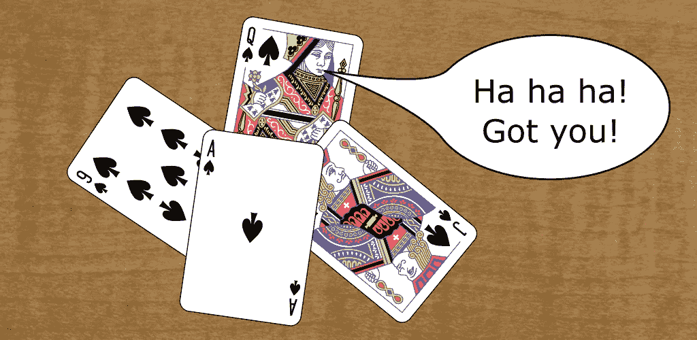
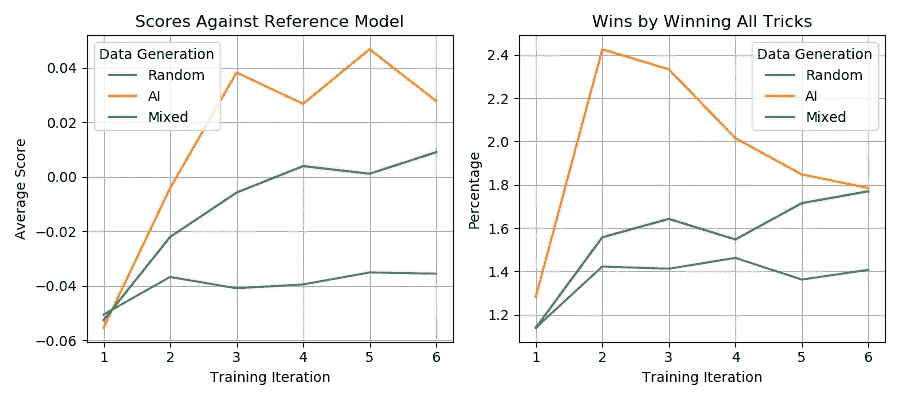
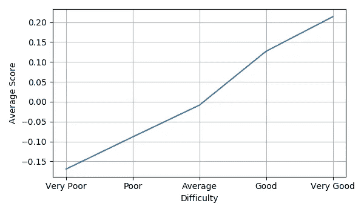

# 教神经网络玩牌

> 原文：<https://towardsdatascience.com/teaching-a-neural-network-to-play-cards-bb6a42c09e20?source=collection_archive---------15----------------------->

## [实践教程](https://towardsdatascience.com/tagged/hands-on-tutorials)

## 我是如何训练一个神经网络在不需要人工输入的情况下玩一个纸牌游戏的

我选择了一个我在成长过程中喜欢玩的纸牌游戏，我的目标是开发一个可以在没有人类互动的情况下自学的系统，并达到一个足以击败我父亲的模型。



图片作者，来源于[英文图案扑克牌副](https://commons.wikimedia.org/wiki/File:English_pattern_playing_cards_deck.svg)(公共领域)作者 [Dmitry Fomin](https://commons.wikimedia.org/wiki/User:Dmitry_Fomin) 和[桌面纹理](https://www.deviantart.com/scooterboyex221/art/Table-Texture-323020634) ( [CC BY 3.0 License](https://creativecommons.org/licenses/by/3.0/) )作者 [ScooterboyEx221](https://www.deviantart.com/scooterboyex221)

这种游戏在奥地利和巴伐利亚州被称为“陈苏 Grünober”或“Grasobern”。我这里就叫“黑桃皇后”吧，省去了德国牌的介绍。我选择这个游戏是因为难度刚刚好，所以它很容易学习，但它仍然有一些曲折，使它变得有趣。

该项目的成果是一款 [Android 应用](https://play.google.com/store/apps/details?id=org.mwurm.cards)，你可以在其中与基于人工智能的对手进行难度可调的游戏。

# 怎么玩

黑桃皇后是一种与红心有关的纸牌游戏。该游戏供 4 名玩家玩，使用一副 32 张牌。有四种花色:红心、方块、黑桃和梅花。每种花色按降序排列有以下等级:王牌、国王、王后、杰克、10、9、8 和 7。

每个玩家收到 8 张牌。第一个玩家将一张牌面朝上的牌放在桌子上，以此领先。其他玩家每人拿着一张牌，顺时针方向。如果可能的话，他们必须遵循第一张牌的花色。如果不可能，他们可以打任何牌。打出与第一张牌匹配的花色最高牌的玩家赢得该墩牌。赢家拿走牌，将它们面朝下放在一堆牌上，然后开始下一墩牌。

目标是避免赢得包含黑桃皇后的墩，并避免赢得最后墩。所以正常的策略是早早弃用高价值卡。但作为一个额外的转折，游戏也可以通过赢得所有的技巧来赢得，这需要一个完全不同的策略。决定使用所有的技巧通常是在游戏进行到一半时动态做出的。它不需要被宣布，并且经常给其他玩家带来惊喜。

更详细的解释，包括一些策略，可以在这里找到。

## 得分

点的分布使得所有点的总和为零:

*   赢了所有把戏的玩家得到+3 点，所有其他人得到-1 点。
*   拥有黑桃皇后*和*的玩家赢了最后一墩牌(但不是所有墩牌)得到-3 分，所有其他人得到+1 分。
*   否则，用黑桃皇后赢这一墩牌的玩家获得-1 点，赢最后一墩牌的玩家获得-1 点，其他两位玩家各获得+1 点。

# 训练模型

我的目标是建立一个无需人类干预就能自我学习的系统。我首先用 Python 实现了游戏的框架，其中四个模拟玩家可以相互对战。最初，由于缺乏训练有素的模型，玩家从规则允许的选项中随机选择卡片。

每局 8 轮，但最后一轮，只剩一张牌，真的没得选了。对于每场比赛，我能够收集 28 种情况和移动的信息(7 轮* 4 名球员)。

## 定义输入和输出向量

输入向量需要足够详细地描述游戏的当前情况。为了公平起见，只能使用当前玩家可用的信息。然而，玩家可以算牌。

我选择了总共有 115 个元素的表示:

*   正在进行的回合数(8)
*   活动玩家手中的牌(32)
*   桌上的牌(32)
*   其他玩家手中所有牌的组合(32)
*   第一套玩法(4)
*   当前玩家的顺序；相当于表(4)中的卡片数量
*   旗帜:目前玩家还没有赢过任何牌(1)
*   旗帜:目前玩家已经赢了所有的墩牌(1)
*   旗帜:当前玩家用黑桃皇后(1)赢了这一墩牌

括号中的数字表示用于编码每个分量的元素数量。一切都是用`-1`或`1`一次性编码的。例如，在第二轮中，轮数将被编码为`[-1, 1, -1, -1, -1, -1, -1, -1]`。如果某些东西未知或不适用，则使用零(例如，在出牌之前打出的第一套花色)。

输出向量仅仅是卡的一个热编码，可以处理 32 个元素。其思想是，经过推理，在输出向量中具有最高值的合法可玩的牌是最好的牌。

## 培训用数据

正如我上面指出的，每个模拟游戏产生 28 行训练数据，每个玩家 7 行。游戏结束后，每个玩家得到一个分数，可以是-3 分，-1 分，+1 分，或者+3 分。每一行由描述游戏情况的输入向量和输出向量组成。输出向量用零填充，除了代表被打出的牌的元素*被设置为玩家在游戏结束时得到的分数*。

例如，由最终获得-3 分的玩家生成的数据可能如下所示:

```
Round  Input Vector                Output Vector
    1  [1,-1,-1,-1,-1,-1,-1,-1...] [0,0,0,0,0,-3,0,0,0,0,0...]
    2  [-1,1,-1,-1,-1,-1,-1,-1...] [0,0,0,0,0,0,0,0,0,-3,0...]
    3  [-1,-1,1,-1,-1,-1,-1,-1...] [0,-3,0,0,0,0,0,0,0,0,0...]
...
```

在这个例子中，玩家在第一轮打出了由元素 6 代表的牌，在第二轮打出了元素 10，在第三轮打出了元素 2。

使用这种方法，模型应该知道在给定的情况下玩这些牌是一个坏主意，因为它们最终导致了负的分数。

然而，需要一个更细致的方法，因为当输掉一场比赛时，并不是所有的回合都是造成失败的原因。举个例子:一个玩家在第 3 回合用黑桃皇后赢了这一墩，但之后避免了赢最后一墩。在这种情况下，只有第 1 轮到第 3 轮导致了负得分，而其他几轮实际上是好的，因为它们阻止了更糟糕的结果。

## 损失函数

当在训练期间使用标准均方误差作为损失函数时，存在一个问题。

考虑这个输出向量:`[0,-3,0,0,0,0,0,0,0,0,0...]`。

这个模型将会知道出 2 号牌是不好的，但是它也会知道出任何其他的牌都会产生一个中性的结果。事实上，我们不知道如果玩家在相同的情况下使用其他的牌会发生什么。

因此，输出向量中的零不应用于训练，因为它们指示没有数据，而不是目标值为零。因此，我使用了下面的自定义损失函数，确保反向传播只发生在非零元素上:

```
def squared_error_masked(y_true, y_pred):
    """ Squared error of elements where y_true is not 0 """
    err = y_pred - (K.cast(y_true, y_pred.dtype) * scale_factor)
    return K.sum(K.square(err) * K.cast(K.not_equal(y_true, 0),
        y_pred.dtype), axis=-1)
```

## 网络结构

神经网络的确切结构并不重要。我用这种结构和类似的结构取得了很好的效果:

```
layers = [  # input_shape=(115,)
        [(384,'elu')],
        [(384,'elu')],
        [(256,'elu')],
        [(128,'elu')],
        [(32,'tanh')]
    ]
```

## 模型的评估

为了评估一个模型，我让它在模拟游戏中与随机的玩家竞争，或者与由不同模型控制的玩家竞争(通常每个模型有两个玩家)。经过几千场比赛后，我比较两组玩家的平均分数，以确定哪一组玩得更好，差距有多大。

# 迭代训练

事实证明，仅使用随机游戏中的训练数据并不会产生一个玩得很好的模型。例如，当每个人都随机出牌时，一个玩家赢所有的牌是不太可能的。因此，模型并不知道如何以这种方式取胜。

最好使用迭代方法，其中初始训练回合仅使用随机数据，但下一组训练数据是通过让结果模型与自身或随机玩家进行比赛来产生的。

## 算法

1.  从随机游戏中生成训练数据。
2.  使用该数据训练新模型。
3.  对照当前最佳模型评估新模型。如果新模型更好，那么保存它以替换最好的模型。
4.  在一定数量的迭代之后或者如果一段时间没有任何改进，就退出。
5.  从当前模型与自身对抗的游戏中生成新的训练数据。
6.  继续使用新生成的数据训练当前模型几个时期。
7.  转到步骤 3。

每次的数据集都是基于 100 万场比赛(2800 万条记录)。如果内存使用不是问题，那么在步骤 4 中添加新的训练数据而不是替换现有数据也是有意义的。

## 结果

下图显示了当与先前训练的参考模型(每个模型有两个玩家)竞争时，训练模型的性能如何随着每次迭代而进步。作为参考，我使用了应用程序中当前部署的模型。



迭代训练期间的绩效进展(图片由作者提供)

比较在算法的步骤 5 中生成附加训练数据的不同方法:

*   随机:来自游戏中玩家随机移动的数据。
*   人工智能:来自游戏的数据，在这些游戏中，模型与自己对抗。
*   混合:来自游戏的数据，其中模型与随机玩家(两个 AI 玩家和两个随机玩家)进行游戏。

很明显，从玩得聪明的游戏中产生数据的方法会产生更好的结果。

赢得所有墩牌的游戏的百分比也明显更高。它显示了一个有趣的进展，在第二轮后达到峰值，然后下降。

一个可能的解释是:在第一轮后，模型知道正常的策略，即尽早丢弃高价值的牌。这种玩法实际上更容易赢得所有的墩牌，因为在游戏的后期，可以用来阻止玩家赢得所有墩牌的高价值牌不再有效。在随后的迭代中，模型会进行调整，从而降低赢得所有技巧的尝试实际成功的可能性。

## 张量流性能

在模拟游戏以评估模型或生成训练数据时，有必要一次在一个游戏情境中调用张量流模型。TensorFlow 针对同时处理大型数据集进行了优化，当用于单个数据记录时会产生大量开销。事实证明，通过将模型转换为 TensorFlow Lite，可以大幅提高速度。

另请参见:“[使用 TensorFlow Lite 加速预测](https://micwurm.medium.com/using-tensorflow-lite-to-speed-up-predictions-a3954886eb98)”。

# 调整难度级别

在应用程序中，我实现了五个难度设置:

1.  非常好:模型运行时无需修改。人工智能玩家可以算牌，这是通过提供“其他玩家手中所有牌的组合”作为输入向量的一部分来实现的。
2.  好:算牌有限。黑桃花色的牌仍然被完全计数，但是所有其他的牌被模拟不完全记忆计数。我通过将“其他玩家手中所有牌的组合”的适当元素减半来实现这一点，以便它们对结果的影响更小。
3.  平均:不算卡。“其他玩家手中所有牌的组合”的所有元素都被设置为零。
4.  差:没有算牌和引入误差。在确定最佳合法移动之前，噪声被添加到输出向量中。
5.  很差:没有算牌，引入更多错误。增加了更多的噪声。

下面的图表显示了难度级别的比较。两个难度不同的玩家在平均设置上与两个玩家竞争。显示前几名选手的平均得分。



难度级别对比(图片由作者提供)

# 结论

对人类的测试正在进行。如果你想看看你如何比较，你可以在这里获得游戏:[Google Play 上的黑桃皇后](https://play.google.com/store/apps/details?id=org.mwurm.cards)(免费且无广告)。就我父亲而言——他在和非常高水平的对手比赛时会遇到麻烦。但他可以在好的水平上击败他们，并最终在数百场比赛后获得积极的分数。