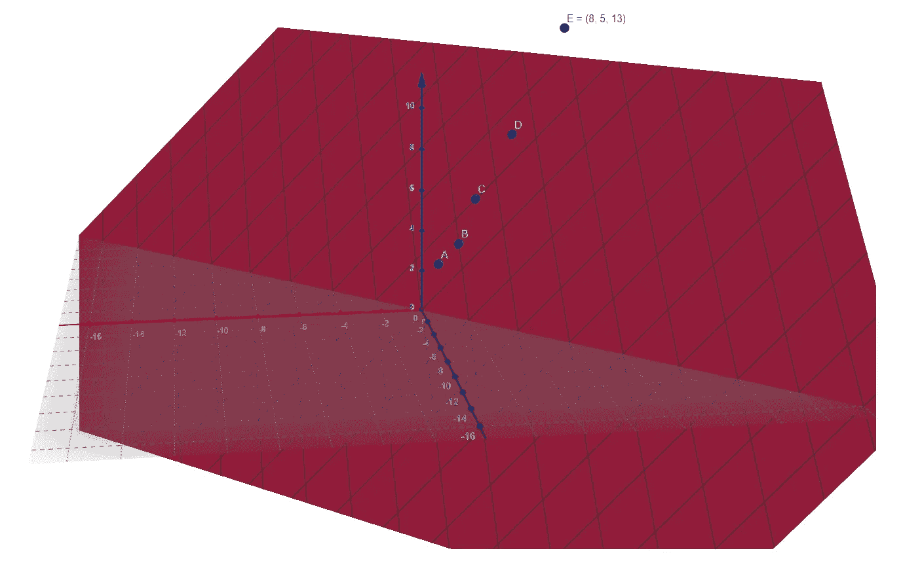
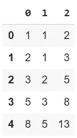
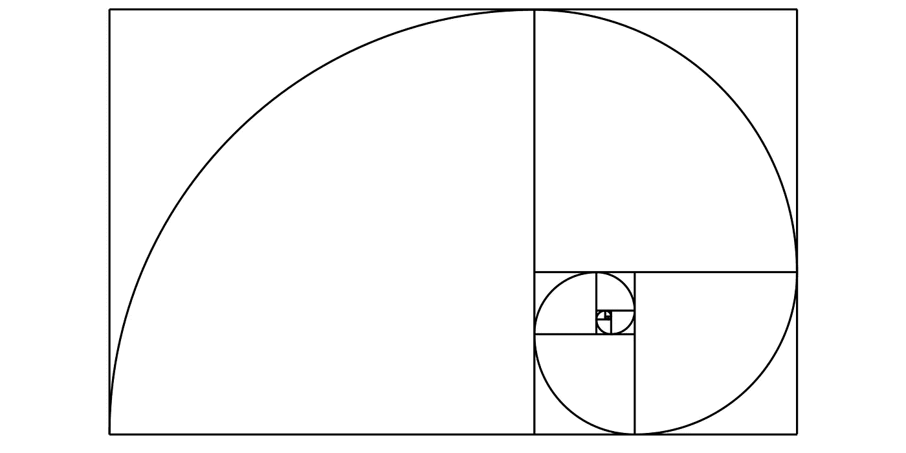

# 教人工智能斐波那契数列

> 原文：<https://towardsdatascience.com/teaching-ai-the-fibonacci-sequence-849430397963?source=collection_archive---------28----------------------->

## 数学

## 使用回归模型构建斐波纳契数列的下一个值。完整的代码可在我的回购[。](https://github.com/arditoibryan/Projects/tree/master/20210128_Numerical_Seq2Seq)

在本文中，我将在斐波那契数列的几个样本上训练一个机器学习模型，然后使用该模型来估计缺失的斐波那契数列。

实际上，问题很简单。斐波纳契数列中的每一个数字都是通过将前面两个数字相加得到的。序列中的前两个数字是 0 和 1。

## 训练集

为了训练我的模型，我只需要一些样本。如果我必须使用 5 或 5000 个样本，结果将是相同的。让我解释一下:

```
#training sample for my model
fibonacci = pd.DataFrame([[1, 1, 2], 
                          [2, 1, 3], 
                          [3, 2, 5],
                          [5, 3, 8],
                          [8, 5, 13]
])
```

我所做的是隔离斐波纳契数列的每一次迭代，产生两个变量(特征)和一个变量(标签),必须使用特征进行预测。通过绘制数据集，我可以看到三维空间中的点。即使它们看起来不是沿着一条直线(看看 A、B 和 C)，它们都位于同一个超平面上:f(x，y)=x+y。



数据很清楚。我可以简单地使用三维线性回归模型。机器学习模型将学习的，本质上，只是对数字求和。因为训练集上的每个数字都可以在这个超平面中找到，这意味着模型将使用**相同的超平面**来预测未来值。例如，通过输入 f(8，13)，超平面的输出将是 21，这是两个特征的和，以此类推，后面的每个数字都是如此。

# 编写代码

```
#predicting fibonacci sequence with linear regression
import pandas as pdfibonacci = pd.DataFrame([[1, 1, 2], 
                          [2, 1, 3], 
                          [3, 2, 5],
                          [5, 3, 8],
                          [8, 5, 13]
])fibonacci.columns = [0, 1, 2]
fibonacci.iloc[0]
fibonacci
```



数据集的熊猫表示

## 训练模型

给定样本，我将使用一个简单的回归模型。我将使用的库是 sklearn。通过使用**。fit()** 方法 I 将输入特征(列[0，1])和标签(列[2])。

```
import numpy as np
from sklearn.linear_model import LinearRegressionreg = LinearRegression().fit(fibonacci[[0, 1]], fibonacci[2])
reg.score(fibonacci[[0, 1]], fibonacci[2])
```

既然模型已经完成，就可以进行预测了。考虑到模型的简单性和数学确定性，我跳过了验证步骤。正如您将看到的，该模型将能够准确无误地预测斐波纳契数列中的下一个数字。

```
#given any 2 numbers, the model will return their sum as properly learned from the training data
def pred(x):
  return reg.predict(np.array([x]))
```

## 再现斐波那契数列

我将从序列的前两个数开始，然后估计第三个数。

```
list1 = [0, 1]
```

我将通过无限地使用下一个估计数作为预测值来重复迭代。

```
for k in range(25):
  #the np results of prediction for 1+1 may be 1.999999: transformed into an int, it becomes one. I am using rint to round it to the closest numpy int, then converting it into an int
  list1.append(int(np.rint(pred([list1[k], list1[k+1]]))))
print(list1)
```

使用上面的代码，我要求模型输出斐波纳契数列中接下来的 25 个数字。完美的执行力！！！

```
[0, 1, 1, 2, 3, 5, 8, 13, 21, 34, 55, 89, 144, 233, 377, 610, 987, 1597, 2584, 4181, 6765, 10946, 17711, 28657, 46368, 75025, 121393]
```



斐波纳契数列的图形