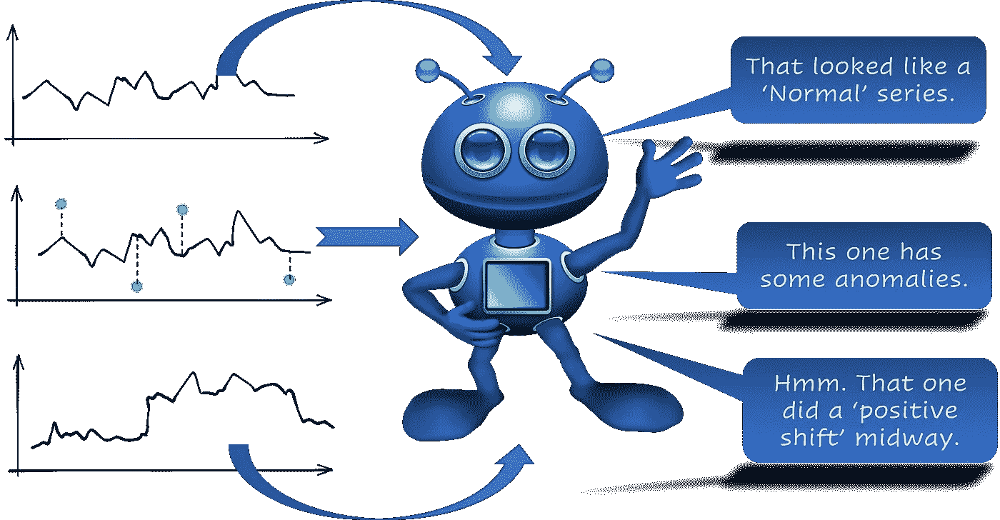
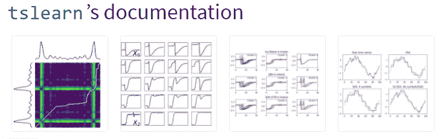
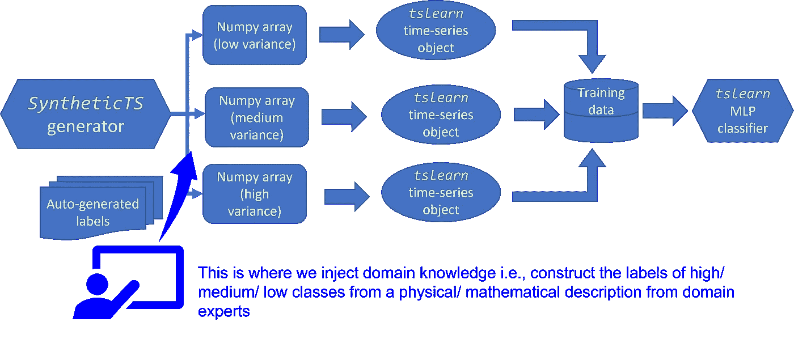
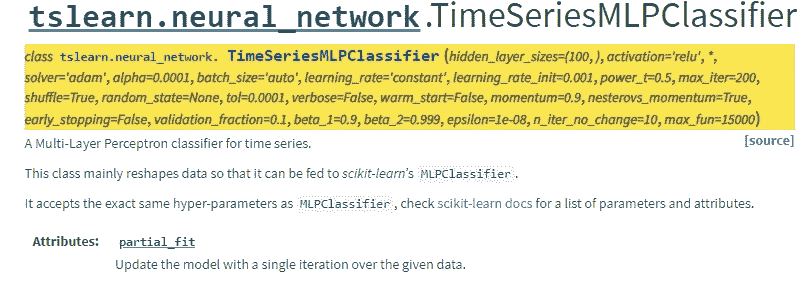
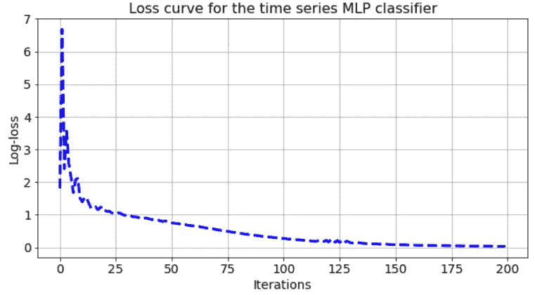
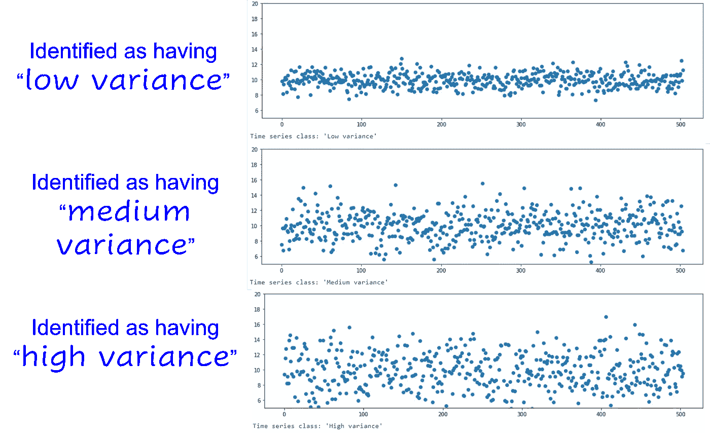
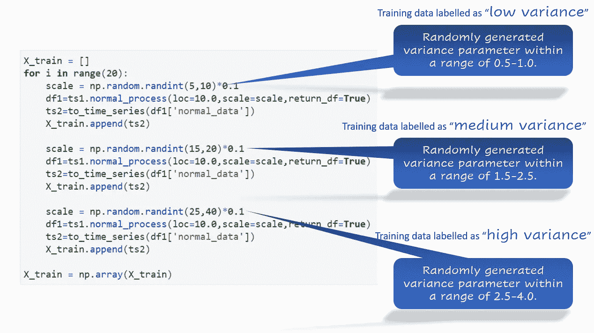
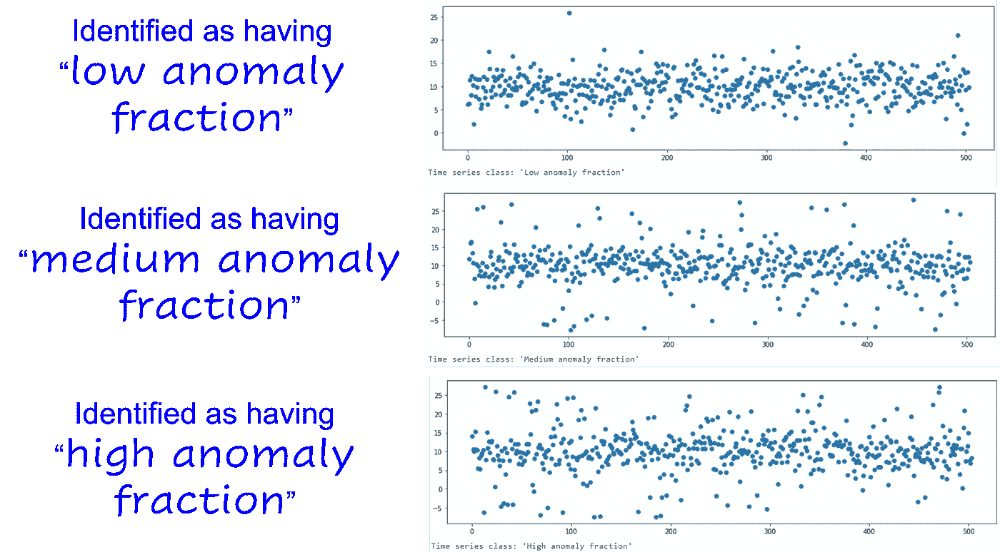
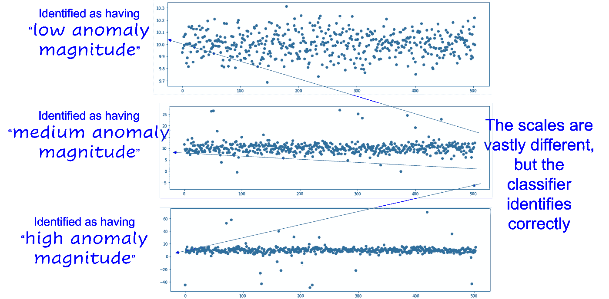
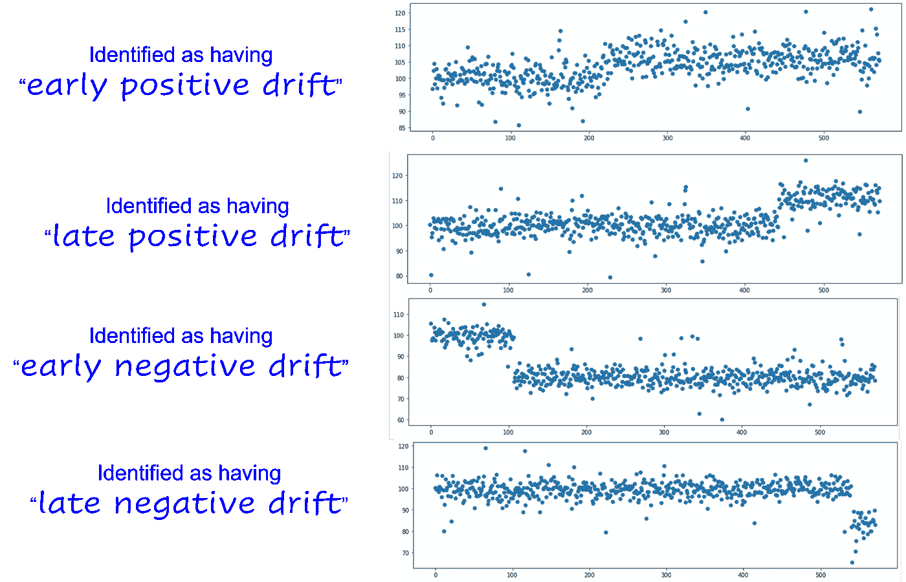

# 教导人工智能用合成数据对时间序列模式进行分类

> 原文：<https://towardsdatascience.com/teaching-ai-to-classify-time-series-patterns-with-synthetic-data-555d8e75ee8a?source=collection_archive---------12----------------------->

## 如何建立和训练人工智能模型来识别时间序列数据中的各种常见异常模式

# 我们想要实现什么？

我们想训练一个人工智能代理或模型来做这样的事情，

**图片来源**:作者使用此 [Pixabay 图片](https://pixabay.com/illustrations/alien-robot-android-antennae-blue-1905155/)制作(免费使用)

## 差异、异常、移位

更具体地说，我们希望训练一个人工智能代理(或模型)来识别/分类时间序列数据，

*   低/中/高方差
*   异常频率(*少量或大量异常*)
*   异常标度(*是异常远离正常或接近*)
*   时间序列数据的正或负偏移(存在一些异常)

## 但是，我们不想把事情复杂化

然而，我们不想为此做大量的特征工程或学习复杂的时间序列算法(如 ARIMA)和属性(如季节性、平稳性)。

我们只是想将我们的时间序列数据(带有适当的标签)输入到某种受监督的“学习”机器中，该机器可以*学习这些类别*(高或低方差、太少或太多异常等)。)*来自原始数据*。

## 一个有用的 Python 库

我们为什么不利用 Python 库，它可以自动为我们做这种分类，我们所要做的就是使用标准的 Numpy/Pandas 格式将数据放入其中？

如果这个库拥有我们最喜欢的 Scikit-learn 包的外观和感觉就更好了！

我们在美丽库— [**tslearn**](https://tslearn.readthedocs.io/en/stable/index.html) 中发现了这样的特征。简单来说就是一个 Python 包，为时间序列的分析提供机器学习工具。这个包建立在(并因此依赖于)`scikit-learn`、`numpy`和`scipy`库之上。

图片来源: [tslearn 文档](https://tslearn.readthedocs.io/en/stable/index.html)

# 为什么(以及如何)合成数据？

正如我在这篇文章中所写的—“*合成数据集是一个以编程方式生成的数据存储库。所以，它没有被任何现实生活中的调查或实验所收集。因此，它的主要目的是足够灵活和丰富，以帮助 ML 从业者用各种分类、回归和聚类算法进行引人入胜的实验*。

 [## 合成数据生成—新数据科学家的必备技能

### 为自驱动数据科学项目和深潜生成合成数据的包和想法的简要概述…

towardsdatascience.com](/synthetic-data-generation-a-must-have-skill-for-new-data-scientists-915896c0c1ae) 

…然后扩展了本文中的论点—“*合成时间序列也不例外—它帮助数据科学家试验各种算法方法，并为现实生活中的部署做准备，而这些部署方式仅使用真实数据集是不可能的。*”

 [## 用 Python 创建具有异常特征的合成时间序列

### 一种简单而直观的方法来创建带有定制异常的合成(人工)时间序列数据，适用于…

towardsdatascience.com](/create-synthetic-time-series-with-anomaly-signatures-in-python-c0b80a6c093c) 

基本上，我们想要**合成具有异常和其他模式**的时间序列数据，自动标记它们，并将它们馈送给`tslearn`算法，以便向我们的 AI 代理教授这些模式。

特别是，如果我们想要使用基于深度学习的分类器(如`tslearn`所提供的)，那么我们可能需要涵盖所有可能变化的大量数据，这在现实生活中可能不容易获得。这就是合成数据派上用场的地方。

那就去冒险吧！

# 向人工智能代理传授时间序列模式

演示笔记本可以在我的 Github repo 这里找到 [**。将时间序列数据转换成适合通过`tslearn`模型进行训练的格式的过程相当简单，并在笔记本中进行了说明。这里，我们主要以各类分类结果为例进行说明。**](https://github.com/tirthajyoti/Synthetic-data-gen/blob/master/Notebooks/Anomaly-training-tslearn.ipynb)

## 数据中的高或低方差？

我处理大量工业数据，例如，大量传感器正在从机器、工厂、操作员和业务流程中创建永无止境的数字数据流。

检测时序数据流是否具有高或低的方差对于下游的许多过程决策可能是至关重要的。所以，我们从那里开始。

流程很简单，

*   使用`SyntheticTS`模块生成合成数据(在我的文章中讨论过，可以在这里找到)
*   生成相应的类标签以匹配这些 Numpy/Pandas 数据序列(注意**基于领域知识注入的标签自动生成**
*   将合成系列数据转换为`tslearn`时间序列对象(数组)
*   将它们存储在训练数据集中
*   从`tslearn`将训练数据输入合适的时间序列分类器。我们选择了`TimeSeriesMLPClassifier`方法，它建立在我们熟悉的 Scikit-learn 的多层感知器方法之上，本质上实现了一个**完全连接的深度学习网络**。

**合成数据训练流程来源**:完全由作者编写

`TimeSeriesMLPClassifier`拥有标准 Scikit-learn MLP 分类器的所有功能，

*   隐藏层大小和神经元数量
*   激活功能
*   求解器/优化器(例如“Adam”)
*   学习率
*   批量
*   容忍
*   动量设置
*   提前停止标准

> 基本上，我们希望**合成带有异常和其他模式**的时间序列数据，自动标记它们，并将其馈送给`tslearn`算法，以便向我们的 AI 代理教授这些模式。

为了简洁起见，在笔记本中，我没有显示训练/测试分割，但这必须作为实际应用程序的标准数据科学工作流实践来完成。

我们可以在训练后绘制标准损耗曲线，并进行各种超参数调整，以实现一流的性能。

然而，展示深度学习分类器调整并不是本文的目标。我们更愿意关注最终的结果，即它做出了什么样的分类决定。

以下是一些随机测试结果。

## 标签生成—手动还是自动？

这篇文章的全部目的是表明，人们可以通过合成数据避免人工标记。

我用**随机变化或偏移**生成了数百个合成时间序列来训练分类器。因为它们是以编程方式生成的，所以也可以自动标记。

一旦你在实际的笔记本中看到生成代码，这一点就清楚了。这是方差训练的想法。

## 异常—数据比例高还是低？

识别异常是不够的。在大多数现实生活中，你还必须确定它们的频率和发生模式。

这是因为工业数据分析系统通常负责在数据流中检测到足够多的异常时发出警报。因此，要决定是否发出警报，他们需要很好地了解异常计数是否代表正常数据的重要部分。

你不想引起太多的假警报，对吧？这将有损人工智能驱动系统的声誉。

因此，我们经历了同样的过程，训练一个关于时间序列数据中异常部分的人工智能模型。这是随机测试结果，

## 异常现象——它们的规模有多大？

在许多情况下，我们还对将输入数据归类为高/中/低异常感兴趣。对于工业数据分析，该特征可以给出机器状态或过程异常的指示。

我们遵循与上面相同的训练过程并获得这些结果，

## 数据漂移或转移—在哪里以及如何漂移或转移？

工业数据分析中的另一个经典操作是检测来自机器的传入传感器数据的漂移/偏移。可能有很多原因，

*   机器可能正在老化，
*   在没有适当记录的情况下突然改变工艺配方/设置，
*   一个小的子组件可能会随着时间的推移而退化

底线是，人工智能驱动的系统应该能够识别这些类别——至少根据正或负偏移及其发生点，即*偏移是在流程生命周期*的早期还是晚期开始的。

> 识别异常是不够的。在大多数现实生活中，你还必须确定它们的频率和发生模式。这是因为工业数据分析系统通常负责在数据流中检测到足够多的异常时发出警报

在这种情况下，我们将班次的位置(整个时间段中的早或晚)添加到混合中。所以，我们有下面的类来训练数据，

*   早期正移位
*   后期正移
*   早期负移
*   晚期负移

**由于复杂性的增加，我们需要生成比之前实验更多的合成数据**。这是结果，

# 摘要

对于许多精彩的用例来说，时间序列分类是一个非常有趣的话题。在这篇文章中，我们展示了**如何使用合成数据，我们可以训练 AI 模型**(具有几个完全连接的层的深度学习网络)来模拟工业过程或传感器流的一维**时间序列数据**。

特别是，我们将重点放在**向人工智能模型传授各种异常属性和数据漂移模式**，因为这些分类是机器退化的非常重要的指标。简而言之，它们构成了**工业 4.0** 或**智能制造**领域中所谓 [**预测分析**](https://www.industr.com/en/how-convergence-of-data-analytics-iot-drives-industry-2551064) 的基石。

我们希望人工智能驱动的预测分析的合成数据的使用在未来将会显著增长。

*喜欢这篇文章吗？成为* [***中等会员***](https://medium.com/@tirthajyoti/membership) *继续* ***无限制学习*** *。如果您使用下面的链接，* ***，我将收取您的一部分会员费，而无需您支付额外费用*** *。*

 [## 通过我的推荐链接加入媒体

### 作为一个媒体会员，你的会员费的一部分会给你阅读的作家，你可以完全接触到每一个故事…

medium.com](https://medium.com/@tirthajyoti/membership)