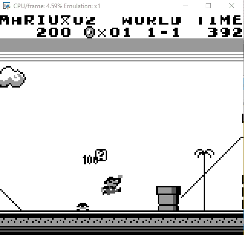
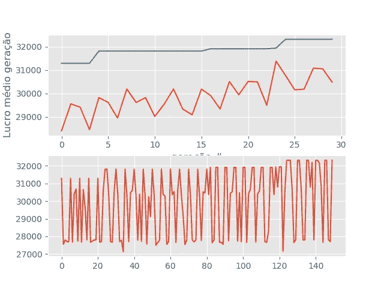

# 教人工智能玩超级马里奥游戏——遗传算法

> 原文：<https://towardsdatascience.com/teaching-ai-to-play-super-mario-land-genetic-algorithm-dde42c814e16?source=collection_archive---------27----------------------->

## 用遗传算法控制超级马里奥大陆——用代码

照片由 [@claudiolcastro](https://unsplash.com/@claudiolcastro) 在 Unsplash 拍摄

这是教人工智能在 GameBoy 上玩超级马里奥的系列文章的第一篇，在这里我将向你展示如何开发一个遗传算法人工智能来用 Python 玩超级马里奥。(文末我的 GitHub 链接上的完整代码)

超级马里奥之地是由任天堂创造的平台游戏，它讲述了一个关于马里奥的故事，一个勇敢的水管工住在蘑菇王国的土地上，他的角色是从恶棍浏览器的手中拯救公主。

下面的 GIF 展示了控制 GBA 超级马里奥世界 1–1 第一部分的遗传算法。在下一节中，我将解释如何自己编写这个算法。

图片作者:超级马里奥陆地 AI——第 30 代

# 环境

我们旅程的第一步是 Python 和 Game Boy 模拟器之间的集成。对于这一个，我找到了一个很好的 Python 库，叫做 PyBoy。

https://github.com/Baekalfen/PyBoy

按照 PyBoy 的指示，我能够将超级马里奥陆地游戏集成到 Python 中，并开发所有的控制交互。为了创建环境的第一个工作版本，你必须创建一个“init”函数来定义所有的初始变量，如马里奥的寿命、剩余时间、世界等级等等。在这之后，你必须创建一个函数来在游戏结束时重置游戏，并创建一个“step”函数来允许 AI 代理与游戏交互并在游戏上执行操作。

在创建了允许任何人工智能程序与游戏互动并实际玩游戏的环境之后，让我们选择一种算法并开发 AI 代理。

# 遗传学方法

遗传模型是基于算法的，这些算法使用**生物进化**的概念来优化它们的行为。

> 在生物学中，进化是指一个物种在几代人的时间里发生的特征变化，它依赖于自然选择的过程[1]你的 Genome.org([*来源*](https://www.yourgenome.org/facts/what-is-evolution) *)*

照片由 [@nci](https://unsplash.com/@nci) 在 Unsplash 拍摄

> 生物进化理论的基础是所有物种都是相关的，并随着时间的推移而逐渐变化。该理论指出，群体中的遗传变异会影响物种的物理特征(表型)，其中一些特征可能会使个体比其他个体具有优势。”【1】你的 Genome.org([来源](https://www.yourgenome.org/facts/what-is-evolution) ) *。*

这些身体上的优势可以通过父母延续给后代。这种应用于人工智能的理论创造了自我学习代理，它们每一代都在进化，并探索环境以最大化结果。

想法很简单，对于每一个*代，我们创造一些物种，并执行 ***交叉*** 和 ***突变*** 来优化和发展基因，然后执行一个 ***选择*** 最后选出最好的物种。*

## *产生*

*世代是一组物种，每个物种都具有通过突变和交叉产生的特定特征，这些特征是从其父母那里继承的。*

*将这一概念应用于人工智能，每个物种在第一代出生时都有一套动作，然后根据其适应性选择最佳物种，以延续到下一代。然后，下一代物种经历一个基于上一代的交叉过程来创造后代，并变异以产生可变性。这个过程迭代地继续，直到最后一代。*

## *选择*

*算法的选择部分是基于查尔斯·达尔文的自然进化理论。*

> *“具有最适合其环境的特征的个体更有可能生存下来，找到食物，躲避捕食者，并抵抗疾病。这些个体更有可能繁衍后代，并将他们的基因传递给他们的孩子。不适应环境的个体不太可能生存和繁殖。因此，他们的基因不太可能遗传给下一代。结果，那些最适合其环境的个体生存了下来，只要有足够的时间，这个物种就会逐渐进化。”[1]你的 Genome.org([来源](https://www.yourgenome.org/facts/what-is-evolution))*

*将这一概念应用于 AI，当我们前进到下一代时，我们只选择最适合的个体来“生存”，并将他们的“基因”复制到未来。*

## *交叉*

*在生殖周期中，当父母将基因传递给下一代时，他们的基因会发生交叉。交叉过程从亲代 1 取一半基因，从亲代 2 取另一半基因，为下一代生成基因。*

## *变化*

*突变是部分基因随机改变的过程。*

*这些变化可能只是不影响运动的微小变化，也可能导致全新的特征，彻底改变物种的行为。对于人工智能，我们通过在模型生成过程中随机改变代理动作来执行变异。*

## *健康*

*遗传算法最重要的变量之一是适应度。*

*健康是一个变量，它表明了我们希望为我们的环境带来的最大化。适应度公式的微小变化可以导致代理行为的巨大变化。*

*对于超级马里奥土地，我们希望马里奥向前走，杀死敌人，以完成阶段。因此，当马里奥向前移动或杀死一个敌人时，我们开发一个正值，并且我们对每一秒应用一个折扣，以鼓励马里奥快速向前移动。*

# *实验和结果*

*在对模拟环境进行编程并实施遗传算法之后，我们可以开始运行模拟并评估模型性能。*

*出于研究目的，我运行了一个有 30 代和 5 个物种的模型来玩第 1-1 阶段的超级马里奥大陆。以下是第一代的结果:*

**

*图片作者:超级马里奥陆地 AI——第一代*

*马里奥能够向前走，但在第一个障碍中失败了，一个简单的古姆巴。让我们看看代理是否能在一些基因进化后表现得更好…*

*30 代之后我们注意到了巨大的进化！人工智能代理发现的一些惊人的动作是杀死一些 Goombas 和跳过小管道和高块。看到人工智能可以用动态编程做什么真是太棒了。*

**

*图片作者:超级马里奥陆地 AI——第 30 代*

*我们可以通过下面的基准图表来跟踪这一发展。在图表的第一部分，是每一代的平均适应度(红线)和最大适应度(蓝线)，我们可以清楚地看到随着一代的发展，平均适应度和最大适应度的增长趋势。*

*第二部分显示了每个交互的适应度，我们可以看到每代内部的变化，这是探索旅程的一部分，以及每代最大适应度的增加。*

**

*图片作者:超级马里奥陆地 AI——30 代基准*

*如果您想实现这个解决方案或了解更多关于遗传算法的信息，您可以在下面的链接中找到我的 GitHub repo 上的完整 python 代码:*

* [## 奥克塔维奥-圣地亚哥/超级马里奥-兰-艾

### 此时您不能执行该操作。您已使用另一个标签页或窗口登录。您已在另一个选项卡中注销，或者…

github.com](https://github.com/octavio-santiago/Super-Mario-Land-AI) 

非常感谢您的阅读！如有任何问题或建议，请通过 LinkedIn 联系我:[https://www.linkedin.com/in/octavio-b-santiago/](https://www.linkedin.com/in/octavio-b-santiago/)

## 参考

[1]你的基因组，美国，2021 年 7 月访问，<[https://www.yourgenome.org/facts/what-is-evolution](https://www.yourgenome.org/facts/what-is-evolution)>

## 更多阅读

 [## 用决策深度强化学习来下象棋

### 用机器学习创造国际象棋冠军

towardsdatascience.com](/hacking-chess-with-decision-making-deep-reinforcement-learning-173ed32cf503)  [## 强化学习——教机器用 Q 学习赌博

### 强化学习是人工智能和机器学习的一个领域，涉及模拟许多…

levelup.gitconnected.com](https://levelup.gitconnected.com/reinforcement-learning-teaching-the-machine-to-gamble-with-q-learning-bc6790ee66c2)  [## 如何使用 Power BI 构建完美的仪表盘

### 在 Power BI 中构建杀手级仪表板的技巧

towardsdatascience.com](/how-to-build-the-perfect-dashboard-with-power-bi-28c35d6cd785)*