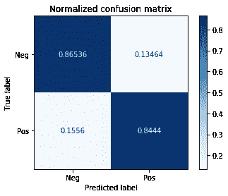
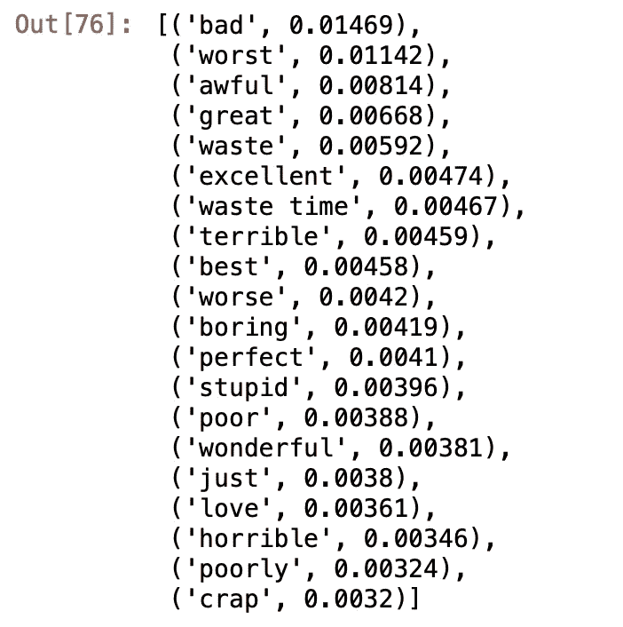
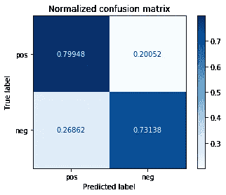
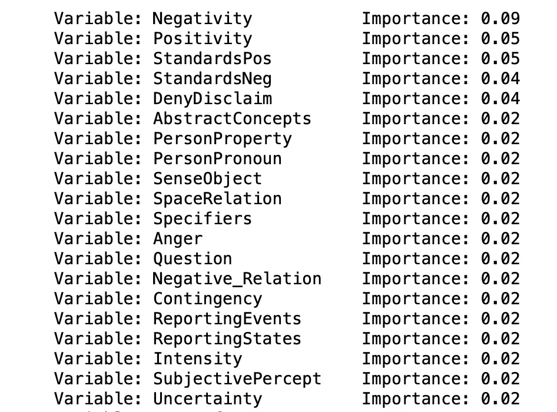

# 教机器阅读电影评论:思考可解释性

> 原文：<https://towardsdatascience.com/teaching-machines-to-read-movie-reviews-thinking-about-interpretability-63c12248b8e5?source=collection_archive---------45----------------------->

## 语言领域知识如何为洞察力的特征选择提供信息的例子。

照片由 [h heyerlein](https://unsplash.com/@heyerlein) 在 Unsplash 上拍摄

是什么让一篇影评是负面的还是正面的？我的意思是，显然一部真正的电影(《哦，嗨，马克》)会产生一些明显的批评性评论，但作为人类，我们如何阅读评论并理解评论者的总体看法？这是机器学习(ML)中的一个重要问题，部分原因是提高 ML 的性能可能取决于更好地理解我们人类如何做像阅读评论这样的事情。现在，准确地将电影评论分为赞成/反对是非常简单的(现有的方法已经[大约 99%准确](https://www.kaggle.com/c/word2vec-nlp-tutorial))。尽管如此，教机器更像人类一样阅读可能意味着以更大的粒度对电影评论进行分类，或者可能让我们转向能够理解复杂、更高风险事物(如公司道德声明或在线阴谋论)的机器。

注意:很多 ML 中的人不认为我们需要理解像阅读这样的人类任务的“如何”。他们认为我们需要更好的算法，更多/更好的计算能力，以及(最重要的)更多的数据。不管怎样，我仍然对回答“如何”这样的问题感兴趣，部分原因是因为我是一名科学家:我想要有助于解决问题的洞察力。但部分原因是因为我是科学家:我只想知道事物是如何运作的。

像“stinker”这样的词是我们如何阅读评论的第一个线索:这些词不依赖于上下文，但总是有好/坏的意思。这个意思(*语义*)直接关系到对消极或积极的评价，所以如果有人使用了很多明显的积极词汇(“美好的”、“快乐的”、“喜悦的”)，这是一个很好的线索，表明我们正在阅读一篇积极的评论。我们可以使用一种“古老而优秀”的 ML 算法来看到这一点:随机森林(RF)分类器。RF 分类器在这里很好，因为除了通常表现良好之外，它还可以输出*特征重要性*:它使用了数据的什么*特征*来学习预测(无论什么)？

# 用文字理解影评

我们可以从使用单词(语言的词汇层次)作为我们的 RF 分类器开始。在第一次尝试中，我们将根据每篇电影评论的术语频率对逆文档频率进行评分，即 *TF-IDF* 。本质上，这意味着训练分类器，教它寻找在一些文档中频繁出现，但在其他文档中不频繁出现的术语。如果你想想传统报纸的版面，这很容易理解:像“那么”或“也”这样的词将会在报纸的每篇文章中出现。但是，像“金融”、“市场”、“利率”和“经济”这样的词虽然在一些文章(即商业部分)中频繁出现，但在其他部分中相对不常见。

当我们输入我们的*训练数据* ( [来自数千条 IMDb 评论](https://ai.stanford.edu/~amaas/data/sentiment/)的文本)，被人类读者标记为“负面”或“正面”，然后分解成单词/单词对进入我们的射频分类器，机器在计算如何区分负面评论和正面评论方面做得非常好:

使用 TF-IDF 分数的随机森林(i *作者的图像)*

你可以从左到右穿过对角线阅读上面的*混淆矩阵*:约 86.5%正确预测负面评价，约 84.4%准确预测正面评价。然后，为了了解模型如何进行预测，我们可以输出要素重要性列表:

TF-IDF RF 分类器的特征重要性(i *由作者创建)*

这没什么好惊讶的:像“差”、“最差”和“糟糕”这样的词对于识别负面评价很重要，而相应的“好”、“优秀”和“最好”这样的词对于正面评价很重要。有两个特性稍有不同:“just”(一个限定词)和“bigram”浪费时间(一个价值判断？).但总的来说，前 20 个权重最高的特征并不特别有洞察力。

部分原因可能是*重要性值*有多低(基本上是一个介于 0 和 1 之间的值，表示该特征对模型的平均贡献百分比)。例如，单个最重要的特征(“坏的”)具有微不足道的 0.0146 重要性值。这可能是为什么除了简单的好/坏之外，功能重要性列表没有非常明显的模式的一个线索:可能有太多不同的词影响评论的观点，没有一个词有很大的权重。在成千上万的文字中很难看出一种模式。也许我们需要更稀疏的东西来获得洞察力。

# 语言立场:语言移动的分类

如果我们不使用单词和单词对，而是使用单词的类别作为我们的特征，会怎么样呢？卡耐基梅隆大学的大卫·考夫和 T4·石崎在他们的 DocuScope 项目中提出了一个有用的语言立场分类法。DocuScope 建立在一个源自功能语言学和修辞学的专家词典上，涵盖了许多词的类别，例如确定性/不确定性、情感、文化价值观、社会关系等。这些是我们在说话/写作中采用的各种语言姿态。虽然字典中有数百万个单词和短语，但立场类别相对较少(这里使用的版本中有 119 个)。因此，我们可以使用 DocuScope 来计算任何立场类别在我们的文档中出现的次数，而不是将数千个单词传递给 RF 分类器:X%负面单词，Y%抽象概念，Z%争论/否认，等等。当我们将这些*向量*传递给 RF 分类器时(本质上是每个评论的 119 个姿态值的列表)，一个有趣的权衡发生了。

# 模型准确性与可解释性

使用立场类别(语言的*词典学*级别)作为特征并不能提高基于单词的模型的性能:

使用姿态向量的随机森林(作者制作的 i *图像)*

再次从左向右对角阅读，基于立场的模型预测正面评论的准确率约为 80%，预测负面评论的准确率约为 73%。所以从纯性能的角度来看，使用站姿有损性能。但是洞察力是一个非常不同的故事:

特征对于姿态 RF 分类器的重要性(i *作者的图像)*

两个最重要的特征是老朋友——通常是负面和正面的词——这并不奇怪。但是现在它们是一个更强的信号:单个单词“坏”解释了大约 1.5%的特征重要性，立场类别“消极”解释了 9%。

从那里开始变得更有趣了。接下来会出现两种价值观，一种是关于积极的价值观，一种是关于消极的价值观，两者都在公共领域。这些词指的是社会公益(如和平、正义)和社会弊病(如腐败、贫困)，比简单的好/坏两极更复杂。事实证明，积极的评论包括谈论“我们作为一个物种的进步”，或以比烂片更“有教育意义”和“更有效的方式”处理重要主题。相反，蹩脚的电影《越界》以“无端的暴力”为标志，在情节上“缺乏想象力，难以置信，令人费解”。因此，除了简单的极性，文化价值观也是教会机器更复杂地阅读更多内容的一部分。反对论点 langauge(“DenyDisclaim”上文)也很重要。例如，在负面评论中，你可能会说，如果你“没有”读过这本书，你可能会喜欢这部电影，但“不幸的是，情况并非如此。”

基于立场的模型告诉我们，理解电影评论最大程度上取决于围绕积极/消极、公共价值、反对意见、抽象概念和社会身份的语言移动(上面列表中的“个人属性”)。其中的一些(积极/消极)我们可能已经猜到了(尽管有经验上的证实和量化是很好的)，但其他部分我们可能没有猜到。这是人类可以做的许多事情的一个例子——讽刺，说服——但是很难分析。要做到这一点，我们可能会受益于一种独特的阅读视角:机器阅读。

# 对同一件事的不同看法

因为计算机和人类阅读方式不同，所以可以高度互补。人类在大量上下文中阅读，引入外部知识，使文本数据的含义更加丰富和精确。但我们也很慢，而没有上下文的计算机阅读却以超人的规模/速度阅读。还有，人类阅读的精准性是串行的:我们一次读一件事，看不到整体。而机器可以鸟瞰大型文本数据集。在许多方面，机器可以补充人类阅读。

斯坦福大学文学实验室的研究人员对比了人类和机器的阅读，使用了识别写作类型的类比，就好像它们是建筑物一样。人类可以使用主题(黑暗的秘密，不断增加的恐惧)来识别哥特式小说这样的流派，就像人们可以使用建筑元素(基座，光滑的表面)来识别新古典主义这样的建筑流派一样。而计算机可以使用字数统计(词汇层面的特征)和 DocuScope 的立场类别(词汇语法特征)来识别相同类型的哥特式小说。这有点像用砂浆中的沙粒(文字)或砖块类型(姿态)来识别建筑。当然，并不是说人类不用文字或者站姿来阅读。相反，我们在没有明确看到更大的图案的情况下使用它们，就像我们识别像装饰艺术这样的图案，而不能轻易地背诵图案的微观特征一样。

我真的很喜欢给机器额外的数据种类/表示来帮助它们更好地阅读的想法。反过来，能够看到引擎盖下，理解机器如何利用这些额外的表示来阅读文本数据，因为它可以扩展人类的知识，可能比电影评论更重要。