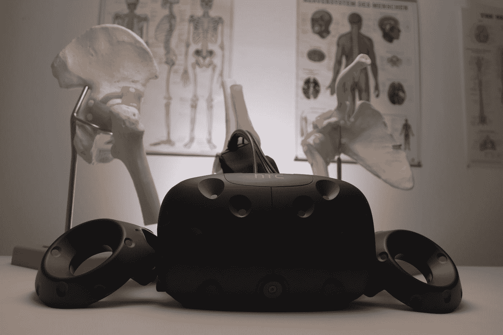
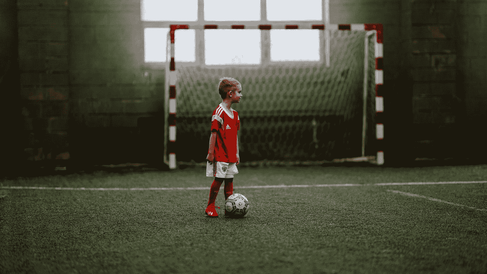

# 不管你叫它英式足球还是橄榄球，人工智能可能正在帮助你的球队

> 原文：<https://towardsdatascience.com/tech-in-euro-2020-39b0a4aa6a07?source=collection_archive---------30----------------------->

## 从 2020 年欧洲杯到各国联赛，用人工智能锻造足球冠军

托马斯·塞勒在 [Unsplash](https://unsplash.com?utm_source=medium&utm_medium=referral) 上的照片

足球狂热伴随着我们；人们虔诚地追随他们喜爱的球队，啜饮各种不健康的饮料，嚼着一卡车美味的小吃。电视台用各种各样的分析轰炸我们，告诉我们在各种国际比赛中发生了什么，让我们知道看到我们最喜欢的球队举起渴望已久的奖杯的几率。但你有没有问过自己，人工智能(AI)在这一切中有没有任何作用？

当然，我们知道其中的一些技术，比如球门线技术(GLT)和视频助理裁判(VAR)。这些系统帮助裁判在比赛中做出正确的决定。GLT 检查球是否越过了球门线，而瓦尔审查主裁判的决定。但是在幕后，俱乐部正在使用其他系统，很少有人意识到这一点。别忘了足球是一项耗资数百万欧元的运动。人体是用来演奏音乐的主要机器。因此，使用人工智能技术来优化机器是有意义的。

照片由[杰斯珀·阿格尔加德](https://unsplash.com/@aggergakker?utm_source=medium&utm_medium=referral)在 [Unsplash](https://unsplash.com?utm_source=medium&utm_medium=referral) 拍摄

第一个突出的用途是提高运动员的单项成绩。为了做到这一点，俱乐部通常依赖步态分析等。这种分析是对人类运动的系统研究，使用仪器来测量身体运动、力学和肌肉的活动。通过这种方法，他们可以判断运动员是否正确地跑步，确定他是否有任何弱点，并提出进一步改进的方法。典型的步态分析系统需要一个昂贵的实验室，配备大约 16 个摄像头，仔细监控个人的运动。除了不是每个人都能使用这样一个系统之外，它还涉及到大量的时间和精力。但人工智能技术的最新进展使得将这些系统集成到移动设备成为可能，从而允许教练直接从球场上执行自动化步态分析，并毫无延迟地获得初始指示。

Izuddin Helmi Adnan 在 [Unsplash](https://unsplash.com?utm_source=medium&utm_medium=referral) 上拍摄的照片

但是，足球不是个人运动，团队合作很关键。正因为如此，第二个明显的用途是在回顾过去的比赛。这种分析有两个显著的好处:优化团队和识别对手的缺陷。通过跟踪过去比赛中的每一名队员，人工智能可以提取重要的统计数据，如成功传球、拦截、接球、犯规、踢球准确性、进球、速度、疲劳等等。系统绘制群体动态并突出显示。然后，它分析这些信息并确定最关键的因素，从而帮助教练在团队环境中为任何球员确定最佳策略。人工智能也处理对方球队的视频，但这一次，它的角色颠倒了。与其说是为了优化，不如说是为了利用对手的弱点。这个信息将允许教练重组他的队伍，利用对手的缺点为自己服务。

理论上，这样的系统听起来很棒。但是比赛中会发生什么呢？我们都知道足球是一个现场动态的游戏。即使球队试图利用对手的弱点，另一名教练也可能意识到这一点，并做出调整来抵消这种失误。再一次，人工智能开始发挥作用。

该系统不仅是一个在比赛前处理数据的分析过程。它也是一个在线教练监控现场比赛。因此，对手球队中发生的变化可以被实时识别，并向主教练提出对策。这个分析也适用于他的团队。此外，我们都意识到人工智能比任何人都快。它存储了每个球员的大量信息，从他的第一场比赛到他最近的一场比赛。该系统可以意识到球员是表现良好还是表现不佳。通过使用所有这些信息，人工智能可以在其数字大脑中进行几场虚拟比赛。它可以窥视未来，并试图确定最成功的战略。一旦它对这个计划有足够的信心，它就可以向主教练提出建议，供他考虑。

照片由[阿瑟尼·托古列夫](https://unsplash.com/@tetrakiss?utm_source=medium&utm_medium=referral)在 [Unsplash](https://unsplash.com?utm_source=medium&utm_medium=referral) 拍摄

当然，我们必须记住，这不是一门精确的科学。过去有过 AI 在足球上惨败的例子。就在一年前，一个苏格兰人工智能系统被设计成在一场直播足球比赛中跟踪球，不断被边裁的光头弄糊涂，反复认为这是球。比赛结束后，他们很快解决了这个问题，但事实是，艾并不是一贯正确的。

本质上，并不能保证人工智能的预测会变成现实。但是考虑到人工智能可以访问的巨大信息库，这种系统中内置的逻辑以及它拥有的相当大的处理能力，它很可能是下一个最好的选择。可以肯定的是，赔率将有利于那些早期使用人工智能的俱乐部。很快，这些改进将会把足球带到一个新的高度，这在几十年前是闻所未闻的。

如果你喜欢这篇文章并想联系我，请通过🖊️ [媒体](https://alexieidingli.medium.com/)联系我，🐦[推特](https://twitter.com/alexieidingli)，🔗[领英](https://www.linkedin.com/in/alexieidingli/)，📷 [Instagram](https://www.instagram.com/alexieidingli/) ，😊[脸书](https://www.facebook.com/alexieidingli)或者🌐[网站](http://www.dingli.org/)

<https://medium.com/dataseries/managing-pain-through-distraction-c51e73d49205>  </sitting-on-a-pile-of-digital-gold-f20b74e0ae47>  </beyond-the-frontiers-of-disabilities-88b82631533d>  

Alexiei Dingli 教授是马耳他大学的人工智能教授。二十多年来，他一直在人工智能领域进行研究和工作，协助不同的公司实施人工智能解决方案。他的工作被国际专家评为世界级，并赢得了几个当地和国际奖项(如欧洲航天局、世界知识产权组织和联合国等)。他出版了几本同行评审的出版物，并成为马耳他的一部分。由马耳他政府成立的人工智能工作组，旨在使马耳他成为世界上人工智能水平最高的国家之一。