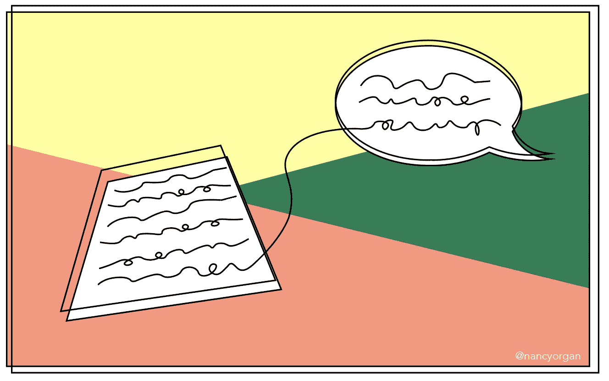
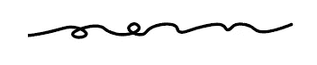

# 数据科学家的技术写作

> 原文：<https://towardsdatascience.com/technical-writing-for-data-scientists-1cc44e9949fc?source=collection_archive---------19----------------------->

## [行业笔记](https://towardsdatascience.com/tagged/notes-from-industry)

## 一个由四个部分组成的公式，可以让你写足够的技术文章

作者的原创艺术

D 数据科学就像在一个新城镇开车:你可能会到达目的地，但解释你如何到达那里是另一回事。在花费数周或数月做了艰苦的技术工作后，数据科学项目的写作阶段可能会令人沮丧。你知道你做得很好——学到了一些很酷的东西！—但是这些文字有时会很慢才出现在页面上。

幸运的是，这是*非常*可解的。在与数据科学家共事的几年中，我设计了一组尖锐的问题，如果按顺序回答，基本上可以为你写一篇文章。我建议先单独回答每个问题，然后再将它们粘贴到最后的作品中。另外，你可以把每一部分的一个句子串起来，写一个简单的摘要。

风格注释:我们都想成为街区里最有口才的孩子。然而，就技术写作而言，与 elan 相比，其优势在于清晰性和有效性。在你陷入天赋之前，掌握说出你需要说的话的艺术。完全充分的技术写作本身就是一项巨大的成就。不管怎样，成为一个好作家就像变漂亮一样；如果你有有趣的事情要说，两者都会更有趣。

# 1.有什么问题？

在你工作的某个地方，你正在解决一个或多个问题。很多时候，东西贵了或者亏了。在其他情况下，一些事情是不方便的，低效的，或者让人生病的。隔离主要问题并描述规模、位置、受影响人群等。的问题。举个例子，

“上个季度纸杯蛋糕的销售额下降了，导致我们比目标少了 400 万美元。令人担忧的是，我们估计这些下降主要是由食用我们糕点产品的儿童造成的。这个问题主要出现在太平洋西北部，引发了人们对沉闷天气和低糖饮食的复合心理影响的关注。为了我们的业务和客户的利益，我们渴望解决这个紧迫的问题。”

# 2.我们对它了解多少？

使用这一部分给出手头主题的背景信息。这包括之前对主题所做的工作和读者应该了解的外围因素。别忘了引用你的资料来源！

历史上，销售额一直稳定在每季度 1000 万美元左右。整个冬天，我们看到了急剧下降到只有 600 万美元，这是自 90 年代末以来我们的竞争对手在一轮独特有效的广告宣传中从未出现过的情况。根据我们的客户调查，98%的客户家庭报告 18 岁以下的居民消费我们的纸杯蛋糕产品。对销售趋势的分析预测，如果这种下降趋势持续下去，到 2022 年，将没有孩子能吃到纸杯蛋糕。

# 3.我们在做什么？

这类似于方法部分。解释数据收集的过程，你是如何进行分析的，分析的结果，以及你打算解决的问题的解决方案。描述你工作的局限性，并详细说明未来的研究和下一步。

*“客户调查由一组训练有素的调查方法学家通过电话进行，使用抽奖参与者提交的联系信息，并从国家数据库中对琐碎的废话进行三角测量。我们的大学实习生使用一个小型开源 Python 包为他的最终项目进行了时间序列分析。看似合理的是，分析一直进行到一些重要的东西出现。根据调查结果，我们将在华盛顿和俄勒冈州加大纸杯蛋糕产品的广告力度。”*

# 4.为什么有人会在意？

如果你所说的内容与读者无关，那么前面三个部分都没有意义。因此，你在这一部分的工作就是准确地解释为什么你的解决方案、发现或创新对他们有用。自然地，有些作品除了最小众的观众之外，对所有人都无关紧要；你不需要说服*每一个人*，只要是你希望阅读的人。

“纸杯蛋糕是这个世界上仅存的美好源泉，为了我们的员工和顾客，我们应该传播这种快乐。”

这种方法可能不会让你获得诺贝尔文学奖，但是充分的技术写作是为了告诉读者他们应该了解你的作品。通过在他们提问之前回答他们的问题，你已经完成了一项了不起的工作，实现了你的目标:学习很酷的东西，并告诉人们。快乐写作！

 [## 建立一个真正属于你的职业

### 你希望五年前就开始做的七件事

nancyorgan.medium.com](https://nancyorgan.medium.com/build-a-career-thats-actually-yours-daba8380ff29)