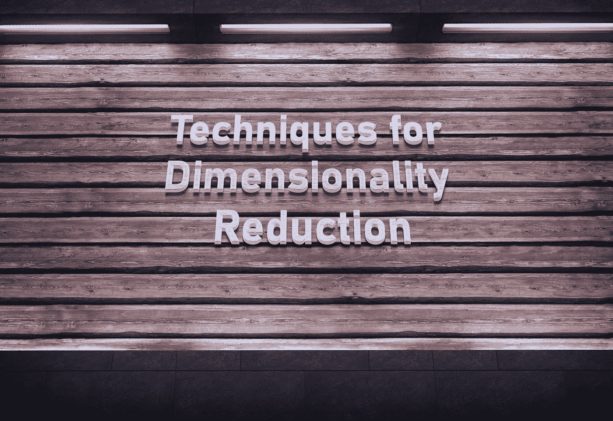
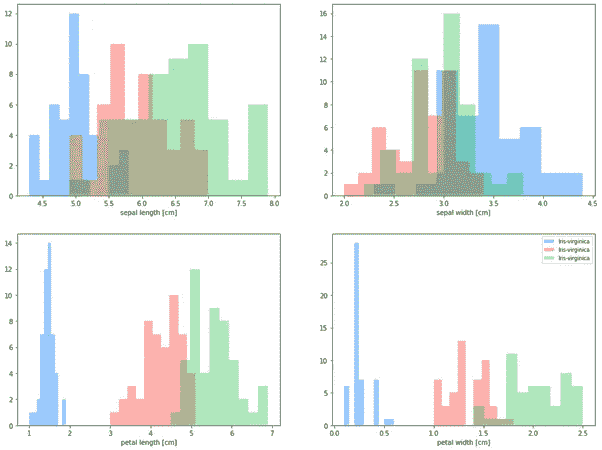
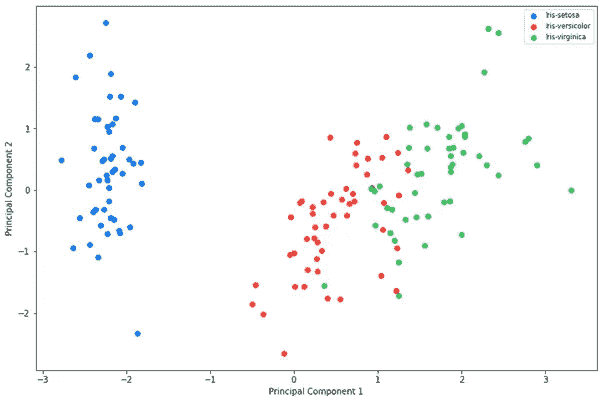

# 降维技术

> 原文：<https://towardsdatascience.com/techniques-for-dimensionality-reduction-927a10135356?source=collection_archive---------20----------------------->

## 使用降维来提高人工智能模型效率的指南

照片由[甘特·拉博德](https://gantlaborde.medium.com/)拍摄

目前，我们正处于一场美妙革命的边缘:人工智能。除此之外，最近跨公司、组织和政府部门的大型数据集的“大爆炸”导致了数据挖掘技术的大量使用。那么，什么是数据挖掘呢？简单来说，就是在高维数据集(拥有数千列的数据集)中发现趋势和洞察的过程。一方面，高维数据集使组织能够解决复杂的现实问题，例如减少癌症患者的等待时间，预测与新冠肺炎相关的蛋白质结构，以及分析脑磁图扫描。然而，另一方面，大型数据集有时可能包含具有低质量数据的列，这会降低模型的性能-越多并不总是越好。

在低维空间中保留高维数据结构的一种方法是使用降维技术。那么，这样做有什么好处呢？答案是三重的:首先，由于误导性数据较少，它提高了模型精度；第二，该模型训练更快，因为它具有更少的维度；最后，它使得研究人员解释模型更加简单。主要有三种降维技术:( *1)* 特征消除与提取，( *2* )线性代数，( *3)* 流形。在本文的整个过程中，我们将研究一种在人工智能工作流中实现降维的策略，探索不同的降维技术，并完成一个降维示例。

# 如何最好地脱离其他:人工智能建模的新策略

对分析进行简单实验的时代已经结束，大多数组织都知道这一点。因此，公司应该将高级分析置于其组织的核心，提供建立有效、高效和成功的公司所需的信息和见解。此外，公司应该努力成为洞察力驱动的组织，支持有见识和有能力的员工。说起来容易，掌握起来难。

目前，大多数组织都运行大型业务和运营报告功能，在整个公司范围内提供传统的定期报告。然而，公司通常会面临一些挑战，例如维护数据质量、单一版本的事实和假设的一致性。因此，在尝试实现大规模人工智能功能之前，组织解决这些挑战至关重要。但是，从短期来看，他们可以考虑制作概念证明，以激发高级分析优势的高级利益相关方的兴趣，这将有助于首席数据官(CDO)争取更多资金来提高整个组织的数据素养和质量。

出于本文的目的，我们将假设您拥有可接受的数据质量来承担更复杂的分析技术。分析师应该采取三个关键阶段来建立一个人工智能模型，包括理解更大的图景，清理数据，以及部署模型。降维技术进入该过程的净化阶段。然而，请注意，分析师理解他们分析的目的是至关重要的；否则，他们可能会低效地使用他们的时间，或者更糟，产生一个不满足涉众需求的模型。

因此，为了生产、监控和维护一个生产就绪的模型，组织应该通过以下阶段工作:( *1* )产生一组用户故事，( *2* )收集数据，( *3* )验证数据，( *4* )考虑与部署您的模型相关的道德规范，( *5* )利用一系列维度缩减技术，( *6* )对数据建模，( *7*

# 大多数降维技术属于三类之一:特征提取和消除、线性代数和流形

# 特征提取和消除

降维过程的第一个阶段是特征提取和消除，这是选择用于模型的列子集的过程。一些常见的特征提取和消除技术包括:

**缺失值比率。**缺少太多值的列不太可能为机器学习模型增加附加值。因此，当一列超过缺失值的给定阈值时，可以将其排除在训练集之外。

**低方差滤波器。**方差较小的列不太可能为机器学习模型增加太多价值。因此，当一列低于给定的方差阈值时，可以将其从训练集中排除。

**高相关滤波器。**例如，如果多列包含相似的趋势，那么只需将其中一列提供给机器学习算法就足够了。为了识别这些列，分析师可以使用皮尔逊的产品动量系数。

**随机森林。**消除特性的一种方法是使用随机森林技术，该技术针对目标属性创建一个决策树，然后利用使用情况统计来识别最具信息性的特性子集。

**反特征消除**。向后要素消除是一种自上而下的方法，从数据集中的所有要素开始，一次渐进地移除一个要素，直到算法达到最大容许误差。

**前向特征构造**。与后向特征消除技术不同，前向特征构造采用自下而上的方法，从一个特征开始，逐步添加下一个性能增加最多的特征。

# 线性代数方法

最著名的降维技术是实现线性变换的技术，例如:

**主成分分析**。PCA 是一种无监督的机器学习算法，它可以降低数据集的维度，同时尽可能多地保留信息。为此，该算法从现有的一组特征中创建新的一组特征。但是，请注意，为了避免具有较大值的特征在结果中占主导地位，所有变量都应该在相同的范围内。在 Python 的 scikit-learn 中，为了实现这一点，可以使用“StandardScaler”函数来确保所有变量都在相同的范围内。

**线性判别分析(LDA)。** LDA 是一种监督技术，旨在尽可能多地保留因变量的判别能力。为此，首先，LDA 算法计算类之间的可分性；其次，计算每一类样本与均值之间的距离；最后，它在低维空间中产生数据集。

**奇异值合成。**奇异值分解从数据集中提取最重要的特征。这种方法特别受欢迎，因为它基于简单、可解释的线性代数模型。

# 多方面的

非线性降维的一种方法是流形学习。那么，什么是流形学习呢？简而言之，流形学习使用几何属性，将点投影到更低维度的空间，同时保留其结构。一些常见的流形学习技术包括:

**Isomap 嵌入。** Isomaps 试图通过生成嵌入式数据集来保留数据集中的关系。为了实现这一点，isomaps 从生成邻域网络开始。接下来，它会估计所有成对点之间的测地线距离，即曲面上两点之间的最短路径。最后，利用测地距离矩阵的特征值分解，确定数据集的低维嵌入。

**局部线性嵌入(LLE)。**此外，像 isomaps 一样，LLE 试图通过生成嵌入式数据集来保留数据集中的关系。为此，首先，它找到这些点的 k-最近邻(kNN );第二，它将每个数据向量估计为其 kNN 的组合；最后，它创建低维向量来最好地再现这些权重。这种算法有两个好处:第一，与线性代数方法相比，LLE 能够检测更多的特征；第二，与其他算法相比，它更有效。

**t-分布随机邻居。**SNE 霸王龙对局部结构特别敏感。这种方法是最好的可视化方法之一，有助于理解数据集的理论属性。但是，请注意，这是计算开销最大的方法之一，在应用此技术之前，应该使用其他技术，如缺失值比率。此外，在应用此技术之前，应缩放所有要素。

没有一种降维技术能始终提供“最佳”结果。因此，数据分析师应该探索一系列选项和不同降维技术的组合，以便他们将模型移向最佳解决方案。

# 在这个工作示例中，我们将探索如何使用主成分分析(PCA)来降低数据集的维度，同时保留重要的特征

对于下面的例子，我们将使用众所周知的“Iris”数据集(见表 1)，它是由 UCI 机器学习知识库提供的。这个数据集有来自三个不同物种的 150 种花。数据集有三个唯一的类:(*1*)Iris-setosa；(*2*)Iris-versi colour；还有( *3* )鸢尾-海滨鸢尾。它还有四个独特的特征:( *1* )萼片长度；( *2* )萼片宽度；( *3* )花瓣长度；和( *4* )花瓣宽度。为此，我们将使用 pandas 导入数据集，然后删除空白行(参见图 1)。

图 1:导入“Iris”数据集

完成后，您应该会看到下面的数据(见表 1)。

表 1:Iris 数据集的前五行

在这之后，我们将把前四个特性列分配给变量“X”(从左到右)，然后我们将把类列(最右边的一列)分配给变量“y”(见图 2)。

图 2:分配 x 和 y 变量

数据集通常包含具有不同单位的不同特征的数值，如身高(m)和体重(kg)。然而，机器学习算法会额外强调体重特征而不是身高特征，因为体重值大于身高。但我们希望确保机器学习算法同等重视每一列。那么，我们该怎么做呢？一种方法是使用一种叫做标准化的技术来衡量这些特征。

因此，在本例中，我们将应用 scikit-learn 内置的“StandardScaler”函数，因此对每一列都给予同等的重视(参见图 3)。因此，标准化将确保每个特征的均值为零，标准差为一。

图 3:将标准缩放器应用于“Iris”数据集

然后，我们将导入、初始化 scikit-learn 中内置的 PCA 算法，并将其应用于我们之前定义的“X”变量(见图 4)。

图 4:将 PCA 应用于“Iris”数据集

现在，为了理解这些类是如何分布在这些特性中的，让我们制作一些直方图(参见图 5)。

图 5:按 iris 类绘制每个数字列的直方图

运行上面的代码(参见图 5)后，您应该会看到一系列类似于下图的图形(参见图 6)。

图 iris 类别的每个数字列的直方图

接下来，我们将调用 scikit-learn 的 PCA 函数，然后通过散点图可视化得到的主成分(见图 7)。

图 7:两个主要成分的散点图

最后，我们可以看到 PCA 算法已经有效且高效地将我们的三个独特类跨两个主成分进行了分组(参见图 8)；这两个主成分分布最广。在下图中，我们可以看到三个不同的集群，它们现在的格式更适合人工智能算法处理。

图 8:两个主要成分的散点图

# 组织应确保降维包含在他们的人工智能工作流程中

在高级分析中，越多的数据自动被认为越好，我们重新发现了从数据集中删除离群值、低质量数据和缺失值的价值，以提高模型的准确性和训练时间。虽然没有降低数据集维度的灵丹妙药，但数据分析师应考虑采用和试验不同特征提取和消除、线性代数和流形技术的组合，以优化算法的功效。

# 文献学

Judy，R. (2019) *机器学习降维初学者指南*。走向数据科学。可从:[https://towards data science . com/dimensionalization-reduction-for-machine-learning-80 a 46 C2 ebb 7 e](/dimensionality-reduction-for-machine-learning-80a46c2ebb7e)【2020 年 4 月 15 日访问】。

普雷纳，S. (2020) *降维方法*。走向数据科学。可从:[https://towards data science . com/dimensionality-reduction-approach-8547 c4c 44334](/dimensionality-reduction-approaches-8547c4c44334)【2020 年 4 月 15 日获取】。

Hinton，g .和 Maaten，L. (2008) *使用 t-SNE 可视化数据*。多伦多大学。可从:[http://www.cs.toronto.edu/~hinton/absps/tsne.pdf](http://www.cs.toronto.edu/~hinton/absps/tsne.pdf)【2021 年 4 月 16 日获取】。

数据人。(2019)*Python 的降维技术*。走向数据科学。可从以下网址获得:[https://towardsdatascience . com/dimension-reduction-techniques-with-python-f 36ca 7009 e5c](/dimension-reduction-techniques-with-python-f36ca7009e5c)【2021 年 4 月 16 日获取】。

Wattenberg 等人(2016) *如何有效使用 t-SNE*。蒸馏。可从:[https://distill.pub/2016/misread-tsne/](https://distill.pub/2016/misread-tsne/)【2021 年 4 月 16 日获取】。

数据人。(2019) *自动编码器异常检测变得简单*。走向数据科学。可从以下网址获取:[https://towards data science . com/anomaly-detection-with-auto encoder-B4 cdce 4866 a 6](/anomaly-detection-with-autoencoder-b4cdce4866a6)【2021 年 4 月 26 日获取】。

费弗曼等人*。* (2016) *检验流形假设*。美国数学学会杂志。可查阅:[http://www . MIT . edu/~ mitter/publications/121 _ Testing _ manifold . pdf](http://www.mit.edu/~mitter/publications/121_Testing_Manifold.pdf)【2021 年 4 月 16 日查阅】。

Belkin，m .和 Niyogi，P. (2013) *用于降维和数据表示的拉普拉斯特征映射*。麻省理工学院。可从以下网址获取:[http://www2 . IMM . dtu . dk/projects/manifold/Papers/laplacian . pdf](http://www2.imm.dtu.dk/projects/manifold/Papers/Laplacian.pdf)【2021 年 4 月 16 日获取】。

Silipo，R. (2015) *数据降维的七种技术*。KD 掘金。可从:[https://www . kdnugges . com/2015/05/7-methods-data-dimensionality-reduction . html](https://www.kdnuggets.com/2015/05/7-methods-data-dimensionality-reduction.html)【2021 年 4 月 17 日访问】。

布朗利，J. (2020) *用 Python 实现六种降维算法。*机器学习精通。可从:[https://machine learning mastery . com/dimensionally-reduction-algorithms-with-python/](https://machinelearningmastery.com/dimensionality-reduction-algorithms-with-python/)【2021 年 4 月 17 日访问】。

Scikit 学习(未标出)*歧管学习*。Scikit 学习。可从:[https://scikit-learn.org/stable/modules/manifold.html](https://scikit-learn.org/stable/modules/manifold.html)【2021 年 4 月 17 日获取】。

Brems，M. (2017) *主成分分析一站式商店*。可从以下网址获得:[https://towardsdatascience . com/a-一站式主成分分析商店-5582 FB 7 E0 a9 c](/a-one-stop-shop-for-principal-component-analysis-5582fb7e0a9c)【2021 年 4 月 17 日获取】。

杜克大学。(n.d.) *线性回归模型*。可从:[http://people.duke.edu/~rnau/testing.htm](http://people.duke.edu/~rnau/testing.htm)【2021 年 4 月 17 日获取】。

主成分分析:直观解释。可从:[https://setosa.io/ev/principal-component-analysis/](https://setosa.io/ev/principal-component-analysis/)【2021 年 4 月 17 日获取】。

Gormley，M. (2017) *PCA +神经网络*。可从以下网址获取:[https://www . cs . CMU . edu/~ mgormley/courses/10601-s17/slides/lecture 18-PCA . pdf](https://www.cs.cmu.edu/~mgormley/courses/10601-s17/slides/lecture18-pca.pdf)【2021 年 4 月 17 日获取】。

Mohamed，O. (2021) *民主在特征选择中的力量*。可从以下网址获取:[https://towards data science . com/the-power-of-democracy-in-feature-selection-DFB 75 f 970 b 6 e](/the-power-of-democracy-in-feature-selection-dfb75f970b6e)【2021 年 5 月 3 日获取】。

Palaniappan，V. (2021) *流形学习:背后的理论*。可从以下网址获得:[https://towards data science . com/manifold-learning-the theory-behind it-c 34299748 FEC](/manifold-learning-the-theory-behind-it-c34299748fec)【2021 年 5 月 3 日获取】。

为建模准备数据:特征工程、特征选择、降维(第二部分)。可从:[https://towards data science . com/getting-data-ready-for-modeling-feature-engineering-feature-selection-dimension-reduction-39 DFA 267 b95a](/getting-data-ready-for-modelling-feature-engineering-feature-selection-dimension-reduction-39dfa267b95a)【2021 年 5 月 3 日访问】。

拉什卡，S. (2015) *三个简单步骤的主成分分析。*可从:[https://sebastianraschka . com/Articles/2015 _ PCA _ in _ 3 _ steps . html](https://sebastianraschka.com/Articles/2015_pca_in_3_steps.html)【2021 年 5 月 3 日访问】。