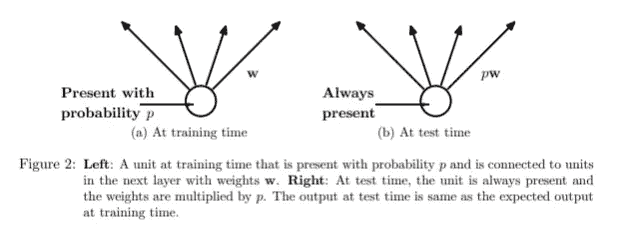

# 机器学习中处理欠拟合和过拟合的技术

> 原文：<https://towardsdatascience.com/techniques-for-handling-underfitting-and-overfitting-in-machine-learning-348daa2380b9?source=collection_archive---------8----------------------->

由 [Unsplash](https://unsplash.com?utm_source=medium&utm_medium=referral) 上的 [Pietro Jeng](https://unsplash.com/@pietrozj?utm_source=medium&utm_medium=referral) 拍摄

在本文中，我将讨论各种可以用来处理过拟合和欠拟合的技术。我将简要讨论欠拟合和过拟合，然后讨论处理它们的技术。

# 介绍

在我之前的一篇文章中，我谈到了偏差-方差权衡。我们讨论了偏差-方差与模型复杂性的关系，以及欠拟合和过拟合的情况。如果您不理解这些术语，我鼓励您阅读这篇文章:

</bias-variance-trade-off-7b4987dd9795>  

让我们快速回顾一下下图。

来源:线性回归的欠拟合、最佳拟合和过拟合[1]

**欠拟合**发生在模型有非常高的偏差，无法捕捉数据中的复杂模式的时候。这导致更高的训练和验证错误，因为模型不够复杂，不足以对底层数据进行分类。在上面的例子中，我们看到数据具有二阶关系，但是模型是线性模型，所以它不能

**过度拟合**则相反，因为模型过于复杂(或更高的模型),甚至会捕捉到数据中的噪声。因此，在这种情况下，人们将观察到非常低的测试误差值。然而，当它不能推广到验证集和测试集时。

我们希望找到模型在训练和验证误差值之间具有较小差距的最佳拟合情况。它应该比另外两种情况更好地概括。

# 如何处理不合身

1.  在这种情况下，最佳策略是通过增加深度学习模型的参数数量或模型的阶数来增加模型的复杂性。拟合不足是由于模型比需要的简单。它无法捕捉数据中的模式。增加模型复杂度将导致训练性能的改善。如果我们使用足够大的模型，它甚至可以实现零训练误差，即模型将记住数据并遭受过拟合。目标是达到最佳的甜蜜点。
2.  尝试为更多的纪元训练模型。确保损失在培训过程中逐渐减少。否则，很有可能是训练代码/逻辑本身存在某种 bug 或问题。
3.  如果您没有在每个历元后重排数据，可能会损害模型性能。此时，确保您正在混洗数据是一个很好的检查。

# 如何处理过度拟合

与欠拟合相反，有几种技术可用于处理过拟合，人们可以尝试使用。让我们一个一个来看。

**1。获得更多的训练数据**:虽然获得更多的数据并不总是可行的，但是获得更多有代表性的数据是非常有帮助的。拥有更大的多样化数据集通常有助于提高模型性能。你可以得到一个更好的模型，它可能会更好地概括。这意味着模型在看不见的数据(真实测试集)上的性能会更好。

**2。增强**:如果你不能获得更多的数据，你可以尝试增强来增加数据的变化。扩充意味着通过类似于您在真实数据中可能预期的变化的转换来人为地修改您的现有数据。对于图像数据，【https://imgaug.readthedocs.io/en/latest/】的[是一个非常全面的库，给你大量的增强方法。它允许你快速有效地组成强大的增强序列。我推荐以下两篇文章，供进一步阅读。Olga Chernytska](https://imgaug.readthedocs.io/en/latest/) 有一篇关于图像增强的[详细文章](/complete-guide-to-data-augmentation-for-computer-vision-1abe4063ad07)，你应该考虑阅读一下。 [Valentina Alto](https://medium.com/u/341264d69dd4?source=post_page-----348daa2380b9--------------------------------) 在本文中很好地解释了如何在 Keras [中进行图像增强。](https://medium.com/analytics-vidhya/data-augmentation-in-deep-learning-3d7a539f7a28)

**3。早期停止[2，3]** :早期停止是一种正则化形式，以避免在用迭代方法训练学习者时过度拟合，例如梯度下降[2]。在训练神经网络时，我们迭代地使用来自训练数据的梯度，并试图使模型更好地逼近潜在的真实世界函数。从某种意义上说，这种方法可以让你停在最佳拟合点或其附近。从而防止过度适应训练集并减少泛化误差。为了决定何时停止，我们可以监控某些指标，如 loss、test_accuracy、val_accuracy，并根据满足的某些条件停止训练。

**4。正则化 L1，L2** :正则化是一个附加项，它被添加到损失函数中，对大的网络参数权重施加惩罚，以减少过度拟合。L1 和 L2 正则化这两种广泛使用的技术。虽然它们惩罚大的权重，但是它们都以不同的方式实现正则化。
**L1 正则化:** L1 正则化将权重参数的 L1 范数的缩放版本添加到损失函数中。L1 正则化的等式为:

其中 Lreg =正则化损失，E(W) =误差项，λ是超参数，||W||₁是权重的 L1 范数
现在，即使误差项为零，只要权重不为零，我们仍将具有+ve 高 Lreg 值。由于优化问题的目标是最小化 Lreg，将重量设置为零将导致更低的损失。权重中的零越多意味着越稀疏。有可用的几何解释表明稀疏解更多。您可以观看/阅读以下视频/文章:

1.  [https://www.youtube.com/watch?v=76B5cMEZA4Y](https://www.youtube.com/watch?v=76B5cMEZA4Y)
2.  [稀疏性和 L1 范数](https://www.youtube.com/watch?v=76B5cMEZA4Y)[https://towardsdatascience . com/regulation-in-machine-learning-connecting-the-dots-c6e 030 BF addd](/regularization-in-machine-learning-connecting-the-dots-c6e030bfaddd)
3.  [https://developers . Google . com/machine-learning/crash-course/正则化稀疏性/L1-正则化](https://developers.google.com/machine-learning/crash-course/regularization-for-sparsity/l1-regularization)
4.  [针对稀疏性的正则化:L₁正则化](https://developers.google.com/machine-learning/crash-course/regularization-for-sparsity/l1-regularization)[https://www . INF . ed . AC . uk/teaching/courses/mlpr/2016/notes/w10a _ sparsity _ and _ L1 . pdf](https://www.inf.ed.ac.uk/teaching/courses/mlpr/2016/notes/w10a_sparsity_and_L1.pdf)

**L2 正则化**:我们将权重的平方 L2 范数添加到成本/损失/目标函数中。L2 正则化的等式如下:

其中 Lreg =规则化损失，E(W) =误差项，λ是称为规则化率的超参数，||W||₂是权重的 L2 范数
该方程的导数导致优化期间权重更新方程中的以下项:

其中η是学习率

我们看到旧的权重被(1-ξλ)缩放或者随着每次梯度更新而衰减。因此，L2 正则化导致更小的权重。因此，它有时也被称为重量衰减。要获得详细的解释，我强烈推荐你阅读谷歌机器学习速成班的这篇文章:[简单的正则化:L₂正则化](https://developers.google.com/machine-learning/crash-course/regularization-for-simplicity/l2-regularization)

**Dropout [4]** :这种技术的主要思想是在训练过程中从神经网络中随机丢弃单元。在以下论文中提出:[辍学:防止神经网络过度拟合的简单方法(2014)](https://www.cs.toronto.edu/~hinton/absps/JMLRdropout.pdf)Srivastava 等人在训练期间，随机辍学样本形成了大量不同的“稀疏”网络。通过从概率为 **p** (用于得到 1)的伯努利分布中提取来构建矩阵，从而实现丢失(即**丢失概率为 1-p** )，然后与隐藏层的输出进行逐元素乘法。下图显示了培训阶段的辍学情况。

来源:[4]

辍学确保没有一个神经元最终过度依赖其他神经元，而是学习一些有意义的东西。可以在卷积层、池层或全连接层之后应用 Dropout。

需要记住的另一件事是，由于在训练过程中，所有的神经元并不是一直都是活跃的，而是有一个概率 p，所以在推理过程中，权重需要与该值成比例。你可以在文章中读到更多关于缩放需求的内容: [CS231n 卷积神经网络用于视觉识别](https://cs231n.github.io/neural-networks-2/)

来源:[4]

**DropConnect** :这种技术就像把辍学带到了下一个层次。我们不是随机丢弃节点，而是随机丢弃权重。所以我们不是关掉一个节点的所有连接，而是切断某些随机连接。这意味着具有 DropConnect 的全连接层变成了稀疏连接层，其中在训练阶段随机选择连接[5]。对于 DropConnect 层，输出如下所示:

其中 r 是层的输出，v 是层的输入，W 是权重参数，M 是用于截断随机连接的掩码矩阵，这些随机连接是以概率 p 从伯努利分布中抽取的。掩码 M 的每个元素是在训练期间针对每个示例独立抽取的。作为这些随机连接丢弃的结果，我们获得了网络权重的动态稀疏性，从而减少了过度拟合。

参考

[1] [Pinterest 图片](https://i.pinimg.com/originals/72/e2/22/72e222c1542539754df1d914cb671bd7.png)

[2] [提前停车](https://en.wikipedia.org/wiki/Early_stopping)

[3][https://machine learning mastery . com/early-stopping-to-avoid-overtraining-neural-network-models/](https://machinelearningmastery.com/early-stopping-to-avoid-overtraining-neural-network-models/)

[4] Nitish Srivastava、Geoffrey Hinton、Alex Krizhevsky、Ilya Sutskever 和 Ruslan Salakhutdinov。2014.辍学:防止神经网络过度拟合的简单方法。j .马赫。学习。第 15 号决议，第 1 段(2014 年 1 月)，1929-1958 年。

[5] [论文用代码— DropConnect 解释](https://paperswithcode.com/method/dropconnect)