# 电信客户汇率分析

> 原文：<https://towardsdatascience.com/telco-customer-churnrate-analysis-d412f208cbbf?source=collection_archive---------6----------------------->

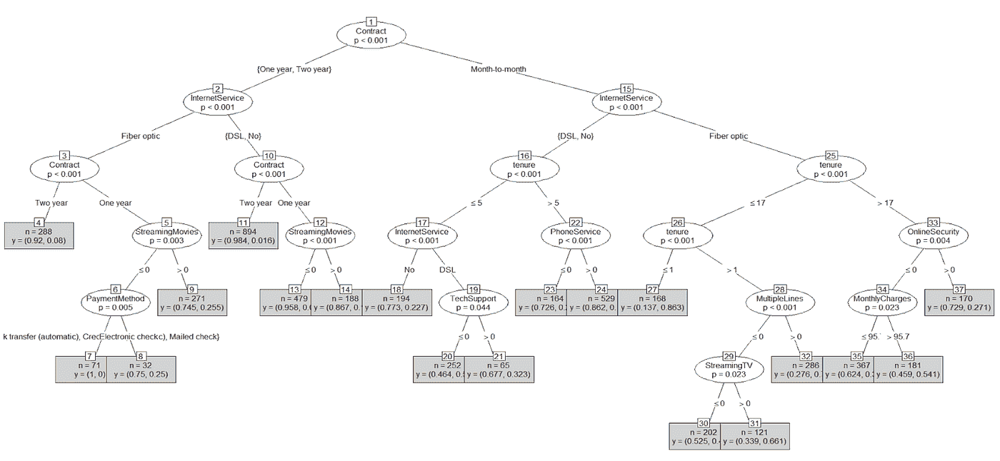

随机森林图片，作者图片

## *基本但详细的流失率分析*

在这篇博客中，我们将描述我们如何建立基本但有用的模型来解释基于 Kaggle Telco 客户数据集的流失率。具体过程包括(1)背景和问题，(2)数据总结和探索性分析，(3)数据分析，(4)策略建议，局限性和未来研究。

该项目由**马书恒、**承建。要查看使用的完整代码，请找到[我们的 GitHub](https://github.com/hzmsh/ChurnRate) 。

# 第 1 部分—背景和问题

**1.1 背景**

随着使用电话服务的客户数量大幅增加，电信公司的营销部门希望吸引更多新客户，并避免现有客户终止合同(流失率)。为了扩大客户群，电信公司的增长率(新客户数量)必须超过流失率(现有客户数量)。导致现有客户离开其电信公司的一些因素是其他公司提供的更好的价格、更快的互联网服务和更安全的在线体验。

高流失率会对公司的利润产生不利影响，并阻碍增长。我们的客户流失预测将能够向电信公司提供清晰的信息，使其了解如何留住现有客户，并了解导致现有客户终止合同的潜在原因(高流失率)。

电信公司可以使用我们的分析来衡量它提供的产品与其竞争对手提供的产品相比是否有用。由于获得新客户的成本远高于保留现有客户的成本，公司可以使用流失率分析来提供折扣、特别优惠和优质产品，以保留现有客户。

**1.2 数据来源**

电信公司的数据集在 Kaggle 上可用 [**，它来自 IBM 样本集集合。该公司为加州的 7043 名客户提供家庭和互联网服务。我们的挑战是帮助公司预测留住客户的行为，并分析所有相关的客户数据，以开发有针对性的客户保留计划。**](https://www.kaggle.com/blastchar/telco-customer-churn)

所提供的数据集包含以下信息:

1.  客户的人口统计信息，包括性别、年龄、婚姻状况
2.  客户账户信息，包括在公司的月数、无纸化账单、付款方式、每月费用和总费用
3.  客户使用行为，如流媒体电视、流媒体电影
4.  客户注册的服务:电话服务、多重服务、互联网服务、在线安全、在线备份、设备保护和技术支持
5.  客户流失，客户在上个月离开的地方

**1.3 研究目标**

1.  哪一个是促成高保留率的最重要因素？
2.  哪种分析模型可以准确预测客户的流失率？
3.  使用不同的分析模型有什么好处和坏处？
4.  电信公司如何利用我们的分析来制定有针对性的保留计划？

**1.4 研究的合理性**

我们的客户流失分析对于电信公司了解客户停止使用其产品或服务的原因非常重要。除非公司了解客户取消导致的总收入损失，哪些客户取消，以及他们取消的原因，否则电信公司很难改进其产品和服务。

由于流失率分析是监督学习领域中的典型分类问题，我们将使用简单线性回归、二项式 Logit 回归、二项式 Probit 回归和随机森林回归来分析客户的流失行为。

我们的研究将帮助该公司提供关于如何通过针对特定客户的人口统计信息、账户信息、使用行为和注册服务来减少客户流失的见解。

# **第二节—数据汇总和探索性分析**

我们用来分析的数据是 Kaggle 上的二手数据，Kaggle 是一个开源的数据聚合平台。一部分数据附在图 1 中。

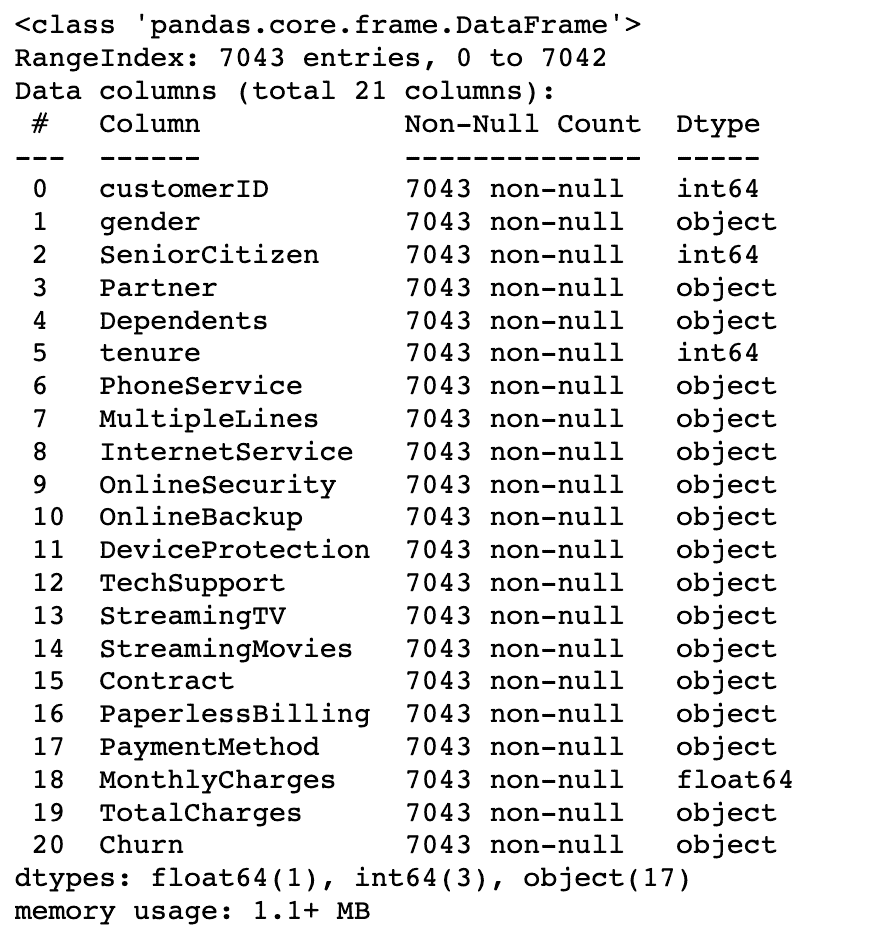

图 1:数据源表，按作者分类的图片

**2.1 数据介绍:**

在 Python 中使用 Pandas 读取数据后，我们发现原始数据集中没有缺失数据，并且大多数特征(如性别、电话服务、支付方式等)都是分类数据。

每月费用和总费用都是数字数据。每月费用的汇总统计如下:

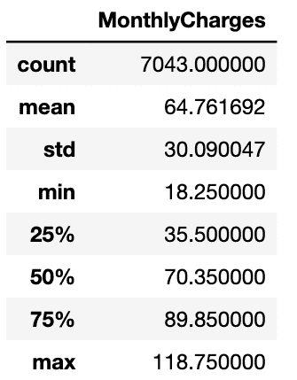

图 2:每月费用，按作者分类的图片

平均来说，人们为这些服务支付 64.76 美元，最贵的每月收费是 118.75 美元。最便宜的月费是 18.25 美元。

**2.2 相关性:**

使用标签编码和编码器转换所有分类数据后，我们对所有特征进行了成对关联:

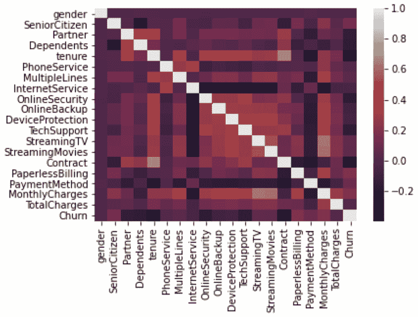

图 3:热图:功能的相关性，按作者分类的图片

从热图中，我们可以看到“合同”和“任期”这两个特征有很高的相关性。这是有意义的，因为这些特征衡量了客户的忠诚度。

“流媒体电视”、“流媒体电影”、“多线”和“月费”彼此具有高度相关性。我们认为这是因为观看电影的客户更有可能观看电视。由于他们在观看电影或电视节目时使用大量数据，他们的月费往往会上涨。对于账户上有多个账户的客户来说，他们比只有一个账户的客户更有可能支付更多的费用。

## **2.3 探索性数据分析**

**2.31 分类数据分析:**

*   如图 4:老年公民，老年公民客户更有可能为电信服务流失。

图 4:老年公民，作者图片

*   如图 5:合作伙伴，没有合作伙伴的客户更有可能为电信服务流失。

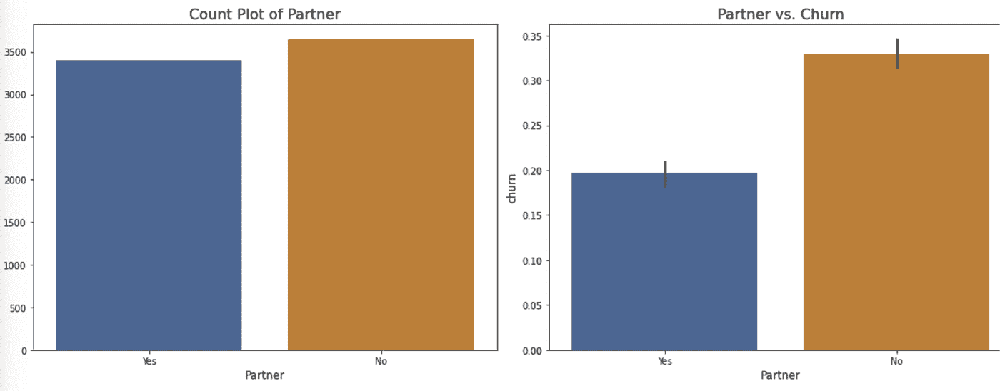

图 5:合作伙伴，作者图片

*   如图 6:依赖，没有依赖的客户更有可能为电信服务流失。

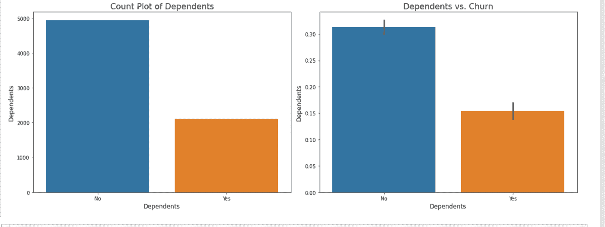

图 6:依赖者，按作者分类的图像

*   如图 7:互联网服务，看起来大多数人都在使用光纤互联网，订购光纤互联网的客户更有可能流失。

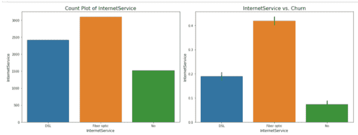

图 7:互联网服务，作者图片

*   如图 7:流电视和图 8:流电影，有趣的是看到流电视和流电影的人更容易流失。这可能意味着流媒体电视和电影的客户对电信公司的流媒体服务不满意。

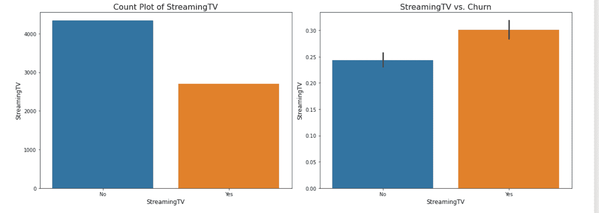

图 7:流媒体电视，作者图片

图 8:流媒体电影，作者图片

**2.32 数值数据分析:**

*   如图 9:每月收费，在宁滨之后，为了更好的可视化，将数据分成 6 个箱，每个箱中的客户数量相等。与支付较少费用的人相比，每月支付 70.35 美元至 118.75 美元的客户更有可能流失。

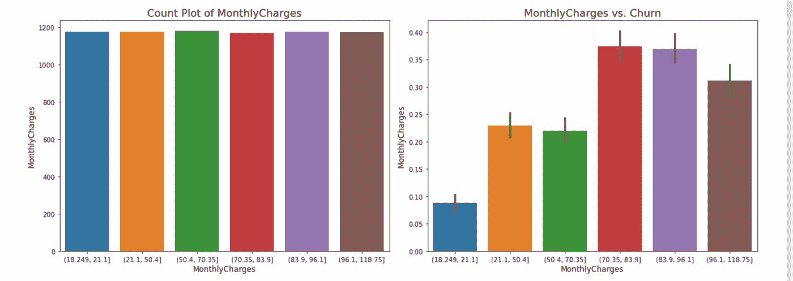

图 9:每月费用，按作者分类的图片

如图 10:每月收费，在宁滨之后，为了更好的可视化，将数据分成 5 个箱，每个箱中的客户数量相等。与每月支付超过 18.799 美元至 267.07 美元的人相比，每月支付 18.799 美元至 267.07 美元的客户最有可能流失。

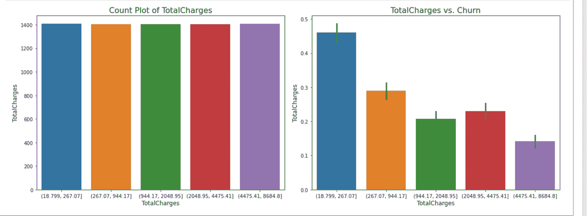

图 10:总费用，按作者分类的图像

# **第 3 节—数据分析、主要发现和结论**

我们为数据选择的四种方法是(1)简单线性回归；(2)二项式 Logit 回归；(3)二项式概率单位回归；(4)随机森林回归。

**3.1 车型介绍**

下面开始解释我们的**首选**的模型:简单线性回归。线性回归模型将目标预测为特征输入的加权和。线性回归的优点和缺点主要是由于它的简单性和易用性作为我们的基准精度和参考。

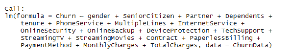

图 11:简单的线性模型，作者的图片

**我们第二个选择**的模型:二项式 logit 回归与模型 1 不同。二项式逻辑回归是一个 sigmoid 函数，其中输出是概率，输入可以是从-无穷大到+无穷大。

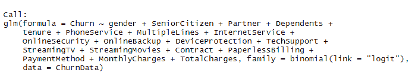

图 12:二项式 Logit 回归，作者图片

对于我们的特定数据集， **pro side** 包括(1)它对二项式输出数据集极其有用。(2)与先进的机器学习模型相比，它仍然相当容易解释。(3)将来可以方便地扩展到多个类。(4)它可以将模型系数解释为特征重要性的指标。

而**端**包括(1)它假设因变量和自变量之间的线性关系。(2)输出仅限于离散数据格式。

我们的第三个选择模型:二项式概率单位回归与我们的第二个概率单位模型有很多相似之处。然而，它们确实有一些不同之处。在相似性方面，它们在二项式数据集上都表现得相当好。对于差异，在概率单位模型中，它表示累积的正态 pdf。因为逻辑模型的尾部略平，所以概率单位曲线比逻辑曲线更快地接近轴。尽管我们不得不承认逻辑回归模型比概率单位模型更容易解释，因为逻辑回归可以被解释为建模对数优势，但尝试这两种模型并在之后进行检查仍然是一个不错的主意。

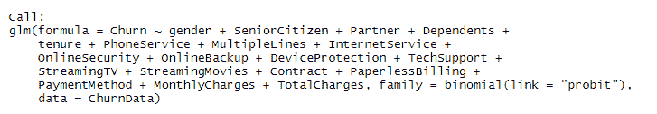

图 13:二项式概率单位回归，作者图片

我们的第四个也是最后一个模型是一个相当常用的机器学习模型:随机森林。随机森林模型由大量单独的决策树组成，这些决策树作为一个整体运行。随机森林中的每棵树都有一个类别预测，得票最多的类别成为我们模型的预测。

在我们的例子中，有利的一面包括(1)它通常提供高精度并很好地平衡偏差-方差权衡。(2)可以作为特征重要性可视化。(3)它在相当程度上不受离群值的影响。(4)既能处理线性关系，又能处理非线性关系。缺点是(1)与以前的模型相比，它更难解释。(2)如果数据集很大，则需要更长的时间。

**3.2 数据分析的细节**

在我们将数据集应用到所选模型之前，第一步总是转换和清理我们的数据。在我们的案例中，为了充分展示数据的威力，我们需要采取几个步骤。

**3.21:删除 NA**

作者删除 NA、*图像的代码*

我们的数据来自现实情况，其中极有可能包含空的数据单元格。的确如此。在删除之前，总共有 7043 条意见。

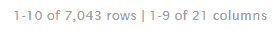

图 14:删除前，作者的图片

删除后，它有 7032 个观察值。

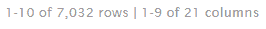

图 15:删除后，作者的图片

因此，它只删除了 9 个空观测值，这对我们的数据集应该只有一个可忽略的影响。

**3.22:将“否”转换为 0，将“是”转换为 1**

我们的许多数据列的默认值都是二进制的:它们要么是“是”，要么是“否”。

转换二进制代码，作者的*图像*

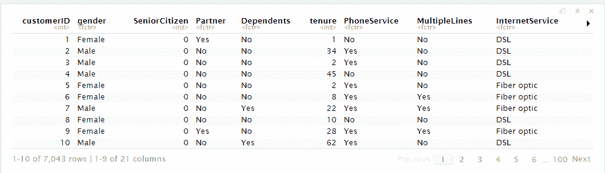

图 16:默认值，作者图片

为了更好地操作数据，我们最好将它们转换为 0 和 1。

**3.23:因子转换**

因子转换代码，*图片作者*

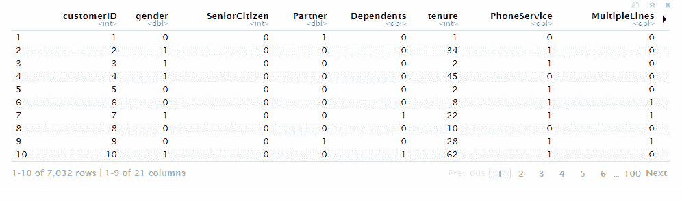

图 17:转换后，作者的图像

有三列特征应被编码成因子:

1.  互联网服务，包括 DSL、光纤和
2.  合同包括逐月、一年和两年。
3.  付款方式包括银行转账、信用卡、电子支票和邮寄支票。

完成这三个步骤后，我们现在可以将数据放入我们选择的模型中。

**3.3 主要结果、发现和解释**

作者创建模型、图像的代码

**3.31 简单回归模型**

让我们逐一运行上面选择的四个模型。第一个是简单的线性回归模型。

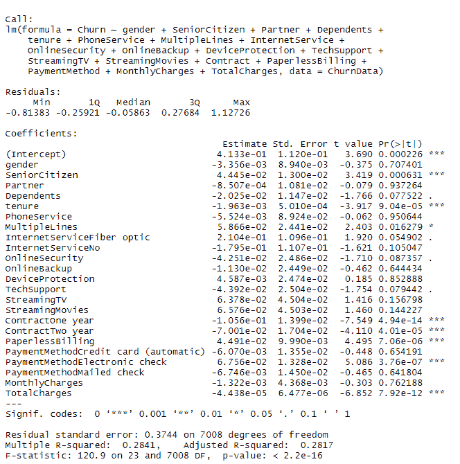

图 18:简单线性回归结果，作者图片

根据图 18 中的结果:简单线性回归，在仔细检查每个变量的显著性并只保留那些 p 值小于 0.05 的变量后，我们得到的方程是:

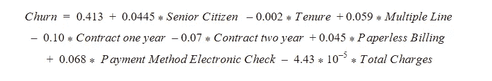

图 19:带系数的简单线性回归，作者图片

这个等式告诉我们，如果客户是老年人，使用多条线路，使用无纸化结算，使用电子支票作为支付方式，他或她更有可能流失。

然而，如果客户在公司呆的时间更长(任期)，选择一年或两年的合同，而不是按月选择，并且公司提供更便宜的价格，他或她就不太可能流失。

**3.32 Logit 回归模型**

我们的第二个模型是二项式逻辑回归模型。

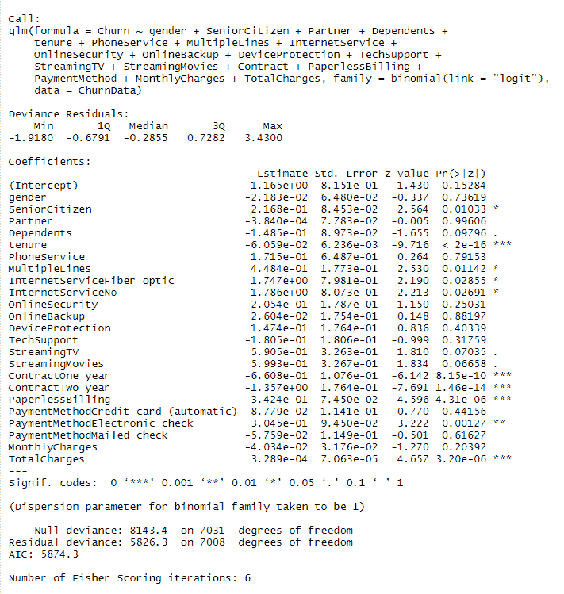

图 20:二项式逻辑回归结果，作者图片

根据图 20 中的结果:逻辑回归模型，在仔细检查每个变量的显著性并仅保留 p 值小于 0.05 的变量后，我们得出的方程为:

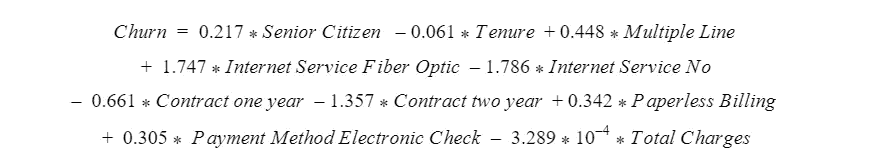

图 21:带系数的二项式逻辑回归，作者图片

这个等式告诉我们，如果客户是老年人，使用多条线路，使用光纤互联网服务，使用无纸化计费，使用电子支票作为支付方式，他或她更有可能流失。

然而，如果客户在公司呆的时间更长(任期)，根本不选择互联网服务，选择一年或两年的合同而不是按月选择，并且公司提供更便宜的价格，他或她就不太可能流失。

**3.33 概率单位回归模型**

我们的第三个模型是二项式概率单位回归模型。

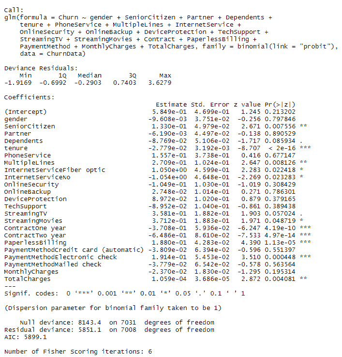

图 22:二项式概率单位回归结果，作者图片

根据图 22 中的结果:概率单位回归模型，在仔细检查每个变量的显著性并只保留那些 p 值小于 0.05 的变量后，我们得到的等式是:

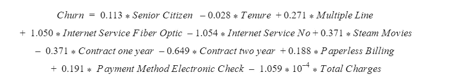

图 23:带系数的二项式概率单位回归，作者图片

这个等式告诉我们，如果客户是老年人，使用多条线路，使用光纤互联网服务，使用流媒体电影，使用无纸化结算，并使用电子支票作为支付方式，他或她更有可能流失。

然而，如果客户在公司呆的时间更长(任期)，根本不选择互联网服务，选择一年或两年的合同而不是按月选择，并且公司提供更便宜的价格，他或她就不太可能流失。

**3.34 随机森林模型**

我们的第四个模型是随机森林。下面列出了随机森林的具体代码。

随机森林代码，作者图片

森林中的一棵样本树具有以下形状:

图 25:样本树，作者的图片

这确实是一个非常拥挤的树，因为我们有很多特征来进行分割。每个节点代表由树做出的决定或标准，每个分支代表父节点和子节点之间的关系。最终，所有结果将被分配到节点的最后一级。

并且从随机森林的特殊特性中，我们还可以选择检查特性的重要性:

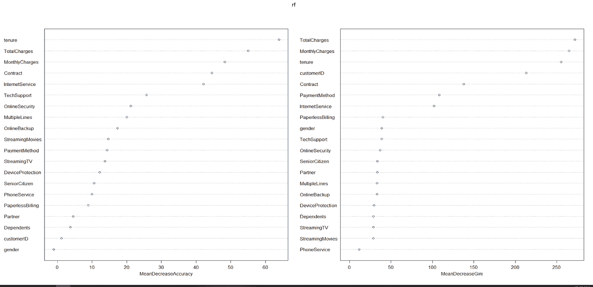

图 25:按作者排序的随机森林特征重要性图片

图 25:附录中的随机森林要素重要性，重要性通过平均降低精度计算得出:如果我们删除该变量，模型精度会降低多少。在右侧，该表使用平均下降基尼系数来衡量:基于基尼系数杂质指数的可变重要性衡量，用于计算树中的分裂。

对于这两个表，最上面的是任期，总费用，每月费用，合同，互联网服务。这个结果与我们以前的“模型”的显著结果相一致。

代码的准确性比较，图片由作者

**3.4 精度对比与探索**

至于比较不同模型的准确性，我们首先将数据集分成 70%作为训练，30%作为测试。然后，我们改装模型，并在下面的 AIC/BIC 表中总结了结果。请注意，AIC 和 BIC 不适合随机森林，我们稍后将使用选定的高精度模型对它们进行比较。

**3.41 AIC/BIC 表**

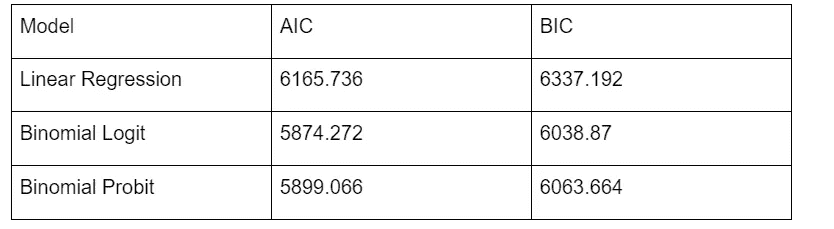

图 26: AIC/BIC 表格，作者图片

根据上面的 AIC/BIC 表，由于 AIC/BIC 越低，模型越好，我们的最佳模型是二项式逻辑回归模型。让我们通过计算预测精度来继续将其与随机森林模型进行比较。

**3.42 精度表**

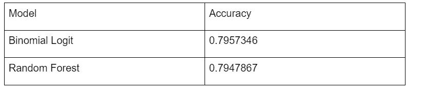

图 27:准确度表，作者图片

从上面的准确度表中，我们可以看到，尽管它们的准确度相似，但二项式逻辑回归模型的性能略好。

由于二项式逻辑回归模型是最好的一种，让我们来探讨一下它的准确性的细节。我们可以使用 ROC 曲线和混淆矩阵来考察它的更多性能。

**3.43 大鹏**

ROC 曲线代码，作者图片

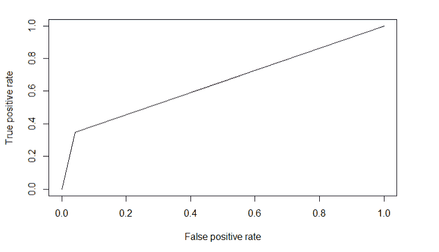

图 28: ROC 图，作者提供的图像

在图 28: ROC 图中，ROC 确定了在用户定义的阈值下分类模型的准确性。它使用曲线下面积(AUC)来确定模型的准确性。面积越高，模型越好。ROC 绘制在真阳性率(Y 轴)和假阳性率(X 轴)之间。

从结果图中，我们可以观察到，与 TPR 相比，我们的模型具有稍高的 FPR。我们将在后面的章节中通过详细的计算进行更仔细的分析。

**3.44 混淆矩阵**

混淆矩阵代码，作者图片

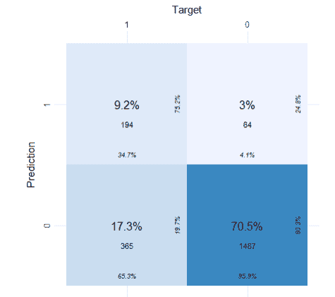

图 29:混淆矩阵，作者图片

我们还可以使用聚合混淆矩阵提取大量有用的信息。

1.  在每个瓷砖的中间，我们有计数的总百分比。实际的计数在它下面。
2.  在底部，我们有列百分比。在 Target 为 1 的所有观察值中，34.7%被预测为 1，65.3%被预测为 0。
3.  在每个图块的右侧，我们有行百分比。在所有预测值为 1 的观测值中，4.1%的观测值实际上为 1，而 95.9%的观测值为 0。
4.  颜色强度基于计数。计数越多，颜色越深。

**3.45 混淆矩阵的重要计算**

从聚集的混淆矩阵，我们可以计算大量的矩阵。

*   准确性-它决定了模型的整体预测准确性。

> 准确度=(真阳性+真阴性)/(真阳性+真阴性+假阳性+假阴性)

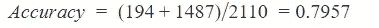

*   真阳性率(TPR)-它表示所有正值中有多少个被正确预测。也代表了敏感。

> TPR = (TP/TP + FN)

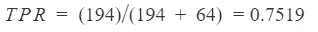

*   误报率(FPR)-它指示所有正值中有多少负值被错误预测。

> FPR = (FP/FP + TN)

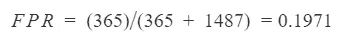

*   真负率(True 它指示所有负值中有多少负值被正确预测。它还具有特异性。

> TNR = (TN/TN + FP)

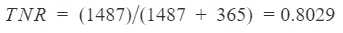

*   精度:它表示在所有预测的正值中，有多少值实际上是正的。

> 精度= (TP / TP + FP)

# **第 4 节—策略建议、局限性和未来研究**

**4.1 建议**

根据我们在第 3 节中提供的所有可视化和分析，我们可以为决策者提出以下建议:

1.  对于类似的问题，最好选择二项式逻辑回归，因为 logit 模型具有最高的准确性，并且表明了特征的重要性。它也很容易解释和应用。
2.  就我们目前的情况而言，最佳模型 logit 模型表明，如果企业想留住顾客，它可以采取以下措施:

*   更多地瞄准年轻和中年客户，因为他们更有可能采用现代技术，并且有预算来享受。
*   为决定选择一年期或两年期合同的客户提供更多的折扣，这样更多的客户将受到该合同的约束。
*   考虑整体折扣，因为价格总是客户在现有客户中选择的主要因素之一。

**4.2 限制**

对于研究的局限性，我们应该提到我们的模型和数据集的以下局限性。

1.  观察的数量还不错，但是如果我们能有更多列的特征，比如客户的地理位置、竞争对手的信息和其他重要因素，我们就能从结果中获得更多的洞察力。
2.  由于我们选择的模型不仅取决于复杂性和预测能力，更重要的是取决于解释的容易程度，因此在我们的范围之外还有更强大的模型。例如，神经网络或极端梯度提升可能会表现得更好，并导致精度提高。
3.  我们的数据集本质上是一个横截面数据集。这意味着它里面没有时间序列因素。由于我们的目标是预测流失率，我们可以选择从每月，一年到两年的合同。我们最好能找到一个包含所有客户长达两年的信息的时间序列数据集，以获得更好的结果来预测未来市场并做出决策。

**4.3 下一步**

1.  我们可以潜在地考虑拟合神经网络或极端梯度提升以获得更好的精度。然而，我们确实需要考虑解释的困难，因为这两种方法更像一个黑箱，而不是传统的清晰回归。
2.  尝试找到一个包含长达两年的所有客户信息的时间序列数据集，这样我们不仅可以应用上述模型，还可以应用时间序列域模型，如 ARIMA 模型。