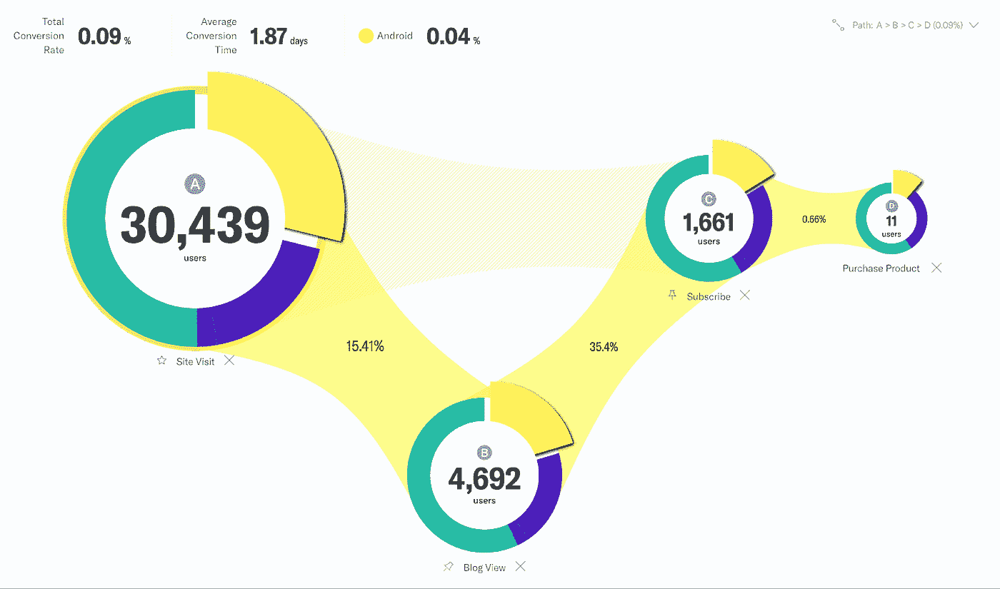
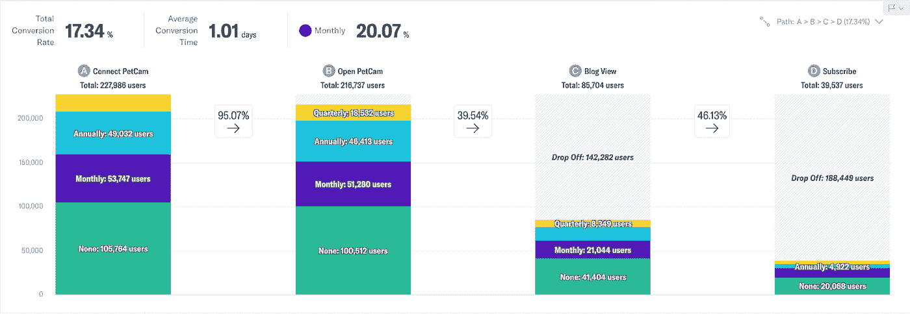
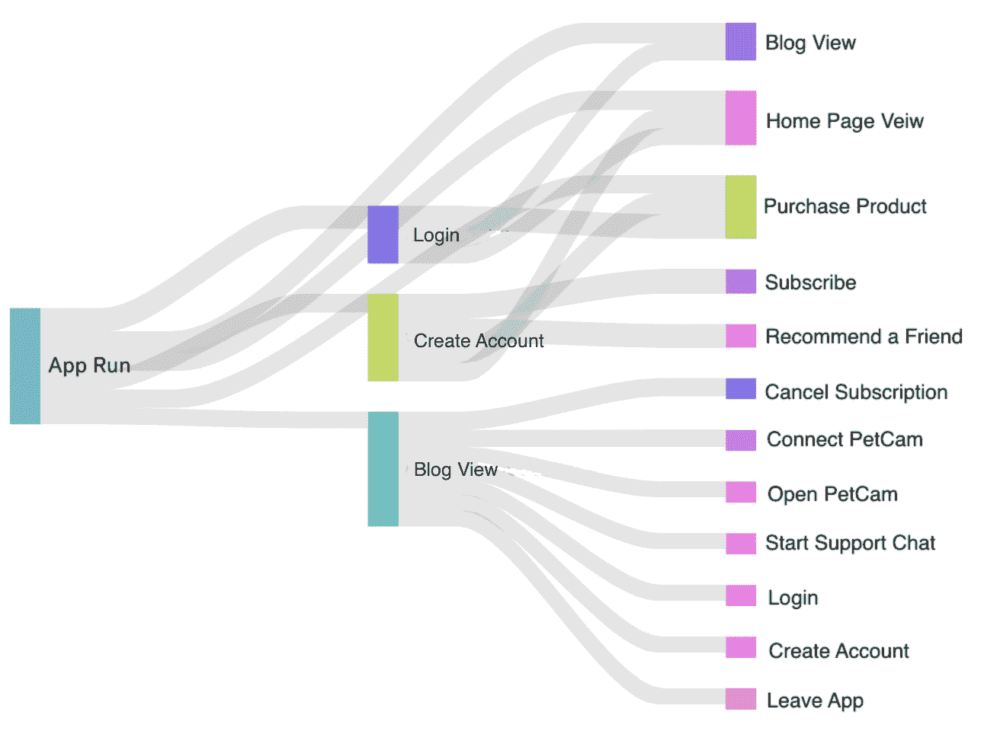

# 通过漏斗可视化讲述您的数据故事

> 原文：<https://towardsdatascience.com/telling-your-data-story-with-funnel-visualizations-1bea6d0f64df?source=collection_archive---------17----------------------->

## 数据分析的好坏取决于人类的理解，有时我们需要图片

产品经理知道个人用户数据提供了对产品优势和劣势的巨大洞察力，但是解释原始数据提出了一个挑战。即使是最好的数据分析师也不能通过盯着数据表来传达太多关于每个客户旅程的信息。当浏览数据进行分析时，您希望立即得到问题的答案，而不需要[复杂的 SQL 查询](https://www.indicative.com/indicative-blog/sql-funnel-analysis-discover-your-most-profitable-conversion-path-with-these-5-steps/)。

进入漏斗可视化。客户转化漏斗跟踪用户从第一次点击到最近互动的过程。随着产品进入大众市场，谷歌分析已经让许多人熟悉了转换漏斗的概念，但当转换漏斗显示每个用户采取的行动时，它可以提供更深入的见解。

根据数据和查询，您的客户旅程可以以多种方式细分和可视化。以下是三种不同的客户漏斗可视化方式，可帮助您从数据中获得洞察力:

**甜甜圈漏斗**

虽然圆环图是最基本的数据可视化之一，但它有助于在整体的几个细分或切片之间进行简单的比较。

图 1(作者图片)

在上面的*图 1* 中，圆环图是[多路径漏斗](https://www.indicative.com/data-defined/multipath-funnel/)的一部分，切片代表客户用来访问网站的设备类型。在第一个甜甜圈中，Android 用户(黄色部分)占网站访客的四分之一以上，但随着用户在漏斗中移动，Android 用户的流失远远超过其他设备上的用户。当漏斗到达最终的甜甜圈图——通过购买实现的客户转化——时，Android 用户只占一小部分。这向产品经理和开发人员表明，他们的网站设计不适合 Android 用户。

在漏斗可视化中使用圆环图(或饼图)的一个缺点是，切片数量越多，图表[越难解读](https://www.data-to-viz.com/caveat/pie.html)。人类很难判断多个相似角度之间的差异，因此尽管整体的 17%和 11%之间存在显著差异，但你可能不容易在环形图中发现它。因此，它们最适用于比较两到三个群体行为的漏斗。

**条形图漏斗**

相反，放在漏斗顶部的条形图非常适合表示许多组之间的比例差异。这种可视化也很容易定制；您可以上下移动条形图的每个部分，以更好地显示数据所讲述的故事。

条形图漏斗在识别客户旅程中的关键摩擦点时特别有用，因为旅程中的每一步都用一个新的条形图表示。当客户完成转换漏斗中的一个步骤时，他们可以继续进行下一个步骤(他们将出现在下一个条形图上),或者离开图表。

在下面的*图 2* 中，一家公司推出了名为“PetCam”的功能，旨在吸引动物爱好者更多地关注他们的网站。然而，柱形图漏斗显示，尽管新用户和现有客户都会连接并打开“PetCam”，但该功能并没有对博客流量或新订阅量产生太大影响。它本身可能是一个有趣的功能，但数据显示它没有产生预期的影响。

图 2(作者图片)

**桑基图**

毫无疑问，散点图比饼状图和条形图更难理解，但你可能熟悉它们在化学和物理中的用途。他们绘制了一个过程中几个不同阶段的能量或物质流，记录了损失和低效。当你的漏斗需要跨区间的更大规模时，桑基图比饼图和棒线更好。

随着你的产品变得越来越复杂，你的客户的旅程变得不那么线性。客户通过你的网站或应用程序的途径不太可能是单一的。桑基图可以确定许多不同的途径，导致成功的客户转换。以*图 3* 中的例子为例。

图 3(作者图片)

使用“PetCam”的同一家公司将其客户转化漏斗显示为 Sankey 图。考虑到目标是让用户购买产品，似乎最重要的目标是增加拥有账户的用户数量。然后，产品经理可以重新设置图表，专注于用户在创建帐户之前所做的事情，并挖掘那些成功的客户旅程以获得更多见解。

**结论**

漏斗可视化通过数据更深入地直观表达用户决策。用文本或数据表成功地导航客户之旅需要机器般的处理数字和跟踪线索的能力。我们都是人。产品经理、营销人员和数据分析师等可以使用漏斗可视化来更好地理解用户做出的非线性人类决策。数据为您的团队设计个性化的用户体验铺平了道路，以提高销售额和客户转化率。即使是一个基本的饼图也能指明方向。