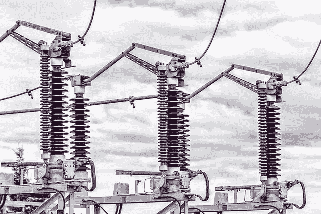
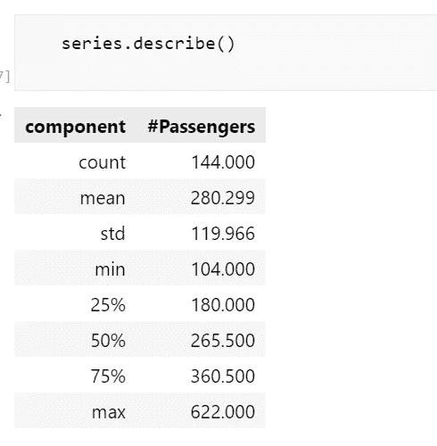
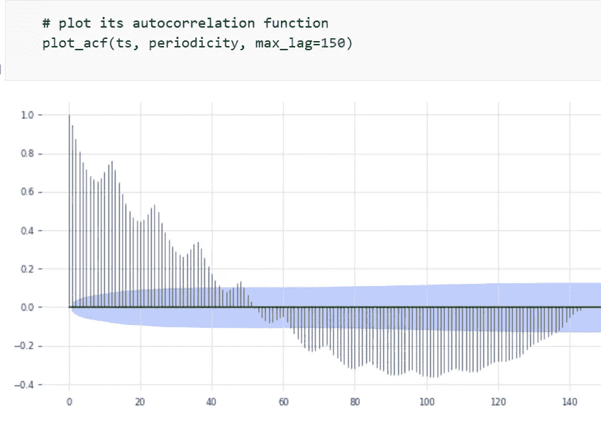
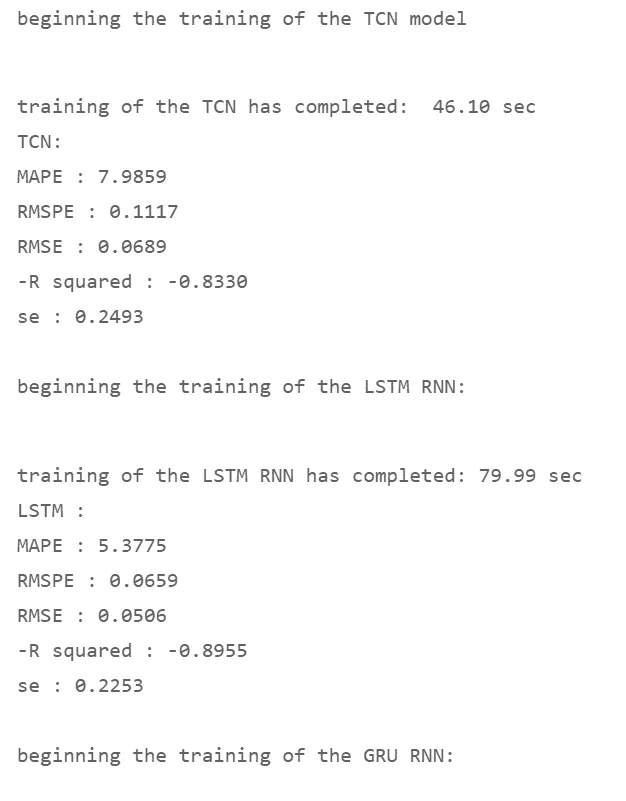
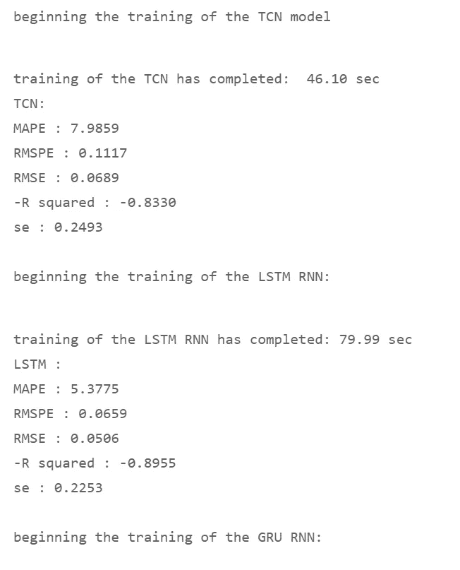
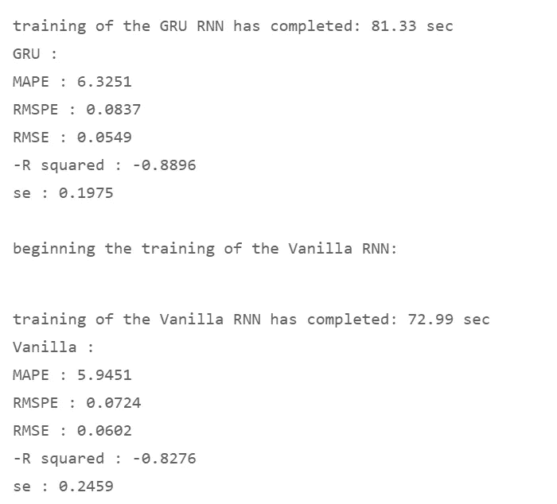
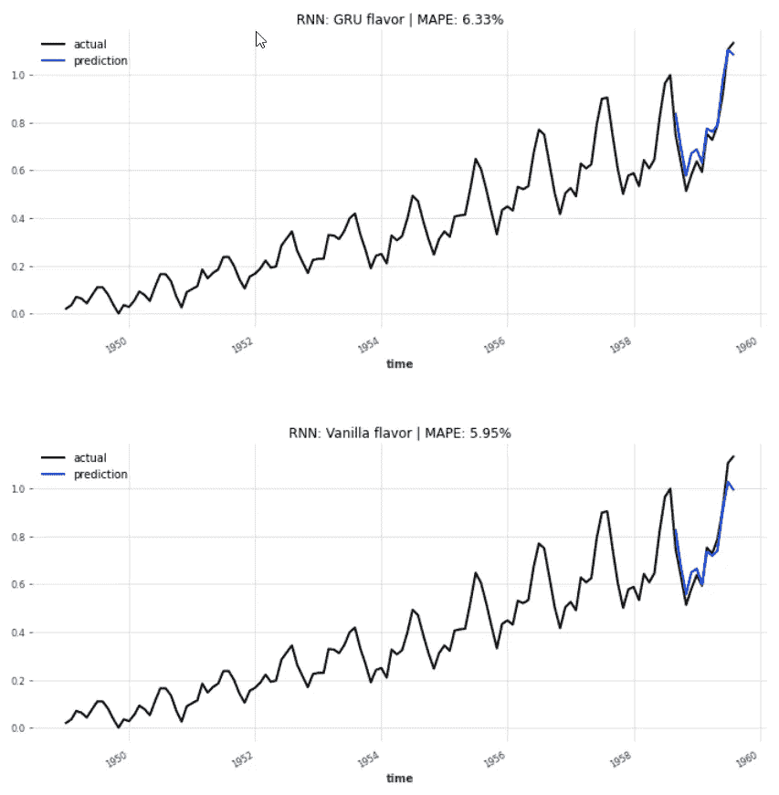
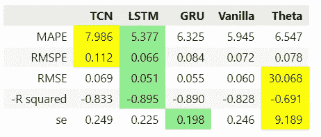

# 时态线圈:Python 中时间序列预测的时态卷积网络介绍

> 原文：<https://towardsdatascience.com/temporal-coils-intro-to-temporal-convolutional-networks-for-time-series-forecasting-in-python-5907c04febc6?source=collection_archive---------3----------------------->

## 一个 TCN 教程，使用飞镖多方法预测库

昨天的文章提供了一个关于*递归神经网络(RNNs)的教程:*它们的 *LSTM，GRU，*和*香草*变种。今天我们来补充一下**时态卷积网络(TCNs)，**作为这个关于时间序列预测器的小编第四篇文章的第十种方法。

[螺旋弹簧，数字艺术家，皮特·林弗斯 Pixabay 上的免费图片](https://pixabay.com/illustrations/coil-slinky-spring-flexible-spiral-632650/)

*   [时间循环:Python 中用于时间序列预测的递归神经网络简介|走向数据科学](/temporal-loops-intro-to-recurrent-neural-networks-for-time-series-forecasting-in-python-b0398963dc1f)
*   [预测者群体的智慧。面向数据科学的 Python |时间序列集合预测](/wisdom-of-the-forecaster-crowd-f70b398f190b)
*   [飞镖的时间序列预测瑞士刀|走向数据科学](/darts-swiss-knife-for-time-series-forecasting-in-python-f37bb74c126)

RNN 教程通过描述神经网络的核心特征和术语，提供了一般神经网络和递归神经网络的快速运行。今天的文章将从这个基础开始，然后强调时态卷积网络不同于 RNNs 的方面。

我们将通过使用 *Darts* 库构建一个 TCN，它包装了 *PyTorch* 包中可用的神经网络；然后在一个小型锦标赛中运行我们的 TCN，对抗三个 RNN 变体和我们昨天遇到的 Theta 方法。

# 1.时间卷积网络的概念

卷积神经网络(CNN)通常应用于计算机视觉任务:图像或视频识别和分类。

[Alexander Lesnitsky 的投影仪电影《The》——pix abay 上的免费图像](https://pixabay.com/illustrations/projector-film-movie-the-movie-4598558/)

Sumit Saha 在 2018 年发表的一篇文章对 CNN 在图像处理中的应用进行了出色的概述([卷积神经网络综合指南 ELI5 way |作者 Sumit Saha |迈向数据科学](/a-comprehensive-guide-to-convolutional-neural-networks-the-eli5-way-3bd2b1164a53))。

受视觉皮层早期研究的启发，卷积神经网络的基本架构于 1979 年首次提出。由此产生的“neocognitron”被应用于手写日文字符的识别。

CNN 的核心架构由输入层、隐藏层(其中包括卷积层)和输出层组成。隐藏层执行卷积。*汇集*层收集整理中间成果。*完全连接的*层试图导出描述输入值到输出的映射的非线性函数。类似于 RNNs，TCN 也有一个*成本*或*损失函数*，它试图将其最小化以减少预测误差。

一个*卷积*是积分学中的一个运算。卷积采用两个函数，其中一个被反转和移位，并计算它们乘积的积分。卷积函数表示一个函数的形状如何被另一个函数修改。卷积类似于*互相关*，因为它反映了两个系列或序列的相似性。

根据计算机视觉术语，给定节点监管的输入被称为*感受野*或*小块*。每个节点接收来自网络前一层的有限区域的输入，即节点的感受域。

CNN 将*过滤器*应用于输入，以检测特征的存在。它的节点或神经元充当这些过滤器。

在图像中，形状或颜色可以代表一个特征。一个*过滤器*可以专门用于例如垂直线的检测。其他过滤器会将自己与其他特征挂钩，例如水平线。在时间序列中，趋势或季节性是需要隔离的特征。滤波器的值是 CNN 将在训练期间校准的权重，以最小化损失函数中表达的预测误差。当在搜索拍照宠物时对图像进行分类时，CNN 将学习分离狗或猫的特征，从而在它训练的过滤器的帮助下建立一个狗或猫的分类器。在处理时间序列时，它可以学习识别它们的趋势和季节性模式。

节点创建一个*特征图，*映射出特征的存在。过滤器穿过其输入面片，并检查其是否存在该特征。结果收集在要素地图中。内核或特征检测器是一个二维权重数组。内核穿过图像的感受野来检测特征。滤波器在输入端移动的距离称为*步幅*。

*完全连接的*层接收提取的特征作为输入，并应用激活函数。这一层之所以得名，是因为它将一层中的每个节点与另一层中的每个节点连接起来:全连接层中节点的感受野是整个前一层。完全连接的层构建了一个通常非线性的函数，该函数将它从前一层接收的特征联系在一起。

CNN 通过一系列的训练时期——前馈接着反向传播——学习从本质特征中挑选出不重要的特征。

**时间卷积网络**——最近的发展([一种用于序列建模的通用卷积和递归网络的经验评估(arxiv.org)](https://arxiv.org/abs/1803.01271))——将递归神经网络的某些属性添加到经典的 CNN 设计中。

TCN 确保*因果卷积*。输出值必须只依赖于在输入序列中位于前面的值。

*TCN 中的扩张*将一个节点的感受野扩大到包含更多的历史时期。

[线圈高压技术电源，由 analog us-pix abay 上的免费照片](https://pixabay.com/photos/coil-high-voltage-technology-4320892/)

# 2.属国

在 Darts 模型中，我们现在还在第 8 行中导入了 TCNModel 子类。

我们对昨天与 RNN 相关的脚本做了一个小小的改动，对三个 rnn 和 TCN 进行了不同于 0.1 的*漏失*水平的实验。 *Dropout* level 表示打开或关闭网络中节点的选项。这是为了防止过度拟合。节点不容易越来越深地陷入连接节点的特定配置中。卷积网络具有更高的过拟合倾向，因此我们不会关闭压差。

Darts 集成了一些经典的数据源，其中包括 Box & Jenkins 的 *airline passenger* 数据集，我们可以从库中加载该数据集，而无需导入文件。

在航空公司乘客的例子中，我选择 1958 年 8 月 1 日作为测试周期的开始，用常量 FC_START 表示。我们将预测 12 个月，输入常量 FC_N。

# 3.准备数据

Darts 的 *load()* 函数允许我们将时间序列读入一个 *timeseries* 对象*。*

函数 *pd_dataframe()* 可以将 timeseries 对象转换为“正常”序列和 dataframe，使其与 pandas 提供的数据争论方法兼容。

作者图片

作者图片

作者图片

该图表揭示了一个非常类似于一个日历年中 12 个月的季节性。为了证实这一点，我们应用了 Darts 的*check _ seasonity()*检验，该检验评估自相关函数 ACF。测试证实时间序列的周期正好是 12.0 个月。就像图表一样，这表明时间序列具有相对简单的模式。

作者图片

作者图片

接下来，我们将时间序列拆分为一个训练数据集和一个验证数据集，时间段 FC_START 是我们在 dependencies 单元格中选择的常量:19580801。

在将源数据输入神经网络之前，我们需要通过应用一个 *Scaler()* 函数来规范化它们。归一化抵消了前一篇文章提到的*爆炸梯度问题*。缩放还将使神经网络更容易运行梯度下降来搜索最小预测误差。

目前，时间序列的日期是用字符串编码的。为了使 TCN 能够识别时间步长，我们从这些字符串中提取月份，并通过应用 Darts '*datetime _ attribute _ time series()*函数将它们定义为第二列—协变量或外生回归变量。然后我们用一个定标器将协变量标准化。

# 4.模型的设置

列表*模型*排列了我们想要在时间序列上释放的四个神经网络:我们今天介绍的 TCN 模型；以及我们在昨天的教程中设计的三种类型的递归神经网络:LSTM、GRU 和香草 RNN。

在第 5 行，我们准备了一个条件列表理解，它将一个接一个地读取四个模型，并将它们传递给我们将在下面编写的设置函数。

注意列表理解中的' *if — else'* 条件。TCN 和 RNN 的参数设置不同，因此 list comprehension 为它们调用了不同的函数——*run _ TCN()*和 *run_RNN()* 。它将在变量 *res_models* 中收集它们的结果——预测准确性指标。

作者图片

RNN 模型的训练函数， *run_RNN()* ，基本上与我们在昨天的文章中讨论的相同。我将跳过 RNNs 的部分，重点放在 TCN。

函数 *run_TCN()* 具有类似的形状，但是在某些方面与 RNNs 不同。

我们将 *input_chunk_length —* 用于预测的过去时间段的数量—设置为 13 个月，比*check _ 季节性*测试返回的周期多 1 个月。RNN 将回顾过去 13 个月，一个完整的季节周期，来计算预测。

我们选择的 *output_chunk_length* 包含一个完整的季节周期的 12 个月。它必须严格小于 input_chunk_length，因此输入为 13 个月。预测范围受限于输出长度。

为了进行实验，我们将*辍学*水平设置为 0.1，而不是我们之前使用的零比率。下降水平将有助于模拟不同的网络架构。在每个时期，网络会选择一组不同的神经元，并暂时移除。不同的神经元组合然后做出预测。这些重组将防止 TCN 过度适应同一组神经元。

过滤器的*数量*应该反映时间序列中固有模式的假定复杂性。我们从折线图中获得的视觉线索表明了一个相对简单的时间序列，具有趋势和季节性的单一顺序。因此，三到五个过滤器应该足以反映其复杂性。

布尔参数 *weight_norm* 确定 TCN 是否将使用权重归一化。归一化具有权重向量的长度与其方向解耦的效果，这将加速朝向最小误差的梯度下降([权重归一化:加速深度神经网络训练的简单重新参数化(neurips.cc)](https://proceedings.neurips.cc/paper/2016/file/ed265bc903a5a097f61d3ec064d96d2e-Paper.pdf) )。然而，一项研究发现，一种替代方法，批量归一化，可能会导致更好的测试准确性([【1709.08145】大规模图像分类的批量归一化和权重归一化算法的比较(arxiv.org)](https://arxiv.org/abs/1709.08145))。因此，重量定额是一个用户可以选择调整的超参数。

*膨胀基数*因子使 TCN 延伸到时间上更早的节点。这扩展了一个节点的感受域以包含更多的历史时期。它为 TCN 提供了记忆。*内核大小*应设置为至少与选择的膨胀因子一样大。

在第 6 行到第 18 行建立模型之后，我们将它与第 23 行到第 28 行的训练数据相匹配。拟合器参考训练和验证数据集，并使用它们的时间序列值和我们定义为协变量的月份系列。

第 35 到 37 行得出 12 个月的预测值。

在第 40 行，我们调用了与 RNN 模型相同的绘图仪函数 *plot_fitted()* 。

第 43 行将预测值和实际值提供给 *accuracy_metrics()* 函数，该函数将计算平均绝对百分比误差和一些其他预测质量指标。

当脚本拟合四个模型时，它会显示其进度，然后报告结果准确性指标:

作者图片

作者图片

绘图仪功能绘制实际观测值和 12 个月的预测值。蓝色预测值的线条与黑色实际曲线相对接近。

作者图片

作者图片

递归神经网络的 LSTM 变体拥有最低的 MAPE，为 5.38%，其次是香草味，为 5.95%。在本例中，TCN 无法发挥其优势，报告的 MAPE 明显高于三个 rnn，为 7.99%。

正如我们昨天所做的，我们通过应用非神经网络预测器(Theta 方法)准备了一个快速基准预测，它将在几秒钟内运行，并将该基准与 TCN 和 RNNs 进行比较。

作者图片

# 5.结论

作者图片

Theta 预测的预测误差排在所有三种 RNN 风味之后，尽管它的 MAPE 和均方根百分比误差 RMSPE 低于 TCN。

在本例中，TCN 的绝对 RMSE 和 R 平方(预测中的运动份额与实际观测中的运动一致)优于θ。但是三个 rnn 仍然胜过 TCN 和西塔。

这个特殊的例子不太适合 TCN，但对更复杂模式的时间序列问题的研究——例如厄尔尼诺-南方涛动的预测，太平洋表面的周期性、非季节性变暖——发现 TCN 的准确性优于递归神经网络(【times 提前预测的时间卷积网络|(nature.com) )。

Jupyter 笔记本可在 GitHub 下载:[h3ik0th/Darts _ TCN _ RNN:Darts(github.com)中用 TCN 和 RNN 神经网络进行时间序列预测](https://github.com/h3ik0th/Darts_TCN_RNN)