# 时态融合转换器:Python 深度预测入门

> 原文：<https://towardsdatascience.com/temporal-fusion-transformer-a-primer-on-deep-forecasting-in-python-4eb37f3f3594?source=collection_archive---------2----------------------->

## 端到端的例子:概率时间序列预测使用 TFT，一个基于注意力的神经网络

tommyvideo 的 Pixabay 上的原子分子化学-自由图像

两个月前，我写了两篇文章，解释了使用递归和时态卷积神经网络进行时间序列预测。两篇文章都继续吸引着读者。

 [## 时间循环:Python 中用于时间序列预测的递归神经网络简介

### 一个关于 LSTM，GRU 和香草 RNNs 的教程-由 Darts 多方法预测库包装

towardsdatascience.com](/temporal-loops-intro-to-recurrent-neural-networks-for-time-series-forecasting-in-python-b0398963dc1f)  [## 时态线圈:Python 中时间序列预测的时态卷积网络介绍

### 一个 TCN 教程，使用飞镖多方法预测库

towardsdatascience.com](/temporal-coils-intro-to-temporal-convolutional-networks-for-time-series-forecasting-in-python-5907c04febc6) 

由于深度预测的初级读本显然有很多读者，我认为神经网络预测者中的最新竞争者也会有类似的兴趣。让我们在书架上增加第三个深度预测者。

*   在今天的文章中，我们将实现一个**时间融合转换器(TFT)。**我们将使用 Darts 库，正如我们在 RNN 和 TCN 的例子中所做的那样，并将 TFT 与两种基线预测方法进行比较。
*   虽然之前的文章准备了确定性预测，我们将通过研究**概率**预测来扩展我们的范围。概率预测是一种输出类型，TFT 和其他神经网络在对它们的损失函数进行一些调整后，已经很好地装备了这种输出。

对于神经网络的一般入门，以及它们在时间序列预测中的应用，我建议从我上面列出的两篇文章中的第一篇开始，“时间循环”。如果你已经知道递归或卷积网络的元素，让我们直接跳到时间融合转换器。

# 1.概念

## 1.1 什么是时间融合转换器？

TFT 提供了一种神经网络架构，它集成了其他几种神经架构的机制，例如 LSTM 层和变压器中使用的注意力头。

最近的一篇[谷歌人工智能博客文章——“时间序列预测的可解释深度学习](https://ai.googleblog.com/2021/12/interpretable-deep-learning-for-time.html)”(2021 年 12 月)——提供了时间融合转换器的概述。作者测试了 TFT 的替代方法，如 DeepAR，ARIMA 和 LSTM Seq2Sep。他们在四个数据集上运行它们，并将它们的性能制成表格。TFT 的表现优于其他模型——包括经典方法和不同类型的神经网络。其 50%和 90%的分位数损失比第二好的模型，LSTM Seq2Seq 网络的至少低 7%。

arxiv 在 2020 年末的一篇文章“用于可解释的多时域时间序列预测的时间融合转换器”([arxiv.org)](https://arxiv.org/pdf/1912.09363.pdf))中介绍了 TFT 的概念。

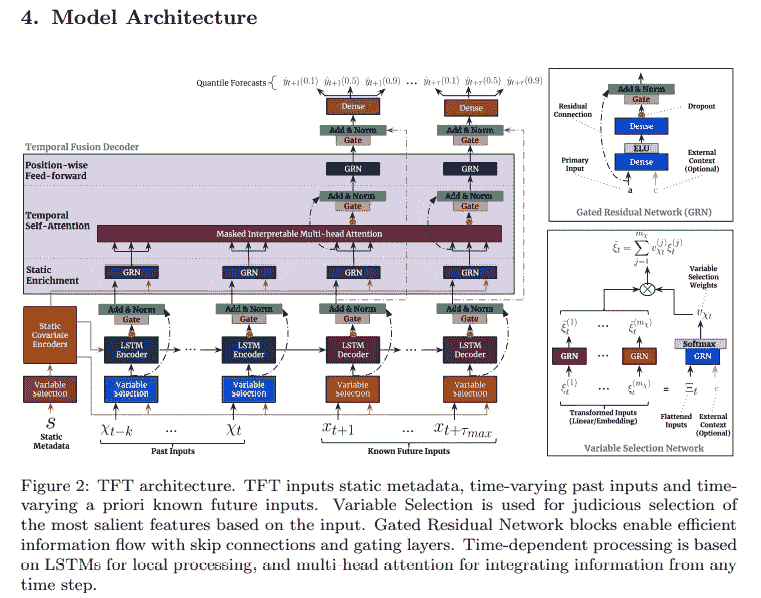

布莱恩·林等人，2020 年，【912.09363.pdf】1(arxiv.org)

基本构件专门寻找时间序列中的不同方面或模式，其中包括:

*   时间多头**关注块**，识别时间序列可能持有的长期模式，并优先考虑最相关的模式；每个注意力头可以聚焦于不同的时间模式；
*   **LSTM 序列到序列**编码器/解码器，用于总结更短的模式；LSTM 块用于确定时间步长与其周围值的关系(而长期关系则留给注意力集中的人)；
*   **门控残差网络**块，grn，用于剔除不重要的、未使用的输入。他们还可以随机删除节点，以防止过度拟合。

时间融合解码器之所以得名，是因为它结合了这些专门的层来学习沿时间轴的关系。

TFT 最小化分位数损失函数，这使得它能够生成概率预测。

## 1.2 什么是概率预测？

确定性预测生成展望期内时间段的*点估计值*。它们没有揭示与点估计相关的不确定性——预测误差的分布。我们想要估计预测值可能与真实值不同的范围。哪个最小值和最大值将包含真实值？

一个**概率预测器**超出了每个时间步的点估计，并能画出高于和低于平均预测值的可能预测误差带。

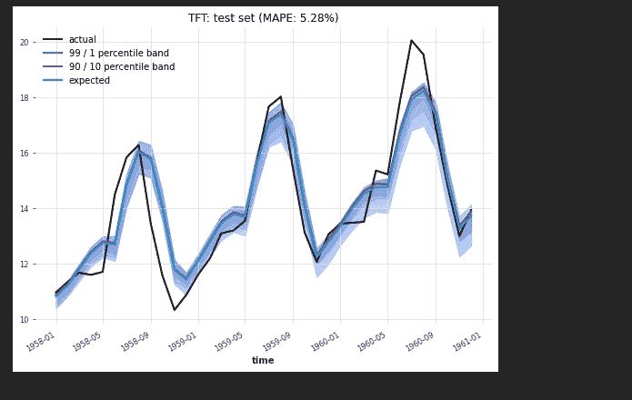

作者图片

任何神经网络都是根据评估预测误差的损失函数来训练的。为了从点估计转移到概率预测，损失函数需要修改，以便*分位数回归*可以应用于它。

维基百科解释说“分位数回归的实用性的关键在于分位数可以表示为最小化问题的解决方案。”✅check——我们希望最小化神经网络的损失函数。

Darts 包包装了 PyTorch 预测包中内置的功能。PyTorch 实现了分位数损失函数，Wen 等人在他们的 [2017 论文(arxiv.org)](https://arxiv.org/pdf/1711.11053.pdf)中对此进行了描述。

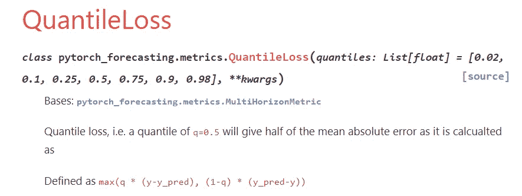

[QuantileLoss — pytorch 预测文档](https://pytorch-forecasting.readthedocs.io/en/latest/api/pytorch_forecasting.metrics.QuantileLoss.html)

为了理解分位数损失函数的行为，我在旧 Excel 中准备了一个包含一些玩具值的表格。

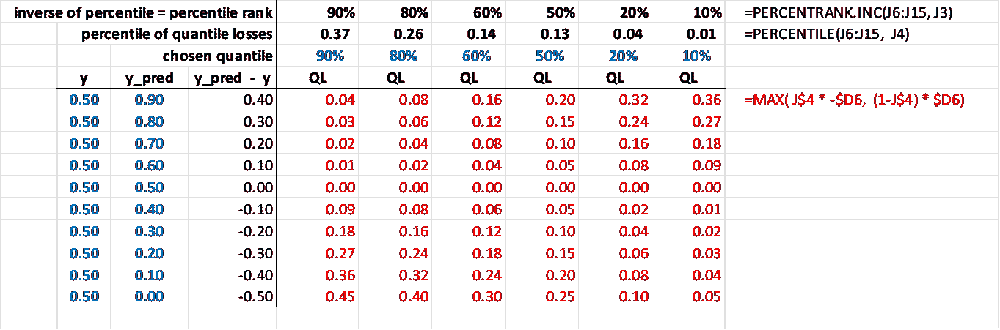

作者图片

*   在最左边的一列，我列出了实际的观察值 *y* ，我把它们都设置为 0.5。除了列 *y_pred* 中的一个预测值之外，所有的预测值都超过或低于它们对应的实际值 y
*   红色列包含分位数损失函数，QL。在它的顶部，用蓝色表示，我们可以看到相应的损失列用来衡量预测误差的百分比值。
*   当我们研究 90%列时，我们看到 QL 函数用 10%来衡量高估(第一行:高估 0.40，分位数损失 0.04)和低估 90%(最后一行:低估-0.50，分位数损失 0.45)。
*   10%分位数列返回 90%分位数列的镜像。
*   Excel 的百分位函数计算相应 QL 列的损失百分位。例如，90%百分位得出的加权损失为 0.37:该列中 10 个损失中有 9 个不超过 0.37 的阈值。
*   顶行十字只是通过将百分点转换回百分比值来检查结果。
*   50%百分位等于绝对预测误差(y_pred — y)的一半，如第三列(黑色列)的选定行所示。如果使用这种“减半”损失在预测值上下加一个括号，该括号加起来就是完全绝对预测误差(y _ pred-y)。
*   其他互补损失对的总和也产生相同的完全绝对预测误差:90%/10%、80%/20%或 50%/50%。例如，在第一行中，每一对加起来都是预测误差的绝对值:y_pred — y = 0.40。
*   因此，预测误差为我们提供了每个观察点的分位数损失范围。从该范围中选取的对可用于围绕预测线绘制百分位带，以指示预测误差的分布。

Alexandrov 等人的一篇 2019 [论文](https://arxiv.org/pdf/1906.05264.pdf)描述了亚马逊的 [GluonTS 包](https://arxiv.org/pdf/1906.05264.pdf)，还引用了 Wen 等人在第 10 页的论文，提到了“神经分位数回归模型”。它指出 GluonTS 开发者“在 GluonTS 中实现了这种分位数解码器模型的变体，产生了被称为 RNN QR 和 CNN CR 的模型。”解码器为每个时间步长生成分位数值。

# 2.设置和依赖关系

在 Juypter 笔记本顶部的单元格中，我预设了一些常数。

前七行列出了 TFT 模型的初始超参数。没有确定它们的硬性规则——否则，它们就不是用户需要选择的超参数。

*   **时期**表示训练周期的数量:一次向前传递，随后是整个训练集的一次向后传递。通常，模型将不得不经历数百个历元来校准自身并达到可接受的精度。
*   INLEN 设置输入层的 input_chunk_length 或**大小(节点数)。它不应该小于季节性的顺序，否则模型可能会在识别季节性模式时出错。理想情况下，将节点数设置为 2 的幂。要在一个月频率的时间序列中分析两年期间的季节性模式，24 个节点就足够了，但是我将这个数字向上舍入到它的下一个二进制上限值 32。这也是网格搜索为我们在本教程中使用的源数据集找到的数字。**
*   隐藏设置隐藏层的**大小。如果源数据不包含复杂的模式，过多的隐藏节点会导致过度拟合。节点太少会过于简化:模型无法捕捉复杂时间序列中的所有重要模式。一些经验法则提供了如下建议:**
*   —将隐藏节点的数量保持在输入层和输出层的大小之间；
*   —输入节点与隐藏节点的比例应为 2:1；
*   —隐藏节点=输出节点+ 2/3 *输入节点。
*   LSTMLAYERS =长短期记忆编码器/解码器的**层数。Darts API 参考建议将单层作为一个好的缺省值。**
*   ATTHEADS 表示**注意头**的数量。对于预计会呈现长期模式的大型模型，最多可以选择四个头。对于小而相对简单的数据集，如我们的例子，不超过两个注意头应该是必要的。
*   为了防止模型过度拟合，通过越来越深入地挖掘单个配置，模型应该在每次训练过程中随机选择并关闭一部分节点。我把这个**辍学率**设置为 0.1。
*   **批量大小**是模型在更新其权重之前处理的训练观察的数量。它的上限由可用内存和观察次数决定。2 的幂是更可取的，因为它们使批处理与 CPU/GPU 内存的组织方式一致。通常，批量过大会削弱模型在训练数据集之外进行归纳的能力。较小的批次会受到更多噪音的困扰，梯度下降会更频繁地改变方向。但是较粗糙的小批量可以帮助模型跳出次优的局部最小值。然而，辍学率可能是一个更好的替代工具。小批量可能产生不太精确的梯度下降。通常，32 是初始批量的推荐值。

第二部分，第 9 行和第 12 行之间，也包含超参数，但是这些值不在诸如网格搜索之类的调优工作的范围内。

*   N_FC 表示我们选择的默认**预测周期数，** 36 个月。
*   RAND 将系统的**随机状态**设置为一个固定的、可重复的初始值。
*   N_SAMPLES 建议**概率预测**模型在进行分位数回归和计算预测区间时对预测值进行采样。
*   FIGSIZE 为绘图设置一个**默认尺寸。**

第三部分，在第 22 行和第 26 行之间，定义了预测曲线的百分位带的**下限和上限。我选择 1% / 99%、5% / 95%和 10% / 90%百分点作为带宽。**

*   第四部分设置了**时间戳，TRAIN，**，在这个时间点上，我们希望在训练和测试数据集之间分割时间序列。
*   MSEAS 为我们将要运行的季节性测试绘制了一个**上限。我们预计季节性不会超过 60 个月；很可能，只需要 12 个月。**
*   阿尔法值表示假设检验的**显著性水平**。在这个脚本中，我们将应用季节性测试。
*   N_JOBS 告诉脚本**它可以使用多少处理器**。如果设置为-1，您机器上的所有处理器都将对它可用。

接下来，我们导入将要使用的包。除了我们通常的由 pandas、numpy 和 matplotlib 组成的工作台之外，我们还将接触到几个 Darts 类:TFT 模型类本身和两个可选的基线预测器；以及用于预处理、评估和绘图的类。

要安装 Darts 库，您可以遵循我之前的文章 [Python RNN:用于时间序列预测的递归神经网络](/temporal-loops-intro-to-recurrent-neural-networks-for-time-series-forecasting-in-python-b0398963dc1f)中的指导。和往常一样，在安装有多个依赖项的沉重包之前，创建一个新的虚拟环境。三个可选组件可以与省道核心包装分开存放。除了核心库，您还需要 darts[torch]组件来处理神经网络，但是您可以选择跳过可选的 pmdarima 和 prophet 组件。

# 3.数据争论和探索

Darts 库附带了一个由几个公共域数据集组成的*数据集*类。我们可以加载它们，而不是从外部源文件导入它们。在我们的练习中，我们导入并加载 Box & Jenkins 的经典航班乘客数据集。

为了解决不同月份天数不相等的问题——这可能是造成数据失真的原因之一——我们通过报告每月平均*日*乘客数量来重新衡量每月乘客的绝对数量。Darts 提供了属性 *time_index。使这个操作成为一个简单的一行程序。*

第 8 行将*时间序列对象* ts 转换为 pandas 数据帧，以获得更好的可视性。

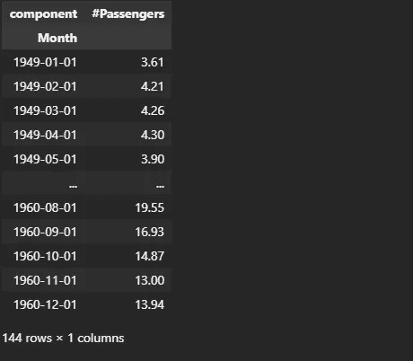

作者图片

该时间序列包含 144 个月的日均乘客人数。

源不包含缺失值。

作者图片

如果我们导入了一个外部数据源，并将其填充到 pandas 数据帧中，我们将使用 Darts 的一个实用函数将其转换为一个时间序列对象(下面的第 2 行):from_series、from_dataframe 或 from_json 等。为了演示语法，下面的第 2 行重新创建了时间序列，现在是从数据帧开始。

让我们先看一下时间序列，并使用 *plot()* 函数画出它的曲线。

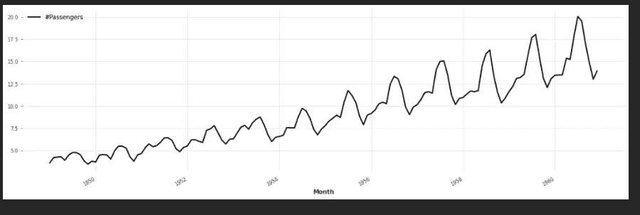

作者图片

我们发现了一个明显的上升趋势和一个稳定的年度季节性。季节性峰值的幅度随着时间的推移而增加，因此它必须表现出乘法而不是加法季节性。

Darts 提供了一个函数*check _ seasonity()*来计算自相关函数 ACF。它使我们能够通过确认 12 个月的季节性来验证我们的视觉线索。

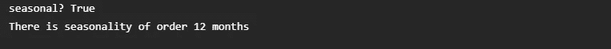

作者图片

接下来，我们使用 ETS 方法(误差—趋势—季节性)来分离趋势和季节性成分。Darts 包装了 statsmodels 包的 ETS 方法。

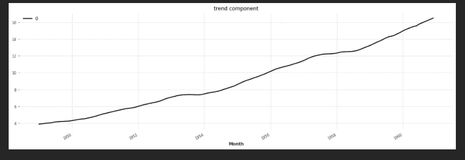

作者图片

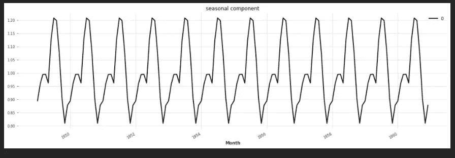

作者图片

为了准备用于预测的数据，我们在训练集和测试集之间拆分时间序列。

*   如果常量 *TRAIN* 的类型是 string，那么第 3 行将其转换为 pandas 时间戳。
*   而介于 0 和 1 之间的浮点值将被解释为脚本应该为训练保留的时间序列的百分比。
*   如果 TRAIN 是一个整数， *split()* 函数会将其解释为训练数据集应该结束的索引。

神经网络对数量的变化很敏感。因此，我们需要衡量每天的乘客数量。第 10 行使缩放器适合训练数据集。为了防止泄漏，我们没有将定标器安装到测试设备上。在训练集上专门训练了定标器之后，我们将其应用于测试数据。

产生的时间序列被标记为:

*   ts_ttrain = "时间序列-转换的训练数据"
*   ts_ttest = "时间序列—转换后的测试数据"
*   ts_t = "时间序列—转换(完整)数据"

*协变量*在回归术语中被称为回归变量或独立变量。我们的示例数据集没有提供影响 20 世纪 50 年代乘客数量的外生协变量。当然，增加更多目的地的航线或降低票价将对乘客数量产生重大影响。我们手头没有这样的源数据。

相反，我们将从我们在源中找到的时间戳中导出两个协变量，这将使任何类型的神经网络更容易在时间轴上分离模式。在下面的第 2 行中，我们使用 Darts 的*datetime _ at ribute _ time series()*函数来隔离年份。在第 3 行中，我们将月份作为另一个协变量，并将其与年份相结合(叠加)。第 4 行添加了一个连续的整数索引。这三个变量共同构成了*协变量*时间序列， *cov* 。

我们在第 11 行中拆分了训练集和测试集之间的协变量。再次需要应用于训练部分的缩放器，以使神经网络可消化协变量。

# 4.天真的基线预测

任何预测方法，如时间融合变换，如果比简单的基线预测模型提供更好的准确性，就可以说是有技巧的。如果我们选择的准确性度量——我们的练习中的平均绝对百分比误差——比基线模型实现的要差，那么更复杂的模型将被认为是无用的。

一个**天真的季节性预测**简单地假设时间序列值将每 K 个时间步重复一次。我们在上面评估的*check _ seasonity()*函数证实了 mseas = 12 个月的季节性，我们将其输入到预测器中。

但我们也观察到了强劲的上升趋势。因此，预测应该反映出季节性高峰不会保持不变，而是逐年上升。n**a ve drift**在第一次和最后一次观察之间画一条直线，以反映该趋势线。

天真的漂移和季节性的总和产生了一条预测曲线，该曲线与测试集中的实际观察值相对接近，尽管它没有完全预测到在测试集的最后时刻，即 1960 年，乘客数量的峰值。

测试集的 MAPE 低至 5.71%，这意味着时间序列表现良好，具有稳健的规则模式。这是更复杂的预测模型必须与之竞争的基准。

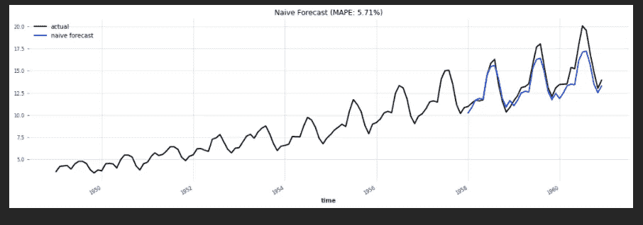

作者图片

# 5.指数平滑基线预测

为了准备第二个基线预测，我们将应用一种经典的预测方法，即指数平滑法。它的两个超参数是

*   季节性顺序，mseas =12 个月；
*   季节性类型:年度峰值幅度的增加意味着一种倍增而非累加的季节性模式。

函数 *predict()* 的参数为:

*   预测范围 *n* ，在我们的例子中是测试集中的月数；
*   可选参数 *num_samples* —如果 num_samples 设置为大于 1，模型将返回概率预测。

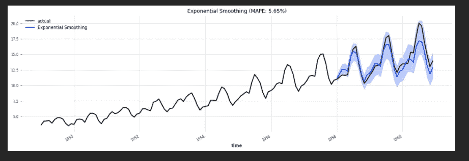

作者图片

指数平滑预测器与天真的预测相差无几，显示出最低的平均绝对百分比误差:5.65%对 5.71%。天真的预测不容易被击败的事实再次证实了我们的时间序列呈现出一种非常有规律的、重复的模式。

# 6.时间融合变压器

## 6.1 TFT 设置和培训

TFT 模型是用我们在笔记本顶部单元格中列出的超参数设置的。

由于我们想要获得概率预测，我们建议预测者应用分位数回归，使用常数列表*分位数*作为其参数，将频率从 0.01 排列到 0.99。对于确定性预测，我们将使用传统的损失函数 *loss_fn* (此处注释掉)。

第 15 行使模型符合训练数据集。它的参数*future _ co variables*由年、月和我们从时间戳得到的整数索引组成。

## 6.2 TFT 测试

完成训练后，我们预测测试数据集中的每日乘客数量。

如果 num_samples 设置为大于 1 的整数值，我们得到一个概率预测，Darts 时间序列属性确认:*is _ probabilical？*

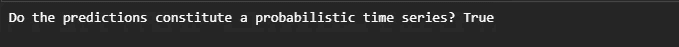

作者图片

接下来，我们将编写一个助手方法 *plot_predict，*，它将使用 Darts 的 *plot()* 函数来绘制预测曲线。它将中值预测曲线的百分位带的选定下限和上限作为其参数。请记住，我们在 Jupyter notebok 的顶部定义了三个这样的百分位数:1%/99%，5%/95%，10%/90%。

第 9 行到第 11 行使用第一对和第三对。第二对，5%/95%，会使图表过于拥挤，因此我把它的代码行注释掉了。

第 12 行画出了平均预测曲线。或者，我们可以通过将参数 *central_quantile* 设置为 0.5 来选择中间值。

第 21 行调用了助手方法 *plot_predict* ，在运行融合转换器之前，我们已经对源数据应用了缩放转换。

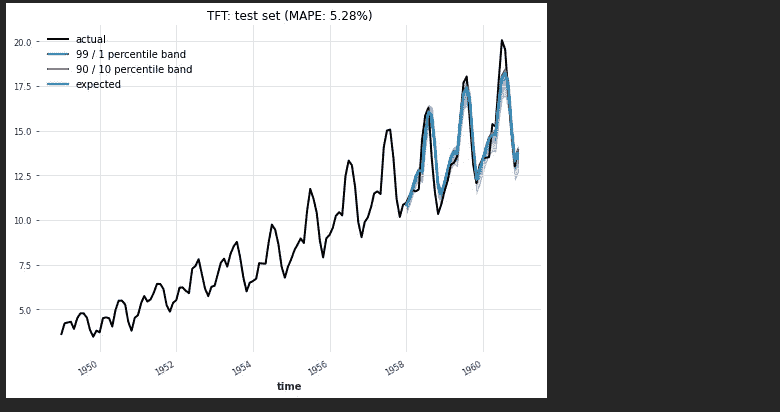

作者图片

预测值与测试窗口中的实际乘客人数非常一致。TFT 的 MAPE 低于任一基线预测器的误差。

让我们放大测试集，以便我们可以辨别百分位数。训练期间的预测误差很小，因此百分位带相对于平均值来说比较紧密。1960 年，乘客数量的激增超过了前几年的趋势。这就是 TFT 低估峰值的原因，就像天真的预测和指数平滑一样。这是训练数据集没有揭示的模式变化。因为它接近测试数据集的末尾，所以训练期必须覆盖整个时间序列的 90%以上才能有机会捕捉到它。

作者图片

为了将预测百分位数制成表格，

*   我们在第 2 行创建一个新的数据帧 dfY，
*   在第 13 行填入实际观察值；
*   并在第 16 行选择我们想要列表的百分点。
*   第 17 行的 list comprehension 为这七个百分点中的每一个调用辅助函数 *predQ()* 。
*   Darts 函数 *quantile_timeseries()* 计算测试集中每个月的预测百分比/分位数，在第 6 行。
*   第 7 行和第 8 行将这个分位数时间序列对象转换为传统的 pandas 序列，并将其作为分位数列插入到 dataframe dfY 中。
*   “Q50”表示确定性预测中的点估计值。然后其他分位数在每个月将这个中心预测点 Q50 括起来。

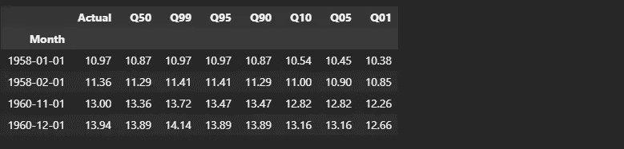

作者图片

函数*historic _ forecasts*使我们能够沿着源时间序列的完整时间轴计算预测，而不仅仅是针对测试集。

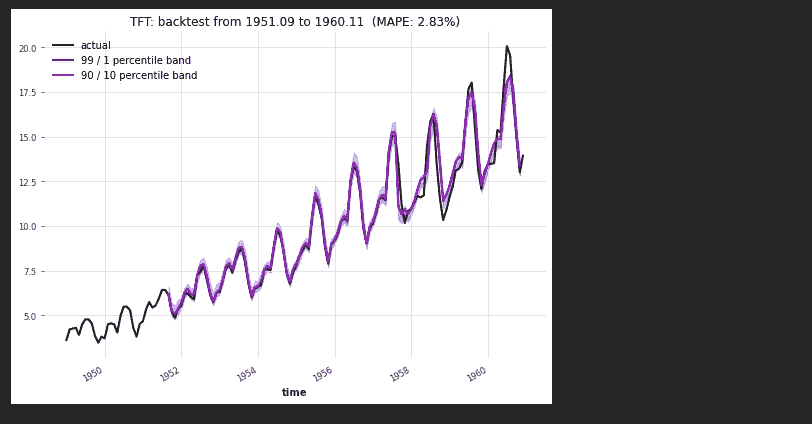

作者图片

我们观察到，从 1950 年到 1960 年的回测数据集的平均绝对百分比误差低至 2.83%。正如可以预期的那样，与测试集相比，该模型对其训练数据的拟合程度更高。5.3%到 2.8%的准确性差异主要是由于最后一年，即 1960 年，当时乘客人数超过了其长期趋势。

## 6.3 TFT 样本外预测

除了 1960 年的最后一年，我们如何产生样本外预测？

首先，我们需要创建超出我们在源数据中发现的协变量。

*   使用 Darts 函数*datetime _ attribute _ time series()*，我们在第 8 行定义了一个 pandas *date_range* ，其频率为“ *MS* (月初)”，然后提取其年份。
*   我们对几个月做同样的事情，然后把它们叠加到几年。
*   在第 17 到 20 行，使用函数 *from_times_and_values* ，我们获得一个连续的整数索引，然后将它附加到另外两个协变量上，即年和月。

像往常一样，我们需要缩放协变量，在第 23 行。

协变量跨越了 1958 年 1 月到 1963 年 12 月之间的几个月，即培训期结束后的六年。

在 72 个月的时间范围内，我们在第 29 行调用函数 *predict()* 。然后，第 31 行反转比例变换，第 33 至 44 行绘制预测曲线及其百分位带。

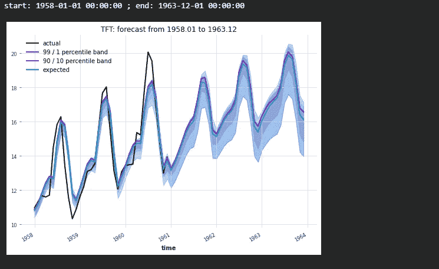

作者图片

为了在数据帧 dfY 中列出预测及其分位数，我们再次调用我们之前编写的帮助函数 *predQ()* ，使用第 4 行中的列表理解。

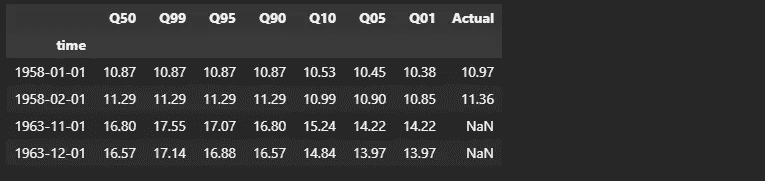

作者图片

## 6.4 TFT:保存并重新加载模型

我们获得当前工作目录的路径，定义一个文件名，并将模型保存为一个 *.pth.tar* 文件。

函数 *load_model()* 将 tar 文件取回到 RAM *中。*

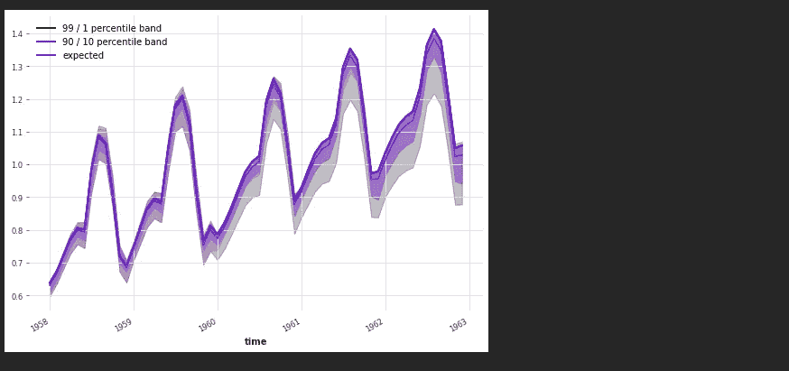

作者图片

## 6.5 通过随机网格搜索进行 TFT 调谐

Darts 库使我们能够对 TFT 模型的超参数进行网格搜索。该搜索可以包含整个搜索空间，或者可以建议该方法抽取随机样本，并且仅评估所有可能的参数元组的某个百分比。

目前，Darts 中的网格搜索适用于确定性模型，但不评估概率预测器。我们将寻找 TFT 模型的最佳确定性参数化。

我们首先在第 2 行定义一个字典*参数*。其密钥必须由 TFT 控制参数的名称组成。它的值由我们想要测试的可选参数值的列表组成。

在下面的例子中，你可以看到我定义了一个相对狭窄的搜索空间来限制评估每个可能的元组所花费的时间。对于大多数参数，我只列出两个(甚至一个)值供网格搜索研究。

*   最佳模型将通过在测试集上计算的**度量 *mape*** *、*来识别。
*   **n_jobs** 通知搜索算法它可以声明的最大处理器数量。
*   可以将 n_random_samples 设置为 0 到 1 之间的一个分数。如果小于 1，该方法将不会评估搜索空间中的每个单个参数元组，而只是给定的分数。

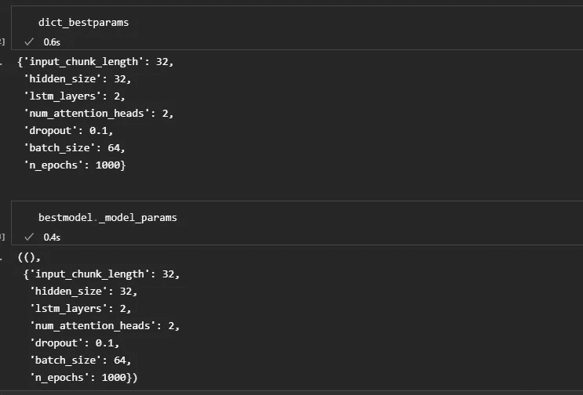

作者图片

网格搜索返回一个元组 *res* ，由报告最佳度量的模型(在我们的例子中，是最低的 MAPE)组成；和它的参数字典。参数也可以从模型对象本身的属性 *_model_params* 中获得。

接下来，我们需要训练这个调优的 bestmodel，然后才能从中检索预测值。

作者图片

网格搜索返回一个 MAPE 仅略低于初始 TFT 模型的模型。我们可以通过在更宽的参数空间中运行搜索，用更多的可选值来测试，从而提高精确度。但是在测试集上 5.2%的 MAPE 必须已经接近可达到的峰值性能。如果我们在训练集中包括 1960 年，当乘客数量超过其趋势时，我们可以期待更好的准确性。但是这会将测试数据集缩减到几个月。

# 7.结论

我们已经实现了另一个用于深度预测的神经网络，**时间融合转换器，**它是我们在前两篇文章中讨论的 RNN 和 TCN 方法中最年轻的兄弟。

这三个神经网络都能生成**概率预测**。概率模型为我们提供了对预测不确定性的洞察。

Jupyter 笔记本可以在 GitHub 上下载: [h3ik0th/TFT_darts:用时间融合变换器进行概率预测(github.com)](https://github.com/h3ik0th/TFT_darts)

 [## 每当 Heiko Onnen 发表文章时，都会收到一封电子邮件。

### 每当 Heiko Onnen 发表文章时，都会收到一封电子邮件。通过注册，您将创建一个中型帐户，如果您还没有…

medium.com](https://medium.com/subscribe/@h3ik0.th)  [## 释放时间融合变压器:Python 中多元时间序列的深度预测

### 端到端示例:带有外生变量和复杂季节性的时间序列的概率预测

medium.com](https://medium.com/@h3ik0.th/temporal-fusion-transformer-unleashed-deep-forecasting-of-multivariate-time-series-in-python-674fa393821b)