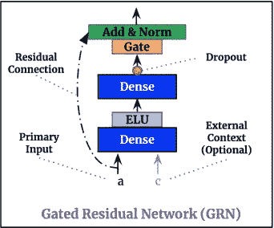
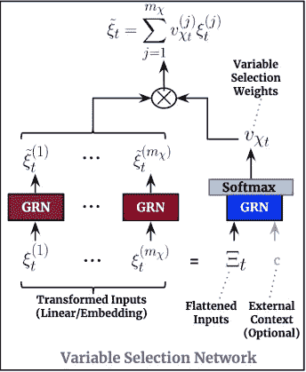
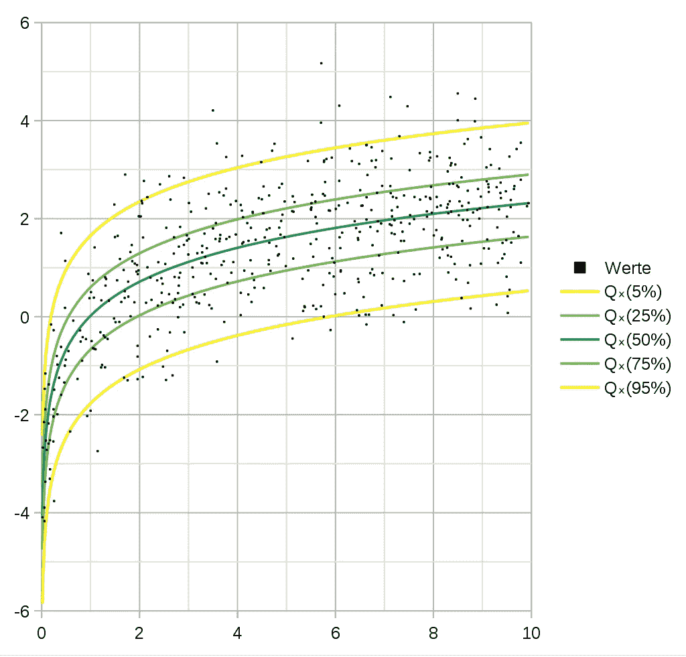
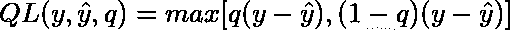
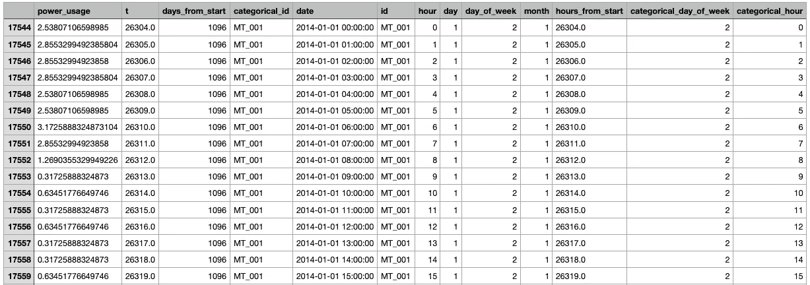
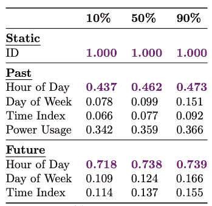
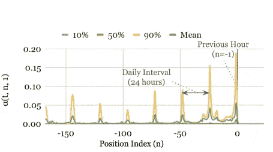

# 时间融合转换器:具有可解释性的时间序列预测

> 原文：<https://towardsdatascience.com/temporal-fusion-transformer-googles-model-for-interpretable-time-series-forecasting-5aa17beb621?source=collection_archive---------1----------------------->

## 谷歌最先进的变形金刚应有尽有


照片由 [JJ 英](https://unsplash.com/@jjying?utm_source=medium&utm_medium=referral)在 [Unsplash](https://unsplash.com?utm_source=medium&utm_medium=referral)

# 预赛

首先，让我们明确一点:为单个时间序列(无论是单变量还是多变量)定制模型的时代已经一去不复返了。

如今大数据时代，新数据点的创造极其廉价。想象一下，一家大型电气公司拥有数千个传感器来测量不同实体(例如家庭、工厂)的功耗，或者拥有大量股票、共同基金、债券等的投资组合。换句话说，时间序列可能是多元的，具有不同的分布，并可能伴随着额外的探索性变量。当然，不要忘记通常的疑点:缺失数据、趋势、季节性、波动性、漂移和罕见事件！为了在预测能力方面创建一个有竞争力的模型，除了历史数据之外，所有变量都应该考虑在内。

让我们后退一步，重新思考一个最新的时间序列模型应该考虑哪些规格:

1.  显然，该模型应适用于单维或多维序列。
2.  该模型应该考虑多个时间序列，最好是数千个。不要将此与多元时间序列混淆。它意味着具有不同分布的时间序列，在单一模型上训练。
3.  除了时间数据之外，模型应该能够使用未来未知的历史信息。例如，如果我们要创建一个预测空气污染水平的模型，我们希望能够使用湿度作为外部时间序列，这是到目前为止才知道的。例如，所有的自回归方法(如 ARIMA 模型)包括**亚马逊的 DeepAR** [1]都受到这个限制。
4.  非时间性的外部静态变量也应考虑在内。比如不同城市的天气预报(城市是静态变量)。
5.  该模型应该具有极强的适应性。时间序列可能相当复杂或嘈杂，而其他时间序列可以简单地用季节性朴素预测器建模。理想情况下，模型应该能够区分这些情况。
6.  多步预测功能也是必须的。递归提供预测的先行一步预测模型也可以工作。然而，请记住，对于长期预测，误差开始累积。
7.  在许多情况下，仅仅预测目标变量是不够的。该算法还应该能够输出反映预测不确定性的预测区间。
8.  理想模型易于使用，并且可以在生产环境中无缝部署。
9.  最后但同样重要的是，过去几年的“黑箱模型”已经开始不受欢迎。可解释性现在已经成为头等大事，尤其是在生产方面。在某些情况下，可解释性比准确性更受青睐。

> **注:**关于时间融合变压器的动手项目，查看这篇[文章](https://medium.com/p/d32c1e51cd91)。另外，查看我的[最佳深度学习预测模型列表](/@nikoskafritsas/list/timeseries-deep-learning-ultimate-collection-3955c636a768)。

# **进入时间融合变压器(TFT)**

什么是**时间融合转换器**？**时间融合转换器** (TFT)是一个基于注意力的深度神经网络，针对出色的性能和可解释性进行了优化。在深入研究这种酷炫架构的细节之前，我们先简要描述一下它的优势和新颖之处:

1.  **丰富的特性** : TFT 支持 3 种类型的特性:I)输入到未来的已知时态数据 ii)目前已知的时态数据 iii)外生分类/静态变量，也称为**时不变**特性。
2.  **异构时间序列:**支持来自不同分布的多个时间序列的训练。为了实现这一点，TFT 架构将处理分为两个部分:局部处理，侧重于特定事件的特征；全局处理，捕捉所有时间序列的集体特征。
3.  **多时段预测**:支持多步预测。除了实际预测，TFT 还通过使用分位数损失函数输出预测区间。
4.  **可解释性:**TFT 的核心是基于变压器的架构。通过利用自我注意，该模型提出了一种新的多头注意机制，当对其进行分析时，可以提供关于特征重要性的额外见解。例如，*多时域分位数递归预测器(MQRNN)* [3]是另一个 DNN 实现，具有良好的性能，但不提供任何关于特征可解释性的见解。
5.  **高性能:**在基准测试期间，TFT 的表现超过了传统的统计模型(ARIMA)以及基于 DNN 的模型，如 *DeepAR* 、 *MQRNN* 和*深空状态模型(DSSM)*【4】。
6.  **文档:**虽然这是一个相对较新的模型，但是在 Tensorflow 和 Python 中都已经有 TFT 的开源实现。

**图 1** 显示了**时间融合变换器**的顶层架构:


图 TFT 的顶层架构及其主要组件([来源](https://arxiv.org/pdf/1912.09363.pdf))

虽然这张图片看起来有点吓人，但这个模型实际上很容易理解。

对于给定的时间步长`t`、回顾窗口`k`和前一步窗口`τmax`，其中`t` ⋹ `[t-k..t+τmax]`，模型将以下作为输入:I)在时间段`[t-k..t]`内观察到的过去输入`x`、在时间段`[t+1..t+τmax]`内的未来已知输入`x`和一组静态变量`s`(如果存在)。目标变量`y`也跨越时间窗口`[t+1..t+τmax]`。

接下来，我们将一步一步地描述所有单个组件以及它们如何协同工作。

**门控剩余网络(GRN)**

**图 2** 显示了论文提出的一个组件，称为**门控残差网络(GRN)** ，它在整个 TFT 中被多次用作基本块。该网络的要点如下:



图 2:门控剩余网络([来源](https://arxiv.org/pdf/1912.09363.pdf))

*   它有两个致密层和两种类型的激活函数，称为 **ELU(指数线性单位)**和 **GLU(门控线性单位)**。GLU 首先用于[门控卷积网络](https://paperswithcode.com/paper/language-modeling-with-gated-convolutional)【5】架构，用于选择预测下一个单词的最重要特征。事实上，这两个激活函数都有助于网络理解哪些输入转换是简单的，哪些需要更复杂的建模。
*   最终输出通过标准图层标准化。GRN 还包含一个剩余连接，这意味着如果有必要，网络可以学习完全跳过输入。在某些情况下，根据 GRN 的位置，网络也可以利用静态变量。

**变量选择网络(VSN)**

该组件如图 3 所示。顾名思义，它的功能是一种特征选择机制。记住我们之前说过的:不是所有的时间序列都是复杂的。该模型应该能够区分有洞察力的特征和有噪声的特征。此外，由于有 3 种类型的输入，TFT 使用变量选择网络的 3 个实例。因此，每个实例具有不同的权重(注意图 1 中**每个 VSN 单元的不同颜色)。**



图 3:变量选择网络([来源](https://arxiv.org/pdf/1912.09363.pdf))

自然地， **VSN** 利用发动机罩下的 GRN 实现其过滤功能。它是这样工作的:

*   在时间`t`处，相应回看周期的所有过去输入(称为`Ξ_t`)的展平向量通过 GRN 单元(蓝色)和 softmax 函数馈送，产生权重`u`的归一化向量。
*   此外，每个特性都通过自己的 GRN，这导致创建一个名为`ξ_t`的处理过的向量，每个变量一个。
*   最后，输出被计算为`ξ_t`和`u`的线性组合。
*   请注意，每个特征都有其自己的 GRN，但在同一回望周期内，每个特征的 GRN 在所有时间步长上都是相同的。
*   静态变量的 VSN 不考虑上下文向量`c`

**LSTM 编码器解码层**

LSTM 编码器解码器层是许多实现的一部分，尤其是在 NLP 中。显示在图 1**中。这个部件有两个用途:**

到目前为止，输入已经通过了 **VSN** ，并且已经对特征进行了适当的编码和加权。然而，由于我们的输入是时间序列数据，该模型还应该理解时间/序列排序。因此，LSTM 编码器/解码器模块的第一个目标是产生上下文感知嵌入，称为`φ`。这类似于经典变压器中使用的位置编码，我们将正弦和余弦信号相加。但是为什么作者选择 LSTM 编码器而不是解码器呢？

因为模型应该考虑所有类型的输入。已知的过去输入被馈送到编码器，而已知的未来输入被馈送到解码器。静态信息呢？是否有可能将 LSTM 编码器解码器产生的上下文感知嵌入与静态变量的上下文向量`c`合并？

不幸的是，这是不准确的，因为我们将时间信息与静态信息混合在一起。正确的做法是应用[6]使用的方法，根据外部数据正确调节输入:具体来说，不是将 LSTM 的初始`h_0`隐藏状态和单元状态`c_0`设置为 0，而是分别用`c_h`和`c_c`向量(由 TFT 的静态协变编码器产生)进行初始化。因此，最终的上下文感知嵌入`φ`将适当地以外部信息为条件，而不改变时间动态。

**可解读的多头注意力**

这是 TFT 架构的最后一部分。在这个步骤中，应用了熟悉的自我注意机制[7],这有助于模型学习跨不同时间步骤的长期依赖性。

所有基于变压器的架构都利用注意力来学习输入数据之间的复杂依赖关系。如果您不熟悉基于注意力的实现，请查看这个资源[8](这是理解 Transformer 模型的最佳在线资源)。

**时间融合转换器**提出了一种新颖的**可解释** **多头注意力**机制，与标准实现相反，它提供了特征可解释性。在原始架构中，有不同的“头”(查询/关键字/值权重矩阵)，以便将输入投射到不同的表示子空间。这种方法的缺点是权重矩阵没有共同点，因此无法解释。TFT 的多头注意力增加了一个新的矩阵/分组，使得不同的头共享一些权重，然后可以根据季节性分析进行解释。

**分位数回归**

在许多涉及时间序列预测的应用中，仅仅预测目标变量是不够的。同样重要的是估计预测的不确定性。通常，这以预测间隔的形式出现。如果我们决定在输出中包含预测区间，线性回归和均方误差将不再适用。

标准线性回归使用普通最小二乘法(OLS)来计算不同特征值的目标变量的条件均值。OLS 解的预测区间基于残差具有恒定方差的假设，但事实并非总是如此。另一方面，**分位数回归，**是标准线性回归的扩展，估计目标变量的条件中值，可在不满足线性回归假设时使用。除了中位数之外，分位数回归还可以计算 0.25 和 0.75 分位数(或任何百分点)，这意味着模型能够输出实际预测值周围的预测区间。**图**



图 4:分位数回归来源:[维基百科](https://upload.wikimedia.org/wikipedia/commons/thumb/d/de/Quantilsregression.svg/1024px-Quantilsregression.svg.png)

给定*和**分别为实际值和预测值，并且`q` 为 0 和 1 之间的分位数值，分位数损失函数定义为:***

******

***随着`q`值的增加，与低估相比，高估会受到更大的惩罚。例如，对于等于 0.75 的`q`，高估将被罚因子 0.75，低估将被罚因子 0.25。这就是预测区间的创建方式。***

***通过最小化在`q` ⋹ [0.1，0.5，0.9]上求和的分位数损失来训练**时间融合变换器**的实现。这样做是为了进行基准测试，以便与其他流行型号使用的实验配置相匹配。此外，不言而喻，分位数损失的使用不是排他性的-可以使用其他类型的损失函数，如 MSE，MAPE 等。***

# ***Python 实现***

***在原始论文中，**时间融合转换器**模型与其他流行的时间序列模型如 DeepAR、ARIMA 等进行了比较。作者用于基准测试的一些数据集是:***

*   ***[电力负荷图表数据集](https://archive.ics.uci.edu/ml/datasets/ElectricityLoadDiagrams20112014#)(UCI)【9】***
*   ***[PEM-SF 交通数据集](https://archive.ics.uci.edu/ml/datasets/PEMS-SF)(UCI)【9】***
*   ***[Favorita 杂货店销售](https://www.kaggle.com/azzabiala/corporacin-favorita-grocery-sales-forecasting)(ka ggle)【10】***

***有关每个数据集使用哪些配置/超参数的更多信息，请查看原始论文[2]。***

> ***在基准测试中，TFT 的表现优于传统的统计模型(ARIMA)以及基于 DNN 的模型，如 DeepAR、MQRNN 和深空状态模型(DSSM)***

***此外，作者善意地提供了 Tensorflow 1.x 中 TFT 的[开源实现](https://github.com/google-research/google-research/tree/master/tft)，以及关于每个数据集的相应超参数配置，用于再现性目的。而且，你还可以在这里找到 Tensorflow 2.x [的修改版本。](https://github.com/greatwhiz/tft_tf2)***

***让我们使用[电力负荷图表数据集](https://archive.ics.uci.edu/ml/datasets/ElectricityLoadDiagrams20112014#)创建一个最小工作示例，我们将简称为*电力*。该数据集包含 370 个消费者的电力消耗(单位为千瓦)。数据点每 15 分钟采样一次。在进行预测之前，首先对数据集进行预处理:***

1.  ***时间粒度变成每小时。***
2.  ***使用日期信息，我们创建以下(数字)特征:`hour`、`day of week`和`hours from start`。***
3.  ***`categorical_id`是每个消费者的 id。***
4.  ***目标变量是`power_usage.`***
5.  ***数据集被分成训练集、验证集和测试集。***
6.  ***训练数据集被归一化。具体来说，数值变量(包括目标变量)被标准化(z-归一化),并且单个分类特征被标签编码。必须理解，标准化是针对每个时间序列/消费者分别进行的，因为时间序列具有不同的特征(均值和方差)。定标器也用于将预测值恢复到原始值。***

> ***目标是通过使用上周(7*24 小时)来预测第二天(1*24 小时)的用电量。***

***对于此示例，我们将使用 Tensorflow 2.x 的 TFT 更新版本。您可以在 Conda 中快速设置一个最小工作示例:***

## ***Tensorflow 2.x***

```
***# Download TFT. Kudos to greatwhiz for making TFT compatible to TF # 2.x!
!git clone [https://github.com/greatwhiz/tft_tf2.git](https://github.com/greatwhiz/tft_tf2.git)# Install any missing libraries in Conda environment
!pip install pyunpack
!pip install wget***
```

***该实现还包含用于下载和预处理上述数据集的脚本:对于[电力](https://archive.ics.uci.edu/ml/datasets/ElectricityLoadDiagrams20112014#)数据集，执行:***

```
***# The structure of the command is:
# python3 -m script_download_data $EXPT $OUTPUT_FOLDER!python3 tft_tf2/script_download_data.py electricity electricity_dataset***
```

***其中`electricity_dataset`是存储预处理数据的文件夹。预处理数据集如下所示:***

******

***然而，并非所有这些变量都被考虑用于训练。该模型将利用我们上面讨论的变量。***

***最后，执行培训脚本:***

```
***# The structure of the command is:
# python3 -m script_train_fixed_params $EXPT $OUTPUT_FOLDER $USE_GPU!python3 tft_tf2/script_train_fixed_params.py electricity electricity_dataset ‘yes’***
```

***默认情况下，该脚本在测试模式下运行，这意味着模型将只训练 1 个时期，并且分别只使用 100 和 10 个训练和验证实例。在`script_train_fixed_params.py`集合`use_testing_mode=True`中，使用原始文件中找到的最佳超参数启动完整的训练。对于完整的培训，该模型将在启用 GPU 的情况下在 Colab 上花费大约 7-8 个小时。***

## *****Pytorch*****

*****时间融合变压器**在 PyTorch 中也有。查看本[综合教程](https://pytorch-forecasting.readthedocs.io/en/latest/tutorials/stallion.html)了解更多信息。***

# ***可解释性***

***关于**时间融合转换器**最强的一点是可解释性。在时间序列问题的背景下，可解释性在许多情况下是有意义的。***

*****功能方面的*****

***首先，**时间融合变换器**试图通过考虑预测的鲁棒性来计算每个特征的影响。可以通过分析整个测试集中所有**变量选择网络**模块的权重`u`来测量特征重要性。对于**表 1** 中的电力数据集，我们有:***

******

***表 1:电力数据集的特征重要性([来源](https://arxiv.org/pdf/1912.09363.pdf)***

***所有特征分数的值都在 0 到 1 之间。`ID`变量起着重要作用，因为它将一个时间序列与另一个时间序列区分开来。接下来是`Hour of Day`，这是意料之中的，因为功耗在一天中遵循特定的模式。***

*****季节性*****

***使用可解释的多头注意力层，我们可以更进一步，计算“持续时间模式”。更具体地说，来自该层的注意力权重可以揭示回望期间哪个时间步长是最重要的。因此，这些重量的可视化揭示了最突出的季节性。例如，在**图 5** 中，我们有 **:*****

******

***图 5:电力数据集的时间模式([来源](https://arxiv.org/pdf/1912.09363.pdf)***

***其中`a(t,n,1)`是地平线等于 1(与领先一步相同)和`n` ⋹ `[-(7*24)..0]`的关注度得分。换句话说，该图清楚地显示了数据集呈现出每日的季节性模式。***

# *****结束语*****

***综上所述，**时间融合变压器**是一款高性能的通用机型。**Temporal Fusion Transformer**的架构融合了深度学习领域的众多关键进步，同时提出了一些自己的创新。然而，其最基本的特性是能够在预测方面提供可解释的见解。此外，根据 [Gartner](https://www.gartner.com/en/documents/3988118/hype-cycle-for-data-science-and-machine-learning-2020) 的说法，这是深度学习未来的发展方向之一。***

# ***感谢您的阅读！***

*   ***订阅我的[简讯](https://medium.com/subscribe/@nikoskafritsas)！***
*   ***在 Linkedin 上关注我！***

# ***参考***

***[1] D. Salinas 等人， [DeepAR:用自回归递归网络进行概率预测](https://arxiv.org/pdf/1704.04110.pdf)，国际预测杂志(2019)。***

***[2] Bryan Lim 等人，[用于可解释多时间范围时间序列预测的时间融合变换器](https://arxiv.org/pdf/1912.09363.pdf)，2020 年 9 月***

***[3] R. Wen 等，[一个多地平线分位数循环预测器](https://arxiv.org/abs/1711.11053)，NIPS，2017***

***[4] S. S. Rangapuram 等，[时间序列预测的深态空间模型](https://papers.nips.cc/paper/2018/file/5cf68969fb67aa6082363a6d4e6468e2-Paper.pdf)，NIPS，2018。***

***[5] Y. Dauphin 等，[用门控卷积网络进行语言建模](https://arxiv.org/pdf/1612.08083v3.pdf)，ICML，2017***

***[6]安德烈·卡帕西，李菲菲，[用于生成图像描述的深度视觉语义对齐](https://arxiv.org/abs/1412.2306)***

***[7] A .瓦斯瓦尼等人[关注是你所需要的全部](https://arxiv.org/abs/1706.03762)，2017 年 6 月***

***[8] J .阿拉玛，[《图解变压器》](https://jalammar.github.io/illustrated-transformer/)***

***[9]杜瓦和格拉夫(2019 年)。UCI 机器学习知识库。加州欧文:加州大学信息与计算机科学学院。***

***[10] Favorita 杂货销售预测， [Kaggle](https://www.kaggle.com/azzabiala/corporacin-favorita-grocery-sales-forecasting) ，license
CC0:公共领域***