# 时间循环:Python 中时间序列预测的递归神经网络介绍

> 原文：<https://towardsdatascience.com/temporal-loops-intro-to-recurrent-neural-networks-for-time-series-forecasting-in-python-b0398963dc1f?source=collection_archive---------0----------------------->

## [实践教程](https://towardsdatascience.com/tagged/hands-on-tutorials)

## 一个关于 LSTM，GRU 和香草 RNNs 的教程-由 Darts 多方法预测库包装

[People Collective Group，由 geralt-pix abay 上的免费图片](https://pixabay.com/illustrations/people-collective-group-knowledge-3286018/)

# 0.介绍

今天的文章将继续讨论，超越我在 10 月早些时候写的两篇关于时间序列预测的文章。早期的教程介绍了*飞镖*多方法预测库，在飞镖游戏中的五个预测者之间进行比赛:

*   天真的漂移+季节性预测
*   指数平滑法
*   θ方法
*   萨里玛
*   脸书先知。

第二篇文章将这五个组合成一个*集合*场景，形成了第六个预测者。

*   [飞镖的时间序列预测瑞士刀|走向数据科学](/darts-swiss-knife-for-time-series-forecasting-in-python-f37bb74c126)
*   [预测者群体的智慧。面向数据科学的 Python |时间序列集合预测](/wisdom-of-the-forecaster-crowd-f70b398f190b)

今天的教程将提供如何将**递归神经网络(RNNs)** 应用于时间序列的实践介绍:三个 RNN 变量将成为本系列文章中展示 Python 中时间序列分析的方法# 7–9。

Darts 包装了 **PyTorch** 库(由来自谷歌、Twitter 和脸书等公司的数据科学家维护——其他用于神经网络的开源“OEM”包包括谷歌开发的 TensorFlow 和 Keras，后者基于 TensorFlow 和 Theano 构建)。

Darts 提供三种类型的 RNNs:

*   **LSTM，**
*   **GRU，**
*   香草。

包装将使我们能够将 RNNs 与飞镖中可用的其他预测方法并行使用，然后举办一场他们可以竞争的锦标赛。

# 1.递归神经网络:概念

**递归神经网络(RNNs)** 是深度学习模型，通常用于解决时序等顺序输入数据的问题。它们是什么，我们如何在时间序列预测中使用它们？

RNNs 是一种神经网络，它保留了已经处理过的内容的记忆，因此可以在训练期间从以前的迭代中学习。

当我们第一次听到任何技术术语时，你可能会做我们大多数人都会做的事情。你试图通过点击顶部列出的非广告谷歌搜索结果来理解什么是递归神经网络。然后你会发现维基百科的文章展现了高度的抽象性。当我们试图理解 RNN 是什么以及它们的用途时，它的用处是有限的:“一个**递归神经网络** ( **RNN** )是一类[人工神经网络](https://en.wikipedia.org/wiki/Artificial_neural_network)，其中节点之间的连接沿着时间序列形成一个[有向图](https://en.wikipedia.org/wiki/Directed_graph)。这允许它展示时间动态行为。从[前馈神经网络](https://en.wikipedia.org/wiki/Feedforward_neural_networks)衍生而来，RNNs 可以使用它们的内部状态(记忆)来处理可变长度的输入序列。递归神经网络理论上是图灵完全的，可以运行任意程序来处理任意输入序列。说什么？

Michael Phi 在他的前一篇《走向数据科学》文章中提供了一个关于 RNNs 的优秀的、非数学的指南:“[回归神经网络图解指南|作者 Michael Phi |走向数据科学](/illustrated-guide-to-recurrent-neural-networks-79e5eb8049c9)”。Will Koehrsen 在“[Python 中的递归神经网络示例| Will Koehrsen |迈向数据科学](/recurrent-neural-networks-by-example-in-python-ffd204f99470)”中也是如此

让我用非数学术语总结一下我们应该了解的关于 RNNs 的基础知识(然后我会向你推荐迈克尔和威尔在 2018 年写的两篇文章中的额外解释和插图)。

一个神经网络——递归神经网络是其中的一种，还有其他类型，如卷积神经网络——由三个基本组件组成:输入层、隐藏层和输出层。每层由所谓的*节点*(又名*神经元*)组成。

我读过以下对三种主要类型的神经网络的类比，据说它们以特定的方式模仿人类大脑的功能。下面的比较过于简单，所以最好持保留态度。

*   我们大脑的颞叶=> *人工*神经网络= >主要用于分类和回归问题= >颞叶的功能之一是长期记忆
*   枕叶=> *卷积*神经网络= >主要用于计算机视觉问题(虽然*时态*卷积网络，TCNs，可以应用于时间序列)
*   额叶=> *递归*神经网络 RNN = >主要用于时间序列分析、序列和列表——例如，在语言处理中，它处理按语法排序的字符、单词和句子的序列；或者时间序列，由观察的时间序列组成= >额叶的功能之一是短期记忆

前馈神经网络(ffnn)——如神经网络中的祖父，最初的单层感知器，于 1958 年开发——出现在递归神经网络之前。在 FFNNs 中，信息只在一个方向上流动:从输入层，通过隐藏层，到输出层，但在反馈回路中不会反向。FFNN 常用于模式识别。FFNN 将加权因子矩阵与输入相乘，并从这些加权输入产生输出。前馈神经网络不会保留它们处理过的输入的记忆。他们患有顺行性健忘症，无法形成新的记忆(类似于克里斯托弗·诺兰电影*Memento—*[Wikipedia](https://en.wikipedia.org/wiki/Memento_(film))【这似乎是一个在数据科学文章中提及顺行性健忘症和 Memento 的难得机会】)。

相比之下，**递归**神经网络保留了它在*最近*先前步骤中处理的内容的记忆(我们一会儿将回到“最近”限定词)。它通过*时间反馈循环*进行循环连接:前一步骤的输出用作当前过程步骤的输入。与失忆症 FFNNs 不同，这种记忆使 RNNs 能够处理输入序列而不会丢失轨迹。这些环路使它成为一个循环网络。

[葡萄藤卷须攀缘植物，由 stevepb 拍摄 Pixabay 上的免费照片](https://pixabay.com/photos/grape-vine-tendril-climbing-plant-592995/)

隐藏层位于输入层和输出层之间。在 RNN 中，它们不仅产生输出，而且还反馈它(“反向传播”)作为下一次观察时训练隐藏层的输入。他们通过调整整个神经网络的突触权重来进行训练。网络重新校准当前和先前输入的权重，将输入值的向量与新权重的向量相乘(从而相对于降低预测误差的训练目标提高或降低它们的重要性)，并将结果的向量作为输入传递给下一层。通过调整权重，隐藏层递增地导出一种函数，该函数将输入值转换成近似训练数据集中的实际观察值的输出值。但是，将输入映射到输出的函数并没有以封闭形式的方程来表达——它仍然是隐藏的。

为了建立我们在神经网络描述中遇到的技术术语的词汇表，让我们浏览一些其他构建模块的列表。

例如，分析图像的神经网络对于图像中的每个像素都有一个输入节点；节点保存它的颜色值。如果 RNN 处理时间序列，每个周期将由一个节点表示，保存该周期的观测值。

当输入值从一层的节点传递到另一层的节点时，它沿着节点之间的*边*(连接线)传播。边缘相当于大脑的突触。

接收节点将其接收的所有输入相加成为一个*总净输入*。

它将这个净输入输入到一个*激活函数*(又名*转移*函数)来计算输出:该节点将对下一层贡献多少。在经常使用的激活函数类型中，你会发现逻辑函数或 sigmoid 函数；step 或 heaviside 函数(相当于布尔或二进制是/否决策)；双曲正切函数(tanh)；以及 ReLU 函数(整流线性单位，max(0，x))。当将输入映射到训练输出时，像逻辑或双曲正切函数这样的非线性激活函数有助于网络使自己适应非线性问题。

当激活函数的输出值沿着一条边被发送到另一层中的一个节点，或者通过多条边被发送到一个以上的接收节点时，激活函数的输出值被乘以一个权重因子。

递归神经网络应用的校准机制由两个术语描述，这两个术语在大多数 RNN 描述中都会遇到:

*   *穿越时间的反向传播(BPTT)* 又名*时间循环*；
*   和*梯度下降*。

当网络生成预测值时，它还会计算预测误差，即与训练数据集的偏差。网络试图通过在训练期间调整其内部权重来最小化误差。反向传播计算误差相对于权重的偏导数。然后，RNN 会根据偏导数向上或向下重新校准砝码。

术语*梯度下降*是指通过计算偏导数来搜索全局最小值([梯度下降——维基百科](https://en.wikipedia.org/wiki/Gradient_descent))。权重的重复调整，沿着朝向最小误差的下降，将使模型朝向逐渐减小的预测误差移动。

RNN 工艺步骤的简化顺序如下:

*   它向前传递并计算预测误差，以获得训练数据集和验证集的损失值。
*   它计算每一层的梯度，并通过 t 个时间步长反向传播误差。然后它更新权重；并且循环到另一个向前传球。

RNN 的拟合过程被称为*映射*，以使其输出与训练数据集中的实际观测值的偏差最小化。

*成本函数(又名损失、误差或目标函数)*将网络的预测误差度量为一个数字，一个标量。RNN 的目标是最小化成本函数。预测精度指标，如均方差 MSE 或均方根误差 r MSE，我们从其他时间序列方法中知道，可以作为成本函数；你会看到提到的替代方法包括海灵格距离或库尔贝克-莱布勒散度。

网络计算输出节点的值与其对应的实际观测值之间的差异。它将个体差异——这些*局部的、*节点特定的误差——浓缩在成本函数中，以获得网络的*总误差*或*全局误差，*成本函数的结果。

然后，RNN 研究总误差是如何在网络中的所有权重上分布的。它通过计算*偏导数*，也就是*梯度(【斜率】*)来找出它们各自对总误差的贡献。损失函数包括多个权重。相对于某一重量的偏导数揭示了该特定重量如何影响总误差。网络改变单个权重，记录其对总误差的影响，从而获得其梯度。这听起来计算量很大，因此神经网络通常需要很长的训练阶段。*梯度下降*表示搜索全局最小值，该组权重将最小化总误差。

梯度分解了总误差，因此 RNN 可以将块重新分配回贡献块的每个权重。这是*反向传播*。

然后，RNN 通过从旧权重中减去它们各自梯度的一部分来更新旧权重。分数代表*学习率*，一个大于 0 且最大为 1 的值。

*   新权重=旧权重-梯度*学习率

更高的学习率(接近 1.0)可以加快 RNN 的训练过程，但也可能导致超调，使网络无法确定最小的总误差。

一个*时期*包含整个训练数据集通过网络的过程，包括一次向前和一次向后。历元的数量将决定训练 RNN 所需的时间与其准确性之间的权衡。

*批量训练*是一种梯度下降的形式，在完成一次训练后更新权重，然后启动另一个训练周期。*小批量训练*在处理了一定数量的训练值(少于完整集)后更新权重。随机(又名在线)培训是另一种选择。我建议将批量大小设置得高于确认的或假设的季节性，这样批量就不会错过完整的季节性序列。

*Dropout* level 表示打开或关闭网络中节点的选项。这是为了防止过度拟合。节点不容易越来越深地陷入连接节点的特定配置中。

一个*深度*神经网络有不止一个隐藏层。不同的隐藏层可以专注于识别输入数据中的不同模式，例如季节性或趋势。

自 20 世纪 90 年代末以来，出现了几种**递归神经网络**的变体:

**LSTM** 代表**“长短期记忆”**，于 1997 年作为增强的 RNN 算法首次推出。LSTMs 是早期 RNNs 的扩展，能够保持长期记忆，并使用它来学习较长序列源数据中的模式。在 LSTMs 之前，rnn 是健忘的。他们可以保留一段记忆，但仅仅是关于他们刚刚过去的过程步骤。相比之下，LSTM 引入了可以生成长时间渐变的循环。它可以在经历循环时坚持自己发现的长期模式。在每个时间步，它可以将三条信息联系在一起:当前的输入数据，它从前一个细胞接收的短期记忆(所谓的*隐藏状态*，以及来自更远细胞的长期记忆(所谓的*细胞状态*)，RNN 细胞从中产生一个新的隐藏状态。

长持续时间梯度解决了一个称为*消失梯度下降*的问题，当模型停止学习时，因为梯度的斜率变得太浅，搜索无法进一步提高权重。当重复梯度计算中涉及的许多值小于 1 时，会发生这种情况。相反的问题，*爆炸梯度*，在 RNN 执行的重复矩阵乘法中，当许多值超过 1 时出现。过大的梯度最终会导致 RNN 不稳定。消失梯度问题将 RNN 的记忆限制在短期相关性，而 LSTM 的公式保持梯度足够陡，这样搜索就不会陷入死胡同。如果模型必须处理跨越数百个周期的长时间序列，就会出现消失梯度问题。每个周期都必须由一个网络层来反映；但是具有许多层的深层网络涉及一长串矩阵乘法。

LSTM 的一个牢房据说是“有门的”。信息通过门有选择地添加或删除。细胞就像一个筛子，决定了有多少信息被捕获，有多少信息被保留。该模型可以决定它是否打开一个*输入*门来存储信息，拒绝并从长期记忆中删除它(*忘记*门)，或者将信息传递到下一层(*输出*门)。当 RNN 试图最小化错误并在时间循环中踱步时，它根据学习分配给信息的重要性权重来做出这些决定。这些门在它们从短期或长期记忆中作为当前输入接收的信息值之间执行矩阵乘法。随着时间的推移，LSTM 学会了哪些信息在减少预测误差方面是有效的；它将通过向信息值分配 0 到 1 之间的更高或更低的权重来相应地打开和关闭门。通过它的循环，它会让权重较高的有用值通过输出门，形成新的短期记忆，但会丢弃权重较低的值。

**2014 年推出的门控循环单元(GRU** )可以被视为 LSTM 的变体，内部架构略有不同，简化了原 LSTM 的某些方面。GRUs 组合构建模块，例如将*输入*和*忘记*门合并成单个*更新*门。

普通的 RNN 使用基本的反向传播算法，该算法在 1980 年代中期设计，早于 1997 年的 LSTM 创新。“香草”指的是这样一个事实，即它不包含后来的“更奇特”的数学成分，如一种*细胞状态*来保留一种记忆的长期模式。与 LSTM 及其衍生品相比，普通 rnn 更难学会长期依赖关系。香草 RNN 可能会被消失梯度问题绊倒。

注意，普通神经网络(与普通 RNN 相对)是一个*前馈*神经网络 FFNN 的标签；这和香草 RNN 不一样。

其他 RNN 变体——甚至其他 LSTM 风味——也存在；例如，深度门控 RNN 或 RNN 时钟工程。研究发现，RNN 口味并不总是胜过其他口味([实证研究](http://proceedings.mlr.press/v37/jozefowicz15.pdf)；以及 [1503.04069](https://arxiv.org/pdf/1503.04069.pdf) )。似乎没有最好的 RNN 变体。

对我们来说，这意味着当我们想解决一个具体的时间序列问题时，我们应该测试不止一种类型的递归神经网络。Darts 包提供了三种选择，我们可以通过改变模型设置中的单个参数来替换它们。

[chan wity 拍摄的男子渔网湖 Pixabay 上的免费照片](https://pixabay.com/photos/man-fishing-net-lake-sunset-6342665/)

# 2a。省道的安装

和往常一样，您应该在尝试安装一个庞大的 Python 包之前创建一个新的虚拟环境，这个包有许多依赖项，比如 *Darts 的*。您希望避免基础环境中的现有软件包因新安装而降级或升级。

例如，在 *Anaconda:* 中创建虚拟环境

*   康达创建——名称<your_chosen_env_name></your_chosen_env_name>

省道包裹所需的神经网络方法 *PyTorch* 。PyTorch 具有非 Python 依赖性，因此如果试图安装完整的库时出现错误消息，安装可以在一个 *Darts* 核心包和某些附加包之间进行。

关于安装的附加信息:[一个 python 库，用于时间序列的简单操作和预测。| PythonRepo](https://pythonrepo.com/repo/unit8co-darts-python-machine-learning)

用*安装*飞镖*及其所有*延伸部分*FB prophet；pmdarima* (针对 SARIMAX)；和 *PyTorch* (用于神经网络)——使用命令:

*   *pip 安装' u8darts[all]'*

如果你遇到问题，你可以先安装飞镖而不需要额外的东西:

*   *pip 安装 u8 飞镖*

然后尝试逐步添加额外内容:

*   pip 安装 *'u8darts[fbprophet]'*
*   pip 安装 *'u8darts[pmdarima]'*
*   pip 安装*' u8 飞镖【火炬】'*

# 2b。属国

我们从 PyTorch 和 Darts 库中导入了一些子类。

您想要设置的最重要的常数之一是神经网络配置中的*历元*的数量。出于调试或测试的目的，将其设置为一个较低的值，如 3。要获得真实的预测，将其设置为 300。请注意，如果您将纪元常数设置为 300，Jupyter 笔记本及其三个 RNN 变体将需要大约 12-15 分钟来训练一个模型，当您想要获得较低个位数的良好平均绝对百分比误差时，请考虑绕街区走一圈。当 epoch 值为 3 时，它将在几秒钟内遍历代码，但当然平均绝对百分比误差会高得离谱。

在本教程中，我们将重点关注 Box & Jenkins 的经典月度*航空乘客*数据集，该数据集随 Darts 安装一起提供，因此无需读取外部文件即可加载。

在航空公司乘客的例子中，我选择 1959 年 1 月 1 日作为测试周期的开始，用常量 FC_START 表示。我们将预测 36 个月，输入常量 FC_N。

# 3.准备源数据

Darts 的 *load()* 函数允许我们将时间序列读入一个 *timeseries* 对象*，ts。*

函数 *pd_dataframe()* 可以将 timeseries 对象转换为 dataframe，以便于在我们想要使用 pandas 提供的数据争论方法时进行处理。

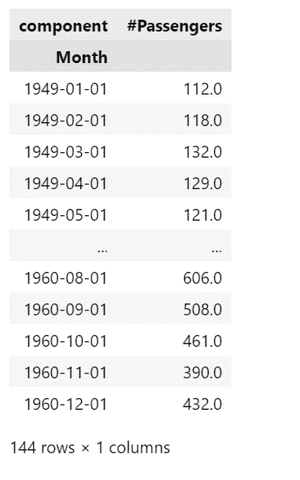

作者图片

单变量时间序列由从 1949 年到 1960 年的 144 个月组成。

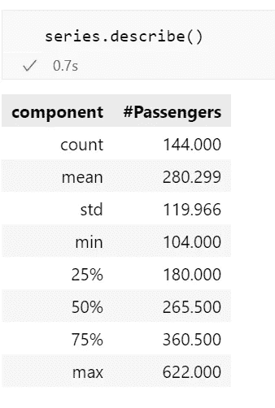

作者图片

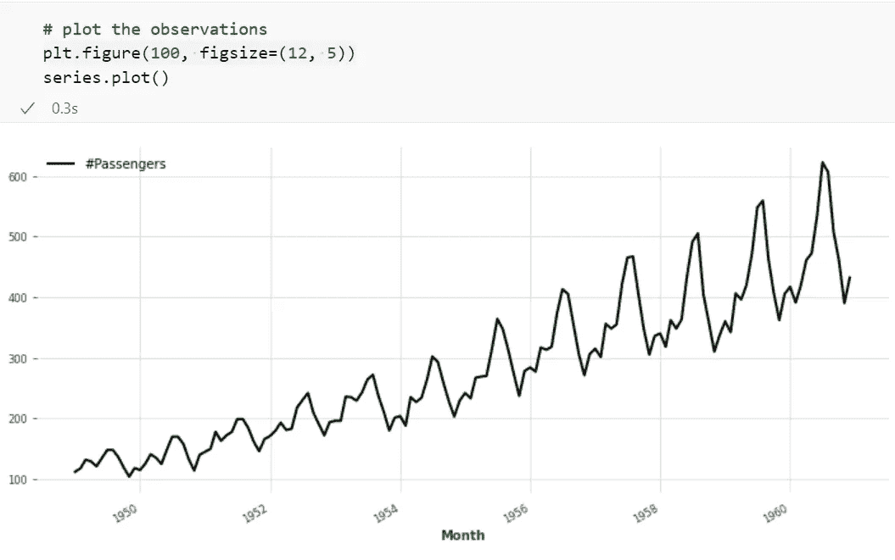

作者图片

时间序列似乎表现出 12 个月后重复的季节性。我们可以通过更精确的测试来确认视觉线索。darts '*check _ 季节性()*函数计算自相关函数 ACF，并返回 12.0 个月的季节性顺序。

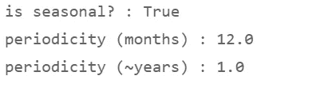

作者图片

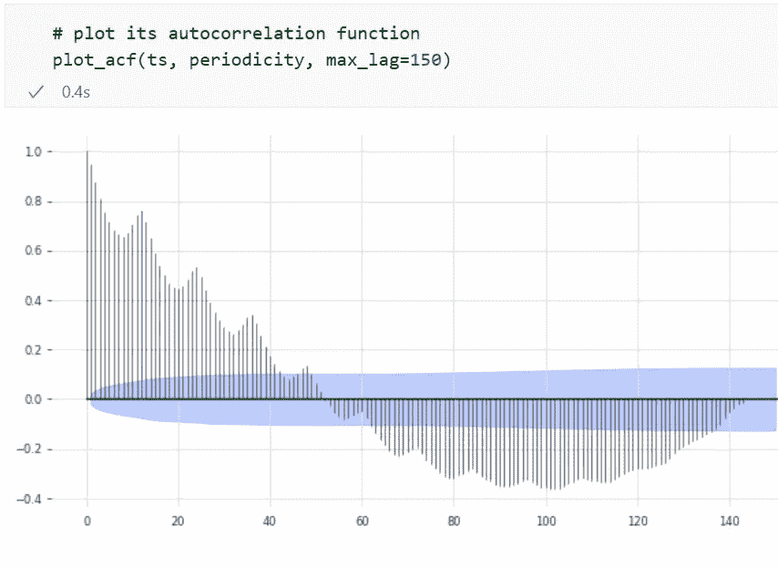

作者图片

我们将时间序列分为训练数据集和验证数据集。

在 dependencies 单元格中，我们选择 FC _ START = 1959/01/01——时间序列结束前的两年——作为我们要进行切割的点。

在将源数据输入神经网络之前，我们需要通过应用 *Scaler()* 函数对它们进行规范化。缩放将使神经网络更容易应用其秘方:重新校准它应用于输入值的权重。

最后，为了使神经网络能够检测时间序列的属性，我们从编码日期的字符串中派生出*年*和*月*。我们将把*年序列*和*月序列*作为协变量提供给 RNN 模型(“回归变量”)，就像当我们拟合 SARIMAX 模型时可以包含两个(或更多)外生变量的列数组 X 一样。

# 4.RNN 模型的设置和运行

我命名为*口味*的列表(下面的第 2 行)包含了我们想要在时间序列上释放的三个 RNN 变体。

第 5 行中的 list comprehension 一个接一个地调用这三种口味，并将它们馈送到 RNN 预测器 *run_RNN* 。除了三种变体的名称之外，它们在所需的参数化方面没有区别。只是他们内部的算法会导致不同的结果。预测器 *run_RNN* 将接受它要应用的算法的名称作为它的输入参数；以及经过重新调整或变换的时间序列及其训练和验证数据集。

接下来， *run_RNN()* 函数配置神经网络。

rnn 附带了一组用户需要设置的超参数(或者在搜索递增的更好的参数元组时让调整算法多次评估模型)，其中包括:

*   输入节点、隐藏层及其节点、输出节点的数量；它们越多，RNN 能处理的模式就越复杂；太多的话，RNN 就有被卡住或过度适应的风险
*   权重值及其变化率(学习率)
*   辍学率，如果有的话(见下文)

它们的最佳设置不是先验已知的，它们是针对 RNN 要攻击的具体问题的。PyTorch 和 Darts 有默认值。超参数调整算法可用于微调它们，作为手动实验的替代方法，但寻找更好的超参数需要时间进行重复评估。我将这个练习限制在几个不同的历元数(训练循环)值上；以及学习率(各遍之间权重的调整量)。

*   它的*模型*参数接受我们想要应用到源数据的三个拟合过程中的每一个的“味道”:首先是 LSTM，然后是 GRU，最后是香草(简单地标记为“RNN”作为默认变量)。
*   神经网络的 *epoch* 参数设置训练期间的通过次数。一个时期包括一次向前和一次向后通过整个训练数据集。
*   我们将 *input_chunk_length —* 用于预测的过去周期数— 设置为周期性 12.0，这是*check _ 季节性*测试返回的结果。RNN 将回顾过去 12 个月，一个完整的季节周期，来计算预测。我们可以增加这个值，从而迫使 RNN 更加依赖它的长期记忆。这将发挥 LSTM 或 GRU 相对于香草味的短期记忆的优势，但不一定会导致更高的准确性。
*   *training_length* —训练期间使用的周期数。不应低于它将用于预测的 input_chunk_length。
*   *random_state* 可以使用给定的种子号来初始化权重，以提高模型结果的可重复性。
*   *丢失* —在训练过程中，如果设置大于 0，RNN 可以随机将一些输入清零，丢失概率等于参数值，模拟不同的网络架构。在每个时期，RNN 都会选择一组不同的神经元，并将其暂时移除。不同的神经元组合然后做出预测。这种所谓的网络细化的目的是通过不断训练其全套神经元来防止 RNN 过度拟合。
*   *optimizer_kwargs* 及其参数“lr”设置了一个*学习率。*RNN 试图通过调整权重来最小化预测误差。权重在循环中更新的量被称为学习率。RNN 估计节点导致错误的程度。然后，每次更新权重时，将估计误差乘以学习率。更高的速率将使 RNN 能够更快地学习，但它可能会因超调而导致不稳定，并使其面临在训练时段之间振荡的风险，甚至会在正反馈循环中结束，从而导致爆炸梯度。然而，在我们当前的例子中，替代的学习率——0.1 或 0.001——并没有显著改变每个模型 10 — 15 分钟的处理时间(尽管时期的数量改变了)。较大的值 0.1 确实会导致 MAPE 增加三倍的不良影响，相比之下，我们将在乘客示例中使用 0.001 的比率来实现更好的预测精度。
*   *hidden_dim* 控制隐藏状态的大小，模型的深度。隐藏状态越大，它从源数据中推断出的模式就越复杂。
*   *force_reset* 放弃任何同名的先前模型，重新开始训练。

在模型建立之后，我们将它与训练和验证数据集一起传递给拟合函数， *fit_it()，*。

装配或训练过程是耗时的。根据您计算机的处理器性能，预计三个 RNN 版本的每一个都将运行 10-14 分钟。

在 dependencies 单元格的顶部，如果您只想在一分钟内运行脚本进行代码测试，而对准确的预测结果不感兴趣，您可以将 *EPOCH* 参数降低到远小于 300，例如一个小至 3 的 EPOCH 数。

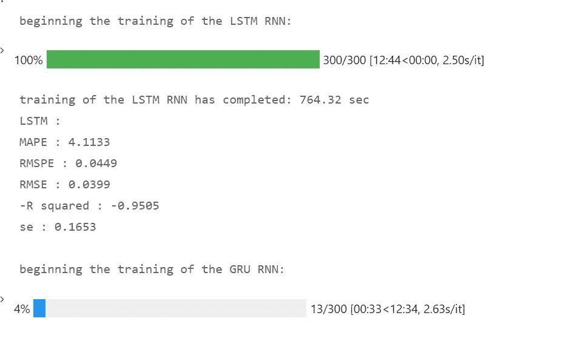

作者图片

当辅助函数 fit_it()返回拟合的模型时，主函数 run_RNN()将接受它并使用它来计算预测(第 26 行)。

run_RNN()中的第 29 行调用绘图仪函数 *plot_fitted()* 来绘制预测和实际观测的图表。

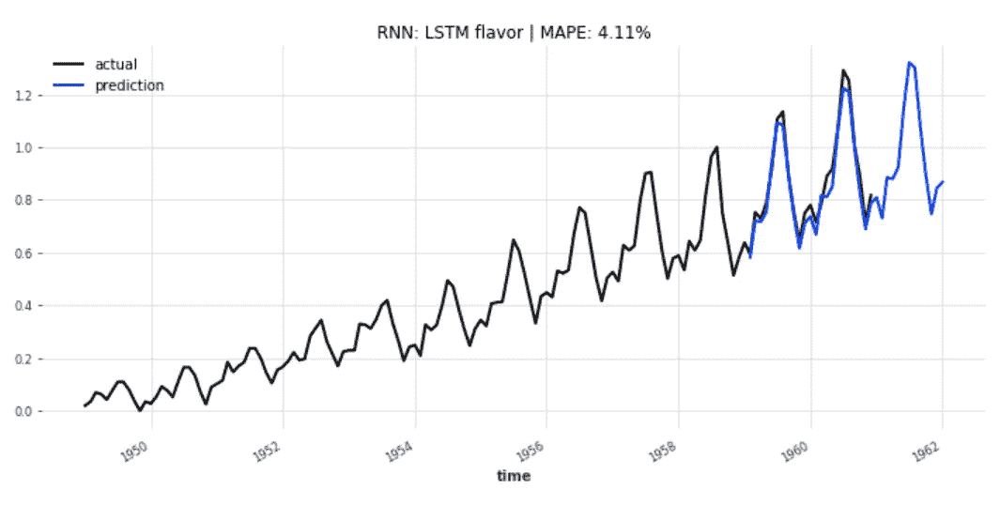

作者图片

绘制完预测图表后，run_RNN()调用下一个帮助函数*【accuracy _ metrics()*，计算预测准确度指标。这将比我们从图表中获得的视觉线索更精确地确定预测值和实际值之间的差异。

在 accuracy_metrics()的顶部，我使用 Darts 的' *slice_intersect()* 函数来确保我们想要比较的两个序列(预测和实际)具有相同的长度，只包括它们的重叠周期。

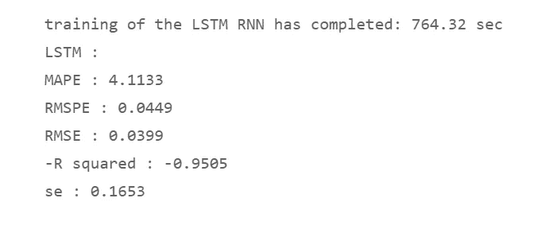

作者图片

该函数计算 Darts 在其工具类中提供的三个度量:MAPE、RMSE 和 R 平方。

r 平方表示实际观测值的变化在多大程度上可以用预测值的相应变化来解释。值 1.0 表示预测完全反映了实际情况。如果你想知道为什么 R 平方显示负值:虽然 R 平方本身是一个介于 0 和 1 之间的非负数，但我反转了它的符号，以使它的方向指引与其他度量一致。对于所有其他误差测量指标，较低的值是首选。R 平方前面的负号使其成为一个“越低越好”的指标，就像其他指标一样，这将有助于在下面进一步显示的数据框架中可视化它们。

该函数还计算 RMSPE，即均方根百分比误差；以及预测的标准误差。

第 20–22 行收集字典中的指标及其名称，该函数将这些信息传递回主函数 run_RNN()。

# 5.查看预测结果

事实证明，简单的 RNN 香草口味生成的预测具有最低的平均绝对百分比误差，为 3.93%，领先于这个特定示例的三个 RNN 变体之间的一根头发的宽度。LSTM 风味紧随其后，为 4.11%。实际上，它们是无法区分的。GRU 风味的 MAPE，5.01%，远远落后于这两个领先者。

在 RNN 模型的设置中，我们对学习率(0.001)和纪元(300)进行了相对精细的梳理。我们还可以使用 dropout 参数(让 RNN 在训练期间尝试各种节点子集)；以及隐藏状态的大小(较高的隐藏维度值增加了 RNN 在较长时间范围内处理更复杂模式的能力)。调整算法可以在重新运行拟合过程时调整它们，以尝试实现更低的 MAPE。但是这个特殊的时间序列并不复杂。耗时的调整工作似乎不太可能将 MAPE 从 4%降低到 1%。然而，在现实世界的项目中，我们可以考虑一个更长的通宵调优过程，以尝试逐步消除 MAPE。

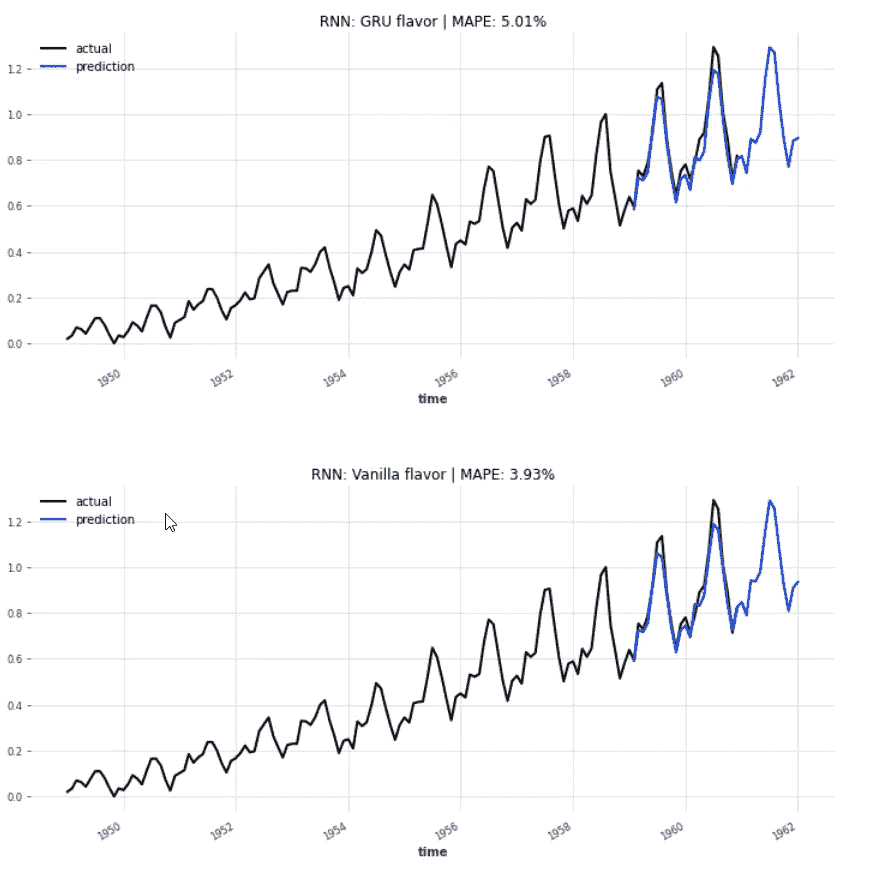

作者图片

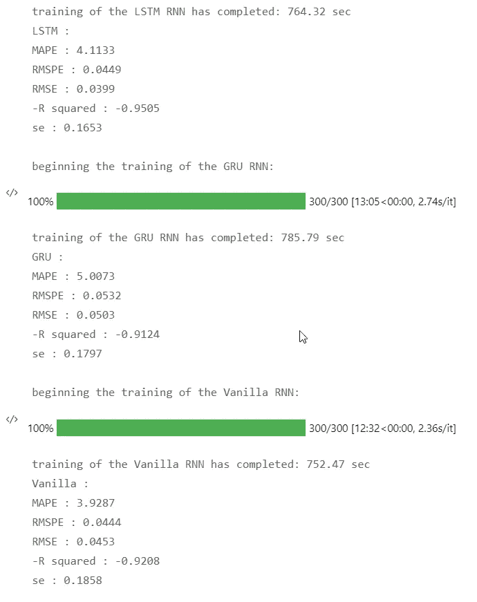

作者图片

为了将 RNN 方法与基线预测进行比较，我们转向我们在早期文章中回顾过的方法之一( [Darts 的时间序列预测瑞士刀| 2021 年 10 月|走向数据科学](/darts-swiss-knife-for-time-series-forecasting-in-python-f37bb74c126)):Theta 方法，一种简单而快速的方法。

我们通过在第 4-18 行中搜索 100 个可选值来调整它的 theta 参数。然后，我们将这个最佳θ参数传递给第 22–23 行中的装配工，并计算第 24 行中的预测。

第 24 行下面的部分绘制了预测曲线，并计算了准确性指标。

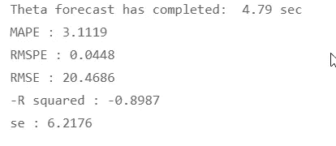

作者图片

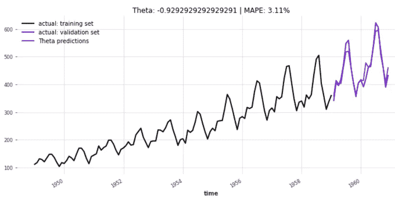

作者图片

θ返回的 MAPE 只有 3.11%

为了便于比较这些方法，让我们将三个 RNN 变量和 Theta 预测的准确性指标收集到一个字典中(第 3-4 行)，我们在第 5 行将其转换为数据帧。

# 6.结论

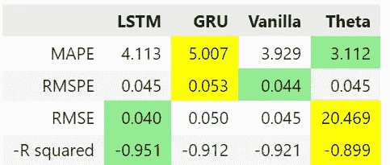

作者图片

*   我们观察到，相对于 MAPE 标准，θ方法领先于该领域:预测误差仅为 3.112%。
*   普通 RNN 在均方根百分比误差 RMSE 方面保持其竞争优势，
*   而 LSTM 提供了最低的绝对 RMSE，以及最佳的 R 平方值和最小的预测标准误差。

没有整合 LSTM 算法的“长”方面的普通 RNN 的良好性能意味着时间序列遵循一种不需要太多长期记忆的模式。

RMSE 对预测误差进行平方，对较大误差的惩罚力度比 MAPE 更大。当残差的分布是左偏或右偏时，就会出现偏差。平均值将高于或低于中间值。最小化 RMSE 的预测将显示出较小的偏差。

在我们当前的例子中，LSTM 在预测的 RMSE、R 平方和标准误差方面具有竞争优势。综上所述，我认为这三个标准足以证明 LSTM 是这场赛马的赢家。

*   Jupyter 笔记本可以在 GitHub 上下载:[h3ik0th/Darts _ RNN:Python Darts 中的递归神经网络(github.com)](https://github.com/h3ik0th/Darts_RNN)
*   标题图片:[人民集体组，作者 geralt——Pixabay 上的免费图片](https://pixabay.com/illustrations/people-collective-group-knowledge-3286018/)
*   葡萄藤图片:[葡萄藤卷须攀缘植物，由 stevepb 拍摄 Pixabay 上的免费照片](https://pixabay.com/photos/grape-vine-tendril-climbing-plant-592995/)
*   渔夫图片:[chan wity 拍摄的渔网湖 Pixabay 上的免费照片](https://pixabay.com/photos/man-fishing-net-lake-sunset-6342665/)
*   所有其他图片:作者