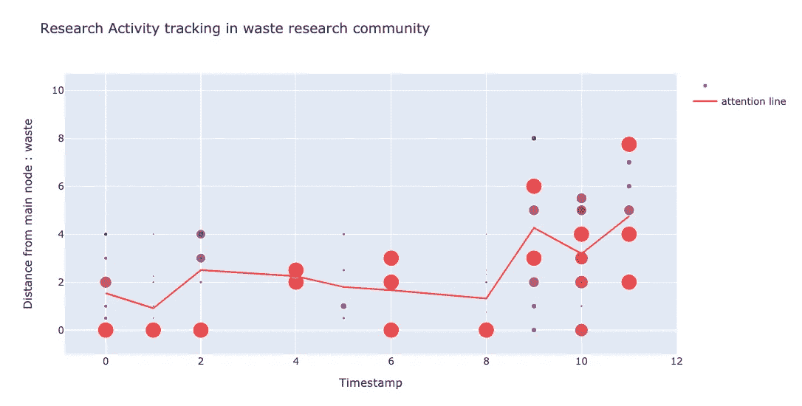

# 时间语义网络分析

> 原文：<https://towardsdatascience.com/temporal-semantic-network-analysis-bd8869c10f10?source=collection_archive---------20----------------------->

## [实践教程](https://towardsdatascience.com/tagged/hands-on-tutorials)

## 大型研究语料库中的时态动态抽取

# 介绍

研究知识一直是基于文档的(研究论文、评论)，许多实体，如**语义学者**或 **Arxiv** 试图将这些文本知识聚集在一个大的语料库中，在那里您可以使用关键字或 id(DOI 代码)来访问特定的论文或获得关于特定领域状态的查询，从而给研究人员一个真实的来源来检查文献并将其用作他们研究的构建基础。

然而，致力于语料库的新论文的快速发展使得跟踪研究趋势或简单地停留在上下文中的任务变得非常困难。特别是对于一个初级研究人员，他希望了解他的领域的状况，以便在此基础上有所发展。

为了解决这个问题，许多研究人员和科学实体自愿通过撰写**文献综述**来填补这一空白，文献综述总结了特定主题的研究现状。虽然这些综述的数量有限，而且不能与科学文集的数量成比例。

为了解决上述问题，我们的研究目标是构建一个**文本网络，该网络对给定的文本语料库**(科学论文列表)进行编码，并使用图论工具和技术来推断研究背景，提取语料库状态，并将语料库视为一个时间动态网络，以揭示时间趋势和模式。

在这第一篇科学文章中，我们将尝试回答上述问题:

*   如何将文本语料库编码成文本网络？
*   如何利用图论工具提取研究社区？
*   我们如何描述和推断一个给定研究团体的内部动态？

# 从非结构化研究语料库到文本网络

## 纸质实体解剖

科学文集包含一组具有标准格式的论文(标题、摘要、简介、方法论、结果和讨论)。有了这个简单统一的结构，我们将论文实体定义为包含摘要的对象，因为它通常是论文内容的摘要、主要关键字的列表和出版日期。

纸质实体解剖(图片由作者提供)

选择这些元素有两个主要原因:

*   出于计算原因，限制处理和编码文本的数量
*   选择给定论文中信息最丰富的部分

## 文本到图形

在定义了我们的 paper 实体之后，是时候将它编码为一个 graph 对象了。为此，我们构建了将原始文本转换为文本图的现有管道。

**一字钢**

首先通过将原始文本分割成单词列表来对抽象文本进行标记化。然后，通过保留单词的词根来蒸化标记化的单词，以减少冗余。例如，模型化、模型化和模型化都是为了模型。

**2-停止字删除**

我们管道的下一步是删除起连接作用并且没有任何科学意义的停用词，例如:和，或…

**3-构建抽象文本图**

下一步是将处理后的抽象文本转换成一个**无向图**，其中单词是图节点，它们的同现是边。

我们通过执行 4 个单词的窗口扫描来构建图的边；换句话说，如果两个单词出现在同一个窗口中，我们构建一条连接它们的边，并根据它们之间的距离分配一个权重。如果两个单词在另一个时间出现，我们将新的权重与前一个相加。

作者图片

**4-提取关键词图**

如果我们回忆一下我们的 paper 对象，我们已经挖掘出了在论文中出现的关键字列表。我们现在的目标是从只包含作为节点的关键字列表的抽象图中提取一个子图。

作者图片

至于新的边及其相对权重，我们将使用每对提取的节点之间的最短路径来构建它们。

作者图片

最后，我们有一个功能完整的管道，它将一篇论文作为输入，并输出一个相关的文本图及其出版日期，这将在接下来的步骤中使用。

## 时态图构造

如前所述，研究语料库包含一个论文列表。因此，为了能够在文本图中对文本格式语料库进行编码，我们应该将纸质图合并成一个大的无向图。

但我们应该注意到，研究语料库不是静态的，随着新论文的增加而不断发展变化。这就是为什么我们选择构建一个**时间网络**来保持这种动态性。

为了实现我们的目标，我们选择一组时间戳来创建我们的时态图的快照，以便我们可以存储我们的图，并且还能够在这些快照上使用静态图论工具以供将来分析。

每个时间间隔将由一批论文来表征，这些论文的发表时间包含在该时间间隔中。

作者图片

因此，我们**获取在给定时间间隔发表的论文集合，创建它们的相关文本图，然后将它们合并到我们的图中，以便更新其状态，从而创建我们的时态图的新快照。**这一更新是通过从我们的图批次向时态图添加新节点和/或加强现有节点的边权重来完成的。

这个迭代过程为我们的时态图提供了一组快照，向我们展示了它是如何在知识创造(新添加的节点)或差距实现(新边)方面随着时间的推移而演变的。

# 时态图分析:在 UM6P 研究语料库中的应用

在最后一部分中，我们成功地准备了将文本语料库转换为时态文本图的管道。现在是时候将它应用到一个真实的研究语料库中进行测试，同时也做一些数据分析，并尝试回答我们引言中的主要问题。

为了做到这一点，我们使用了 UM6P 研究语料库，UM6P 或**穆罕默德六世理工大学**是一所摩洛哥大学，位于未来绿色城市本盖里尔的中心。他们的研究部门主要关注可持续发展、采矿和农业科学。

UM6P 的研究语料库包含了从 2014 年**到 2020 年**之间发表的**科学网站**的 **260 篇研究论文**。

为了给我们的图形管道准备文本语料库，我们构建了一个数据集，其中包含我们定义的论文实体的元素(论文摘要、关键词列表和发表日期)。

来自 UM6P 研究数据集的样本

使用前面介绍的管道架构，我们使用 Networks(一个流行的图形库)和 Numpy 在 Python 中实现了它。代码可以在[我的个人 GitHub](https://github.com/AnasAito/Semantic-parser/tree/main/topicgraph) 上找到。

至于可视化，我们使用用 Javascript 语言编写的 D3 包，它使用一个 Force 算法来使图形在视觉上更具吸引力。

我们通过定义 3 个月的时间间隔，使我们的文本语料库通过我们的**时态图构建管道**，因此我们已经提取了我们的图的 20 个快照，准备进行分析和处理。

下面是我们的时态图表的最后一张快照。它是一个静态网络，包含 **1195 个节点**(UM6P 论文中的关键词)**和 3753 条边**(它们之间的链接)。有了这种可视化，很容易在一个镜头中看到完全进化的 UM6P 研究语料库。

2020 年 12 月 UM6P 研究图表快照

但是，巨大的节点数量并不能帮助我们提取关于我们的研究语料库的有用信息，我们需要一个过滤的网络视图，它只包含**主要和重要节点**。为此，我们选择了“节点度”，这是一种节点中心性度量，它将使我们能够对我们的节点进行评分。

过滤图形快照(图片由作者提供)

如您所见，并非所有节点都具有相同的重要性。我们现在可以提取高度连接的节点(具有高节点度分数的节点)，它指的是我们的研究语料库中的中心关键词。

作者图片

这种高层次的分析帮助我们发现了主要节点，这些节点可能是我们文本网络中的潜在枢纽。如果我们将这些结果投射到我们的案例研究中，我们检测到的节点可能指的是主要的研究主题，而我们的网络中有许多枢纽可以用 UM6P 的**研究多样性来解释。**

自然地，这第一个观察驱使我们询问语料库中的研究社区。一旦被检测到，这些社区不仅会在我们的图中向我们显示密切相关的关键词，而且还会帮助我们提取与每个社区相关的动态。

## 图形社区提取

图社区可以定义为一组内部连接紧密，与其他组连接较稀疏的节点。此外，我们已经确定了潜在中枢节点的存在，它们可能是每个社区的相对心脏。

**问题定义**

鉴于这种观察，我们将我们的社区提取问题公式化为 K 均值聚类问题，其中我们的**质心是我们的图中的主要中心关键词**，并且具有科学意义，我们的**距离**度量将使用节点之间的**最短路径来计算。**

作者图片

**主要关键词提取**

如前所述，静态图论为我们提供了一组中心性度量，以相对于节点在网络中的重要性来加权节点，这允许我们通过计算每个节点的分数来精确定位文本图中的中心节点。为此，我们选择了 4 个中心性度量:程度中心性、中间中心性、特征中心性和接近中心性(**你可以参考我以前关于中心性度量的文章****)。**

****

**中心性测量分布**

**然后，我们计算 4 个指标之间的相关矩阵，以选择哪个中心性度量将与我们的中心节点评分兼容。**

****

**corr 矩阵**

**我们的三个中心性度量具有高的正相关系数，另一方面，接近中心性具有小的正相关系数，这是合乎逻辑的，因为例如高度节点往往是中枢节点，因此通常接近节点的子集(在我们的情况下，最高节点度是 122，相比于我们的图中的 1500 个节点)，因此它将远离大多数图节点，然后它将具有小的节点接近中心性。**

**因为我们的目标是提取图中可能是潜在中心节点的主要节点，所以我们将我们的评分限制在前 3 个相关度量上。这导致提取了构成我们主题节点的 6 个主要节点:*土壤、植物、废物、磷酸盐、材料和纤维素*。为了验证我们的节点排名，我们使用了 **Voterank 算法**，该算法输出网络中最有影响力的节点，它输出相同的节点列表在顶部。**

****距离测量公式****

**现在，我们需要定义一个距离度量，以便根据网络节点与我们预定义的质心(主题关键字)的接近程度对它们进行聚类。为此，我们选择每条最短路径的总距离作为我们的距离。我们应该注意，两个节点之间的距离被构造为它们的边权重的倒数。例如，我们想计算图中的关键字“Funghi”和土壤主题之间的距离。**

****

**作者图片**

**使用 **Dijkstra 的算法，**我们可以计算两个节点之间的路径，并获得距离值。我们对图中的所有节点执行相同的过程，然后根据它们与每个主题节点的接近程度(最小距离)对它们进行分类。**

**这给了我们 6 个社区，给了我们 6 个研究课题。这种社区分离将有助于我们通过推断每个社区的动态或探索他们如何互动来对我们的图表进行更个性化的分析。下图展示了我们在向每个节点添加社区注释后的图表。**

****

**图形社区**

## **社区动态分析**

**所有前面的部分都可以看作是工具，可以帮助我们对一个给定的研究课题进行分析。事实上，我们已经成功地构建了我们的时态图，提取了我们的研究主题，并最终将我们的大网络划分为小而独特的社区或子图。由此，很容易获得每个研究主题的时间演变。现在，我们将能够定义一组指标，以便根据**知识创造**、其**连通性**以及其**活动**来表征我们社区的动态。**

****

**作者图片**

****社区知识创造****

**我们通过量化随时间推移的知识创造来开始我们的图表跟踪。为此，我们定义了 **new_k:** 一个标量值，它计算添加到给定社区子图的新节点与图节点总数的比率:**

****

**我们为给定网络的每个快照计算这个度量，下图可视化了每个社区的子图的演变。**

****

**我们观察到，每个社区在早期时间戳中显示出相同的模式，这是一个高比率的新知识，例如，对于土壤的情况达到 90%,对于废物主题的情况达到 50 %。这可以通过以下事实来证明:我们的图处于其第一次迭代中，并且不包含大量的节点，这给了新节点添加的动作更多的权重。**

**至于其他时间戳，我们看到该比率呈指数下降，这可以通过每个图的节点总数的增加来解释，伴随着新节点到图中的伪常数增加，这使得计算的比率随时间下降，直到它在最后记录的时间戳处停滞，因为节点的数量已经很高，并且比率稳定在其固定值。**

**我们可能会观察到一些社区的比值有很大的变化，如*磷酸盐*和*废物*。这可以通过以下事实来解释，即与其他社区相比，这些社区平均包含少量节点，这使得该比率具有相对较高的方差。**

****

****社区连通性进化****

**社区连接性被定义为知识(在我们的例子中是关键字)在每个社区内相互连接的方式。不用说，这些信息已经编码在我们的图边中，因为每两个可能链接的关键字都有一条连接它们的加权边。**

**我们首先根据边的数量来探索这些连接是如何演变的，并最终根据它们的作用对它们进行分类:边是为了连接新节点而创建的，还是为了加强现有连接而创建的。**

**下图说明了按研究主题划分的边数的演变。**

****

**我们观察到*纤维素*、*土壤*、*植物*和物质群落具有大量的边，至于其他群落，与第一个主题相比，边的数量仍然很少。这与我们之前的观察完全相关，当时我们看到这些最后的主题具有少量的节点，因此它们将需要少量的边来相互连接。至于演变，我们可以清楚地看到土壤群落中的拐点，在这里边数线斜率增加。**

**这种边数的普遍增加可以用两个原因来解释:**

*   **添加边以将新节点链接到图形。**
*   **为加强现有连接或连接现有节点而添加的边。**

**我们的下一个任务将是强调这种边缘角色，以理解社区的连通性如何在质量上演变。下图显示了*工厂*研究主题的角色划分。**

****

**按边缘角色(工厂)的边缘计数演变**

**我们可以看到，这两种类型的边缘没有相同的进化水平。事实上，更有可能出现强化边，而不是连接边，尤其是在图中已经包含许多节点的最后时间戳中。但是为什么呢？**

**事实上，随着时间的推移，研究人员倾向于使用与我们所说的相同的语义词汇或行话，因此在较高的时间戳中，较少的新节点被添加到我们的图中。例如，2020 年发表的一篇论文可能会包含在以前的论文中已经使用过的关键词。新节点或关键字的减少将导致更少的连接边和更多的加固边。**

**在我们的所有主题中都观察到了这种模式，除了*废物*研究社区，在那里我们看到在我们的实验时间范围的中间连接边激增。这可能是因为该领域的新发现或他们研究议程的新支点。这种观点在定量证明之前是主观的。**

****

**按边缘角色划分的边缘计数演变(浪费)**

****提取研究活动中的注意力转移****

**我们已经看到了每个社区在知识创造和连通性方面如何随着时间的推移而发展，在最后一部分，我们看到了我们社区的时间动态可能会有所不同。例如，在其他社区中没有观察到*浪费*研究主题中的连接边计数激增。在这一部分中，我们将通过分析研究活动来更深入地挖掘每个社区的动态，例如，看看一个研究社区是否倾向于通过创建子领域或坚持主要主题来专注于一个领域，从而填补其科学空白或通过新方法或评论来更新现有作品。**

**这个任务在一个镜头中可能有点复杂，所以我们将坚持它的一边。事实上，在这一部分，我们将尝试跟踪研究活动，并尝试量化给定研究社区的专业化水平。**

*   **定义:**

**量化专业化水平可能很难做到，所以我们假设这个简单的定义:当新创建的知识与给定主题的主要主题没有直接联系时，可能会出现高专业化水平，例如，人工智能社区是高度专业化的，因为新论文不会直接对 AI 做出贡献，而是对其子领域做出贡献，如深度学习或强化学习，或更专业的一些特定网络架构(CNN，语言模型……)。**

**在这个例子的基础上，如果我们想象有一个编码人工智能研究文集的图，从关于 [GANs](https://en.wikipedia.org/wiki/Generative_adversarial_network) 的论文中挖掘的新节点将不会直接链接到 **AI** 节点，而是会靠近**深度学习**节点，因此我们可以使用这个距离差异来量化给定社区中的专业化水平。**

*   **方法:**

**使用最后一个例子，我们试图构建一个简单的管道来跟踪专门化的级别。我们首先从大图中提取每个社区的子图，并通过时间戳存储其快照。**

****

**作者图片**

**下一步是从每两个图表快照中计算差异图，这将帮助我们识别图表中发生更改或活动的部分。**

****

**作者图片**

****对于每个差异图，我们使用中心性度量给每个节点分配一个分数，并且还使用最短路径计算它与主题主节点**的距离。**

****

**作者图片**

*   **结果:**

**我们对每个时间戳进行这种转换，并在一个时间图中对其进行总结，该时间图跟踪相对于社区中心节点的图形活动。我们以*工厂*社区为例。**

****

**作者图片**

**我们观察到研究注意力随着时间而变化。例如，我们可以在几个时间戳中看到遥远的活动，这意味着研究活动转移到*工厂*研究的子领域。**

****

**例如，我们放大时间戳 3，其中我们可以识别出大部分活动集中在细胞外节点*****和光合节点*上，这与植物中光能转化的研究的相关。至于其他时间戳，注意力聚集在主节点*植物*附近，正如我们在时间戳 6 中看到的。********

******我们还观察到，大多数时候，在*工厂*节点附近有一个活动是合理的，因为研究人员倾向于利用它来建立它。******

******从这个图表中，很容易看出研究人员的注意力是如何随着时间的推移而转移的，并将其作为一个衡量标准来跟踪特定研究领域的专业化水平。为了更加明确，我们使用与主节点的距离结合节点得分(图中的节点大小)作为权重来计算每个时间戳的重心节点。这有助于我们画一条线，我们称之为**注意力线。这条注意力线的变化可以帮助描述研究人员活动的变化，并给出专业化水平的想法，因为远离主节点的重心表明在给定的时间戳中专业化水平高。********

************

******我们再来看另一个例子:在*废物*研究领域，他们研究*磷酸盐* *废物*或污泥的价值化；******

************

******我们可以在中心节点附近看到一个研究活动，然后在最后的时间戳中看到一个移动，这可以通过专门化移动来证明。上几个时间戳的主题主要是纸(石头纸)和路。******

******为了帮助验证我们对关注线的解释，我们添加了最后一个图表，该图表跟踪与中心节点(直接边)直接连接的新节点的比率。******

************

******我们很容易观察到注意力线和比率图之间的这种依赖关系。事实上，早期时间戳的特征是高比率的新节点直接连接到中心节点。另一方面，我们看到注意力线被拖向中心节点(*废*)。至于最后的时间戳，我们看到一个比率的强烈下降，相当于注意力图中的移动，其中注意力线从中心节点向上摆动。我们可以给这种行为一个简单的解释。事实上，*磷酸盐的* *废物*再利用在 UM6P 是一个新的研究领域，因此第一篇论文试图在此基础上建立一个基础知识，然后后续论文开始专门探索其应用。例如，创造石头纸，这是一种可以用*磷酸盐* *废料*制成的纸。******

# ******结论******

******在这里，我们已经介绍了从非结构化研究语料库计算文本图以将其可视化的基本步骤，对其研究社区的动态进行了深入分析，并且必须通过跟踪研究人员的注意力来量化给定主题的专业化水平。******

******这些步骤的目的是自动从文本语料库中提取模式和趋势，而不需要人工专家。事实上，这些构件有助于对某个领域进行深刻的评论。******

******我们的下一篇文章将讨论根据社区之间的联系推断外部动态的可能性，以查看哪些社区彼此接近，哪些社区不接近，以便让研究人员了解需要填补的知识缺口。******