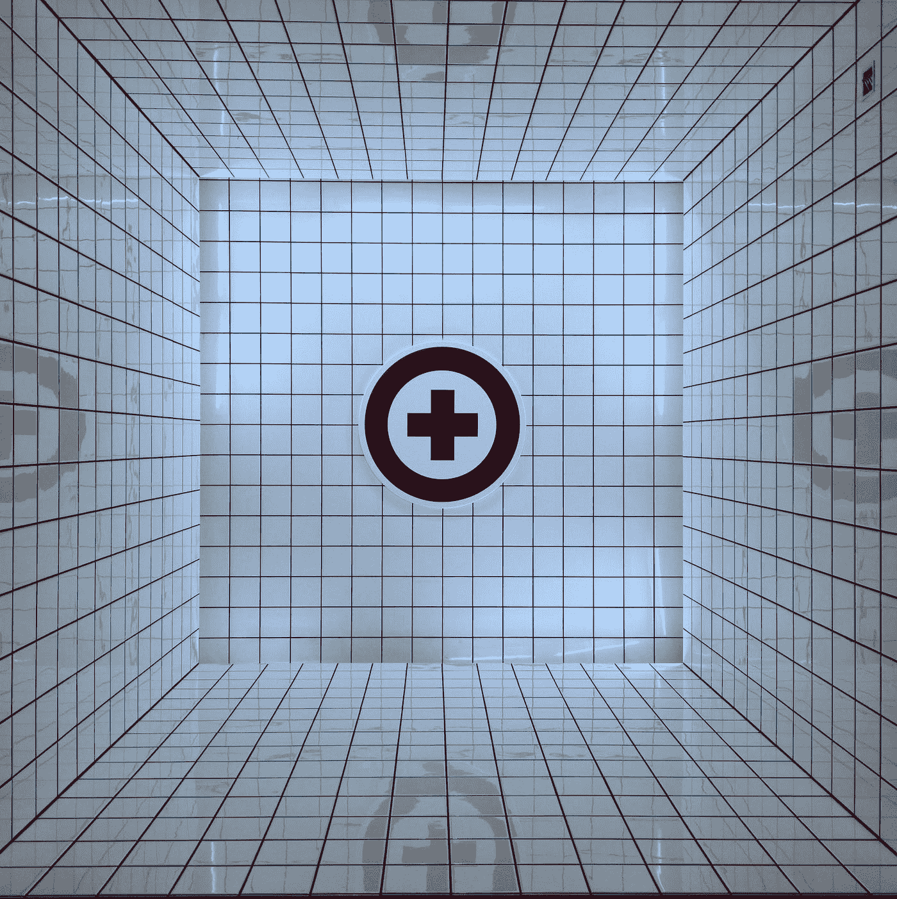

# 医疗保健领域的 10 项人工智能创新

> 原文：<https://towardsdatascience.com/ten-artificial-intelligence-innovations-in-healthcare-3f5b30ea75b5?source=collection_archive---------37----------------------->

## 医疗中断…离家很近

Enric Moreu 在 [Unsplash](https://unsplash.com?utm_source=medium&utm_medium=referral) 上的照片

过去的一年让世界为之震惊，但也迎来了几项重要的医疗创新。由于疫情的限制，远程保健和远程护理变得更加普及。

我们卫生系统的压力意味着最具前瞻性的医疗机构必须发展新的能力，如语音助手，能够在通常的补充之外服务数百个电话。为了加快处理速度，人工智能(AI)在各种医疗保健应用中蓬勃发展，大数据在预测分析领域发挥了重要作用。

这些创新都令人印象深刻，还有更多正在酝酿中。然而，他们中的大多数都来自世界各地的顶级研究中心，如梅奥诊所或一些秘密隐藏在硅谷的小型初创企业。事实是，它们中的许多需要很长时间才能在商业上可行，我们可能需要数年才能开始收获它们的好处。然而，并非所有的创新都发生在世界的另一端，本文将重点介绍发生在我们后院的几个项目。

马耳他大学的研究人员目前正在与 Mater Dei 医院等其他实体合作开展这些研究。他们的创新方面与国外的其他项目不相上下。研究人员用他们获得的微薄资金创造了奇迹，其中许多资金来自大学，但也有来自国家、欧洲甚至私人的资助。然而，他们的共同点是很少有人知道他们，大多数时候，缺乏后续融资扼杀了项目。以下是这类项目的精选。

## **3D 打印智能手**

有各种各样的项目与假肢的创造有关。其中一个使用 Open Hand 项目
来创建 3D 打印手，并使用智能组件来增强它。该项目的想法是为假手提供额外的功能，例如通过远距离移动假肢来改变电视音量。集成在手中的语音识别功能允许人们发出更复杂的命令，并将其发送回家中的任何智能设备。本质上，它融合了智能手机和假肢。

## **MAPProHand 项目**

该项目旨在从零开始制造一种商业假手。它旨在解决商业假肢中通常遇到的简单性、灵活性和可用性之间的权衡。该项目将在保证其可用性的简单架构的基础上，对手的最佳灵巧性进行研究。然后，它将根据人工智能系统提出的参数创建一只假手。

## **自闭症虚拟现实**

自闭症虚拟现实(VR)应用程序，已经在以前的文章中讨论过，让人们体验自闭症儿童在典型的一天中所经历的事情。当用户戴上 VR 头戴式耳机时，他发现自己处于一个学校环境中，在那里他通过一个自闭症儿童的眼睛来看、听和感知世界。该项目旨在促进共情，从而帮助教育工作者、职业和人们更彻底地与自闭症儿童互动。

## **脑瘫助手**

SMARTCLAP 项目帮助脑瘫儿童；影响运动和姿势的儿童最常见的身体残疾。该项目将用户置于设计过程的中心，通过创造一种智能设备来增加儿童的动力。在不同的疗程中，孩子们有时会发现完成治疗师建议的任务很有挑战性。通过将治疗变成一个有趣的游戏，研究人员希望从他们那里获得更好的反馈。这个概念被称为游戏化，一个典型的(有时是乏味的)任务被变成了一个游戏。各种实验表明，游戏化在不同的环境中非常有用。通过这个项目，鼓励儿童发展积极的行为，改善其社会交往。

## **环境辅助生活**

环境辅助生活(AAL)服务在人们的日常生活中使用技术来帮助他们独立生活。基于传感器、麦克风和视觉系统，已经设计和开发了几种 AAL 设备，结果非常有希望。然而，为了使该领域达到成熟，需要应对许多挑战，包括在现实世界中开发易于使用并被社会、用户和护理者接受的强大流程。正因为如此，研究人员正试图使用一个标准的摄像系统来检测罕见的不规则事件。姿态估计模型用于检测图像中的人并提取身体关键点。这个过程通常被称为骨骼检测，通过这个过程，人的骨骼位置就可以从照片中确定。这些信息对于检测异常情况(如有人躺在地上失去知觉)至关重要。初步研究显示，该系统能够检测出大多数异常情况，取得了一些令人印象深刻的结果。这些结果还表明，这些方法与其他基于传感器的商业解决方案相比非常好，这些解决方案要昂贵得多，并且对于大多数人来说是难以获得的。

## **自动步态分析**

步态分析是对行走模式的系统研究，通常涉及昂贵且侵入性的基于标记的方法，结合多个红外摄像机。

当它们结合在一起时，会产生精确测量一个人行走行为的运动学数据。一旦收集了数据，专家们就可以从运动学数据中解读出结论来进行诊断。另一方面，该项目使用标准相机和人工智能开发了基于标记的步态分析方法的自动化替代方法。该系统获得运动学数据，包括臀部或膝盖的不同左右关节角度。两个摄像机对准行走对象的侧视图和前视图，捕捉这些信息。然后，它使用姿势估计作为一种无标记的运动捕捉形式，输入到计算和处理运动学的算法管道中。自动化方法非常有前途，因为它获得的结果几乎与昂贵的基于标记的系统的结果相同。因此，它减少了步态分析所需的努力和资金投入，从而在卫生保健界得到更广泛的推广。此外，由于这种系统理论上可以仅与两个移动设备一起工作，因此它将使其非常适用于世界范围内不可能提供昂贵设置的偏远地区。

## **自残、抑郁和自杀**

心理健康促进(MEHAP)项目试图帮助有心理健康问题的青少年，这些问题导致自残、抑郁和自杀风险增加。该项目将推出一款与自残过的年轻人共同制作的手机 app。它包括许多功能，如情绪监测日记、提升情绪活动的个性化自助菜单、录音放松和正念练习。每次使用后，年轻人被要求重新评估他们的情绪，如果他们仍然有自残的冲动，就会被转到紧急号码。

## **精神分裂症虚拟现实**

向医护人员讲授精神分裂症的一个挑战是，他们很难理解患者的感受。这个项目在虚拟现实模拟中使用人工智能，让用户沉浸在虚拟世界中，帮助他们体验这种患者可能会感觉到的症状。该模拟以几个简单的任务为特色，用户在面对与精神分裂症相关的挑战时，以视觉和听觉幻觉的形式进行尝试。人工智能被应用到交互式叙事中，以允许故事情节适应用户的行为，从而增加体验的沉浸感。各种心理健康护理学生尝试了这种体验，并得到了好评。它设法提高了他们的意识，并培养了对精神分裂症患者的同情心。这个项目的下一阶段是将它作为真实病人的治疗手段，这样病人就可以在一个安全的虚拟环境中面对他们的幻觉。

## **疼痛减轻**

如果大脑分心，即使刺激仍然存在，对疼痛的感知也会减弱。分散注意力作为疼痛管理技术的想法并不新颖，有几个案例研究证明这可以减少多达 50%的疼痛感知。VR 头戴设备会在例行的痛苦程序和治疗过程中分散儿童的注意力。

在 UoM 的 Morpheus 项目中，研究人员使用智能手表等生物传感器来读取生物信息。这些数据将使虚拟现实体验根据患者的感受实时改变和适应。如果病人感到无聊，游戏就会变得令人兴奋。如果他焦虑，它会慢下来，变得更平静。最初的结果表明，虚拟现实体验更加有效，并且无需借助任何药物就能减轻疼痛。

## **癌症检测**

几年前开始的另一个项目使用人工智能来检测 x 光照片中的异常。这个想法是分析成像数据，并在潜在的异常点放射科医生。这个项目将大大加快他们的工作速度，提高他们的准确性，因为即使是训练有素的眼睛也很容易漏掉一些癌症。与此一致，2020 年发表在 *Nature* 上的一篇关于人工智能在乳腺癌筛查中的应用的文章报告称，与标准放射科医生筛查相比，假阳性和假阴性都有所减少。这个结果并不意味着人工智能将很快取代医生。然而，对于任何医生来说，这是一个机会，可以立即以低廉的成本获得对其诊断的第二种意见，从而进一步降低人为错误率。这个项目是 Aaron Casha 教授的创意，他是一位杰出的外科医生和梦想家，去年不幸去世。不幸的是，这个项目也随他而去了。

## **结论**

可以看出，正在进行的项目多种多样，涉及卫生的所有领域。可能有许多其他项目，我们没有在这里列出！这个列表只是为了庆祝研究人员的参与和展示他们的新颖性而选择的。这些研究人员不遗余力地争取资金，寻找合作伙伴，进行项目，并在资金枯竭后继续进行。然而，医学和技术世界仍然相距甚远。因此，当一个想法酝酿出来时，迈出第一步，接触各种各样的研究人员，并把它变成现实。毕竟，这些创新对于改善人们的生活至关重要。

*本文原载于*[***【The Synapse】***](https://thesynapse.net)*。请在下面留下你的想法评论。如果你喜欢这篇文章，请跟我来🐦[推特](https://twitter.com/alexieidingli)，🔗 [LinkedIn](https://www.linkedin.com/in/alexieidingli/) ，📷 [Instagram](https://www.instagram.com/alexieidingli/) 或者😊[脸书](https://www.facebook.com/alexieidingli/)*

* [## 通过分散注意力来控制疼痛

### 分散注意力已被证明是疼痛管理的有效工具。莫琳·萨古纳遇见阿列克谢·丁力和卢卡…

medium.com](https://medium.com/dataseries/managing-pain-through-distraction-c51e73d49205)  [## 超越残疾的界限

### 技术如何为残疾人打开一个全新的世界

towardsdatascience.com](/beyond-the-frontiers-of-disabilities-88b82631533d)  [## 征集章节——用新兴技术重塑医疗保健的伦理意义

### 一系列创新的研究案例，这些案例正在改变我们看待医疗保健的方式，这要归功于人工…

medium.com](https://medium.com/dataseries/call-for-chapters-ethical-implications-of-reshaping-healthcare-with-emerging-technologies-1be92d73145f) 

[**Alexei Dingli**](http://www.dingli.org/)**Prof 是马耳他[大学](https://www.um.edu.mt/)的 AI 教授。二十多年来，他一直在人工智能领域进行研究和工作，协助不同的公司实施人工智能解决方案。他的工作被国际专家评为世界级，并赢得了几个当地和国际奖项(如欧洲航天局、世界知识产权组织和联合国等)。他出版了几本同行评审的出版物，并成为马耳他的一员。由马耳他政府成立的人工智能特别工作组，旨在使马耳他成为世界上人工智能水平最高的国家之一。***