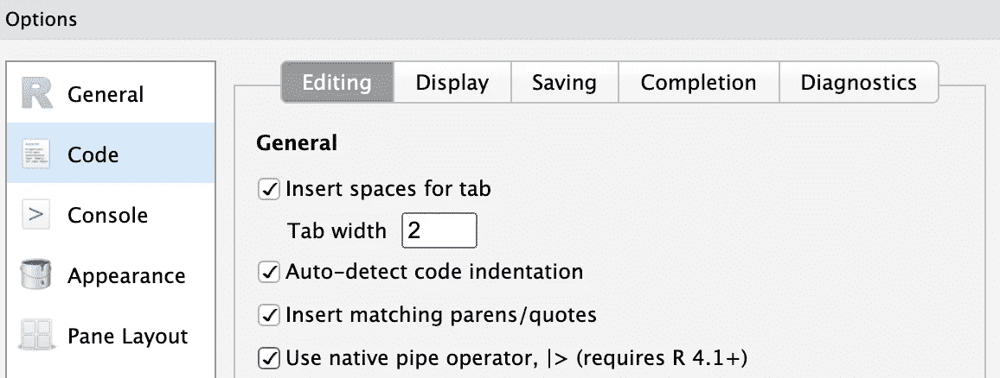
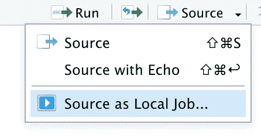
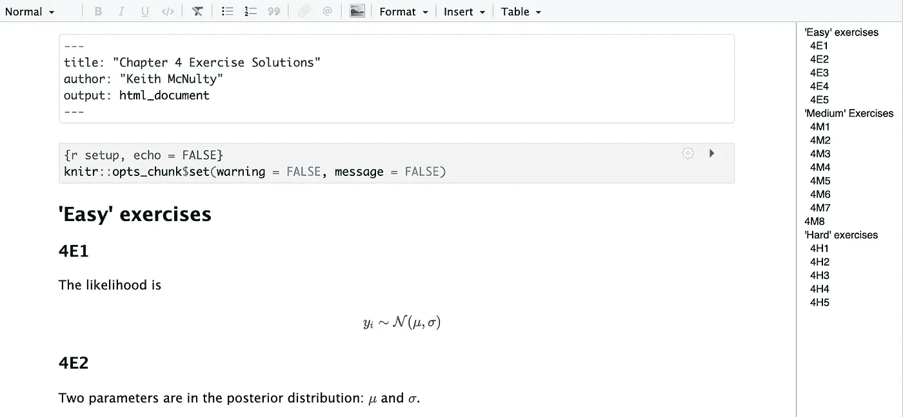
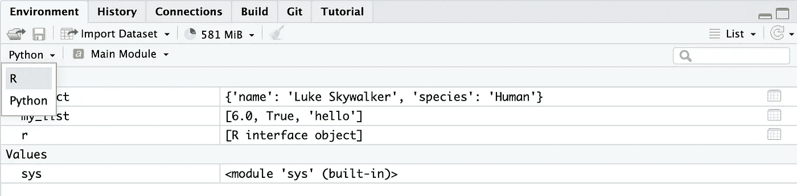
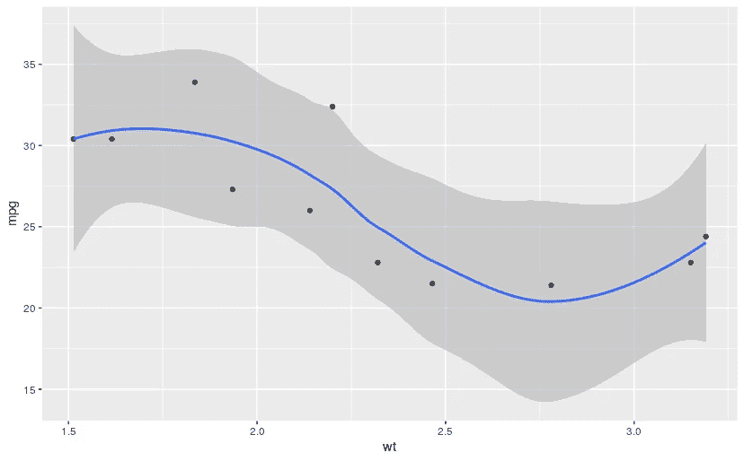
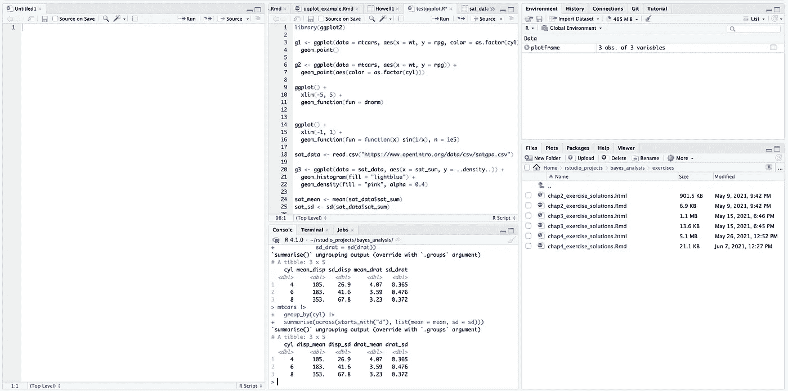

# 十大最新研发成果

> 原文：<https://towardsdatascience.com/ten-awesome-recent-developments-in-r-6bfad46299a0?source=collection_archive---------7----------------------->

## 如果你最近没有掌握最新情况，以下是你应该知道的十件事


从卡尔·海尔达尔途经 unsplash.com

在过去一年左右的时间里，R 生态系统的发展一直在稳步前进。基础 R 语言、关键 R 包和 RStudio IDE 中的新功能使得像我这样的原生 R 程序员更容易完成他们的日常工作。这些发展中的大部分也使得用 R 编写代码变得更加令人愉快，并且在许多情况下消除了以前令人头疼的问题，或者引入了与其他编程语言更好地结合的功能。

如果你没有跟上时代，这里有十个在过去一年左右的时间里让我兴奋的发展——排名不分先后。如果已经有一段时间了，希望这能鼓励你尝试或重新接触这门语言。

## 1.天然管道

我从最近的新进展开始。任何对 R 有过短暂介绍的人都会知道管道操作符`%>%`，它是 R 独有的，引入它是为了使代码更具逻辑性和可读性。对于大多数 R 用户来说，管道已经变得如此自然，以至于许多人试图立即使用它，却没有意识到它不是 base R 的一部分。很多次，我会在安装`dplyr`或`magrittr`之前尝试使用它，由此产生的错误变得令人沮丧和讨厌。

一段时间以来，已经认识到管道需要在 base R 中可用，并且从 R 版本 4.1.0 开始，该操作符是可用的，并被标记为`|>`。Native pipe 将把它前面的表达式作为第一个参数放入后面的函数中。例如:

```
mtcars |>
  subset(subset = cyl == 4)
```

将子集`mtcars`降低到仅用`cyl == 4`观察。注意，与使用`%>%`不同，您不能使用`.`直接进入函数的其他参数——例如:

```
row.names(mtcars) |> 
  grepl("Mazda", .)
```

不会起作用。为此，我们需要使用一个函数调用(见第 2 条)。

预计从长远来看，原生管道将取代“旧”管道。然而，这将需要在使用旧管道的关键包中进行一些进一步的开发，所以您需要准备好使用两者一段时间。如果您确实想立即开始使用本机管道，您可以切换到前面的 Cmd/Ctrl-Shift-M 快捷键，通过单击全局选项> RStudio 中的代码下的框来编码新管道:



将 Cmd/Ctrl-Shift-M 交换到 RStudio 中新的原生管道(作者生成的图像)

## 2.R 中新的匿名函数(类似 Lambda)语法

R 4.1.0 中的另一个并行开发是一个新的语法，用于编写一次性使用的匿名函数，类似于 Python 中的 Lambdas。一般来说，R 之前已经设置好了，鼓励所有函数都在内存中命名。例如:

```
check_mazda <- function(x) {
  grepl("Mazda", x)
}
```

然后，我们将通过管道进入该函数，如下所示:

```
mtcars |>
  row.names() |> 
  check_mazda()
```

虽然总是有办法解决这个问题，但最新的版本将匿名函数的简写正式化如下:

```
mtcars |>
  row.names() |>
  {\(x) grepl("Mazda", x)}()
```

这为跨数据结构映射匿名函数做好了准备。例如:

```
mtcars |>
  lapply(\(x) mean(x) > 20)
```

将跨`mtcars`的所有列测试该列的平均值是否大于 20。

## 3.RStudio 作业

在 RStudio 中，作业可以让您更有效地进行多任务处理。以前，如果您想运行冗长的 R 代码，同时处理代码，您必须启动两个不同的 RStudio 实例，这有点烦人。现在，您可以将代码作为一个作业来运行，它将在 RStudio 中的一个单独的 R 会话中运行，允许您在处理其他事情的同时对其进行监控。

如果您在 RStudio 1.2+中工作，可以使用下拉源菜单将脚本作为作业运行。



您需要确保您的工作目录设置正确，并且您需要选择要将结果复制到哪里。如果您的脚本没有将结果写到某个地方，并且您选择不将它们复制到某个地方，那么流程将执行而没有结果，这可能不是您想要的。您还可以使用脚本中的部分注释来跟踪作业的进度——您可以在这里了解更多信息。

## 4.R Markdown 可视化编辑器

R Markdown 非常棒，也是我最喜欢的发布数据文档的方式。现在，从 RStudio 1.4 开始，R Markdown 有了一个可视化编辑器，对于那些不完全熟悉 R Markdown 语法的人来说，这是一个很好的工具。

要使用可视化编辑器编辑您的`Rmd`文档，请查找


“文档”窗口右上角的符号。这将在源代码编辑器和可视化编辑器之间切换。以下是可视化编辑器的一个示例:



## 5.在 RStudio 中查看 Python 对象并与之交互

从 RStudio 1.4 开始，无论何时使用 R 和 Python，都可以很容易地在两个环境之间切换，并查看每个环境中的对象。假设您已经安装并加载了`reticulate`包，您可以通过在环境窗格中点击 Python 和 R 环境来查看它们:



如果你有兴趣了解更多关于在 R Studio 中一起使用 R 和 Python 的知识，那么请看我的另一篇文章[这里](/five-ways-to-work-seamlessly-between-r-and-python-in-the-same-project-bf173e35fdef)。

## 6.彩虹括号

这个更具装饰性，但是给嵌套括号着色可以帮助您更容易地解决代码问题，尤其是当您有许多嵌套的普通、方形或花括号时。现在可以在全局选项>代码>显示下启用此功能:


## **7。列出数据帧中的列**

虽然列表列不是全新的，但自从去年 tidyverse 包`dplyr`和`tidyr`的重大更新以来，列表列更加引人注目。现在，数据帧的列可以是列表，而不仅仅是向量，这允许我们灵活地在数据帧中放置任何东西，包括模型、图形、其他数据帧等等。这创造了巨大的灵活性，并为像`dplyr`这样的包打开了更大的权力。例如，现在可以在数据帧中嵌套子集数据帧:

```
library(dplyr)
library(ggplot2)mtcars |> 
  nest_by(cyl)# A tibble: 3 x 2
# Rowwise:  cyl
    cyl                data
  *<dbl>* *<list<tibble[,10]>>*
1     4           [11 × 10]
2     6            [7 × 10]
3     8           [14 × 10]
```

然后，您可以进一步改变包含每个子集的图的列:

```
plotframe <- mtcars |> 
  nest_by(cyl) |> 
  mutate(plot = list(ggplot(data = data, aes(x = wt, y = mpg)) +
           geom_point() +
           geom_smooth()))# A tibble: 3 x 3
# Rowwise:  cyl
    cyl                data plot  
  *<dbl>* *<list<tibble[,10]>>* *<list>*
1     4           [11 × 10] <gg>  
2     6            [7 × 10] <gg>  
3     8           [14 × 10] <gg>
```

现在我们有了一个包含数据帧的列表列和一个包含绘图的列表列。要查看特定的绘图，您只需调用列表列中的一个元素:

```
plotframe$plot[1]
```



这可以扩展到使用数据帧来支持大批量任务——在我的文章[中的批量参数化 powerpoint 文档的生产中可以看到这样的例子。](/generating-parameterized-powerpoint-documents-in-python-and-r-333368479038)

## 8.将您的数据科学流程流水线化

新开发的`targets`包提供了一个工具包，用于自动化和生产 R 中的数据科学过程。这特别旨在克服这些过程建立在相互依赖的 R 脚本上的情况，这些脚本按顺序单独执行。这个模型并不理想，`targets`鼓励程序员在抽象的 R 函数管道中建立他们的流程，而不是使用脚本。targets 包将智能地执行这些函数的流水线，并存储中间和最终输出以供检查。

当参数改变时，`targets`知道这会影响到管道的哪些部分，并且只执行管道中受影响的部分，使用先前为未受影响的部分生成的输出。这可以节省大量的时间，并有助于大量的错误修复。`targets`还包含像`tar_glimpse()`这样有用的功能，可以即时创建管道的可视化。更多关于`targets` [这里](https://books.ropensci.org/targets/)。

## 9.dplyr 中扩展的抽象能力

`dplyr`是 R 生态系统中一个非常重要的包，从去年 1.0.0 版本发布时起，它的力量已经大大增强了。特别是，许多常用的函数已经被抽象为一次跨多个列工作，节省了大量的编码工作。结合允许您通过编程选择列的`tidyselect`，现在使用`summarise`中的`across`这样的函数可以大大缩短代码。例如，以前我们可能会写:

```
mtcars |>
  group_by(cyl) |>
  summarise(mean_disp = mean(disp),
            sd_disp = sd(disp),
            mean_drat = mean(drat),
            sd_drat = sd(drat))
```

我们现在可以简单地写:

```
mtcars |>
  group_by(cyl) |>
  summarise(across(starts_with("d"), list(mean = mean, sd = sd)))
```

我已经在这里详细地写了一些令人惊奇的新的抽象功能[。](/what-you-need-to-know-about-the-new-dplyr-1-0-0-7eaaaf6d78ac)

## 10.使用源列在 RStudio 中创建更多编码空间

如果您希望同时打开和查看多个源文件，并且希望在不牺牲其他窗格的情况下获得更多空间，那么从 RStudio 1.4 开始，您可以通过简单地添加源列来实现这一点。你可以通过全局选项>窗格布局，然后选择新的“添加列”选项。这将在现有窗格的左侧创建一个全新的源窗格。如果你愿意，你甚至可以添加更多。



在这里，我在左侧添加了一个额外的源列

这些只是我充分利用的 R 的最新发展。如果你有其他人可以随意添加到评论中，这样其他读者也可以受益。

最初我是一名纯粹的数学家，后来我成为了一名心理计量学家和数据科学家。我热衷于将所有这些学科的严谨性应用到复杂的人的问题上。我也是一个编码极客和日本 RPG 的超级粉丝。在[*LinkedIn*](https://www.linkedin.com/in/keith-mcnulty/)*或*[*Twitter*](https://twitter.com/dr_keithmcnulty)*上找我。也可以看看我在 drkeithmcnulty.com*[*上的博客*](http://drkeithmcnulty.com/) *或者我即将发布的* [*关于人物分析的教科书*](https://www.routledge.com/Handbook-of-Regression-Modeling-in-People-Analytics-With-Examples-in-R/McNulty/p/book/9781032041742) *。*