# 关于 ggplot2 要知道的十件随机但有用的事情

> 原文：<https://towardsdatascience.com/ten-random-but-useful-things-to-know-about-ggplot2-197dc4439d10?source=collection_archive---------17----------------------->

## 就像语言中的语言，但对于数据科学图形来说，这是当今最好的东西

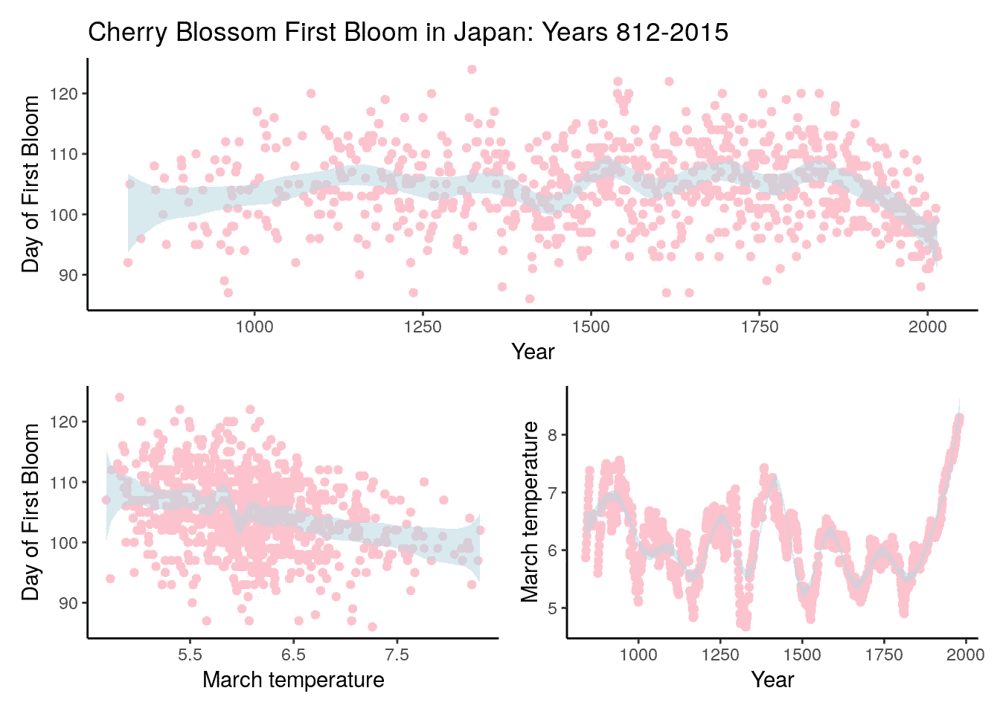

本文中的所有图片都是作者生成的

上周，我在`ggplot2`中做了一些图表，向一些分析师同事说明一些事情。这些图表立即引起了共鸣，并完全符合我的目的。不久之后，我收到了分析师发来的一条信息——“我如何在 Excel 中做到这一点？”。

我解释说，他们不太可能在 Excel 中创建这个图表——不是以任何直接的方式——我将此作为鼓励分析师调查和学习数据科学语言的机会。对我来说，像`ggplot2`这样的软件包是学习编程的最有说服力的理由之一。在几行简单的代码中，你可以创建几乎任何统计现象的惊人的、定制的图形。您可以将它们设计得非常漂亮，您可以将它们集成到任何文档中，并且您可以共享代码，以便其他人可以轻松、即时地复制它们。

也就是说，`ggplot2`有一个特殊的语法，需要一些时间来适应，所以它不是可以立即掌握的东西。对`ggplot2`变得自信需要实践、尝试和错误，但是一旦你到了那里，统计图表的世界就是你的了。

我想用这篇文章来展示我在`ggplot2`中经常做的一些事情。我希望它有助于鼓励你更多地使用这个包，你甚至可以学到一些你不知道的技巧。

## 1.使用美学继承使你的代码更简单

`ggplot2`图表是通过审美传承来发挥作用的。*美学*实际上是图形和数据之间的映射。您使用美学来告诉`ggplot2`哪些数据元素用于图表的哪些特性。例如，要为`mtcars`数据集创建一个显示`mpg`与`wt`的简单散点图，并根据`cyl`为点着色，您需要将三个美学传递给`ggplot()`:

```
library(ggplot2)g1 <- ggplot(data = mtcars, 
             aes(x = wt, y = mpg, color = as.factor(cyl))) +
  geom_point()
```

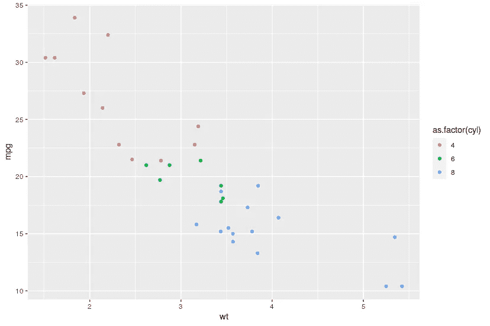

你在第一个`ggplot()`语句中加入的任何美学将会传递给所有后续的图形命令，除非你特别指出。因此，如果我们想为每个`cyl`组分别绘制拟合线，我们只需添加`geom_smooth()`:

```
g1 + geom_smooth()
```

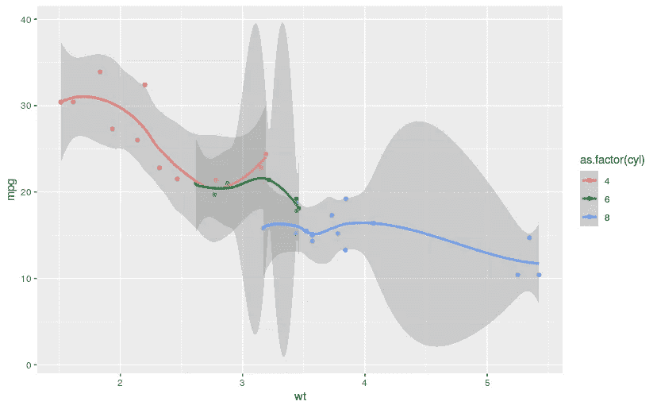

也许你不想这样，只是想要一个适合整个样本的线？然后，只需从原始`ggplot()`语句中取出您不希望继承的美学元素，并将其放入您希望使用它们的特定 geom 函数中:

```
g2 <- ggplot(data = mtcars, aes(x = wt, y = mpg)) +
  geom_point(aes(color = as.factor(cyl)))
```

这将创建一个相同的散点图，但现在当您添加`geom_smooth()`时，颜色分组将不再被继承，一个更一般的拟合将被绘制:

```
g2 + geom_smooth()
```

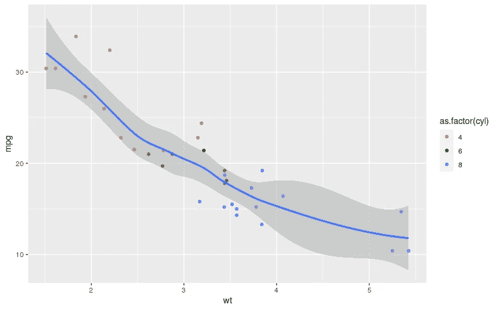

## 2.绘制任何没有数据的函数

`geom_function()`是`ggplot2`的一个相对较新的补充，允许你对你定义的任何函数进行模拟绘图。这可以是一个内置的通用统计函数:

```
ggplot() +
  xlim(-5, 5) +
  geom_function(fun = dnorm)
```

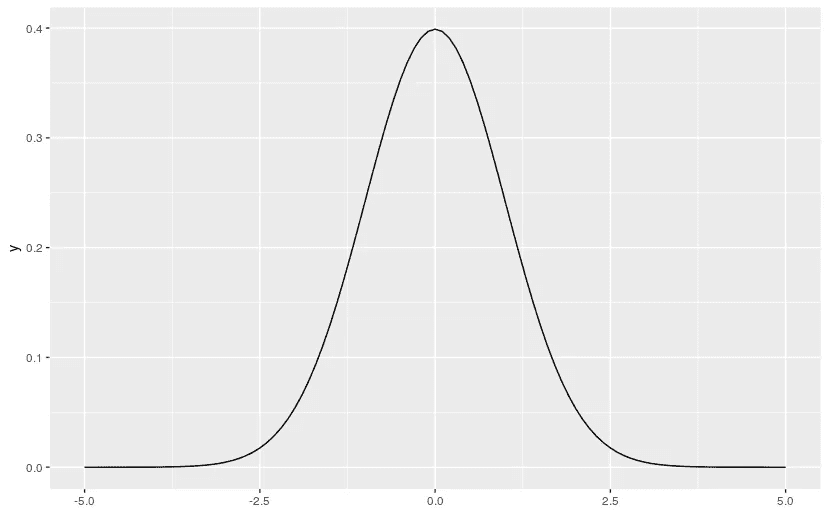

或者它可以是用户定义的函数。例如，一个有趣的函数是 sin(1/x ),很久以前，我在本科数学项目的一次面试中被要求画出这个函数。您可以使用`n`参数来指定要模拟多少个点——在本例中，我将使用 100，000 个点:

```
ggplot() +
  xlim(-1, 1) +
  geom_function(fun = function(x) sin(1/x), n = 1e5)
```

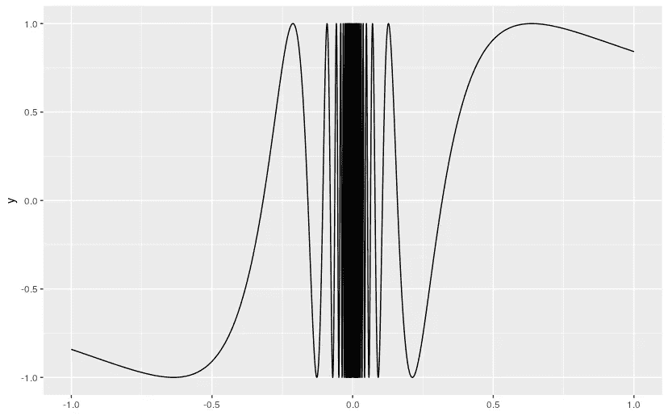

## **3。将密度曲线叠加到直方图上**

当绘制分布图时，最好同时看到直方图和密度曲线。您可能想通过简单地添加`geom_histogram()`然后添加`geom_density()`来做到这一点，但问题是默认情况下`geom_histogram()`使用计数而不是密度。因此，将密度定义为 y 美学非常重要，这样两种几何图形才能很好地协同工作。还要注意使用像`fill`和`alpha`这样的图形元素来定制颜色和不透明度。

```
# get some data on sat scores for 100 students
sat_data <- read.csv("[https://www.openintro.org/data/csv/satgpa.csv](https://www.openintro.org/data/csv/satgpa.csv)")g3 <- ggplot(data = sat_data, aes(x = sat_sum, y = ..density..)) +
  geom_histogram(fill = "lightblue") +
  geom_density(fill = "pink", alpha = 0.4)
```

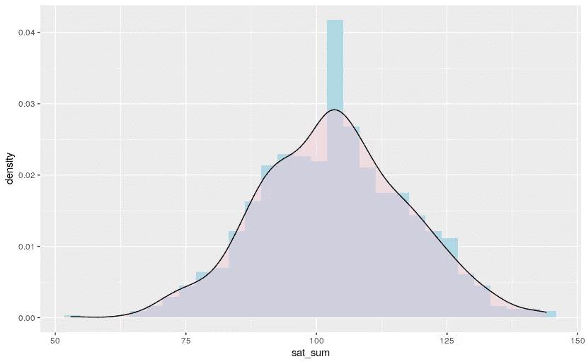

## 4.通过去继承美学来覆盖不相关的图形元素

有时，您可能希望通过叠加一个没有继承先前图形美感的图形来说明一个理论模型或比较模型。这就是论点`inherit.aes`真正有用的地方。默认情况下，大多数 geom 函数都将该参数设为`TRUE`，但是将其设为`FALSE`可以让您在图表上覆盖一些不相关的内容。例如，假设我想要叠加一个理论上的完美正态分布:

```
sat_mean <- mean(sat_data$sat_sum)
sat_sd <- sd(sat_data$sat_sum)g3 +
  geom_function(
    fun = function(x) dnorm(x, mean = sat_mean, sd = sat_sd), 
    linetype = "dashed",
    inherit.aes = FALSE
  )
```

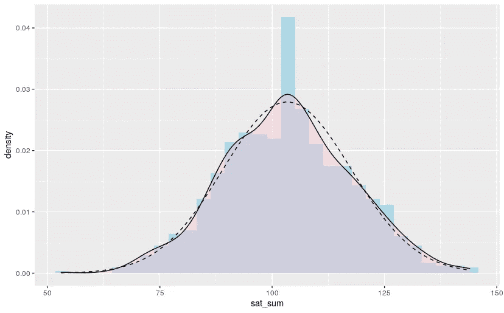

## 5.使用 geom_ribbon()传达范围和不确定性

在我看来，`geom_ribbon()`是`gglot2`中使用最少的 geoms 之一。你可能已经在使用中见过它，因为它是`geom_smooth()`中阴影置信区间背后的引擎，但是我在很多情况下都使用过它。假设我们建立了一个模型，根据之前数据集中的高中 GPA 预测 SAT。我们可以使用`geom_smooth()`来很好地显示均值的置信区间，但是我们可以在其上叠加`geom_ribbon()`来很好地显示一个更宽的预测区间。

```
model <- lm(sat_sum ~ hs_gpa, data = sat_data)
predictions <- predict(model, data.frame(hs_gpa = sat_data$hs_gpa), 
                       interval = "prediction")ggplot(data = sat_data, aes(x = hs_gpa)) +
  geom_point(aes(y = sat_sum), color = "lightblue") +
  geom_smooth(aes(y = sat_sum), color = "red") +
  geom_ribbon(aes(ymin = predictions[,'lwr'], 
                  ymax = predictions[,'upr']), 
                  fill = "pink",
                  alpha = 0.3)
```

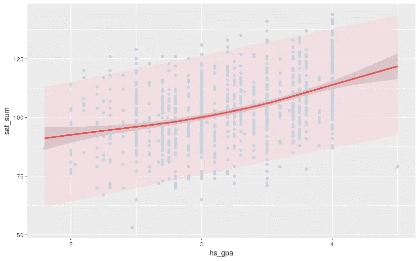

## 6.使用 geom_jitter()给你的散点图更多的“分散”

许多数据由于其固有的规模而被“聚集”。例如，在上面的图表中，你可以看到`hs_gpa`似乎有点结块，迫使散点图变成线条。这可能导致数据点隐藏在其他数据点后面，并且可能意味着您的样本大小看起来比散点图中的要小。`geom_jitter()`是一个非常有用的便利功能，它可以对你的点进行随机抖动，以帮助解决这个问题。只需将`geom_point()`替换为`geom_jitter()`，并尝试使用`width`参数来获得您想要的抖动量:

```
g4 <- ggplot(data = sat_data, aes(x = hs_gpa)) +
  geom_jitter(aes(y = sat_sum), color = "lightblue", width = 0.05) +
  geom_smooth(aes(y = sat_sum), color = "red") +
  geom_ribbon(aes(ymin = predictions[,'lwr'], 
                  ymax = predictions[,'upr']), 
                  fill = "pink",
                  alpha = 0.3)
```

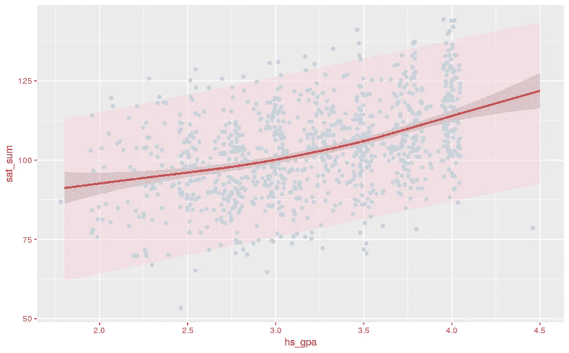

## 7.在图表上批注文本

`geom_text()`允许您向图表添加有用的文本，以帮助理解。假设我们想要用相似颜色的文本在 x-y 刻度上的适当点标注预测间隔:

```
g5 <- g4 +
  geom_text(x = 4.3, y = 100, 
            label = "Prediction \nInterval", 
            color = "pink")
```

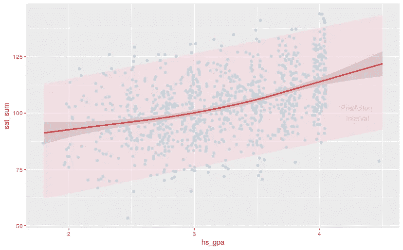

## 8.主题化您的图表以改善外观和感觉

内置主题对于在一个简单的命令中改变图表的外观非常有用。我喜欢干净漂亮的外观，所以我是`theme_minimal()`的忠实用户。结合漂亮的标签，这可以很快让你得到你想要的外观。这里有一个例子:

```
g5 + 
  theme_minimal() +
  labs(x = "High School GPA", 
       y = "SAT",
       title = "Relationship between GPA and SAT")
```

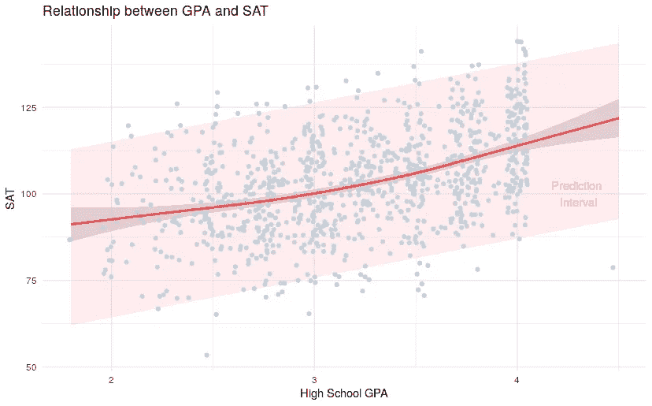

除了`ggplot2`的内置主题，您还可以尝试`ggthemes`包中的主题，其中包括一些流行数据出版物的主题:

```
library(ggthemes)g6 <- g5 + 
  theme_economist_white() +
  labs(x = "High School GPA", 
       y = "SAT",
       title = "Relationship between GPA and SAT")
```

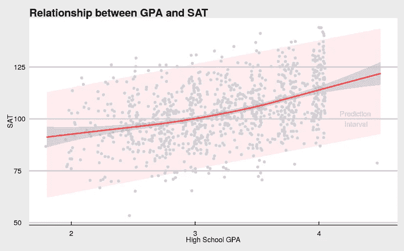

## 9.获得元素的详细信息

当您为高风险的演示文稿设计样式，并且想要了解轴、文本、记号等复杂细节时，您可以编辑元素以获得正确的细节。比方说，我想在上面的图表中使用粗体轴标题和更大的标题字体。

```
g6 +
  theme(axis.title = element_text(face = "bold"),
        plot.title = element_text(size = 20))
```

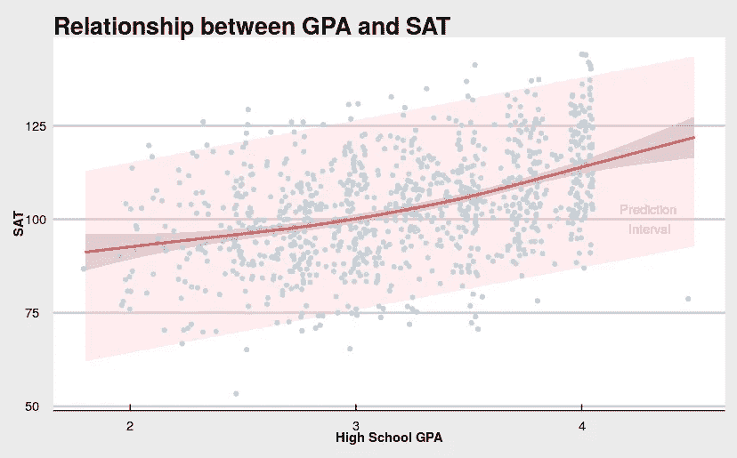

## 10.在 R Markdown 中使用 patchwork 包轻松组合多个 ggplots

如果你已经创建了多个 ggplots，你想以某种方式组合它们，我发现`patchwork`包是一个非常简单的方法，比`gridExtra::grid.arrange()`更直观。要使用它，你必须在 R Markdown 中工作，但一旦你编织了你的文档，你可以随时将拼凑的图像保存为一个单独的文件。假设我想将上面的图像`g4`、`g5`和`g6`与`g4`和`g5`并排修补在第一行，而`g6`横跨第二行，我可以在 R Markdown 文档中使用 patchwork 来完成此操作，如下所示:

```
library(patchwork)(g4 | g5) / 
  g6
```

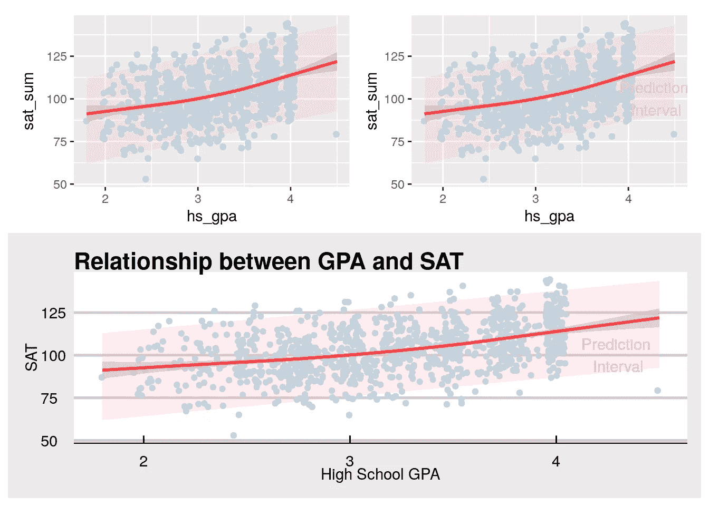

显然，这十条建议并不全面，但我希望它们能说明我喜欢在`ggplot2`工作的一些原因，并激励你尝试一些新事物，更好地了解这个包。

最初我是一名纯粹的数学家，后来我成为了一名心理计量学家和数据科学家。我热衷于将所有这些学科的严谨性应用到复杂的人的问题上。我也是一个编码极客和日本 RPG 的超级粉丝。在[*LinkedIn*](https://www.linkedin.com/in/keith-mcnulty/)*或*[*Twitter*](https://twitter.com/dr_keithmcnulty)*上找我。也可以看看我关于*[*drkeithmcnulty.com*](http://drkeithmcnulty.com/)*的博客或者我即将发布的* [*关于人的分析的教科书*](https://www.routledge.com/Handbook-of-Regression-Modeling-in-People-Analytics-With-Examples-in-R/McNulty/p/book/9781032041742) *。*