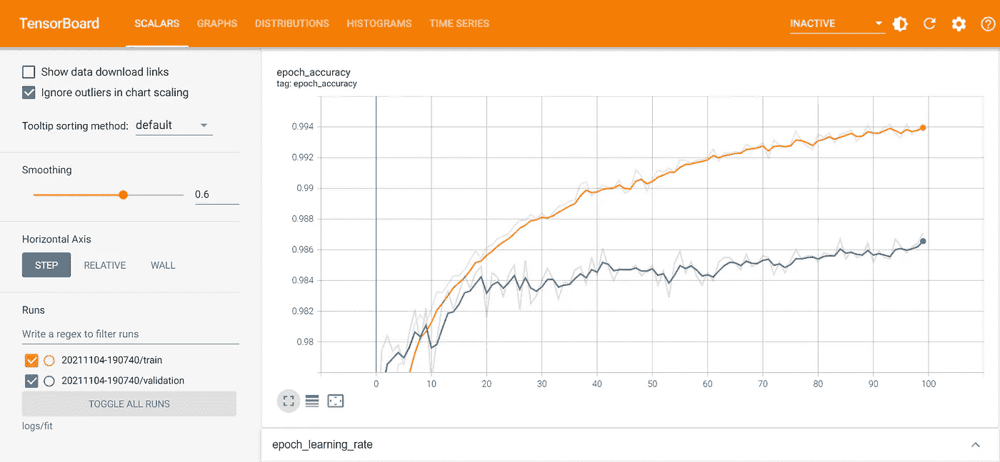
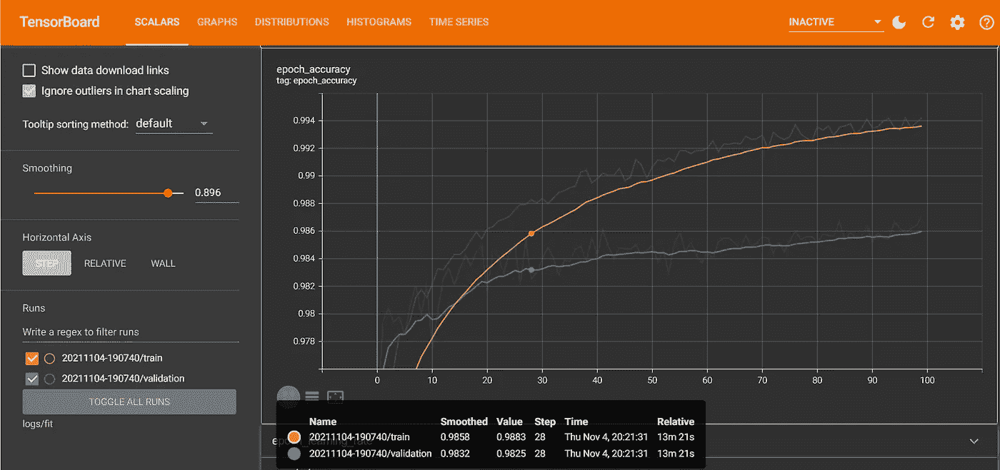
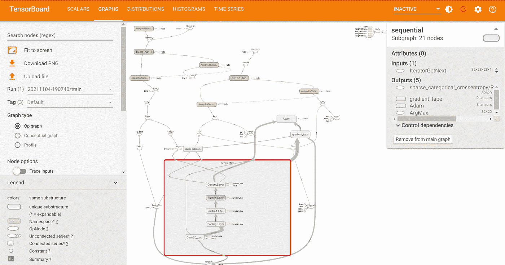
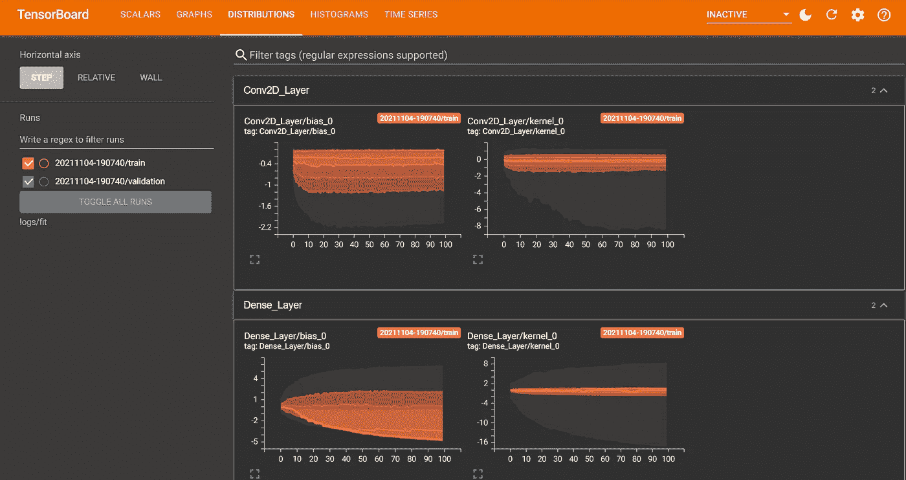
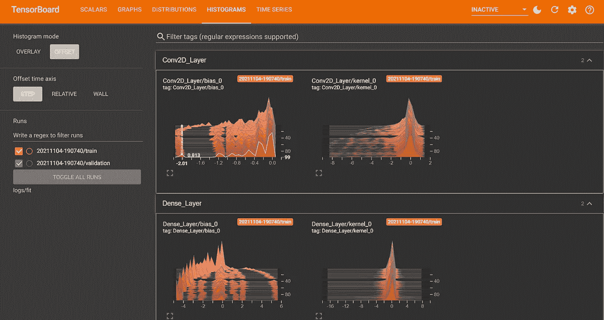
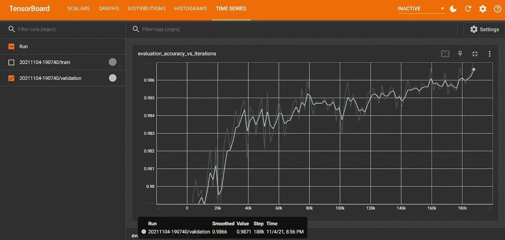

# 五分钟后登船

> 原文：<https://towardsdatascience.com/tensorboard-in-5-minutes-71c5715a10d3?source=collection_archive---------10----------------------->

## 学习如何更好地理解你的机器学习模型。

TensorBoard(图片由作者提供)

机器学习是复杂的。有数不清的选项可供选择，也有很多要跟踪。幸运的是，有 TensorBoard，这使得过程很容易。

在开发机器学习模型时，有许多因素:多少个时期用于训练，损失度量，甚至模型结构。这些决策中的每一个都可以传播，并在无效模型和成功模型之间产生差异。

本文将讨论 TensorBoard 中的一些功能，以及如何为您的下一个机器学习项目设置 TensorBoard。特别是，重点将放在与 TensorFlow 和基于 Keras 的模型一起使用 TensorBoard。

要确定模型的最佳配置，您需要进行实验。任何数据科学家都知道，你需要有效地跟踪和评估这些实验。

幸运的是，TensorBoard 有许多内置功能，您可以利用这些功能快速了解模型中正在发生的事情。

# 设置

设置 TensorBoard 是一个简单的过程。只需几行代码，您就可以从您的机器学习模型中跟踪关键指标。

第一步是将扩展加载到您的笔记本中。

加载 TensorBoard 扩展(代码由作者编写)

接下来，您需要一些数据。这里我使用的是 TensorFlow 内置的 MNIST 数据集[。数据被整形以允许使用 2D 卷积层。](https://www.tensorflow.org/datasets/catalog/mnist)

从 TensorFlow 加载 MNIST 数据集(代码由作者编写)

准备好数据后，您需要构建您的模型。在这里，我做得有点过火，对每个变量都进行了参数化。

这种选择是为了在没有太多问题的情况下快速更改模型的不同方面。这种结构也避免了不清楚值在变化的情况。

结构简单。但是这个基本结构显示了各种不同的层，你可以在 TensorBoard 中进行分析。该模型包含一个 2D 卷积层，随后是汇集层、分离层、输出展平层和密集层。

学习率也有调整。与设置固定的学习速率相反，调度器使学习速率变得灵活并有助于收敛。

模型创建和参数定义(由作者编写代码)

要将 TensorBoard 功能添加到您现有的基于 Keras 的 TensorBoard 模型中，您需要在培训的模型拟合阶段添加一个回调。

应该启用直方图计算来有效地跟踪进度，这是通过将 historgram_freq 参数设置为 1 来实现的。

回调函数需要一个日志目录来存储训练模型的结果。因此，在您的日志中包含一些结构化排序以供将来参考是有益的。这里使用的是当前时间。

编译和拟合模型，设置 TensorBoard 回调(代码由作者编写)

一旦模型被创建、编译和拟合，日志就应该被打包。在训练中你的模型的所有细节。准备好让你分析了。

要在 TensorBoard 中查看训练过程结果，剩下的工作就是运行扩展。

运行 TensorBoard(由作者编写代码)

# **张量板的组件**

TensorBoard 被分解成几个部分。这些组件允许您跟踪不同的指标，如准确性、均方根误差或对数损失。它们还允许将模型可视化为图形等等。

在这篇文章中，我将展示标量、图形、分布、直方图和时间序列标签。**但是在非活动下拉列表中可以找到其他可用视图的列表。**

TensorBoard 也有一些造型选项。我在这里的一些图片中使用了黑暗模式。

## **标量**

标量是打开 TensorBoard 时看到的第一个标签。这里的重点是模型在多个时期的性能。

这里显示了模型的损失函数和您跟踪的任何指标。

该选项卡的一个重要功能是平滑功能。当处理多个时代或一个不稳定的模型时，整体趋势可能会丢失。因此，你要确保你的模型在训练中不断进步，而不是停滞不前。

通过增加平滑度，您可以在训练过程中查看模型的总体趋势。

标量选项卡对于识别模型何时过度拟合至关重要。例如，当您的训练指标不断提高，但验证图没有增加时，您可能对验证集过度拟合。

张量板标量选项卡(图片由作者提供)

## **图表**

graphs 选项卡允许您查看您创建的模型的结构。本质上，它展示了幕后发生的事情。

当您需要与他人共享图形结构时，这些细节很有帮助。此外，还可以上传或下载图表。

除了基本模型结构，该图还揭示了如何使用不同的指标和优化器。

在这里，我选择了图中的顺序节点。一旦选中，模型的结构就会显示出来。细节可以在下图的红框中看到。

TensorBoard Graphs 选项卡(图片由作者提供)

## **分布图&直方图**

分布和直方图选项卡非常相似。但是，它们允许您通过不同的可视化方式查看相同的信息。

“分布”选项卡为您提供了模型权重随时间变化的良好概览。这个视角作为一个初始的标尺，用来判断是否有什么地方出了问题。

直方图视图对您的模型学习到的确切值进行了更详细的细分。

这两种可视化用于确定模型何时过度依赖一小组权重。或者权重是否在许多时期内收敛。

## 分布

TensorBoard 分布选项卡(图片由作者提供)

## **直方图**

TensorBoard 直方图选项卡(图片由作者提供)

## **时间序列**

TensorBoard 中显示的最后一个选项卡是时间序列选项卡。

这个视图非常类似于标量视图。然而，一个区别是您的目标度量的观察值是针对训练的每次迭代，而不是每个时期。

以这种方式观察模型训练要细致得多。这种类型的分析最好是在模型没有收敛，并且跨时代的进展没有揭示任何答案的时候。

TensorBoard 时间序列选项卡(图片由作者提供)

# 包裹

TensorBoard 是一个强大的工具。通过几个不同的组件和视图，你可以快速分析你的机器学习和深度学习模型。

该工具易于设置，并为如何更好地训练模型提供了宝贵的见解。

这里我只展示了 TensorBoard 的一个例子。您可以随意复制代码并亲自探索这个工具。

*如果你有兴趣阅读关于新颖的数据科学工具和理解机器学习算法的文章，可以考虑在 medium 上关注我。我总是在我的文章中包含代码，您可以将其应用到您的工作中！*

如果你对我的写作感兴趣，并想直接支持我，请通过以下链接订阅。这个链接确保我会收到你的会员费的一部分。

 [## 通过我的推荐链接加入 Medium-Zachary Warnes

### 阅读扎卡里·沃恩斯(以及媒体上成千上万的其他作家)的每一个故事。您的会员费直接支持…

zjwarnes.medium.com](https://zjwarnes.medium.com/membership)