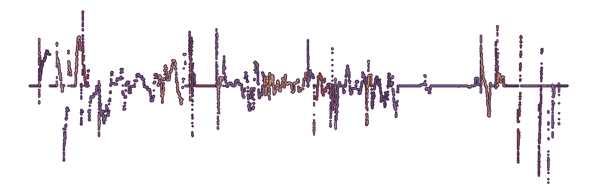
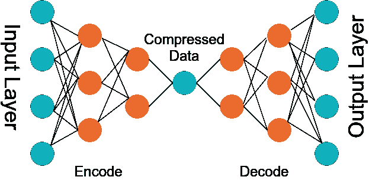
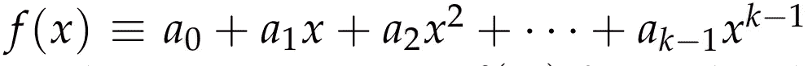
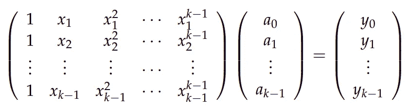
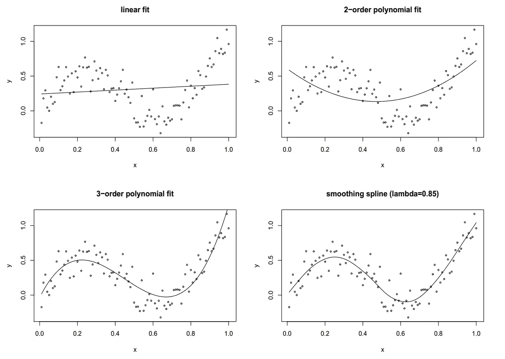
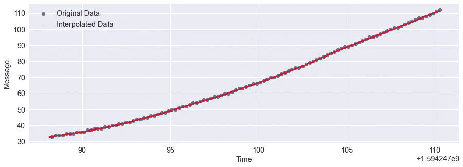
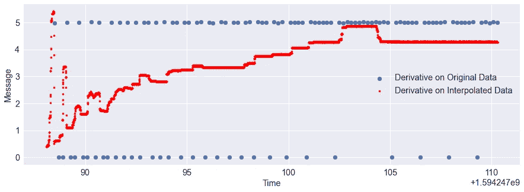

# TensorFlow 2:如何使用自动编码器进行插值

> 原文：<https://towardsdatascience.com/tensorflow-2-how-to-use-autoencoder-for-interpolation-91fefd4516c9?source=collection_archive---------25----------------------->

## [理解大数据](https://towardsdatascience.com/tagged/making-sense-of-big-data)

## 使用 TensorFlow 2 和 AutoEncoder 进行插值和去噪的简短教程



来自作者模拟的原始图像。

# 自动编码器

自动编码器是另一种用于以压缩方式再现输入的神经网络。自动编码器有一个特殊的属性，即输入神经元的数量与输出神经元的数量相同。



作者使用 [draw.io](http://draw.io) 创建的图像

看上图。自动编码器的目标是在输出层创建输入的表示，使得输出和输入相似，但是自动编码器的实际用途是确定具有最低数据丢失量的输入数据的压缩版本。这与主成分分析以黑盒方式所做的事情非常相似。Autoencoder 的编码器部分在压缩数据的同时，确保重要数据不会丢失，但数据的大小会减小。

使用 Autoencoder 进行插值的缺点是压缩数据是黑盒表示，我们不知道压缩版本中的数据结构。假设我们有一个有 10 个参数的数据集，我们在这个数据上训练一个自动编码器。为了更好地表示，编码器没有省略一些参数，而是融合这些参数以创建具有更少参数的压缩版本(将参数数量从 10 个减少到 5 个)。自动编码器有两部分，编码器和解码器。编码器压缩输入数据，而解码器反过来产生数据的未压缩版本，以产生尽可能接近原始输入的重构输入。

# 插值方法

插值是在两个数据点之间猜测函数值的过程。比如给你 *x = [1，3，5，7，9]* ，和 *y = [230.02，321.01，305.00，245.75，345.62]* ，根据给定的数据你想知道给定 *x = 4* 的 *y* 的值。文献中有大量的插值方法，有些是基于模型的，有些是无模型的，即数据驱动的。实现插值的最常见方法是通过数据拟合。例如，您可以使用线性回归分析来拟合给定数据的线性模型。

在**线性回归**中，给定解释/预测变量 *X* 和响应变量 *Y* ，使用公式 *Y = β0 + β1X* 拟合数据，其中 *β0* 和 *β1* 使用**最小二乘法拟合**确定。顾名思义，线性回归是线性的，即它拟合直线，即使预测值和响应变量之间的关系可能是非线性的。

然而，最常见的插值形式是**多项式拟合**。给定 *k* 个样本点，拟合一个次数为 *k -1* 的多项式是简单的。给定数据集 *{xi，易}* ，通过确定函数的多项式系数 *ai* 得到多项式拟合



通过从以下表达式求解矩阵求逆:



一旦我们有了系数 *ai* ，我们就可以找到函数 *f* 对于任何 *x.* 的值

有一些多项式拟合的特殊情况，其中一个**分段三次多项式**被拟合到数据。其他一些非参数方法包括**三次样条、平滑样条、回归样条、核回归、**和**密度估计。**



图片来自作者的课程作业

然而，本文的重点不是多项式拟合，而是插值。多项式拟合恰好便于插值。然而，多项式拟合方法有一个问题——无论是**参数化的**还是**非参数化的**，它们都按照被教授的方式运行。这意味着，如果数据是干净的，拟合将是干净和平滑的，但如果数据是有噪声的，拟合将是有噪声的。这个问题在传感器数据中更加普遍，例如，从您的心率传感器捕获的心跳数据、从[激光雷达](https://medium.com/analytics-vidhya/how-does-a-self-driving-vehicle-see-using-lidar-49f569ededf2)、 [CAN 总线](https://jmscslgroup.github.io/strym/)从您的汽车获取的速度数据、GPS 数据等。

[](https://medium.com/analytics-vidhya/how-does-a-self-driving-vehicle-see-using-lidar-49f569ededf2) [## 自动驾驶车辆如何使用激光雷达进行观察？

### 自动驾驶汽车已经成为最近的热门词汇，几家公司试图创造一个完美的机器人，如…

medium.com](https://medium.com/analytics-vidhya/how-does-a-self-driving-vehicle-see-using-lidar-49f569ededf2) 

此外，由于噪声，它们更难处理，尤其是如果您的算法需要对这类数据执行二重或二阶导数。一般来说，这些传感器数据是时间序列数据，即它们是随时间收集的，因此响应变量可能是一些物理量，如速度、物体与安装在自动驾驶汽车顶部的激光雷达的距离、心率，预测变量是时间。在对这样的数据进行操作时，可以有几个目标:我希望将数据插值到某个时间戳，在该时间戳内，我的传感器无法记录任何响应，但是由于传感器在实时世界中操作，并且由于底层的物理特性，这些数据会有噪声，我还希望有不受传感器噪声影响的可靠插值。此外，我的需求可能还包括此类**时间序列**数据的衍生物。[衍生品往往会放大潜在时间序列数据中的噪音](https://dl.acm.org/doi/abs/10.1145/3302509.3314026)。如果有一种方法可以获得数据的底层表示，同时丢弃噪声，那会怎么样？**在这种情况下，Autoencoder 帮助我实现了目标。**

# 自动编码器作为插值器

为了演示使用 Autoencoder 的去噪+插值目标，我使用了一个由我的[实验室](http://csl.arizona.edu/)从车辆收集的距离数据的示例，其中响应变量是我的车辆前方车辆的距离，预测值是时间。作为演示的一部分，我在我的 GitHub repo 上提供了一小部分数据，您可以免费使用。然而，它真的很小，除了本文描述的教程之外没有任何用处。

[](https://github.com/rahulbhadani/medium.com/blob/master/data/lead_dist_sample.csv) [## rahulbhadani/medium.com

### TF2 自动编码器中型产品的导程数据示例…

github.com](https://github.com/rahulbhadani/medium.com/blob/master/data/lead_dist_sample.csv) 

好了，现在该编码了。

**注意:在您使用数据之前，我应该指出，时间(预测)和消息(响应)必须重新调整。在我的例子中，原始时间从 1594247088.289515(以** [**POSIX 格式**](https://en.wikipedia.org/wiki/Unix_time) **，以秒为单位)开始，到 159424710.290019 结束。我使用公式** `***(time - start_time)/(end_time - start_time)***` **将我的时间值标准化。类似地，使用** `**(message - message_min)/(message_max -message_min)**` **对响应变量进行标准化。我的 GitHub 中提供的示例数据已经标准化，您可以开箱即用地重用它。**

## 培养

```
import glob
import numpy as np
import matplotlib.pyplot as plt
import pandas as pd
import numpy as npdf = pd.read_csv("../data/lead_dist_sample.csv")
time = df['Time']
message = df['Message']import tensorflow as tf
model = tf.keras.Sequential()
model.add(tf.keras.layers.Dense(units = 1, activation = 'linear', input_shape=[1]))
model.add(tf.keras.layers.Dense(units = 128, activation = 'relu'))
model.add(tf.keras.layers.Dense(units = 64, activation = 'relu'))
model.add(tf.keras.layers.Dense(units = 32, activation = 'relu'))
model.add(tf.keras.layers.Dense(units = 64, activation = 'relu'))
model.add(tf.keras.layers.Dense(units = 128, activation = 'relu'))
model.add(tf.keras.layers.Dense(units = 1, activation = 'linear'))
model.compile(loss='mse', optimizer="adam")
model.summary()
# Training
model.fit( time, message, epochs=1000, verbose=True)
```

如您所见，我没有执行任何正则化，因为我故意要进行过度拟合，以便我可以最大限度地利用数据的潜在特性。现在是时候做个预测了。你会看到，在做预测之前，我将时间轴重新调整回原始值。对于这个例子，我有`**time_original[0] =** **1594247088.289515**`**`**time_original[-1] = 1594247110.290019**`**`**msg_min = 33**`**`**msg_max = 112**`******

```
**newtimepoints_scaled = np.linspace(time[0] - (time[1] - time[0]),time[-1], 10000)
y_predicted_scaled = model.predict(newtimepoints_scaled)newtimepoints = newtimepoints_scaled*(time_original[-1] - time_original[0]) + time_original[0]
y_predicted = y_predicted_scaled*(msg_max - msg_min) + msg_min**
```

****请注意，我在变量`newtimepoints_scaled`中创建了更密集的时间点，这允许我在看不见的时间点上插入数据。最后，这里是曲线:****

```
**# Display the result
import matplotlib.pylab as pylab
params = {'legend.fontsize': 'x-large',
          'figure.figsize': (15, 5),
         'axes.labelsize': 'x-large',
         'axes.titlesize':'x-large',
         'xtick.labelsize':'x-large',
         'ytick.labelsize':'x-large'}
pylab.rcParams.update(params)
plt.scatter(time*(1594247110.290019 - 1594247088.289515) + 1594247088.289515, message*(112 - 33) + 33, label='Original Data')
plt.scatter(newtimepoints, y_predicted, c = 'red', s = 1, label = 'Interpolated Data')
plt.xlabel('Time')
plt.ylabel('Message')
plt.legend()
plt.show()**
```

********

****作者图片:插值数据和原始数据****

# ******结束语******

****虽然我只训练了 1000 个纪元，但如果你的数据很大，你的训练可能不会那么短。这种方法的最大优点是求导，从下面的图中可以看出，对原始数据的求导效果很差，甚至可能不代表真正的求导！****

```
**df_interpolation = pd.DataFrame()
df_interpolation['Time'] = newtimepoints
df_interpolation['Message'] = y_predicted
df_interpolation['diff'] = df_interpolation['Message'].diff()/df_interpolation['Time'].diff()df_original = pd.DataFrame()
df_original['Time'] = time*(1594247110.290019 - 1594247088.289515) + 1594247088.289515
df_original['Message']  = message*(112 - 33) + 33
df_original['diff'] = df_original['Message'].diff()/df_original['Time'].diff()# Display the result
import matplotlib.pylab as pylab
params = {'legend.fontsize': 'x-large',
          'figure.figsize': (15, 5),
         'axes.labelsize': 'x-large',
         'axes.titlesize':'x-large',
         'xtick.labelsize':'x-large',
         'ytick.labelsize':'x-large'}
pylab.rcParams.update(params)
plt.scatter(df_original['Time'], df_original['diff'], label='Derivative on Original Data')
plt.scatter(df_interpolation['Time'], df_interpolation['diff'], s= 10, c = 'red', label='Derivative on Interpolated Data')
plt.xlabel('Time')
plt.ylabel('Message')
plt.legend()
plt.show()**
```

********

****作者提供的图片:计算原始数据和插值数据导数的比较****

****这种方法的唯一缺点是时间复杂性。根据数据点的数量，可能需要几个小时才能完成训练。然而，如果您可以使用高性能计算集群、Amazon EC2 或类似的工具，那么训练您的 Autoencoder 可能不会花费太多时间。****

****复制本教程的笔记本可以在我的 GitHub 上找到****

****[https://github . com/rahulbhadani/medium . com/blob/master/01 _ 02 _ 2021/auto encoder _ Interpolation _ tf2 . ipynb](https://github.com/rahulbhadani/medium.com/blob/master/01_02_2021/AutoEncoder_Interpolation_TF2.ipynb)。****

****这篇文章的更长版本发布在 ArXiv.org[上。](https://arxiv.org/abs/2101.00853)****

****如果这篇文章对你有益，请使用以下引用来引用我的工作:****

```
**Rahul Bhadani. Autoencoder for interpolation. arXiv preprint arXiv:2101.00853, 2021.**
```

****或者****

```
**[@article](http://twitter.com/article){bhadani2021autoencoder,
    title={AutoEncoder for Interpolation},
    author={Rahul Bhadani},
    year={2021},
    eprint={2101.00853},
    archivePrefix={arXiv},
    primaryClass={stat.ML},
  journal={arXiv preprint arXiv:2101.00853},
}**
```

****如果你喜欢这篇文章，你会想了解更多关于如何使用 TensorFlow 2。查看我在 TensorFlow 2 上的一些其他文章:****

****[](https://medium.com/analytics-vidhya/tensorflow-2-model-validation-regularization-and-callbacks-49c5ace1e8b) [## Tensorflow 2:模型验证、正则化和回调

### 开发机器学习模型时的一个常见问题是过度拟合。此外，概化模型是实用的…

medium.com](https://medium.com/analytics-vidhya/tensorflow-2-model-validation-regularization-and-callbacks-49c5ace1e8b) [](https://medium.com/analytics-vidhya/lambda-layer-in-tf-keras-c4e8b94c87e) [## tf.keras 中的 Lambda 层

### Lambda 层是有用的，当你需要在前一层上做一些操作，但不想添加任何可训练的…

medium.com](https://medium.com/analytics-vidhya/lambda-layer-in-tf-keras-c4e8b94c87e)****