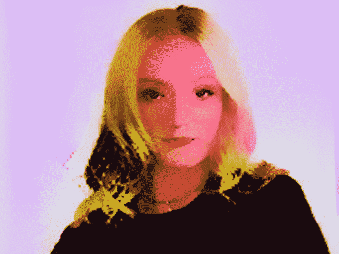
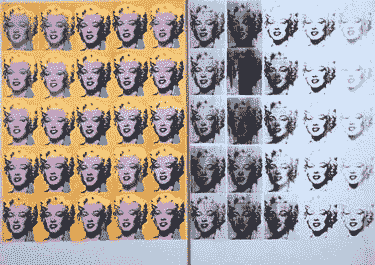
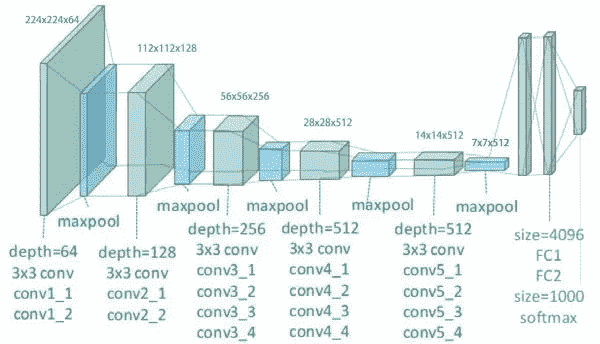
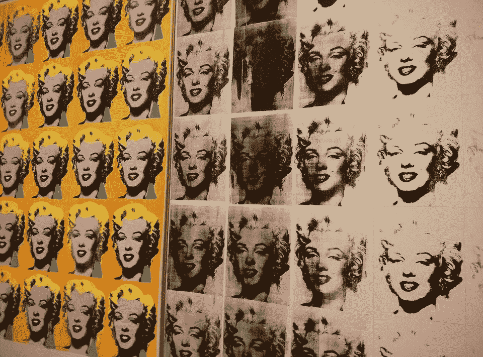
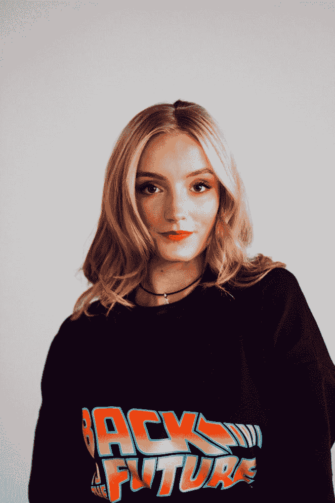
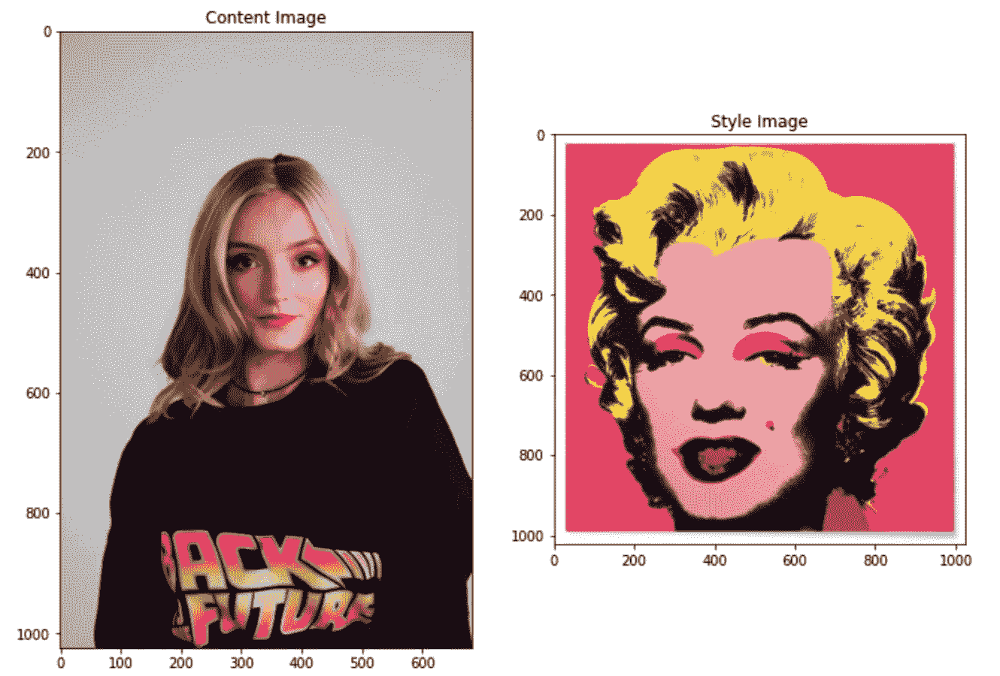
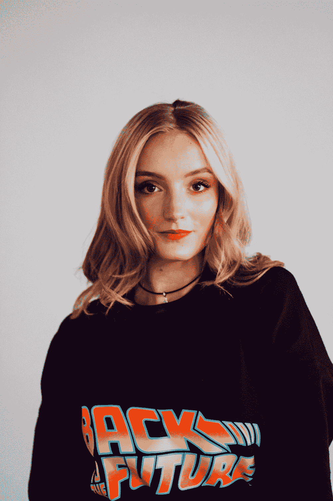
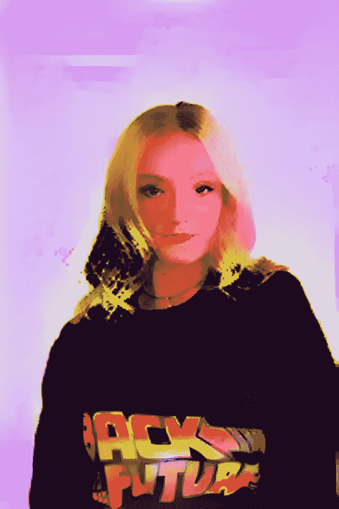

# 用 VGG 19 和迁移学习在 10 分钟内完成神经类型迁移

> 原文：<https://towardsdatascience.com/tensorflow-and-vgg19-can-help-you-convert-your-photos-into-beautiful-pop-art-pieces-c1abe87e7e01?source=collection_archive---------17----------------------->

## 深度学习案例研究

## 基于安迪·沃霍尔门罗双联画的神经风格转移，带有预先训练的计算机视觉网络 VGG19、转移学习和张量流

图一。我们的波普艺术[神经风格转移](https://en.wikipedia.org/wiki/Neural_Style_Transfer)输出用 VGG-19 网络制作(图由作者提供)

大约两个月前，我写了一篇关于神经风格转移的[文章](http://Fast Neural Style Transfer in 5 Minutes with TensorFlow Hub & Magenta)，我们使用 TensorFlow 将梵高的独特风格转移到任何带有 [Magenta 的任意图像风格化网络](https://tfhub.dev/google/magenta/arbitrary-image-stylization-v1-256/2)的照片。它展示了如何在不做任何微调的情况下快速应用神经类型转移。

> [神经风格转移(Neural style transfer)是一种通过复制另一个图像的风格，将两个图像混合并从一个内容图像创建一个新图像的方法，称为风格图像。这个新创建的图像通常被称为风格化图像。](/fast-neural-style-transfer-in-5-minutes-with-tensorflow-hub-magenta-110b60431dcc)

图二。维基媒体[上的玛丽莲双联图](https://en.wikipedia.org/wiki/Marilyn_Diptych#/media/File:Marilyndiptych.jpg)

在收到积极的评论和官方 TensorFlow 帐户的推文后，我决定准备另一个教程。与第一篇文章相比，本教程相对更高级。在本文中，我们将把安迪沃霍尔在[玛丽莲双联画](https://en.wikipedia.org/wiki/Marilyn_Diptych)中的风格复制到我们自己的照片中。[沃霍尔于 1962 年创作了这幅梦露双联画，他首先用不同的颜色在画布上作画，然后在画布上放映玛丽莲现在著名的形象](https://hamiltonselway.com/andy-warhols-silk-screening-process/)。虽然沃霍尔不是波普艺术的创始人，但他是波普艺术领域最有影响力的人物之一

在教程的技术方面，我们将使用预先训练的计算机视觉模型 VGG-19，并对其进行微调，而不是使用开箱即用的 Magenta 网络。所以这篇文章是一篇[迁移学习](/4-pre-trained-cnn-models-to-use-for-computer-vision-with-transfer-learning-885cb1b2dfc)教程，也是一篇计算机视觉。利用迁移学习的力量，如果我们能够适当地调整模型并拥有广泛的更多定制选项，我们可以取得更好的成绩。

> [迁移学习是机器学习和人工智能的一个子领域，旨在将从一个任务(源任务)中获得的知识应用到一个不同但相似的任务(目标任务)中。](/4-pre-trained-cnn-models-to-use-for-computer-vision-with-transfer-learning-885cb1b2dfc)

> 先简单说一下我们要微调的车型:VGG-19

# 谷歌的 VGG-19

VGG 是一个深度为 19 层的卷积神经网络。它是由牛津大学的 K. Simonyan 和 A. Zisserman 在 2014 年建造和训练的。你可以从他们 2015 年发表的论文[大规模图像识别的超深度卷积网络](https://arxiv.org/pdf/1409.1556.pdf)中获取所有信息。使用来自 ImageNet 数据库的超过一百万幅图像来训练 VGG-19 网络。它在 224x224 像素的彩色图像上进行训练。当然，您可以导入带有 ImageNet 训练权重的模型。这个预先训练好的网络可以对多达 1000 个对象进行分类。在本教程中，我们将去除用于分类的顶部部分，并添加我们自己的附加层，以便它可以重新用于神经类型转移。这是报纸上的官方网络图:

图 3。VGG-19 网络的插图(图由 [Clifford K. Yang](https://www.researchgate.net/profile/Clifford_Yang) 和 [Yufeng Zheng](https://www.researchgate.net/profile/Yufeng_Zheng) 在 [ResearchGate](https://www.researchgate.net/publication/325137356_Breast_cancer_screening_using_convolutional_neural_network_and_follow-up_digital_mammography) 上提供)

正如我上面提到的，谁的风格能比安迪·沃霍尔更具标志性，更适合转变波普艺术风格。我们将使用他的标志性作品 Marilyn Diptych 作为我们的风格基础，使用 Unsplash 的肖像照片作为我们的内容基础:

图 4。Marilyn 双联画(Pixabay 上 pvdberg 的图)|图 5。图由[附件](https://unsplash.com/@anneperess)上的[去飞溅](https://unsplash.com/photos/plsF6obTgms)

# 设置图像路径

使用 TensorFlow，我可以从外部 URL`get_files`。使用下面的代码，我将图像下载到我的 Colab 笔记本，一个用于样式，另一个用于内容:

# 图像缩放器

由于我们的图像是高分辨率的，我们需要缩放这些图像，以便训练不会花费太多时间。下面的代码将我们的图像数据转换成合适的格式，缩放图像(随意更改`max_dim`参数)，并创建一个可用于输入模型的新对象:

# 加载图像

既然我们已经定义了我们的`img_scaler`函数，我们可以创建一个包装函数来从我们上面设置的图像路径中加载我们的图像，缩放它们以进行更快的训练(通过`img_scaler()`调用)，并创建一个 4 维张量以使其适用于 VGG-19:

现在我们可以使用上面创建的函数创建`content_image`和`style_image`张量:

# 绘制图像

通过使用 matplotlib，我们可以轻松地并排绘制内容和样式图像:

以下是输出:

图 6。内容和风格图像的可视化(作者提供的图片)

现在我们已经为神经类型转移准备好了我们的图像，我们可以创建我们的 VGG-19 模型，并为微调做准备。这个过程需要更多的关注，但是仔细阅读和编码可以让你得到结果。在本节中，我们将:

*   用 TensorFlow 的功能性 Keras API 加载 VGG-19，用 ImageNet 权重加载；
*   创建 Gram 矩阵函数计算风格损失；
*   精心挑选训练有素的 VGG-19 模型的内容和风格；
*   基于先前装载的 VGG-19 模型，用 Keras 的[模型子类](/3-ways-to-build-neural-networks-in-tensorflow-with-the-keras-api-80e92d3b5b7e)选项创建我们的定制模型；
*   配置我们的优化器和损失函数；
*   定义自定义培训步骤；和
*   运行自定义训练循环。

仅供参考:请注意 Gists 中的评论。

# 用功能 API 加载 VGG

由于 Keras 托管 VGG-19 预训练模型，我们可以从 Keras 应用程序 API 加载模型。我们将首先创建一个函数，稍后在模型子类化部分使用它。此功能允许我们创建具有所需层的自定义 VGG 模型，并且我们仍然可以访问模型的属性:

# 带有模型子类的主模型

我们将使用下面的`gram_matrix`函数比较两个输出的 Gram 矩阵，而不是比较内容图像和样式图像的原始中间输出，因为它给出了更准确的结果:

如上图所示，VGG-19 模型由 5 个区块组成，每个区块内都有层。我们将选择每个块的第一个卷积层作为样式知识。由于中级信息对迁移学习更有价值，我们将保留第五个块的第二个卷积层作为内容层。以下几行创建了两个包含图层信息的列表:

现在我们已经选择了层，损失计算的`gram_matrix()`函数和定制 VGG-19 载荷的`vgg_layers()`函数，我们可以用 Keras 的[模型子类](/3-ways-to-build-neural-networks-in-tensorflow-with-the-keras-api-80e92d3b5b7e)选项创建我们的主模型。使用下面的行，我们`preprocess_input`数据，通过我们的自定义 vgg 模型和`gram_matrix`传递它。我们创建了自己的模型，并将其命名为`extractor`。我们的模型输出一个字典，其中包含内容和样式信息的输出值:

# 优化器和损失配置

现在我们可以输出样式和内容信息的预测，是时候用`Adam`配置我们的模型优化器并创建一个定制的损失函数了:

# 自定义训练步骤

现在我们将定义一个自定义的`train_step`函数，其中我们利用了 [GradientTape](https://www.tensorflow.org/api_docs/python/tf/GradientTape) ，它允许我们对损耗计算进行自动微分。 [GradientTape](https://www.tensorflow.org/api_docs/python/tf/GradientTape) 记录正向传递期间的操作，然后可以计算反向传递的输入图像的损失函数的梯度。注意，我们使用了`tf.function()` decorator，以便 TensorFlow 知道我们正在传递一个 train_step 函数。此外，可以随意使用`total_variation_weight`来获得不同的风格转换结果。

# 定制列车回路

现在一切都已读取，我们可以运行一个定制的训练循环来优化我们的权重并获得最佳结果。我们将运行 20 `epochs`和 100 `steps_per_epoch`的模型。这将给我们一个很好的波普艺术版本的照片，我们在开始加载。此外，我们的循环将在每个时期后临时输出一张风格化的照片。

`*If you are using Google Colab for this tutorial, make sure you enabled Hardware Accelerator from Notebook Settings. This will reduce the training time significantly.*`

# 保存并绘制风格化图像

现在我们的模型已经完成了训练，我们可以用 TensorFlow 的预处理 API 保存风格化的内容照片。以下行将照片保存到您的环境中:

结果如下:

图 7。图 8 通过[退火](https://unsplash.com/@anneperess)对[去毛刺](https://unsplash.com/photos/plsF6obTgms)得到。风格化版本(作者图)

# 恭喜

你刚刚用迁移学习建立了一个神经风格迁移模型。很明显还有改进的空间，但是如果你仔细观察，你会发现我们的模特是如何模仿沃霍尔的发型的。我们的模型也从门罗的双联画中提取了背景色。使用`img_scale`函数、`epoch`、`steps_per_epoch`数字来得到不同的结果。你也可以使用其他艺术风格来获得不同的创意输出。

# 订阅邮件列表获取完整代码

除了我的最新内容，我还与我的订户分享我的 Google Colab 笔记本，其中包含我发表的每篇文章的完整代码。

> *如果你喜欢这篇文章，可以考虑订阅* [*简讯*](http://eepurl.com/hd6Xfv) *！✉️*

既然您正在阅读这篇文章，我相信我们有着相似的兴趣，并且现在/将来会从事相似的行业。那么我们就通过[*Linkedin*](https://linkedin.com/in/orhangaziyalcin/)*来连线吧！请不要犹豫发送联系请求！*[*Orhan g . Yal gan—Linkedin*](https://linkedin.com/in/orhangaziyalcin/)

# 喜欢这篇文章

如果你喜欢这篇文章，看看我的其他文章:

 [## 利用生成性对抗网络在 10 分钟内生成图像

### 使用无监督深度学习生成手写数字与深度卷积甘斯使用张量流和…

towardsdatascience.com](/image-generation-in-10-minutes-with-generative-adversarial-networks-c2afc56bfa3b)  [## 使用 MNIST 数据集在 10 分钟内完成图像分类

towardsdatascience.com](/image-classification-in-10-minutes-with-mnist-dataset-54c35b77a38d)  [## 伯特和拥抱脸 10 分钟情感分析

### 学习预训练的自然语言处理模型的基础，伯特，并建立一个使用 IMDB 电影评论的情感分类器…

towardsdatascience.com](/sentiment-analysis-in-10-minutes-with-bert-and-hugging-face-294e8a04b671)