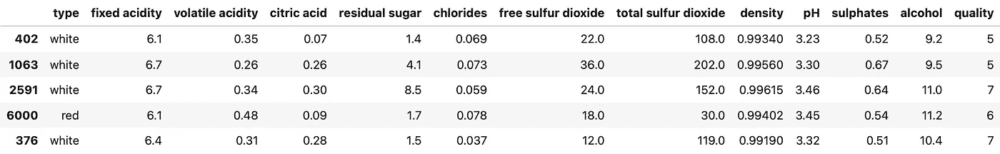
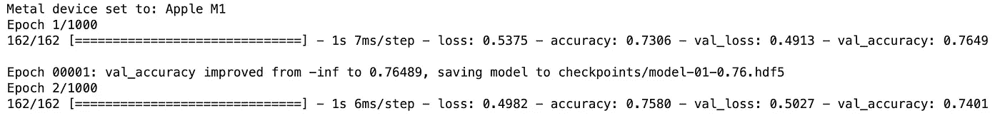
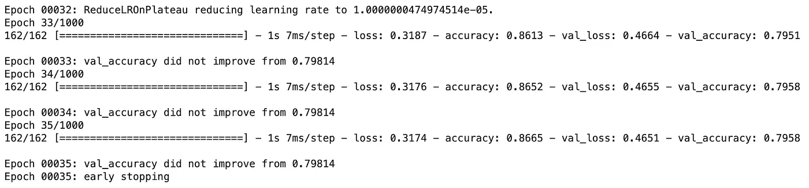
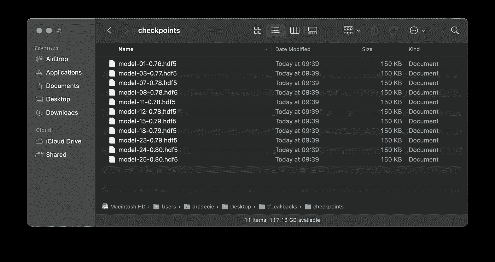
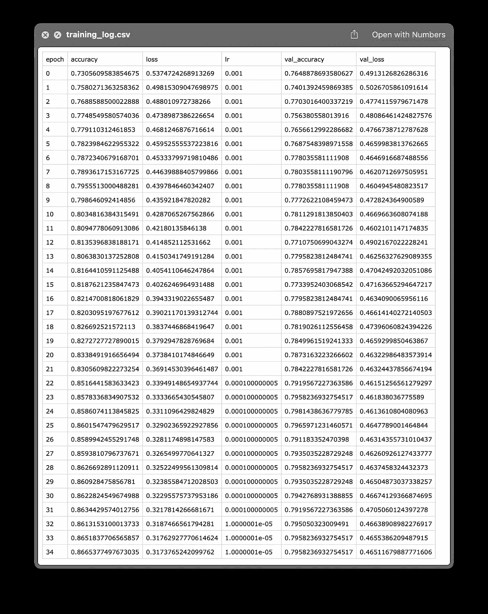

# TensorFlow 回调—如何像专家一样监控神经网络训练

> 原文：<https://towardsdatascience.com/tensorflow-callbacks-how-to-monitor-neural-network-training-like-a-pro-f02cb4e477d0?source=collection_archive---------20----------------------->

## 在您的下一个深度学习项目中要实施的前 4 个 TensorFlow 回调

来自 [Pexels](https://www.pexels.com/photo/a-man-in-front-of-computer-screens-7431356/?utm_content=attributionCopyText&utm_medium=referral&utm_source=pexels) 的 [Caleb Oquendo](https://www.pexels.com/@caleboquendo?utm_content=attributionCopyText&utm_medium=referral&utm_source=pexels) 摄影

训练深度学习模型可能需要几天或几周的时间，但多久才算足够长呢？你的模型很可能在某个时间点后就不再学习了，继续训练会耗费你的时间和金钱。

想象一下，你正在为一个大的图像识别模型训练许多个时期，并希望得到一个可用的模型。经过几十个时期后，损耗没有减少，精度也没有提高。你已经猜到了，不调整参数就进行长时间的训练是浪费时间。

令人欣慰的是，有一个解决方案，它内置在 TensorFlow API 中。它被命名为*回调*，代表在模型训练期间**执行的特殊功能。您可以使用它们来保存模型、保存训练日志、在模型卡住时降低学习率，等等。**

不想看书？请观看我的视频:

你可以在 [GitHub](https://github.com/better-data-science/TensorFlow) 上下载源代码。

# 使用的数据集和数据预处理

我今天不打算花太多时间处理数据。我们将使用与前几篇文章相同的数据集——来自 Kaggle 的[葡萄酒质量数据集](https://www.kaggle.com/shelvigarg/wine-quality-dataset):

图片 1——来自 Kaggle 的葡萄酒质量数据集(图片由作者提供)

您可以使用以下代码将其导入 Python，并随机打印几行:

我们忽略警告并更改默认的 TensorFlow 日志级别，这样我们就不会被输出淹没。

以下是数据集的外观:

图 2——葡萄酒质量数据集的随机样本(图片由作者提供)

数据集基本上是干净的，但默认情况下不是为二元分类(好酒/劣酒)而设计的。取而代之的是，葡萄酒是按等级来评定的。我们现在将解决这个问题，以及许多其他问题:

*   **删除缺失值** —它们为数不多，所以我们不会在插补上浪费时间。
*   **处理分类特征**——唯一的一个是`type`，指示葡萄酒是白还是红。
*   **转化为二分分类任务**——我们将把任何 6 分及以上的葡萄酒宣布为*好*，低于 6 分的葡萄酒宣布为*差*。
*   **训练/测试分割** —经典的 80:20 分割。
*   **缩放数据** —预测值之间的比例差异显著，因此我们将使用`StandardScaler`来拉近数值。

下面是完整的数据预处理代码片段:

同样，如果您想更详细地了解数据预处理背后的逻辑，请参考[上一篇文章](/how-to-train-a-classification-model-with-tensorflow-in-10-minutes-fd2b7cfba86)。

现在，让我们看看如何在 TensorFlow 中声明回调。

# 用 TensorFlow 声明回调

如果你读过我之前的文章[用 TensorFlow](/how-to-optimize-learning-rate-with-tensorflow-its-easier-than-you-think-164f980a7c7b) 优化学习率，你就已经知道回调是如何工作的了。基本上，您将把它们包含在`fit()`函数中。没有人阻止你事先声明一个回调列表，只是为了保持训练函数额外的干净。

TensorFlow 内置了一堆回调。您也可以编写定制的回调函数，但这是下一次的主题。对于大多数项目，我只使用四个内置回调函数。

## `ModelCheckpoint`

如果模型的性能优于前一个时期，您可以使用此选项在当前时期本地保存模型。您想要的任何指标的性能，如损失或准确性。我建议监控验证集的性能，因为深度学习模型往往会过度拟合训练数据。

您可以将模型保存为检查点文件夹或`hdf5`文件。我推荐后者，因为它在您的文件系统上看起来更干净。此外，您可以指定一个更好的文件路径，其中包含纪元编号和该纪元的评估度量值。

下面介绍如何申报`ModelCheckpoint`回调:

简而言之，就验证集的准确性而言，只有当前时期的模型优于前一时期的模型，它才会保存当前时期的模型。

## `ReduceLROnPlateau`

如果评估度量的值在几个时期内没有变化，`ReduceLROnPlateau`降低学习率。例如，如果验证损失在 10 个时期内没有减少，这个回调告诉 TensorFlow 降低学习率。

新学习率的计算方法是旧学习率乘以用户定义的系数。所以，如果旧的学习率是 0.01，因子是 0.1，那么新的学习率就是 0.01 * 0.1 = 0.001。

下面是如何声明它:

总之，上面的声明指示 TensorFlow，如果验证损失在最后 10 个历元中没有减少，则将学习率减少 0.1 倍。学习率永远不会低于 0.00001。

## 提前停止

如果一个指标在给定的历元数内没有发生最小的变化，那么`EarlyStopping`回调将终止训练过程。例如，如果验证准确度在 10 个历元中没有增加至少 0.001，则该回调告诉 TensorFlow 停止训练。

下面是如何声明它:

这没什么大不了的——很简单，但非常有用。

## CSVLogger

`CSVLogger`回调捕获模型训练历史并将其转储到一个 CSV 文件中。这对以后分析性能和比较多个模型很有用。它保存您正在跟踪的所有指标的数据，如丢失率、准确度、精确度和召回率，包括训练集和验证集。

下面是如何声明它:

很简单，对吧？当然，但是最好的还在后面。接下来让我们用这些回调来训练模型。

# 使用 TensorFlow 回调训练模型

深度学习中的常见做法是将数据集分为训练集、验证集和测试集。我们进行了双向分割，所以为了简单起见，我们将测试集视为验证集。

我们将训练模型 1000 个历元——很多，但是`EarlyStopping`回调会提前结束训练过程。您可以在`fit()`函数内将回调指定为一个列表。代码如下:

模型培训现在开始，您将看到类似的打印结果:

图 3 —开始培训过程(图片由作者提供)

由于回调，输出比以前更加详细。你可以看到`ModelCheckpoint`回调做它的工作，并在第一个纪元后保存模型。`hdf5`文件名告诉您在哪个时期达到了什么样的验证精度。

`EarlyStopping`回调将在纪元 35:

图 4 —完成培训过程(图片由作者提供)

就是这样——如果模型已经卡在这里，为什么还要浪费时间训练 965 个纪元。对于简单的表格模型来说，这可能不是一个巨大的时间节省，但是想象一下在租来的 GPU 机器上进行几个小时或几天不必要的培训。

培训结束后，您的`checkpoints/`文件夹应该与我的相似:

图 5 —检查点文件夹(作者图片)

您应该始终选择具有最高纪元编号的版本，以便进一步调整或评估。不要让最后两个模型上的 0.80 的精度迷惑了你——它只是四舍五入到小数点后两位。

您可以使用 TensorFlow 的`load_model()`功能加载最佳模型:

您可以像往常一样继续进行预测和评估——今天不需要涉及这些。

如果你想知道`training_log.csv`的内容，这里是它在我的机器上的样子:

图 6 —培训日志 CSV 文件(图片由作者提供)

您可以看到如何在训练和验证集上跟踪损失和准确性，以及由于`ReduceLROnPlateau`回调，学习率如何随着时间的推移而降低。简而言之，一切都像广告宣传的那样。

这就是我今天想讲的。接下来让我们总结一下。

# 离别赠言

训练深度学习模型不一定要花这么长时间。注意你的评估指标，如果模型没有学习，就停止训练。当然，您不必手动这样做，因为有内置的回调函数。你今天已经学会了其中的四个，其余的，请访问[官方文档。](https://www.tensorflow.org/api_docs/python/tf/keras/callbacks)

如果您想了解有关自定义回调的更多信息，请继续关注，也请继续关注即将发布的卷积神经网络文章。我将涵盖你作为一名机器学习工程师需要知道的一切。

*喜欢这篇文章吗？成为* [*中等会员*](https://medium.com/@radecicdario/membership) *继续无限制学习。如果你使用下面的链接，我会收到你的一部分会员费，不需要你额外付费。*

 [## 通过我的推荐链接加入 Medium-Dario rade ci

### 作为一个媒体会员，你的会员费的一部分会给你阅读的作家，你可以完全接触到每一个故事…

medium.com](https://medium.com/@radecicdario/membership) 

# 保持联系

*   注册我的[简讯](https://mailchi.mp/46a3d2989d9b/bdssubscribe)
*   在 YouTube[上订阅](https://www.youtube.com/c/BetterDataScience)
*   在 [LinkedIn](https://www.linkedin.com/in/darioradecic/) 上连接